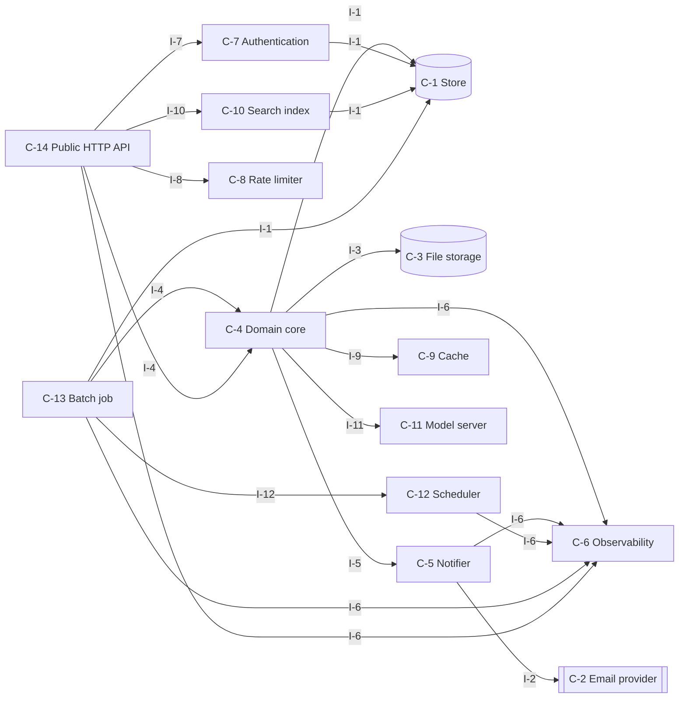
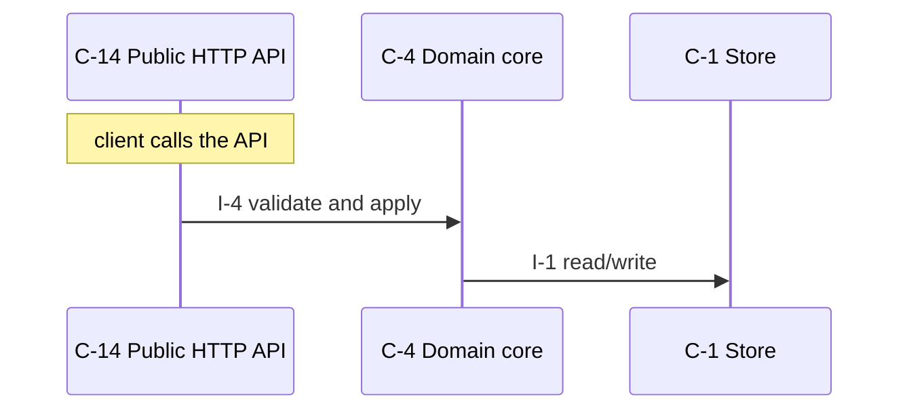
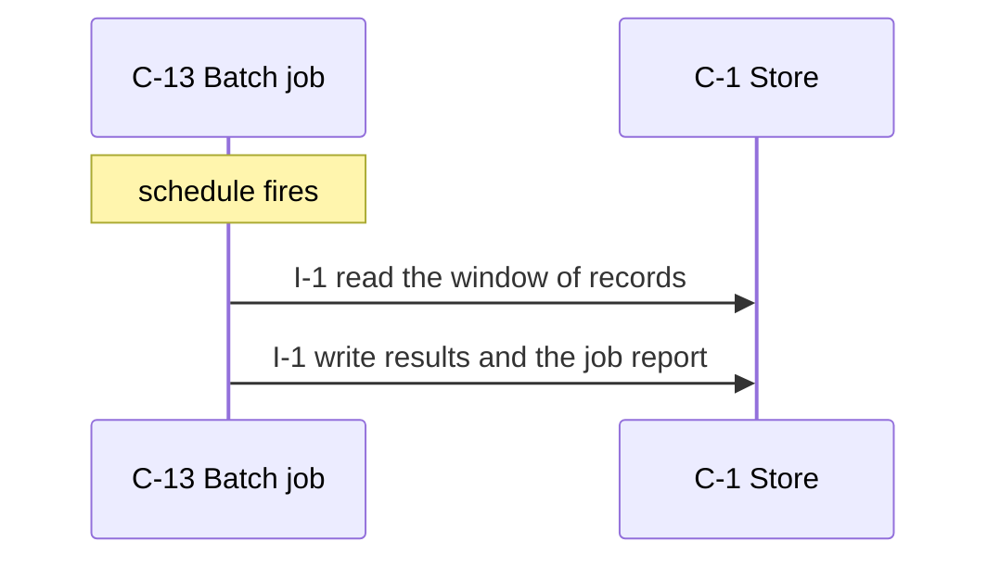
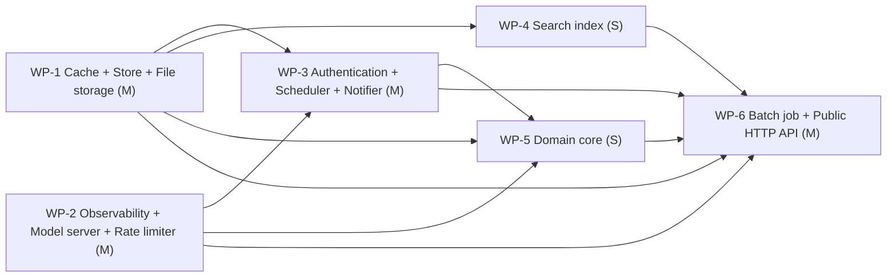

# internal-document-search-with-summaries — design

Employees must find internal documents quickly and get a short summary without opening them.

_version 0.1.0 · schema sekkei/1_

## Goals

- Clients read and write domain resources over HTTP.
- The system notifies people through an external channel.
- Callers are authenticated and authorized.
- Request budgets per caller.
- Hot reads are cached.
- Users search and filter records.
- Files are uploaded, stored and served.
- Scheduled jobs process stored records in windows.
- Predictions are served from a versioned model.

## Requirements

| id | kind | priority | statement | metric |
|---|---|---|---|---|
| R-1 | functional | must | Employees must find internal documents quickly and get a short summary without opening them. | — |
| R-2 | functional | must | Employees upload PDF and Markdown documents (up to 20 MB) and tag them with a team. | — |
| R-3 | functional | must | The system extracts the text, splits it into chunks, computes embeddings and indexes them for semantic search. | — |
| R-4 | functional | must | Employees search with a natural-language query and get the ten best passages with links to the documents. | — |
| R-5 | functional | must | For each result the system generates a three-sentence summary with an LLM and caches it. | — |
| R-6 | functional | must | Team leads can delete documents; deleted documents disappear from search results within one minute. | — |
| R-7 | functional | must | Every search query is logged with the employee id for usage reporting; a weekly report is emailed to the knowledge team. | — |
| R-8 | nonfunctional | should | Search returns within 800 ms p95 for a corpus of 50,000 documents. | p95 latency at 50,000 <= 800 ms ms |
| R-9 | nonfunctional | must | Embedding and summary generation must not block uploads; an upload is acknowledged within 1 s. | latency <= 1 s s |
| R-10 | functional | must | Documents are visible only to members of the tagged team. | — |
| R-11 | constraint | must | Python 3.12, PostgreSQL with pgvector available, S3-compatible object storage available. Team of 3. | — |
| R-12 | constraint | must | Embeddings and summaries come from an external API with a rate limit of 60 requests per minute. | — |
| R-13 | constraint | must | Employees authenticate through the company SSO (OIDC). | — |
| R-14 | functional | must | Records are retained for 90 days and audit history for 1 year, after which a nightly job deletes them (assumed by the engine). | — |
| R-15 | functional | could | Every operation is scoped to the caller's own resources; an admin role may act on any resource (assumed by the engine). | — |
| R-16 | nonfunctional | must | Availability of 99.9 % monthly; accepted work is delayed but never lost during an outage (assumed by the engine). | ratio 99.9 % % |
| R-17 | nonfunctional | should | Backups run daily with a recovery point of 24 h and a recovery time of 4 h (assumed by the engine). | time at 4 h 24 h h |
| R-18 | nonfunctional | should | External calls time out after 10 s; failures are retried 5 times with exponential backoff and work waits durably meanwhile (assumed by the engine). | time at 5 10 s s |
| R-19 | constraint | must | Deployed as stateless containers behind an ingress (assumed by the engine). | — |
| R-20 | constraint | must | Use existing infrastructure only; no new managed services (assumed by the engine). | — |
| R-21 | constraint | must | No existing data or system to migrate from (assumed by the engine). | — |

## Components

### C-1 — Store

- **kind**: datastore · **path**: `app/store.py`
- **responsibility**: Owns persistence of the domain entities: durable writes, reads, listing, and the schema/migrations.
- **provides**: I-1
- **requires**: —
- **satisfies**: R-9, R-11, R-16, R-18

### C-2 — Email provider

- **kind**: external
- **responsibility**: External email delivery service.
- **provides**: I-2
- **requires**: —
- **satisfies**: R-7

### C-3 — File storage

- **kind**: datastore · **path**: `app/files.py`
- **responsibility**: Stores and serves uploaded files/blobs with content-type and size limits.
- **provides**: I-3
- **requires**: —
- **satisfies**: R-2

### C-4 — Domain core

- **kind**: module · **path**: `app/core.py`
- **responsibility**: Business rules and validation for the domain entities; the only module that changes state through the store.
- **provides**: I-4
- **requires**: I-1, I-6, I-9, I-3, I-11, I-5
- **satisfies**: R-1, R-10, R-2, R-3, R-11, R-12, R-20, R-21

### C-5 — Notifier

- **kind**: module · **path**: `app/notifier.py`
- **responsibility**: Sends operator/customer notifications through the configured channel with templating and rate limiting.
- **provides**: I-5
- **requires**: I-2, I-6
- **satisfies**: R-7

### C-6 — Observability

- **kind**: module · **path**: `app/observability.py`
- **responsibility**: Metrics registry and exposition, structured logging, health/readiness endpoints.
- **provides**: I-6
- **requires**: —
- **satisfies**: R-16

### C-7 — Authentication

- **kind**: module · **path**: `app/auth.py`
- **responsibility**: Authenticates callers and resolves them to a principal and scope; enforces authorization for management operations.
- **provides**: I-7
- **requires**: I-1
- **satisfies**: R-13, R-15

### C-8 — Rate limiter

- **kind**: module · **path**: `app/ratelimit.py`
- **responsibility**: Per-principal or per-key request budgets with a sliding window.
- **provides**: I-8
- **requires**: —
- **satisfies**: R-11

### C-9 — Cache

- **kind**: module · **path**: `app/cache.py`
- **responsibility**: Read-through cache with TTL and explicit invalidation.
- **provides**: I-9
- **requires**: —
- **satisfies**: R-5, R-8, R-9

### C-10 — Search index

- **kind**: module · **path**: `app/search.py`
- **responsibility**: Full-text and filtered queries over the indexed entities.
- **provides**: I-10
- **requires**: I-1
- **satisfies**: R-3, R-4, R-6, R-7, R-8, R-9

### C-11 — Model server

- **kind**: service · **path**: `app/model.py`
- **responsibility**: Loads the model, serves predictions with batching and timeouts, versions the model.
- **provides**: I-11
- **requires**: —
- **satisfies**: R-3

### C-12 — Scheduler

- **kind**: job · **path**: `app/scheduler.py`
- **responsibility**: Computes when deferred work runs next (backoff schedules, periodic jobs) and promotes due work.
- **provides**: I-12
- **requires**: I-6
- **satisfies**: R-7, R-14

### C-13 — Batch job

- **kind**: job · **path**: `app/batch.py`
- **responsibility**: Scheduled processing over stored records: extract, transform, aggregate, write results.
- **provides**: I-13
- **requires**: I-1, I-12, I-6, I-4
- **satisfies**: R-7, R-14

### C-14 — Public HTTP API

- **kind**: service · **path**: `app/surface_api.py`
- **responsibility**: Translates HTTP requests into core calls: routing, request validation, error mapping, JSON.
- **provides**: I-14
- **requires**: I-4, I-6, I-7, I-8, I-10
- **satisfies**: R-1, R-10, R-8, R-9, R-17, R-19

**Layers** (each layer depends only on earlier ones):

0. C-1, C-11, C-2, C-3, C-6, C-8, C-9
1. C-10, C-12, C-5, C-7
2. C-4
3. C-13, C-14

## Interfaces

### I-1 — Store interface

- **kind**: class · **owner**: C-1 · **stability**: stable
- Provided by Store. 

| operation | inputs | output | errors | pre / post |
|---|---|---|---|---|
| `save` | `entity`: Entity, `record`: dict | id | ConflictError on duplicate key | record is durable before return |
| `get` | `entity`: Entity, `id`: str | record \| None | — | — |
| `list` | `entity`: Entity, `filter`: dict, `page`: Page | list[record], next page token | — | — |
| `delete` | `entity`: Entity, `id`: str | bool | — | — |

### I-2 — Email provider interface

- **kind**: http · **owner**: C-2 · **stability**: stable
- Provided by Email provider. External; contract is theirs.

| operation | inputs | output | errors | pre / post |
|---|---|---|---|---|
| `send` | `to`: str, `subject`: str, `body`: str | provider message id | — | — |

### I-3 — File storage interface

- **kind**: class · **owner**: C-3 · **stability**: stable
- Provided by File storage. 

| operation | inputs | output | errors | pre / post |
|---|---|---|---|---|
| `put` | `key`: str, `data`: bytes, `content_type`: str | FileRef | — | stated values: 20 MB (R-2) |
| `get` | `key`: str | bytes \| None | — | — |

### I-4 — Domain core interface

- **kind**: module · **owner**: C-4 · **stability**: draft
- Provided by Domain core. 

| operation | inputs | output | errors | pre / post |
|---|---|---|---|---|
| `get_summary` | `summary`: Summary \| id | Summary \| None | ValidationError, NotFound | — |
| | from R-1: Employees must find internal documents quickly and get a short summary without opening the | | | |
| `open_summary` | `summary`: Summary \| id | Summary \| None | ValidationError, NotFound | — |
| | from R-1: Employees must find internal documents quickly and get a short summary without opening the | | | |
| `upload_pdf` | `pdf`: Pdf \| id | Pdf \| None | ValidationError, NotFound | — |
| | from R-2: Employees upload PDF and Markdown documents (up to 20 MB) and tag them with a team. | | | |
| `tag_team` | `team`: Team \| id | Team \| None | ValidationError, NotFound | — |
| | from R-2: Employees upload PDF and Markdown documents (up to 20 MB) and tag them with a team. | | | |
| `extract_text` | `text`: Text \| id | Text \| None | ValidationError, NotFound | — |
| | from R-3: The system extracts the text, splits it into chunks, computes embeddings and indexes them | | | |
| `split_chunks` | `chunks`: Chunks \| id | Chunks \| None | ValidationError, NotFound | — |
| | from R-3: The system extracts the text, splits it into chunks, computes embeddings and indexes them | | | |
| `compute_embeddings` | `embeddings`: Embeddings \| id | Embeddings \| None | ValidationError, NotFound | — |
| | from R-3: The system extracts the text, splits it into chunks, computes embeddings and indexes them | | | |
| `index_semantic` | `semantic`: Semantic \| id | Semantic \| None | ValidationError, NotFound | — |
| | from R-3: The system extracts the text, splits it into chunks, computes embeddings and indexes them | | | |
| `search_semantic` | `semantic`: Semantic \| id | Semantic \| None | ValidationError, NotFound | — |
| | from R-3: The system extracts the text, splits it into chunks, computes embeddings and indexes them | | | |
| `search_natural-language` | `natural-language`: Natural-language \| id | Natural-language \| None | ValidationError, NotFound | — |
| | from R-4: Employees search with a natural-language query and get the ten best passages with links to | | | |
| `query_passages` | `passages`: Passages \| id | Passages \| None | ValidationError, NotFound | — |
| | from R-4: Employees search with a natural-language query and get the ten best passages with links to | | | |
| `get_passages` | `passages`: Passages \| id | Passages \| None | ValidationError, NotFound | — |
| | from R-4: Employees search with a natural-language query and get the ten best passages with links to | | | |
| `generate_summary` | `summary`: Summary \| id | Summary \| None | ValidationError, NotFound | — |
| | from R-5: For each result the system generates a three-sentence summary with an LLM and caches it. | | | |
| `delete_documents` | `documents`: Documents \| id | Documents \| None | ValidationError, NotFound | — |
| | from R-6: Team leads can delete documents; deleted documents disappear from search results within on | | | |
| `search_results` | `results`: Results \| id | Results \| None | ValidationError, NotFound | — |
| | from R-6: Team leads can delete documents; deleted documents disappear from search results within on | | | |
| `search_employee` | `employee`: Employee \| id | Employee \| None | ValidationError, NotFound | — |
| | from R-7: Every search query is logged with the employee id for usage reporting; a weekly report is | | | |
| `query_employee` | `employee`: Employee \| id | Employee \| None | ValidationError, NotFound | — |
| | from R-7: Every search query is logged with the employee id for usage reporting; a weekly report is | | | |
| `record_audit` | `audit`: Audit \| id | Audit \| None | ValidationError, NotFound | — |
| | from R-14: Records are retained for 90 days and audit history for 1 year, after which a nightly job d | | | |
| `delete_engine` | `engine`: Engine \| id | Engine \| None | ValidationError, NotFound | — |
| | from R-14: Records are retained for 90 days and audit history for 1 year, after which a nightly job d | | | |

### I-5 — Notifier interface

- **kind**: module · **owner**: C-5 · **stability**: draft
- Provided by Notifier. 

| operation | inputs | output | errors | pre / post |
|---|---|---|---|---|
| `notify` | `recipient`: str, `template`: str, `context`: dict | message id | NotifyError | — |

### I-6 — Observability interface

- **kind**: module · **owner**: C-6 · **stability**: draft
- Provided by Observability. 

| operation | inputs | output | errors | pre / post |
|---|---|---|---|---|
| `counter` | `name`: str, `labels`: dict | Counter | — | — |
| `histogram` | `name`: str, `labels`: dict | Histogram | — | — |
| `gauge` | `name`: str, `labels`: dict | Gauge | — | — |
| `GET /metrics` | — | Prometheus text exposition | — | — |
| `GET /healthz` | — | 200 when dependencies reachable | — | — |
| `log` | `event`: str, `fields`: dict | None | — | — |
| | one JSON line per event | | | |

### I-7 — Authentication interface

- **kind**: module · **owner**: C-7 · **stability**: draft
- Provided by Authentication. 

| operation | inputs | output | errors | pre / post |
|---|---|---|---|---|
| `authenticate` | `credentials`: str | Principal | AuthError | — |
| `authorize` | `principal`: Principal, `action`: str, `resource`: str | None | Forbidden | — |

### I-8 — Rate limiter interface

- **kind**: module · **owner**: C-8 · **stability**: draft
- Provided by Rate limiter. 

| operation | inputs | output | errors | pre / post |
|---|---|---|---|---|
| `check` | `key`: str, `cost`: int | Decision(allowed, retry_after) | — | — |

### I-9 — Cache interface

- **kind**: module · **owner**: C-9 · **stability**: draft
- Provided by Cache. 

| operation | inputs | output | errors | pre / post |
|---|---|---|---|---|
| `get_or_load` | `key`: str, `loader`: callable, `ttl`: int | value | — | — |
| `invalidate` | `key`: str | None | — | — |

### I-10 — Search index interface

- **kind**: module · **owner**: C-10 · **stability**: draft
- Provided by Search index. 

| operation | inputs | output | errors | pre / post |
|---|---|---|---|---|
| `index` | `entity`: Entity, `record`: dict | None | — | — |
| `query` | `text`: str, `filters`: dict, `page`: Page | hits | — | — |

### I-11 — Model server interface

- **kind**: module · **owner**: C-11 · **stability**: draft
- Provided by Model server. 

| operation | inputs | output | errors | pre / post |
|---|---|---|---|---|
| `predict` | `inputs`: list, `model_version`: str | predictions | ModelError | — |

### I-12 — Scheduler interface

- **kind**: module · **owner**: C-12 · **stability**: draft
- Provided by Scheduler. 

| operation | inputs | output | errors | pre / post |
|---|---|---|---|---|
| `next_attempt` | `attempt`: int, `retry_after`: timedelta \| None | datetime \| None | — | — |
| | None when attempts are exhausted | | | |
| `promote_due` | `now`: datetime | int moved | — | — |

### I-13 — Batch job interface

- **kind**: module · **owner**: C-13 · **stability**: draft
- Provided by Batch job. 

| operation | inputs | output | errors | pre / post |
|---|---|---|---|---|
| `run` | `window`: DateRange | JobReport | JobError | stated values: 90 days (R-14); 1 year (R-14) |

### I-14 — Public HTTP API interface

- **kind**: http · **owner**: C-14 · **stability**: draft
- Provided by Public HTTP API. 

| operation | inputs | output | errors | pre / post |
|---|---|---|---|---|
| `GET /summaries/{id}` | `id`: str | 200 summary | 401 unauthenticated, 404 unknown id | — |
| | from R-1: Employees must find internal documents quickly and get a short summary without opening the | | | |
| `POST /pdfs` | `body`: pdf fields | 201 {pdf id} | 400 invalid body, 401 unauthenticated, 409 conflict | — |
| | from R-2: Employees upload PDF and Markdown documents (up to 20 MB) and tag them with a team. | | | |
| `POST /teams/{id}/tag` | `id`: str | 202 tag accepted | 401 unauthenticated, 404 unknown id, 409 not applicable in current state | — |
| | from R-2: Employees upload PDF and Markdown documents (up to 20 MB) and tag them with a team. | | | |
| `GET /natural-languages` | `filter`: query, `page`: cursor | 200 [natural-language], next cursor | 401 unauthenticated | — |
| | from R-4: Employees search with a natural-language query and get the ten best passages with links to | | | |
| `GET /passages` | `filter`: query, `page`: cursor | 200 [passages], next cursor | 401 unauthenticated | — |
| | from R-4: Employees search with a natural-language query and get the ten best passages with links to | | | |
| `GET /passages/{id}` | `id`: str | 200 passages | 401 unauthenticated, 404 unknown id | — |
| | from R-4: Employees search with a natural-language query and get the ten best passages with links to | | | |
| `DELETE /documents/{id}` | `id`: str | 204 | 401 unauthenticated, 404 unknown id | — |
| | from R-6: Team leads can delete documents; deleted documents disappear from search results within on | | | |
| `GET /results` | `filter`: query, `page`: cursor | 200 [results], next cursor | 401 unauthenticated | — |
| | from R-6: Team leads can delete documents; deleted documents disappear from search results within on | | | |

## Entities

### E-1 — Record (owner C-1)

Generic domain record; refine per entity found in the requirements.

| field | type | constraints |
|---|---|---|
| `id` | uuid | primary key |
| `created_at` | timestamp |  |
| `updated_at` | timestamp |  |

### E-2 — Principal (owner C-1)

| field | type | constraints |
|---|---|---|
| `id` | uuid | primary key |
| `kind` | enum(customer, operator, service) |  |
| `scopes` | list[str] |  |

### E-3 — File (owner C-3)

| field | type | constraints |
|---|---|---|
| `key` | str | primary key |
| `content_type` | str |  |
| `size` | int | <= configured limit |
| `owner_id` | uuid |  |

### E-4 — JobRun (owner C-1)

| field | type | constraints |
|---|---|---|
| `id` | uuid | primary key |
| `job` | str |  |
| `window_start` | timestamp |  |
| `window_end` | timestamp |  |
| `status` | enum |  |
| `report` | json |  |

### E-5 — Document (owner C-1)

Domain entity named in the requirements ('document'); confirm the fields.

| field | type | constraints |
|---|---|---|
| `id` | uuid | primary key |
| `created_at` | timestamp |  |

## Flows

### F-1 — Serve a request

_Trigger:_ client calls the API

1. C-14 → C-4 via I-4: validate and apply
2. C-4 → C-1 via I-1: read/write

### F-2 — Run the batch job

_Trigger:_ schedule fires

1. C-13 → C-1 via I-1: read the window of records
2. C-13 → C-1 via I-1: write results and the job report

## Decisions

### D-1 — API style (accepted)

**Context.** Clients need a programmable surface.

- ✔ **REST/JSON over HTTP**
  - + universal tooling
  - + cacheable reads
  - − over-fetching on nested data
- ✘ **gRPC**
  - + typed contracts
  - + streaming
  - − browser and debugging friction
- ✘ **GraphQL**
  - + flexible queries
  - − complexity budget for a small team

**Rationale.** Scored against the active qualities; decided by durability (weight 1.0), availability (weight 0.9). REST/JSON over HTTP: 1.49; gRPC: 1.33; GraphQL: 1.16

**Consequences.** Not choosing 'gRPC' gives up: typed contracts, streaming. Not choosing 'GraphQL' gives up: flexible queries.

_Affects:_ C-14

### D-2 — Primary store (accepted)

**Context.** Domain records need durable, queryable storage.

- ✔ **PostgreSQL**
  - + transactions
  - + indexes and JSON
  - + already available
  - − operational dependency
- ✘ **SQLite**
  - + zero operations
  - + single file
  - − one writer at a time
  - − no network access
- ✘ **Files (JSON/CSV on disk)**
  - + no dependencies
  - + human readable
  - − no transactions or concurrency
- ✘ **In-memory**
  - + fastest
  - + trivial
  - − lost on restart

**Rationale.** Scored against the active qualities; decided by durability (weight 1.0), availability (weight 0.9). PostgreSQL: 3.18; In-memory: 1.31; SQLite: unavailable (ruled out by containers, multi_instance); Files: unavailable (ruled out by containers, multi_instance). stated in the constraints

**Consequences.** Not choosing 'In-memory' gives up: fastest, trivial.

_Affects:_ C-1

### D-3 — Caller authentication (accepted)

**Context.** Management operations must be attributable to a customer or operator.

- ✘ **API keys per customer, hashed at rest, sent as a bearer token**
  - + simple
  - + scriptable
  - − no delegation or expiry unless added
- ✔ **OAuth2 / OIDC with the platform's identity provider**
  - + single sign-on
  - + expiry and scopes
  - − integration effort
- ✘ **Mutual TLS**
  - + strong
  - + no secrets in headers
  - − certificate lifecycle for every customer

**Rationale.** Scored against the active qualities; decided by durability (weight 1.0), availability (weight 0.9). OAuth2 / OIDC with the platform's identity provi: 2.00; API keys per customer, hashed at rest, sent as a: 1.33; Mutual TLS: 0.84. stated in the constraints

**Consequences.** Not choosing 'API keys per customer, hashed at rest, sent as a' gives up: simple, scriptable. Not choosing 'Mutual TLS' gives up: strong, no secrets in headers.

_Affects:_ C-7

### D-4 — Caching (accepted)

**Context.** Repeated reads dominate the request mix.

- ✔ **Read-through cache with TTL and explicit invalidation on write**
  - + bounded staleness
  - − invalidation paths to maintain
- ✘ **No cache; rely on database indexes**
  - + no staleness
  - − hot rows become the bottleneck

**Rationale.** Scored against the active qualities; decided by durability (weight 1.0), availability (weight 0.9). Read-through cache with TTL and explicit invalid: 1.49; No cache: 1.33

**Consequences.** Not choosing 'No cache; rely on database indexes' gives up: no staleness.

_Affects:_ C-9

### D-5 — Process topology (accepted)

**Context.** The same code base serves requests and performs background work.

- ✔ **One image, role by flag: `api` and `worker` processes scale independently**
  - + stateless containers
  - + independent scaling of ingress and outbound work
  - + one build
  - − two deployables to operate
- ✘ **Single process with background threads**
  - + one deployable
  - − request latency competes with outbound work
  - − cannot scale roles separately
- ✘ **Separate services per concern (ingest, admin, delivery)**
  - + clear ownership
  - − three deployables for a team of three
  - − shared schema anyway

**Rationale.** Scored against the active qualities; decided by durability (weight 1.0), availability (weight 0.9). One image, role by flag: `api` and `worker` proc: 1.96; Separate services per concern: 1.94; Single process with background threads: 1.33

**Consequences.** Not choosing 'Separate services per concern' gives up: clear ownership. Not choosing 'Single process with background threads' gives up: one deployable.

_Affects:_ C-14, C-12

### D-6 — Redundancy for the availability target (accepted)

**Context.** The availability target must be met through instance failures and deploys.

- ✔ **Two or more interchangeable instances per role behind the ingress, health checks, rolling deploys**
  - + survives one instance failure
  - + zero-downtime deploys
  - − needs stateless instances and a shared store
- ✘ **Single instance with health-based restart**
  - + simplest
  - + cheapest
  - − restart time is downtime
  - − deploys are downtime
- ✘ **Active-active across two regions**
  - + survives a regional outage
  - − data replication and conflict handling
  - − cost

**Rationale.** Scored against the active qualities; decided by durability (weight 1.0), availability (weight 0.9). Two or more interchangeable instances per role b: 1.82; Active-active across two regions: 1.49; Single instance with health-based restart: 1.33

**Consequences.** Not choosing 'Active-active across two regions' gives up: survives a regional outage. Not choosing 'Single instance with health-based restart' gives up: simplest, cheapest.

_Affects:_ C-14

### D-7 — Assumed answer: stack (Q-deploy) (proposed)

**Context.** The requirements do not say. Question: Q-deploy. No evidence in the text; engine default.

- ✔ **containers behind an ingress**
- ✘ **single VM**
- ✘ **serverless functions**

**Rationale.** The default for a networked service; keeps instances interchangeable.

**Consequences.** If the real answer differs: State the deployment; topology, statelessness conventions and store options change.

_Affects:_ C-14

### D-8 — Assumed answer: quality (Q-availability) (proposed)

**Context.** The requirements do not say. Question: Q-availability. No evidence in the text; engine default.

- ✔ **99.9 %**
- ✘ **99.5 %**
- ✘ **99.99 %**

**Rationale.** Three nines is achievable with two instances and health-based restarts; anything higher needs multi-region.

**Consequences.** If the real answer differs: State the target and what may be lost; topology and queue durability change.

_Affects:_ C-6

### D-9 — Assumed answer: data (Q-retention) (proposed)

**Context.** The requirements do not say. Question: Q-retention. No evidence in the text; engine default.

- ✔ **90 days / 1 year**
- ✘ **30 days / 90 days**
- ✘ **indefinite**

**Rationale.** Bounded retention limits storage growth and satisfies most data-minimisation rules.

**Consequences.** If the real answer differs: State the retention; the deletion job and capacity change.

_Affects:_ C-13, C-1

### D-10 — Assumed answer: data (Q-backup) (proposed)

**Context.** The requirements do not say. Question: Q-backup. No evidence in the text; engine default.

- ✔ **daily / 24 h / 4 h**
- ✘ **hourly / 1 h / 1 h**
- ✘ **none**

**Rationale.** The store's own daily backup is the cheapest credible baseline.

**Consequences.** If the real answer differs: State RPO/RTO; the store decision and a restore drill change.

_Affects:_ C-1

### D-11 — Assumed answer: security (Q-authz) (proposed)

**Context.** The requirements do not say. Question: Q-authz. No evidence in the text; engine default.

- ✔ **owner-scoped + admin role**
- ✘ **flat (everyone sees everything)**
- ✘ **role matrix per resource**

**Rationale.** Ownership scoping is the minimum that prevents cross-tenant access.

**Consequences.** If the real answer differs: State the roles; core operations and acceptance checks change.

_Affects:_ C-4, C-7

### D-12 — Assumed answer: resilience (Q-external) (proposed)

**Context.** The requirements do not say. Question: Q-external. No evidence in the text; engine default.

- ✔ **10 s / 5 retries / queue**
- ✘ **fail fast, no retry**
- ✘ **30 s / unlimited retries**

**Rationale.** Bounded retries with a durable queue keep the system responsive during a one-hour outage.

**Consequences.** If the real answer differs: State the policy; the outbound client and scheduler contracts change.

_Affects:_ C-12

### D-13 — Assumed answer: cost (Q-budget) (proposed)

**Context.** The requirements do not say. Question: Q-budget. No evidence in the text; engine default.

- ✔ **existing only**
- ✘ **managed services allowed**
- ✘ **strict monthly cap**

**Rationale.** The cheapest assumption; every decision already prefers the option needing no new infrastructure.

**Consequences.** If the real answer differs: State the budget; options adding infrastructure become available.

### D-14 — Assumed answer: data (Q-migration) (proposed)

**Context.** The requirements do not say. Question: Q-migration. No evidence in the text; engine default.

- ✔ **greenfield**
- ✘ **one-shot import**
- ✘ **gradual cut-over**

**Rationale.** Nothing in the text names an existing system.

**Consequences.** If the real answer differs: Name the existing system; a migration package and risk are added.

## Risks

| id | risk | likelihood | impact | mitigation |
|---|---|---|---|---|
| K-1 | Payloads or uploads without size limits exhaust memory or disk. | medium | medium | Enforce size limits at the surface; reject early with a clear error. |
| K-2 | Entities evolve; migrations run against live data. | medium | medium | Versioned migrations applied before deploy; additive changes first, removals one release later. |
| K-3 | A widespread failure disables many targets and emails every owner at once. | low | medium | Rate-limit notifications per owner and batch them. |
| K-4 | A management operation reachable without authentication. | low | high | Authenticate in one middleware for every management route; test every route unauthenticated. |
| K-5 | Parts of the requirements were not recognised by the catalogue and received a generic decomposition. | medium | medium | Review the components marked generic; refine responsibilities and interfaces before briefing. |
| K-6 | [tampering] Store: Injection through query construction. | medium | medium | Parameterised queries only; no string-built SQL. Check: static check for string-formatted SQL finds nothing |
| K-7 | [information_disclosure] Store: Backups and dumps contain everything. | medium | high | Encrypt backups; restrict who can take them. Check: backup file is not readable without the key |
| K-8 | [tampering] File storage: Uploaded content is not what its type claims. | medium | medium | Sniff content type; reject executables; size limits. Check: renamed executable is rejected |
| K-9 | [elevation] File storage: Path traversal through user-supplied names. | medium | high | Generate storage keys; never use client names as paths. Check: name '../x' cannot escape the store |
| K-10 | [denial_of_service] Notifier: Notification storms and template injection. | medium | medium | Rate-limit per recipient; escape template context. Check: 1,000 failures produce one digest per owner |
| K-11 | [spoofing] Authentication: Credential stuffing or leaked keys. | medium | medium | Hash keys at rest; allow revocation; rate-limit failures. Check: revoked key is rejected within seconds; brute force is throttled |
| K-12 | [elevation] Authentication: A caller acts on another tenant's resources. | medium | high | Every core operation takes the principal and checks ownership. Check: cross-tenant request returns 404/403 for every operation |
| K-13 | [denial_of_service] Model server: Adversarial or oversized inputs exhaust inference capacity. | medium | medium | Input size limits; batching with timeouts. Check: oversize input rejected before inference |
| K-14 | [spoofing] Public HTTP API: Requests without a verified caller identity reach domain operations. | medium | medium | Authenticate every route in one middleware; deny by default. Check: every route returns 401 without credentials |
| K-15 | [tampering] Public HTTP API: Malformed or oversized bodies reach the core. | medium | medium | Schema-validate and size-limit at the surface; reject before parsing fully. Check: fuzz the body; oversize returns 413 |
| K-16 | [denial_of_service] Public HTTP API: A single caller saturates the service. | medium | medium | Per-caller rate limit and request timeouts. Check: burst from one key returns 429; others unaffected |
| K-17 | [information_disclosure] Public HTTP API: Stack traces or internal ids leak in error responses. | medium | high | Map exceptions to fixed error shapes; log details server-side only. Check: no traceback text in any 4xx/5xx body |

## Work packages

**Waves** (packages in one wave may run in parallel):

1. WP-1, WP-2
2. WP-3, WP-4
3. WP-5
4. WP-6

_Critical path (weight 7):_ WP-2 → WP-3 → WP-5 → WP-6

### WP-1 — Cache + Store + File storage (M)

Implement Cache: Read-through cache with TTL and explicit invalidation; Store: Owns persistence of the domain entities: durable writes, reads, listing, and the schema/migrations; File storage: Stores and serves uploaded files/blobs with content-type and size limits.

- **components**: C-9, C-1, C-3 · **implements**: I-9, I-1, I-3
- **depends on**: — · **satisfies**: R-2, R-5, R-8, R-9, R-11, R-16, R-18
- **write scope**: `app/cache.py`, `tests/test_cache.py`, `app/store.py`, `tests/test_store.py`, `app/files.py`, `tests/test_files.py`
- **acceptance**:
  - A-1 (test) unit tests of Cache, Store, File storage pass — `python -m pytest -q tests/test_cache.py tests/test_store.py tests/test_files.py`
  - A-2 (metric) R-8: p95 latency at 50,000 <= 800 ms ms — load test at the stated rate; the stated percentile must meet the target — metric R-8
  - A-3 (metric) R-9: latency <= 1 s s — crash/kill test: no accepted item is lost and none is delivered without a durable record — metric R-9
  - A-4 (metric) R-16: ratio 99.9 % % — crash/kill test: no accepted item is lost and none is delivered without a durable record — metric R-16
  - A-5 (metric) R-18: time at 5 10 s s — crash/kill test: no accepted item is lost and none is delivered without a durable record — metric R-18
- **notes**: family: cache

### WP-2 — Observability + Model server + Rate limiter (M)

Implement Observability: Metrics registry and exposition, structured logging, health/readiness endpoints; Model server: Loads the model, serves predictions with batching and timeouts, versions the model; Rate limiter: Per-principal or per-key request budgets with a sliding window.

- **components**: C-6, C-11, C-8 · **implements**: I-6, I-11, I-8
- **depends on**: — · **satisfies**: R-3, R-16
- **write scope**: `app/observability.py`, `tests/test_observability.py`, `app/model.py`, `tests/test_model.py`, `app/ratelimit.py`, `tests/test_ratelimit.py`
- **acceptance**:
  - A-6 (test) unit tests of Observability, Model server, Rate limiter pass — `python -m pytest -q tests/test_observability.py tests/test_model.py tests/test_ratelimit.py`
  - A-7 (metric) R-16: ratio 99.9 % % — crash/kill test: no accepted item is lost and none is delivered without a durable record — metric R-16
- **notes**: family: infra

### WP-3 — Authentication + Scheduler + Notifier (M)

Implement Authentication: Authenticates callers and resolves them to a principal and scope; enforces authorization for management operations; Scheduler: Computes when deferred work runs next (backoff schedules, periodic jobs) and promotes due work; Notifier: Sends operator/customer notifications through the configured channel with templating and rate limiting.

- **components**: C-7, C-12, C-5 · **implements**: I-7, I-12, I-5
- **depends on**: WP-1, WP-2 · **satisfies**: R-7, R-13, R-14, R-15
- **write scope**: `app/auth.py`, `tests/test_auth.py`, `app/scheduler.py`, `tests/test_scheduler.py`, `app/notifier.py`, `tests/test_notifier.py`
- **acceptance**:
  - A-8 (test) unit tests of Authentication, Scheduler, Notifier pass — `python -m pytest -q tests/test_auth.py tests/test_scheduler.py tests/test_notifier.py`
- **notes**: family: auth

### WP-4 — Search index (S)

Implement Search index: Full-text and filtered queries over the indexed entities.

- **components**: C-10 · **implements**: I-10
- **depends on**: WP-1 · **satisfies**: R-3, R-4, R-6, R-7, R-8, R-9
- **write scope**: `app/search.py`, `tests/test_search.py`
- **acceptance**:
  - A-9 (test) unit tests of Search index pass — `python -m pytest -q tests/test_search.py`
  - A-10 (metric) R-8: p95 latency at 50,000 <= 800 ms ms — load test at the stated rate; the stated percentile must meet the target — metric R-8
  - A-11 (metric) R-9: latency <= 1 s s — crash/kill test: no accepted item is lost and none is delivered without a durable record — metric R-9
- **notes**: family: search

### WP-5 — Domain core (S)

Implement Domain core: Business rules and validation for the domain entities; the only module that changes state through the store.

- **components**: C-4 · **implements**: I-4
- **depends on**: WP-1, WP-2, WP-3 · **satisfies**: R-1, R-2, R-3, R-10, R-11, R-12, R-20, R-21
- **write scope**: `app/core.py`, `tests/test_core.py`
- **acceptance**:
  - A-12 (test) unit tests of Domain core pass — `python -m pytest -q tests/test_core.py`
- **notes**: family: crud_api

### WP-6 — Batch job + Public HTTP API (M)

Implement Batch job: Scheduled processing over stored records: extract, transform, aggregate, write results; Public HTTP API: Translates HTTP requests into core calls: routing, request validation, error mapping, JSON.

- **components**: C-13, C-14 · **implements**: I-13, I-14
- **depends on**: WP-1, WP-2, WP-3, WP-4, WP-5 · **satisfies**: R-1, R-7, R-8, R-9, R-10, R-14, R-17, R-19
- **write scope**: `app/batch.py`, `tests/test_batch.py`, `app/surface_api.py`, `tests/test_surface_api.py`
- **acceptance**:
  - A-13 (test) unit tests of Batch job, Public HTTP API pass — `python -m pytest -q tests/test_batch.py tests/test_surface_api.py`
  - A-14 (metric) R-8: p95 latency at 50,000 <= 800 ms ms — load test at the stated rate; the stated percentile must meet the target — metric R-8
  - A-15 (metric) R-9: latency <= 1 s s — crash/kill test: no accepted item is lost and none is delivered without a durable record — metric R-9
  - A-16 (metric) R-17: time at 4 h 24 h h — metric R-17
- **notes**: family: batch_pipeline

## Traceability

| requirement | priority | components | work packages | acceptance |
|---|---|---|---|---|
| R-1 | must | C-4, C-14 | WP-5, WP-6 | A-12, A-13, A-14, A-15, A-16 |
| R-2 | must | C-3, C-4 | WP-1, WP-5 | A-1, A-2, A-3, A-4, A-5, A-12 |
| R-3 | must | C-4, C-10, C-11 | WP-2, WP-4, WP-5 | A-6, A-7, A-9, A-10, A-11, A-12 |
| R-4 | must | C-10 | WP-4 | A-9, A-10, A-11 |
| R-5 | must | C-9 | WP-1 | A-1, A-2, A-3, A-4, A-5 |
| R-6 | must | C-10 | WP-4 | A-9, A-10, A-11 |
| R-7 | must | C-2, C-5, C-10, C-12, C-13 | WP-3, WP-4, WP-6 | A-8, A-9, A-10, A-11, A-13, A-14, A-15, A-16 |
| R-8 | should | C-9, C-10, C-14 | WP-1, WP-4, WP-6 | A-1, A-2, A-3, A-4, A-5, A-9, A-10, A-11, A-13, A-14, A-15, A-16 |
| R-9 | must | C-1, C-9, C-10, C-14 | WP-1, WP-4, WP-6 | A-1, A-2, A-3, A-4, A-5, A-9, A-10, A-11, A-13, A-14, A-15, A-16 |
| R-10 | must | C-4, C-14 | WP-5, WP-6 | A-12, A-13, A-14, A-15, A-16 |
| R-11 | must | C-1, C-4, C-8 | WP-1, WP-5 | A-1, A-2, A-3, A-4, A-5, A-12 |
| R-12 | must | C-4 | WP-5 | A-12 |
| R-13 | must | C-7 | WP-3 | A-8 |
| R-14 | must | C-12, C-13 | WP-3, WP-6 | A-8, A-13, A-14, A-15, A-16 |
| R-15 | could | C-7 | WP-3 | A-8 |
| R-16 | must | C-1, C-6 | WP-1, WP-2 | A-1, A-2, A-3, A-4, A-5, A-6, A-7 |
| R-17 | should | C-14 | WP-6 | A-13, A-14, A-15, A-16 |
| R-18 | should | C-1 | WP-1 | A-1, A-2, A-3, A-4, A-5 |
| R-19 | must | C-14 | WP-6 | A-13, A-14, A-15, A-16 |
| R-20 | must | C-4 | WP-5 | A-12 |
| R-21 | must | C-4 | WP-5 | A-12 |

## Conventions

- **language**: python
- **test**: `python -m pytest -q`
- **lint**: `ruff check .`
- Type hints on every public function; dataclasses or pydantic for records.
- No business logic in the HTTP layer.
- No in-process state that a second instance would not see; instances are interchangeable.
- Prefer the boring option; a new piece of infrastructure needs a decision record.
- Python 3.12 as stated in the constraints.
- Stateless processes: configuration from the environment, no local files that a second instance would not see.

**Definition of done**

- Acceptance checks of the package pass.
- No file outside the write scope changed.
- Every public operation of the implemented interfaces exists with the declared inputs.
