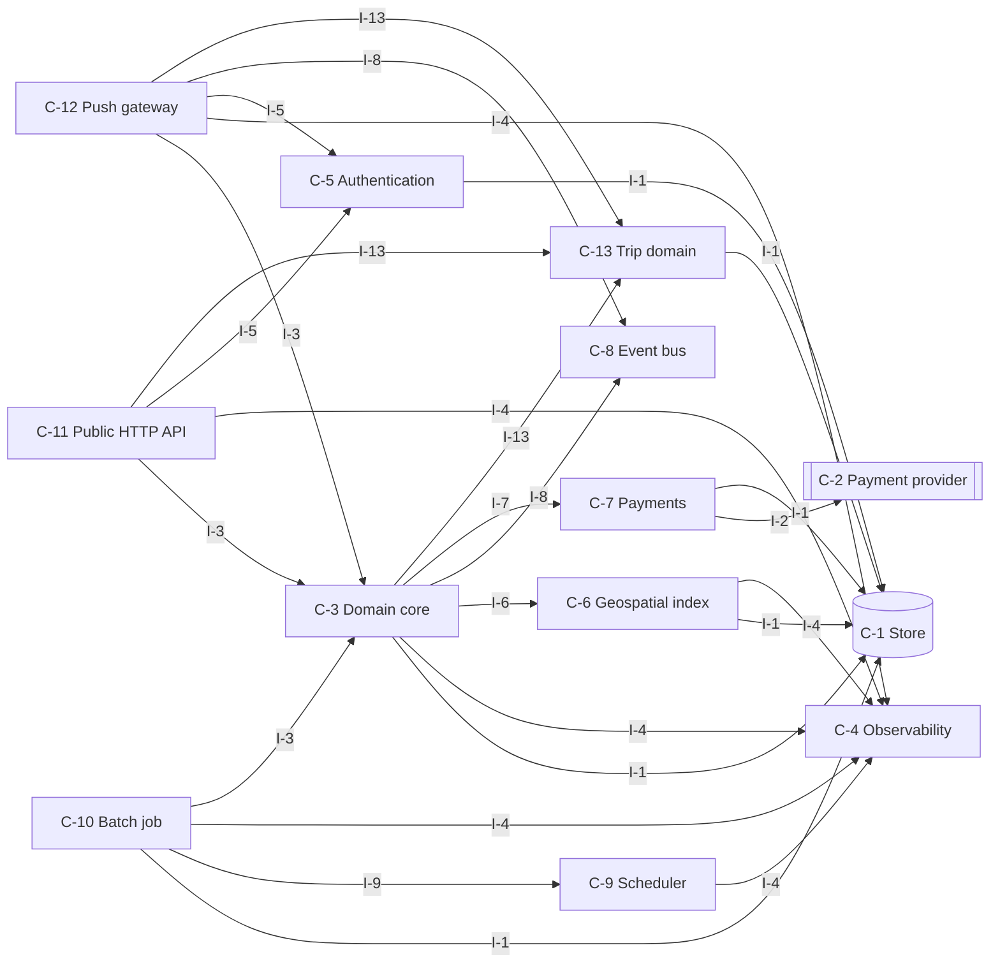
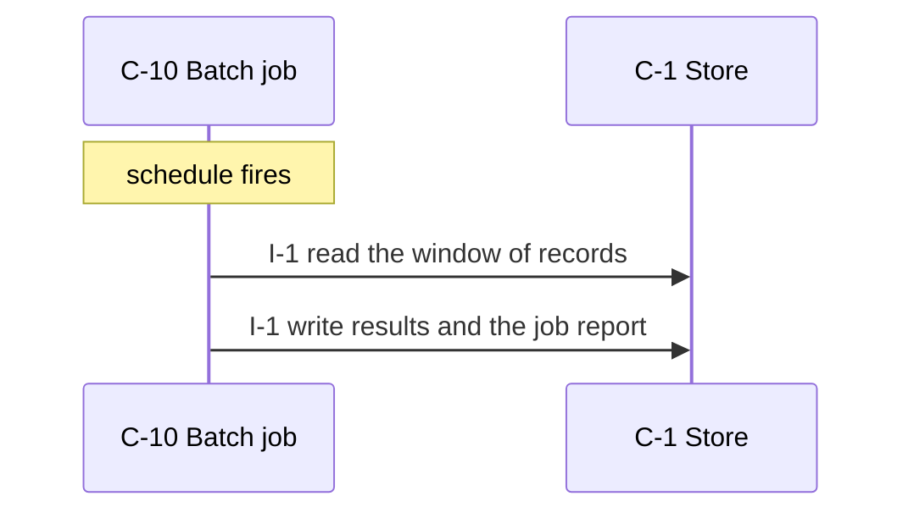
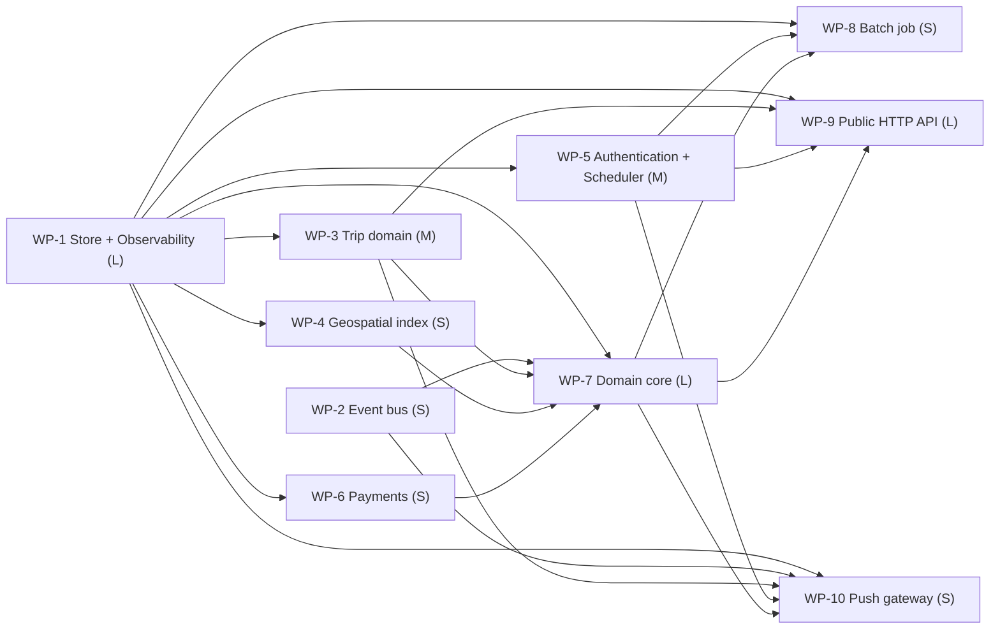

# ride-dispatch-backend — design

A city taxi cooperative needs a backend that matches ride requests to nearby drivers and tracks each trip.

_version 0.1.0 · schema sekkei/1_

## Goals

- Metrics, structured logs and health endpoints for operations.
- Callers are authenticated and authorized.
- Scheduled jobs process stored records in windows.
- Positions are indexed and nearest matches are found.
- Connected clients receive events as they happen.
- Charges and invoices through a payment provider.

**Non-goals**

- Route navigation and maps rendering (handled by the mobile apps).

## Requirements

| id | kind | priority | statement | metric |
|---|---|---|---|---|
| R-1 | functional | must | Riders request a ride from the mobile app with a pickup and a drop-off location; the request is offered to the nearest available drivers. | — |
| R-2 | functional | must | Drivers accept or decline an offer within 15 seconds; after three declines the request is offered to the next batch of drivers. | — |
| R-3 | functional | must | Drivers send their GPS position every 5 seconds while online; riders see the assigned driver's position in real time. | — |
| R-4 | functional | must | The system computes the fare from distance and time at the end of the trip and charges the rider's card through Stripe. | — |
| R-5 | functional | must | Riders can rate a trip and see their trip history; operators can view all active trips on a dashboard. | — |
| R-6 | functional | must | Operators receive an alert when no driver accepts a request within 2 minutes. | — |
| R-7 | nonfunctional | must | 300 concurrent trips and 2,000 online drivers at peak; position updates must be visible to the rider within 2 s p95. | p95 latency at 300, 2,000 <= 2 s |
| R-8 | nonfunctional | should | No accepted ride request or completed trip is lost on a crash. | occurrences of the forbidden action (request) = 0 occurrences |
| R-9 | nonfunctional | should | A driver's position history is kept 30 days for dispute handling, then deleted. | time 30 days |
| R-10 | constraint | must | Go 1.22, PostgreSQL with PostGIS available, Redis available. Team of 4. Kubernetes cluster in a single region. | — |
| R-11 | constraint | must | Riders and drivers authenticate with the company's OIDC provider; operators use the same provider with an operator role. | — |
| R-12 | functional | must | Domain records are kept indefinitely; logs and audit history are retained for 1 year, after which a nightly job deletes them (assumed by the engine). | — |
| R-13 | nonfunctional | must | The system sustains 400 updates/s (assumed by the engine: 2,000 drivers (R-7) ÷ every 5 s (R-3); a fixed reporting interval has no peak factor). | sustained rate at 2,000, 5 s 400 updates /s |
| R-14 | nonfunctional | must | Records are 2 KB on average and at most 256 KB (assumed by the engine). | size at 2 KB <= 256 kb |
| R-15 | nonfunctional | must | Availability of 99.9 % monthly; accepted work is delayed but never lost during an outage (assumed by the engine). | ratio 99.9 % |
| R-16 | nonfunctional | should | Backups run daily with a recovery point of 24 h and a recovery time of 4 h (assumed by the engine). | time at 4 h 24 h |
| R-17 | nonfunctional | should | External calls time out after 10 s; failures are retried 5 times with exponential backoff and work waits durably meanwhile (assumed by the engine). | time at 5 10 s |
| R-18 | constraint | must | Use existing infrastructure only; no new managed services (assumed by the engine). | — |
| R-19 | constraint | must | No existing data or system to migrate from (assumed by the engine). | — |

## Components

### C-1 — Store

- **kind**: datastore · **path**: `internal/store/store.go`
- **responsibility**: Owns persistence of the domain entities: durable writes, reads, listing, and the schema/migrations.
- **provides**: I-1
- **requires**: —
- **satisfies**: R-8, R-10, R-17

### C-2 — Payment provider

- **kind**: external
- **responsibility**: External payment service provider.
- **provides**: I-2
- **requires**: —
- **satisfies**: R-4

### C-3 — Domain core

- **kind**: module · **path**: `internal/core/core.go`
- **responsibility**: Business rules and validation for the domain entities; the only module that changes state through the store.
- **provides**: I-3
- **requires**: I-1, I-4, I-6, I-8, I-7, I-13
- **satisfies**: R-6, R-1, R-3, R-10, R-18, R-19

### C-4 — Observability

- **kind**: module · **path**: `internal/observability/observability.go`
- **responsibility**: Metrics registry and exposition, structured logging, health/readiness endpoints.
- **provides**: I-4
- **requires**: —
- **satisfies**: R-15

### C-5 — Authentication

- **kind**: module · **path**: `internal/auth/auth.go`
- **responsibility**: Authenticates callers and resolves them to a principal and scope; enforces authorization for management operations.
- **provides**: I-5
- **requires**: I-1
- **satisfies**: R-11

### C-6 — Geospatial index

- **kind**: module · **path**: `internal/geo/geo.go`
- **responsibility**: Keeps current positions and answers nearest-neighbour queries within a radius.
- **provides**: I-6
- **requires**: I-1, I-4
- **satisfies**: R-1

### C-7 — Payments

- **kind**: module · **path**: `internal/payments/payments.go`
- **responsibility**: Creates charges/invoices through the payment provider and reconciles their webhooks.
- **provides**: I-7
- **requires**: I-2, I-1
- **satisfies**: R-4

### C-8 — Event bus

- **kind**: module · **path**: `internal/bus/bus.go`
- **responsibility**: Publishes domain events to subscribers inside the system.
- **provides**: I-8
- **requires**: —
- **satisfies**: R-3

### C-9 — Scheduler

- **kind**: job · **path**: `internal/scheduler/scheduler.go`
- **responsibility**: Computes when deferred work runs next (backoff schedules, periodic jobs) and promotes due work.
- **provides**: I-9
- **requires**: I-4
- **satisfies**: R-2, R-12

### C-10 — Batch job

- **kind**: job · **path**: `internal/batch/batch.go`
- **responsibility**: Scheduled processing over stored records: extract, transform, aggregate, write results.
- **provides**: I-10
- **requires**: I-1, I-9, I-4, I-3
- **satisfies**: R-2, R-12

### C-11 — Public HTTP API

- **kind**: service · **path**: `internal/surface_api/surface_api.go`
- **responsibility**: Translates HTTP requests into core calls: routing, request validation, error mapping, JSON.
- **provides**: I-11
- **requires**: I-3, I-4, I-5, I-13
- **satisfies**: R-6, R-7, R-9, R-10, R-13, R-14, R-16

### C-12 — Push gateway

- **kind**: service · **path**: `internal/push/push.go`
- **responsibility**: Long-lived connections (WebSocket/SSE) that fan out events to connected clients.
- **provides**: I-12
- **requires**: I-3, I-4, I-5, I-8, I-13
- **satisfies**: R-3, R-10

### C-13 — Trip domain

- **kind**: module · **path**: `internal/domain_trip/domain_trip.go`
- **responsibility**: Owns the Trip aggregate: creation, changes and state transitions of these records, and the rules that hold across them. Trip state machine: active. Read from R-5.
- **provides**: I-13
- **requires**: I-1
- **satisfies**: R-4, R-5, R-7, R-8

**Layers** (each layer depends only on earlier ones):

0. C-1, C-2, C-4, C-8
1. C-13, C-5, C-6, C-7, C-9
2. C-3
3. C-10, C-11, C-12

## Interfaces

### I-1 — Store interface

- **kind**: class · **owner**: C-1 · **stability**: stable
- Provided by Store. 

| operation | inputs | output | errors | pre / post |
|---|---|---|---|---|
| `save` | `entity`: Entity, `record`: dict | id | ConflictError on duplicate key | record is durable before return |
| `get` | `entity`: Entity, `id`: str | record \| None | — | — |
| `list` | `entity`: Entity, `filter`: dict, `page`: Page | list[record], next page token | — | — |
| `delete` | `entity`: Entity, `id`: str | bool | — | — |

### I-2 — Payment provider interface

- **kind**: http · **owner**: C-2 · **stability**: stable
- Provided by Payment provider. External; contract is theirs.

| operation | inputs | output | errors | pre / post |
|---|---|---|---|---|
| `POST /charges` | — | charge | — | — |

### I-3 — Domain core interface

- **kind**: module · **owner**: C-3 · **stability**: draft
- Provided by Domain core. 

| operation | inputs | output | errors | pre / post |
|---|---|---|---|---|
| `request_ride` | `ride`: Ride \| id | Ride \| None | ValidationError, NotFound | — |
| | from R-1: Riders request a ride from the mobile app with a pickup and a drop-off location; the reque | | | |
| `accept_offer` | `offer`: Offer \| id | Offer \| None | ValidationError, NotFound | stated values: 15 seconds (R-2) |
| | from R-2: Drivers accept or decline an offer within 15 seconds; after three declines the request is | | | |
| `decline_offer` | `offer`: Offer \| id | Offer \| None | ValidationError, NotFound | stated values: 15 seconds (R-2) |
| | from R-2: Drivers accept or decline an offer within 15 seconds; after three declines the request is | | | |
| `send_position` | `position`: Position \| id | Position \| None | ValidationError, NotFound | stated values: 5 seconds (R-3) |
| | from R-3: Drivers send their GPS position every 5 seconds while online; riders see the assigned driv | | | |
| `get_driver` | `driver`: Driver \| id | Driver \| None | ValidationError, NotFound | stated values: 5 seconds (R-3) |
| | from R-3: Drivers send their GPS position every 5 seconds while online; riders see the assigned driv | | | |
| `charge_rider` | `rider`: Rider \| id | Rider \| None | ValidationError, NotFound | — |
| | from R-4: The system computes the fare from distance and time at the end of the trip and charges the | | | |
| `rate_trip` | `trip`: Trip \| id | Trip \| None | ValidationError, NotFound | — |
| | from R-5: Riders can rate a trip and see their trip history; operators can view all active trips on | | | |
| `get_history` | `history`: History \| id | History \| None | ValidationError, NotFound | — |
| | from R-5: Riders can rate a trip and see their trip history; operators can view all active trips on | | | |
| `get_trips` | `trips`: Trips \| id | Trips \| None | ValidationError, NotFound | — |
| | from R-5: Riders can rate a trip and see their trip history; operators can view all active trips on | | | |
| `receive_alert` | `alert`: Alert \| id | Alert \| None | ValidationError, NotFound | stated values: 2 minutes (R-6) |
| | from R-6: Operators receive an alert when no driver accepts a request within 2 minutes. | | | |

### I-4 — Observability interface

- **kind**: module · **owner**: C-4 · **stability**: draft
- Provided by Observability. 

| operation | inputs | output | errors | pre / post |
|---|---|---|---|---|
| `counter` | `name`: str, `labels`: dict | Counter | — | — |
| `histogram` | `name`: str, `labels`: dict | Histogram | — | — |
| `gauge` | `name`: str, `labels`: dict | Gauge | — | — |
| `GET /metrics` | — | Prometheus text exposition | — | — |
| `GET /healthz` | — | 200 when dependencies reachable | — | — |
| `log` | `event`: str, `fields`: dict | None | — | — |
| | one JSON line per event | | | |

### I-5 — Authentication interface

- **kind**: module · **owner**: C-5 · **stability**: draft
- Provided by Authentication. 

| operation | inputs | output | errors | pre / post |
|---|---|---|---|---|
| `authenticate` | `credentials`: str | Principal | AuthError | — |
| `authorize` | `principal`: Principal, `action`: str, `resource`: str | None | Forbidden | — |

### I-6 — Geospatial index interface

- **kind**: module · **owner**: C-6 · **stability**: draft
- Provided by Geospatial index. 

| operation | inputs | output | errors | pre / post |
|---|---|---|---|---|
| `update_position` | `subject_id`: str, `lat`: float, `lon`: float, `at`: datetime | None | — | — |
| `nearest` | `lat`: float, `lon`: float, `radius_m`: int, `limit`: int, `filter`: dict | list[(subject_id, distance_m)] | — | — |

### I-7 — Payments interface

- **kind**: module · **owner**: C-7 · **stability**: draft
- Provided by Payments. 

| operation | inputs | output | errors | pre / post |
|---|---|---|---|---|
| `charge` | `customer`: str, `amount`: Money, `idempotency_key`: str | Charge | PaymentDeclined | — |

### I-8 — Event bus interface

- **kind**: event · **owner**: C-8 · **stability**: draft
- Provided by Event bus. 

| operation | inputs | output | errors | pre / post |
|---|---|---|---|---|
| `publish` | `event`: Event | None | — | — |
| `subscribe` | `type`: str, `handler`: callable | None | — | — |

### I-9 — Scheduler interface

- **kind**: module · **owner**: C-9 · **stability**: draft
- Provided by Scheduler. 

| operation | inputs | output | errors | pre / post |
|---|---|---|---|---|
| `next_attempt` | `attempt`: int, `retry_after`: timedelta \| None | datetime \| None | — | — |
| | None when attempts are exhausted | | | |
| `promote_due` | `now`: datetime | int moved | — | — |

### I-10 — Batch job interface

- **kind**: module · **owner**: C-10 · **stability**: draft
- Provided by Batch job. 

| operation | inputs | output | errors | pre / post |
|---|---|---|---|---|
| `run` | `window`: DateRange | JobReport | JobError | stated values: 15 seconds (R-2); 1 year (R-12) |

### I-11 — Public HTTP API interface

- **kind**: http · **owner**: C-11 · **stability**: draft
- Provided by Public HTTP API. 

| operation | inputs | output | errors | pre / post |
|---|---|---|---|---|
| `POST /rides` | `body`: ride fields | 201 {ride id} | 400 invalid body, 401 unauthenticated, 409 conflict | — |
| | from R-1: Riders request a ride from the mobile app with a pickup and a drop-off location; the reque | | | |
| `POST /offers/{id}/accept` | `id`: str | 202 accept accepted | 401 unauthenticated, 404 unknown id, 409 not applicable in current state | stated values: 15 seconds (R-2) |
| | from R-2: Drivers accept or decline an offer within 15 seconds; after three declines the request is | | | |
| `POST /offers/{id}/decline` | `id`: str | 202 decline accepted | 401 unauthenticated, 404 unknown id, 409 not applicable in current state | stated values: 15 seconds (R-2) |
| | from R-2: Drivers accept or decline an offer within 15 seconds; after three declines the request is | | | |
| `GET /drivers/{id}` | `id`: str | 200 driver | 401 unauthenticated, 404 unknown id | stated values: 5 seconds (R-3) |
| | from R-3: Drivers send their GPS position every 5 seconds while online; riders see the assigned driv | | | |
| `POST /trips/{id}/rate` | `id`: str | 202 rate accepted | 401 unauthenticated, 404 unknown id, 409 not applicable in current state | — |
| | from R-5: Riders can rate a trip and see their trip history; operators can view all active trips on | | | |
| `GET /histories/{id}` | `id`: str | 200 history | 401 unauthenticated, 404 unknown id | — |
| | from R-5: Riders can rate a trip and see their trip history; operators can view all active trips on | | | |
| `GET /trips` | `filter`: query, `page`: cursor | 200 [trips], next cursor | 401 unauthenticated | — |
| | from R-5: Riders can rate a trip and see their trip history; operators can view all active trips on | | | |

### I-12 — Push gateway interface

- **kind**: http · **owner**: C-12 · **stability**: draft
- Provided by Push gateway. 

| operation | inputs | output | errors | pre / post |
|---|---|---|---|---|
| `subscribe` | `topic`: str | stream of events | — | — |

### I-13 — Trip domain interface

- **kind**: module · **owner**: C-13 · **stability**: draft
- Provided by Trip domain. Operations are the state transitions and creations the requirements name; add queries as the surfaces need them.

| operation | inputs | output | errors | pre / post |
|---|---|---|---|---|
| `create_trip` | `trip`: Trip | Trip (id assigned) | ValidationError listing every invalid field | record is durable before return |
| | creation of the aggregate root | | | |
| `get_trip` | `trip_id`: ref | Trip \| None | — | — |

## Entities

### E-1 — Principal (owner C-1)

| field | type | constraints |
|---|---|---|
| `id` | uuid | primary key |
| `kind` | enum(customer, operator, service) |  |
| `scopes` | list[str] |  |

### E-2 — JobRun (owner C-1)

| field | type | constraints |
|---|---|---|
| `id` | uuid | primary key |
| `job` | str |  |
| `window_start` | timestamp |  |
| `window_end` | timestamp |  |
| `status` | enum |  |
| `report` | json |  |

### E-3 — Trip (owner C-13)

Domain entity read from R-5. No fields are stated in the text beyond its name; add them.

| field | type | constraints |
|---|---|---|
| `id` | uuid | primary key |
| `status` | enum(active) | state machine read from  |
| `created_at` | timestamp |  |

### E-4 — Ride (owner C-1)

Domain entity read from R-1. No fields are stated in the text beyond its name; add them.

| field | type | constraints |
|---|---|---|
| `id` | uuid | primary key |
| `created_at` | timestamp |  |

## Flows

### F-1 — Run the batch job

_Trigger:_ schedule fires

1. C-10 → C-1 via I-1: read the window of records
2. C-10 → C-1 via I-1: write results and the job report

## Decisions

### D-1 — Caller authentication (accepted)

**Context.** Management operations must be attributable to a customer or operator.

- ✘ **API keys per customer, hashed at rest, sent as a bearer token**
  - + simple
  - + scriptable
  - − no delegation or expiry unless added
- ✔ **OAuth2 / OIDC with the platform's identity provider**
  - + single sign-on
  - + expiry and scopes
  - − integration effort
- ✘ **Mutual TLS**
  - + strong
  - + no secrets in headers
  - − certificate lifecycle for every customer
- ✘ **Session tokens issued by the platform's own account service to game/mobile clients (device-bound, short-lived, refreshable)**
  - + fits clients without a browser
  - + revocable per device
  - − a token service to run
- ✘ **No account: a reference number plus a knowledge factor (date of birth) resumes a saved application; every attempt rate-limited and logged**
  - + no credentials to manage for occasional users
  - + meets 'no account or email required'
  - − a reference number can be shared; scope what it unlocks
- ✘ **Email one-time code / magic link (no account needed)**
  - + no password, no sign-up
  - + works for occasional customers
  - − depends on email delivery
  - − weak against mailbox compromise

**Rationale.** Scored against the active qualities; decided by durability (weight 1.0), performance (weight 0.83). OAuth2 / OIDC with the platform's identity provi: 2.00; API keys per customer, hashed at rest, sent as a: 1.33; Mutual TLS: 0.83; Session tokens issued by the platform's own acco: unavailable (needs game_client, not in the constraints); No account: a reference number plus a knowledge : unavailable (needs no_account_auth, not in the constraints); Email one-time code / magic link: unavailable (needs email_auth, not in the constraints). stated in the constraints

**Consequences.** Not choosing 'API keys per customer, hashed at rest, sent as a' gives up: simple, scriptable. Not choosing 'Mutual TLS' gives up: strong, no secrets in headers.

_Affects:_ C-5

### D-2 — Primary store (accepted)

**Context.** Domain records need durable, queryable storage.

- ✔ **PostgreSQL**
  - + transactions
  - + indexes and JSON
  - + widely available
  - − operational dependency
- ✘ **MySQL / MariaDB (the stated database)**
  - + transactions
  - + already operated by the team
  - − weaker JSON and DDL ergonomics than PostgreSQL
- ✘ **Redis for the hot state (as stated) with a relational store for durable records**
  - + the stated home of the hot data
  - + sub-millisecond reads
  - − two stores to keep consistent
  - − Redis durability depends on AOF/fsync
- ✘ **Managed document store (DynamoDB/MongoDB, as stated)**
  - + scales without operations
  - + flexible records
  - − no cross-record transactions by default
  - − query patterns must be designed up front
- ✘ **SQLite**
  - + zero operations
  - + single file
  - − one writer at a time
  - − no network access
- ✘ **Files (JSON/CSV on disk)**
  - + no dependencies
  - + human readable
  - − no transactions or concurrency
- ✘ **In-memory**
  - + fastest
  - + trivial
  - − lost on restart

**Rationale.** Scored against the active qualities; decided by durability (weight 1.0), performance (weight 0.83). PostgreSQL: 3.25; MySQL / MariaDB: unavailable (needs mysql, not in the constraints); Redis for the hot state: unavailable (needs redis_primary, not in the constraints); Managed document store: unavailable (needs document_db, not in the constraints); SQLite: unavailable (ruled out by containers); Files: unavailable (ruled out by containers); In-memory: unavailable (ruled out by containers, postgres, durable_required). stated in the constraints

_Affects:_ C-1

### D-3 — Process topology (accepted)

**Context.** The same code base serves requests and performs background work.

- ✔ **One image, role by flag: `api` and `worker` processes scale independently**
  - + stateless containers
  - + independent scaling of ingress and outbound work
  - + one build
  - − two deployables to operate
- ✘ **Single process with background threads**
  - + one deployable
  - − request latency competes with outbound work
  - − cannot scale roles separately
- ✘ **Separate services per concern (ingest, admin, delivery)**
  - + clear ownership
  - − three deployables for a team of three
  - − shared schema anyway

**Rationale.** Scored against the active qualities; decided by durability (weight 1.0), performance (weight 0.83). One image, role by flag: `api` and `worker` proc: 1.83; Single process with background threads: 1.49; Separate services per concern: 1.35

**Consequences.** Not choosing 'Single process with background threads' gives up: one deployable. Not choosing 'Separate services per concern' gives up: clear ownership.

_Affects:_ C-11, C-9

### D-4 — Concurrency control for conflicting writes (accepted)

**Context.** Two callers may change the same record at the same time and the result must be consistent.

- ✔ **Optimistic concurrency: version column checked on every update; conflict returns 409 and the caller retries**
  - + no locks held across requests
  - + works with stateless instances
  - − callers must handle 409
- ✘ **Row locks inside a short transaction (SELECT ... FOR UPDATE)**
  - + simple mental model
  - + no client retry
  - − lock waits under contention
  - − needs a transactional store
- ✘ **Last write wins**
  - + nothing to implement
  - − lost updates

**Rationale.** Scored against the active qualities; decided by durability (weight 1.0), performance (weight 0.83). Optimistic concurrency: version column checked o: 1.75; Row locks inside a short transaction: 1.75; Last write wins: 1.56

**Consequences.** Not choosing 'Row locks inside a short transaction' gives up: simple mental model, no client retry. Not choosing 'Last write wins' gives up: nothing to implement.

_Affects:_ C-1, C-3

### D-5 — Redundancy for the availability target (accepted)

**Context.** The availability target must be met through instance failures and deploys.

- ✔ **Two or more interchangeable instances per role behind the ingress, health checks, rolling deploys**
  - + survives one instance failure
  - + zero-downtime deploys
  - − needs stateless instances and a shared store
- ✘ **Single instance with health-based restart**
  - + simplest
  - + cheapest
  - − restart time is downtime
  - − deploys are downtime
- ✘ **Active-active across two regions**
  - + survives a regional outage
  - − data replication and conflict handling
  - − cost

**Rationale.** Scored against the active qualities; decided by durability (weight 1.0), performance (weight 0.83). Two or more interchangeable instances per role b: 1.52; Single instance with health-based restart: 1.33; Active-active across two regions: unavailable (ruled out by single_region)

**Consequences.** Not choosing 'Single instance with health-based restart' gives up: simplest, cheapest.

_Affects:_ C-11, C-12

### D-6 — Assumed answer: load (Q-rate) (proposed)

**Context.** The requirements do not say. Question: Q-rate. Evidence: 2,000 drivers (R-7) ÷ every 5 s (R-3).

- ✔ **400 updates/s**
- ✘ **800 updates/s**
- ✘ **200 updates/s**

**Rationale.** Derived from the text: 2,000 drivers (R-7) ÷ every 5 s (R-3).

**Consequences.** If the real answer differs: State the measured rate; capacity estimates and the queue decision change.

_Affects:_ C-11

### D-7 — Assumed answer: load (Q-payload) (proposed)

**Context.** The requirements do not say. Question: Q-payload. No evidence in the text; engine default.

- ✔ **2 KB / 256 KB**
- ✘ **16 KB / 1 MB**
- ✘ **256 bytes / 4 KB**

**Rationale.** Typical JSON record sizes; the maximum bounds request bodies.

**Consequences.** If the real answer differs: State the sizes; storage growth and body limits change.

_Affects:_ C-11

### D-8 — Assumed answer: quality (Q-availability) (proposed)

**Context.** The requirements do not say. Question: Q-availability. No evidence in the text; engine default.

- ✔ **99.9 %**
- ✘ **99.5 %**
- ✘ **99.99 %**

**Rationale.** Three nines is achievable with two instances and health-based restarts; anything higher needs multi-region.

**Consequences.** If the real answer differs: State the target and what may be lost; topology and queue durability change.

_Affects:_ C-4

### D-9 — Assumed answer: data (Q-retention) (proposed)

**Context.** The requirements do not say. Question: Q-retention. No evidence in the text; engine default.

- ✔ **indefinite / 1 year**
- ✘ **90 days / 1 year**
- ✘ **30 days / 90 days**

**Rationale.** Deleting domain data is never a safe default; bounded retention for logs and history limits growth and satisfies most data-minimisation rules.

**Consequences.** If the real answer differs: State the retention per record class; the deletion job and capacity change.

_Affects:_ C-10, C-1

### D-10 — Assumed answer: data (Q-backup) (proposed)

**Context.** The requirements do not say. Question: Q-backup. No evidence in the text; engine default.

- ✔ **daily / 24 h / 4 h**
- ✘ **hourly / 1 h / 1 h**
- ✘ **none**

**Rationale.** The store's own daily backup is the cheapest credible baseline.

**Consequences.** If the real answer differs: State RPO/RTO; the store decision and a restore drill change.

_Affects:_ C-1

### D-11 — Assumed answer: resilience (Q-external) (proposed)

**Context.** The requirements do not say. Question: Q-external. No evidence in the text; engine default.

- ✔ **10 s / 5 retries / queue**
- ✘ **fail fast, no retry**
- ✘ **30 s / unlimited retries**

**Rationale.** Bounded retries with a durable queue keep the system responsive during a one-hour outage.

**Consequences.** If the real answer differs: State the policy; the outbound client and scheduler contracts change.

_Affects:_ C-9

### D-12 — Assumed answer: cost (Q-budget) (proposed)

**Context.** The requirements do not say. Question: Q-budget. No evidence in the text; engine default.

- ✔ **existing only**
- ✘ **managed services allowed**
- ✘ **strict monthly cap**

**Rationale.** The cheapest assumption; every decision already prefers the option needing no new infrastructure.

**Consequences.** If the real answer differs: State the budget; options adding infrastructure become available.

### D-13 — Assumed answer: data (Q-migration) (proposed)

**Context.** The requirements do not say. Question: Q-migration. No evidence in the text; engine default.

- ✔ **greenfield**
- ✘ **one-shot import**
- ✘ **gradual cut-over**

**Rationale.** Nothing in the text names an existing system.

**Consequences.** If the real answer differs: Name the existing system; a migration package and risk are added.

## Risks

| id | risk | likelihood | impact | mitigation |
|---|---|---|---|---|
| K-1 | Per-target labels on metrics explode cardinality. | medium | low | Label by outcome and partition class, not by target id; expose per-target detail through the API instead. |
| K-2 | A management operation reachable without authentication. | low | high | Authenticate in one middleware for every management route; test every route unauthenticated. |
| K-3 | Entities evolve; migrations run against live data. | medium | medium | Versioned migrations applied before deploy; additive changes first, removals one release later. |
| K-4 | Parts of the requirements were not recognised by the catalogue and received a generic decomposition. | medium | medium | Review the components marked generic; refine responsibilities and interfaces before briefing. |
| K-5 | [tampering] Store: Injection through query construction. | medium | medium | Parameterised queries only; no string-built SQL. Check: static check for string-formatted SQL finds nothing |
| K-6 | [information_disclosure] Store: Backups and dumps contain everything. | medium | high | Encrypt backups; restrict who can take them. Check: backup file is not readable without the key |
| K-7 | [spoofing] Authentication: Credential stuffing or leaked keys. | medium | medium | Hash keys at rest; allow revocation; rate-limit failures. Check: revoked key is rejected within seconds; brute force is throttled |
| K-8 | [elevation] Authentication: A caller acts on another tenant's resources. | medium | high | Every core operation takes the principal and checks ownership. Check: cross-tenant request returns 404/403 for every operation |
| K-9 | [tampering] Payments: Double charge on retry. | medium | medium | Idempotency keys on every charge; reconcile provider webhooks. Check: retrying a charge with the same key charges once |
| K-10 | [spoofing] Public HTTP API: Requests without a verified caller identity reach domain operations. | medium | medium | Authenticate every route in one middleware; deny by default. Check: every route returns 401 without credentials |
| K-11 | [tampering] Public HTTP API: Malformed or oversized bodies reach the core. | medium | medium | Schema-validate and size-limit at the surface; reject before parsing fully. Check: fuzz the body; oversize returns 413 |
| K-12 | [denial_of_service] Public HTTP API: A single caller saturates the service. | medium | medium | Per-caller rate limit and request timeouts. Check: burst from one key returns 429; others unaffected |
| K-13 | [information_disclosure] Public HTTP API: Stack traces or internal ids leak in error responses. | medium | high | Map exceptions to fixed error shapes; log details server-side only. Check: no traceback text in any 4xx/5xx body |
| K-14 | [denial_of_service] Push gateway: Unbounded connections. | medium | medium | Cap connections per principal; idle timeouts. Check: connection cap enforced |

## Work packages

**Waves** (packages in one wave may run in parallel):

1. WP-1, WP-2
2. WP-3, WP-4, WP-5, WP-6
3. WP-7
4. WP-10, WP-8, WP-9

_Critical path (35 person-days):_ WP-1 → WP-3 → WP-7 → WP-9

### WP-1 — Store + Observability (L)

Implement Store: Owns persistence of the domain entities: durable writes, reads, listing, and the schema/migrations; Observability: Metrics registry and exposition, structured logging, health/readiness endpoints.

- **components**: C-1, C-4 · **implements**: I-1, I-4
- **depends on**: — · **satisfies**: R-8, R-10, R-15, R-17
- **write scope**: `internal/store/store.go`, `internal/store/store_test.go`, `internal/observability/observability.go`, `internal/observability/observability_test.go`
- **acceptance**:
  - A-1 (test) unit tests of Store, Observability pass — `go test ./internal/store/`
  - A-2 (metric) R-8: occurrences of the forbidden action (request) = 0 occurrences — metric R-8
  - A-3 (metric) R-15: ratio 99.9 % — kill one instance under load; error rate stays within the target — metric R-15
- **notes**: family: infra

### WP-2 — Event bus (S)

Implement Event bus: Publishes domain events to subscribers inside the system.

- **components**: C-8 · **implements**: I-8
- **depends on**: — · **satisfies**: R-3
- **write scope**: `internal/bus/bus.go`, `internal/bus/bus_test.go`
- **acceptance**:
  - A-4 (test) unit tests of Event bus pass — `go test ./internal/bus/`
- **notes**: family: realtime

### WP-3 — Trip domain (M)

Implement Trip domain: Owns the Trip aggregate: creation, changes and state transitions of these records, and the rules that hold across them. Trip state machine: active. Read from R-5.

- **components**: C-13 · **implements**: I-13
- **depends on**: WP-1 · **satisfies**: R-4, R-5, R-7, R-8
- **write scope**: `internal/domain_trip/domain_trip.go`, `internal/domain_trip/domain_trip_test.go`
- **acceptance**:
  - A-5 (test) unit tests of Trip domain pass — `go test ./internal/domain_trip/`
  - A-6 (metric) R-7: p95 latency at 300, 2,000 <= 2 s — load test at the stated rate; the stated percentile must meet the target — metric R-7
  - A-7 (metric) R-8: occurrences of the forbidden action (request) = 0 occurrences — metric R-8
- **notes**: family: aggregate:domain_trip

### WP-4 — Geospatial index (S)

Implement Geospatial index: Keeps current positions and answers nearest-neighbour queries within a radius.

- **components**: C-6 · **implements**: I-6
- **depends on**: WP-1 · **satisfies**: R-1
- **write scope**: `internal/geo/geo.go`, `internal/geo/geo_test.go`
- **acceptance**:
  - A-8 (test) unit tests of Geospatial index pass — `go test ./internal/geo/`
- **notes**: family: geo

### WP-5 — Authentication + Scheduler (M)

Implement Authentication: Authenticates callers and resolves them to a principal and scope; enforces authorization for management operations; Scheduler: Computes when deferred work runs next (backoff schedules, periodic jobs) and promotes due work.

- **components**: C-5, C-9 · **implements**: I-5, I-9
- **depends on**: WP-1 · **satisfies**: R-2, R-11, R-12
- **write scope**: `internal/auth/auth.go`, `internal/auth/auth_test.go`, `internal/scheduler/scheduler.go`, `internal/scheduler/scheduler_test.go`
- **acceptance**:
  - A-9 (test) unit tests of Authentication, Scheduler pass — `go test ./internal/auth/`
- **notes**: family: infra

### WP-6 — Payments (S)

Implement Payments: Creates charges/invoices through the payment provider and reconciles their webhooks.

- **components**: C-7 · **implements**: I-7
- **depends on**: WP-1 · **satisfies**: R-4
- **write scope**: `internal/payments/payments.go`, `internal/payments/payments_test.go`
- **acceptance**:
  - A-10 (test) unit tests of Payments pass — `go test ./internal/payments/`
- **notes**: family: payments

### WP-7 — Domain core (L)

Implement Domain core: Business rules and validation for the domain entities; the only module that changes state through the store.

- **components**: C-3 · **implements**: I-3
- **depends on**: WP-1, WP-2, WP-3, WP-4, WP-6 · **satisfies**: R-1, R-3, R-6, R-10, R-18, R-19
- **write scope**: `internal/core/core.go`, `internal/core/core_test.go`
- **acceptance**:
  - A-11 (test) unit tests of Domain core pass — `go test ./internal/core/`
- **notes**: family: geo

### WP-8 — Batch job (S)

Implement Batch job: Scheduled processing over stored records: extract, transform, aggregate, write results.

- **components**: C-10 · **implements**: I-10
- **depends on**: WP-1, WP-5, WP-7 · **satisfies**: R-2, R-12
- **write scope**: `internal/batch/batch.go`, `internal/batch/batch_test.go`
- **acceptance**:
  - A-12 (test) unit tests of Batch job pass — `go test ./internal/batch/`
- **notes**: family: batch_pipeline

### WP-9 — Public HTTP API (L)

Implement Public HTTP API: Translates HTTP requests into core calls: routing, request validation, error mapping, JSON.

- **components**: C-11 · **implements**: I-11
- **depends on**: WP-1, WP-3, WP-5, WP-7 · **satisfies**: R-6, R-7, R-9, R-10, R-13, R-14, R-16
- **write scope**: `internal/surface_api/surface_api.go`, `internal/surface_api/surface_api_test.go`
- **acceptance**:
  - A-13 (test) unit tests of Public HTTP API pass — `go test ./internal/surface_api/`
  - A-14 (metric) R-7: p95 latency at 300, 2,000 <= 2 s — load test at the stated rate; the stated percentile must meet the target — metric R-7
- **notes**: family: infra

### WP-10 — Push gateway (S)

Implement Push gateway: Long-lived connections (WebSocket/SSE) that fan out events to connected clients.

- **components**: C-12 · **implements**: I-12
- **depends on**: WP-1, WP-2, WP-3, WP-5, WP-7 · **satisfies**: R-3, R-10
- **write scope**: `internal/push/push.go`, `internal/push/push_test.go`
- **acceptance**:
  - A-15 (test) unit tests of Push gateway pass — `go test ./internal/push/`
- **notes**: family: realtime

## Traceability

| requirement | priority | components | work packages | acceptance |
|---|---|---|---|---|
| R-1 | must | C-3, C-6 | WP-4, WP-7 | A-8, A-11 |
| R-2 | must | C-9, C-10 | WP-5, WP-8 | A-9, A-12 |
| R-3 | must | C-3, C-8, C-12 | WP-2, WP-7, WP-10 | A-4, A-11, A-15 |
| R-4 | must | C-2, C-7, C-13 | WP-3, WP-6 | A-5, A-6, A-7, A-10 |
| R-5 | must | C-13 | WP-3 | A-5, A-6, A-7 |
| R-6 | must | C-3, C-11 | WP-7, WP-9 | A-11, A-13, A-14 |
| R-7 | must | C-11, C-13 | WP-3, WP-9 | A-5, A-6, A-7, A-13, A-14 |
| R-8 | should | C-1, C-13 | WP-1, WP-3 | A-1, A-2, A-3, A-5, A-6, A-7 |
| R-9 | should | C-11 | WP-9 | A-13, A-14 |
| R-10 | must | C-1, C-3, C-11, C-12 | WP-1, WP-7, WP-9, WP-10 | A-1, A-2, A-3, A-11, A-13, A-14, A-15 |
| R-11 | must | C-5 | WP-5 | A-9 |
| R-12 | must | C-9, C-10 | WP-5, WP-8 | A-9, A-12 |
| R-13 | must | C-11 | WP-9 | A-13, A-14 |
| R-14 | must | C-11 | WP-9 | A-13, A-14 |
| R-15 | must | C-4 | WP-1 | A-1, A-2, A-3 |
| R-16 | should | C-11 | WP-9 | A-13, A-14 |
| R-17 | should | C-1 | WP-1 | A-1, A-2, A-3 |
| R-18 | must | C-3 | WP-7 | A-11 |
| R-19 | must | C-3 | WP-7 | A-11 |

## Conventions

- **language**: go
- **test**: `go test ./...`
- **lint**: `go vet ./...`
- Errors are values; wrap with context.
- Interfaces are declared by the consumer.
- Every component logs one structured line per unit of work with the correlation id.
- Prefer the boring option; a new piece of infrastructure needs a decision record.
- Go 1.22 as stated in the constraints.
- Stateless processes: configuration from the environment, no local files that a second instance would not see.

**Definition of done**

- Acceptance checks of the package pass.
- No file outside the write scope changed.
- Every public operation of the implemented interfaces exists with the declared inputs.
