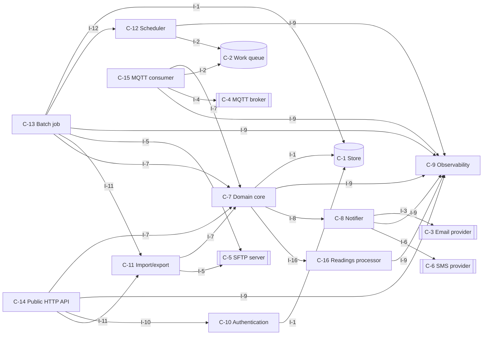
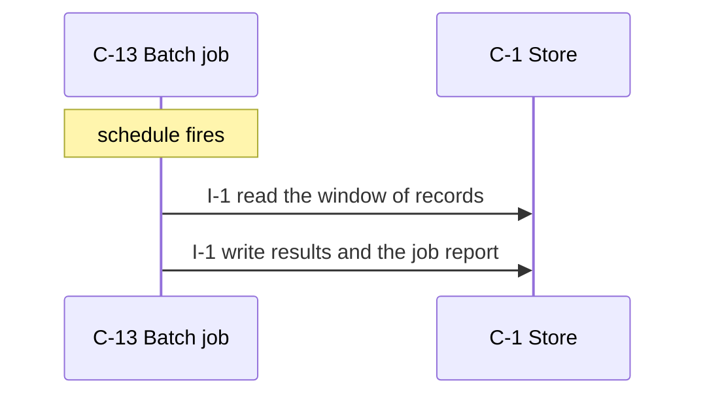
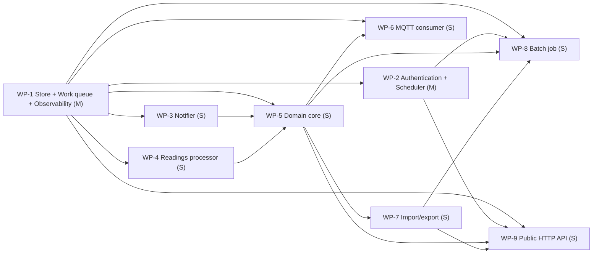

# fleet-telemetry-ingestion — design

Trucks send sensor readings to a central service that keeps the fleet manager informed.

_version 0.1.0 · schema sekkei/1_

## Goals

- The system notifies people through an external channel.
- Callers are authenticated and authorized.
- Scheduled jobs process stored records in windows.
- Devices publish over MQTT; the consumer persists before acknowledging.
- Exports are dropped on an SFTP server.
- People are notified by SMS.
- Records move in and out as files.

## Requirements

| id | kind | priority | statement | metric |
|---|---|---|---|---|
| R-1 | functional | must | Each truck publishes a batch of sensor readings (speed, fuel level, engine temperature, position) every 30 seconds over MQTT. | — |
| R-2 | functional | must | The service validates readings, drops duplicates, and stores them. | — |
| R-3 | functional | must | Fleet managers view the latest reading per truck and a 24-hour chart per sensor. | — |
| R-4 | functional | must | When engine temperature exceeds a threshold for more than 5 minutes the fleet manager is notified by SMS. | — |
| R-5 | functional | must | A nightly job aggregates readings into daily statistics per truck and exports them as CSV to an SFTP server. | — |
| R-6 | nonfunctional | must | 5,000 trucks, 20,000 readings/s at peak; a reading is visible to managers within 10 s p95. | p95 latency at 5,000, 20,000 <= 10 s |
| R-7 | nonfunctional | must | Readings are never lost once acknowledged to the truck; duplicates never appear in charts. | records lost across a process crash = 0 records |
| R-8 | nonfunctional | should | Raw readings are kept 90 days, daily statistics 5 years. | time at 5 years 90 days |
| R-9 | constraint | must | Java 21, PostgreSQL with TimescaleDB available, Kafka available. Team of 5. On-prem Kubernetes. | — |
| R-10 | constraint | must | The MQTT broker already exists and is operated by another team. | — |
| R-11 | functional | must | Domain records are kept indefinitely; logs and audit history are retained for 1 year, after which a nightly job deletes them (assumed by the engine). | — |
| R-12 | functional | could | Every operation is scoped to the caller's own resources; an admin role may act on any resource (assumed by the engine). | — |
| R-13 | nonfunctional | must | Records are 2 KB on average and at most 256 KB (assumed by the engine). | size at 2 KB <= 256 kb |
| R-14 | nonfunctional | must | Availability of 99.9 % monthly; accepted work is delayed but never lost during an outage (assumed by the engine). | ratio 99.9 % |
| R-15 | nonfunctional | should | Backups run daily with a recovery point of 24 h and a recovery time of 4 h (assumed by the engine). | time at 4 h 24 h |
| R-16 | nonfunctional | should | External calls time out after 10 s; failures are retried 5 times with exponential backoff and work waits durably meanwhile (assumed by the engine). | time at 5 10 s |
| R-17 | nonfunctional | must | An alert is raised when the error rate exceeds 1 % for 5 minutes or the queue depth grows for 10 minutes (assumed by the engine). | ratio at 5 minutes, 10 minutes 1 % |
| R-18 | constraint | must | Authentication via an OIDC identity provider (assumed by the engine: internal users). | — |
| R-19 | constraint | must | Use existing infrastructure only; no new managed services (assumed by the engine). | — |
| R-20 | constraint | must | No existing data or system to migrate from (assumed by the engine). | — |

## Components

### C-1 — Store

- **kind**: datastore · **path**: `src/main/java/app/Store.java`
- **responsibility**: Owns persistence of the domain entities: durable writes, reads, listing, and the schema/migrations.
- **provides**: I-1
- **requires**: —
- **satisfies**: R-7, R-9, R-16

### C-2 — Work queue

- **kind**: datastore · **path**: `src/main/java/app/Queue.java`
- **responsibility**: Durable, ordered hand-off of work items between the ingest path and the workers, with visibility timeout and dead-letter.
- **provides**: I-2
- **requires**: —
- **satisfies**: R-1, R-7, R-14, R-16, R-17

### C-3 — Email provider

- **kind**: external
- **responsibility**: External email delivery service.
- **provides**: I-3
- **requires**: —
- **satisfies**: R-4

### C-4 — MQTT broker

- **kind**: external
- **responsibility**: Existing broker operated elsewhere; delivers device messages at least once.
- **provides**: I-4
- **requires**: —
- **satisfies**: R-1

### C-5 — SFTP server

- **kind**: external
- **responsibility**: External file drop for exports.
- **provides**: I-5
- **requires**: —
- **satisfies**: R-5

### C-6 — SMS provider

- **kind**: external
- **responsibility**: External SMS gateway.
- **provides**: I-6
- **requires**: —
- **satisfies**: R-4

### C-7 — Domain core

- **kind**: module · **path**: `src/main/java/app/Core.java`
- **responsibility**: Business rules and validation for the domain entities; the only module that changes state through the store.
- **provides**: I-7
- **requires**: I-1, I-9, I-8, I-16
- **satisfies**: R-3, R-1, R-5, R-9, R-10, R-19, R-20

### C-8 — Notifier

- **kind**: module · **path**: `src/main/java/app/Notifier.java`
- **responsibility**: Sends operator/customer notifications through the configured channel with templating and rate limiting.
- **provides**: I-8
- **requires**: I-3, I-9, I-6
- **satisfies**: R-4

### C-9 — Observability

- **kind**: module · **path**: `src/main/java/app/Observability.java`
- **responsibility**: Metrics registry and exposition, structured logging, health/readiness endpoints.
- **provides**: I-9
- **requires**: —
- **satisfies**: R-14, R-17

### C-10 — Authentication

- **kind**: module · **path**: `src/main/java/app/Auth.java`
- **responsibility**: Authenticates callers and resolves them to a principal and scope; enforces authorization for management operations.
- **provides**: I-10
- **requires**: I-1
- **satisfies**: R-12, R-18

### C-11 — Import/export

- **kind**: module · **path**: `src/main/java/app/Exporter.java`
- **responsibility**: Streams records to and from CSV/JSON with validation and partial-failure reporting.
- **provides**: I-11
- **requires**: I-7, I-5
- **satisfies**: R-5

### C-12 — Scheduler

- **kind**: job · **path**: `src/main/java/app/Scheduler.java`
- **responsibility**: Computes when deferred work runs next (backoff schedules, periodic jobs) and promotes due work.
- **provides**: I-12
- **requires**: I-9, I-2
- **satisfies**: R-1, R-5, R-8, R-11

### C-13 — Batch job

- **kind**: job · **path**: `src/main/java/app/Batch.java`
- **responsibility**: Scheduled processing over stored records: extract, transform, aggregate, write results.
- **provides**: I-13
- **requires**: I-1, I-12, I-9, I-5, I-11, I-7
- **satisfies**: R-1, R-5, R-8, R-11

### C-14 — Public HTTP API

- **kind**: service · **path**: `src/main/java/app/SurfaceApi.java`
- **responsibility**: Translates HTTP requests into core calls: routing, request validation, error mapping, JSON.
- **provides**: I-14
- **requires**: I-7, I-9, I-10, I-11
- **satisfies**: R-3, R-6, R-9, R-13, R-15

### C-15 — MQTT consumer

- **kind**: job · **path**: `src/main/java/app/MqttConsumer.java`
- **responsibility**: Subscribes to the broker's topics, validates and de-duplicates messages, persists them and acknowledges only after persistence.
- **provides**: I-15
- **requires**: I-7, I-2, I-4, I-9
- **satisfies**: R-1

### C-16 — Readings processor

- **kind**: module · **path**: `src/main/java/app/ReadingsProcessor.java`
- **responsibility**: Computes over readings on behalf of the core. Synthesised from R-2; no catalogue pattern matched.
- **provides**: I-16
- **requires**: I-9
- **satisfies**: R-2

**Layers** (each layer depends only on earlier ones):

0. C-1, C-2, C-3, C-4, C-5, C-6, C-9
1. C-10, C-12, C-16, C-8
2. C-7
3. C-11, C-15
4. C-13, C-14

## Interfaces

### I-1 — Store interface

- **kind**: class · **owner**: C-1 · **stability**: stable
- Provided by Store. 

| operation | inputs | output | errors | pre / post |
|---|---|---|---|---|
| `save` | `entity`: Entity, `record`: dict | id | ConflictError on duplicate key | record is durable before return |
| `get` | `entity`: Entity, `id`: str | record \| None | — | — |
| `list` | `entity`: Entity, `filter`: dict, `page`: Page | list[record], next page token | — | — |
| `delete` | `entity`: Entity, `id`: str | bool | — | — |

### I-2 — Work queue interface

- **kind**: class · **owner**: C-2 · **stability**: stable
- Provided by Work queue. 

| operation | inputs | output | errors | pre / post |
|---|---|---|---|---|
| `enqueue` | `item`: WorkItem, `not_before`: datetime \| None | None | — | item is durable before return |
| `lease` | `partition`: str, `limit`: int, `visibility`: timedelta | list[WorkItem] | — | items whose not_before has passed |
| `ack` | `item_id`: str | None | — | — |
| `nack` | `item_id`: str, `retry_at`: datetime \| None | None | — | — |
| | re-queue with a delay, or dead-letter when retries are exhausted | | | |
| `depth` | `partition`: str \| None | int | — | — |

### I-3 — Email provider interface

- **kind**: http · **owner**: C-3 · **stability**: stable
- Provided by Email provider. External; contract is theirs.

| operation | inputs | output | errors | pre / post |
|---|---|---|---|---|
| `send` | `to`: str, `subject`: str, `body`: str | provider message id | — | — |

### I-4 — MQTT broker interface

- **kind**: event · **owner**: C-4 · **stability**: stable
- Provided by MQTT broker. External; contract is theirs.

| operation | inputs | output | errors | pre / post |
|---|---|---|---|---|
| `subscribe` | `topic`: str, `qos`: int | message stream | — | — |

### I-5 — SFTP server interface

- **kind**: file · **owner**: C-5 · **stability**: stable
- Provided by SFTP server. External; contract is theirs.

| operation | inputs | output | errors | pre / post |
|---|---|---|---|---|
| `put` | `path`: str, `data`: bytes | None | transfer error -> retry next run | — |

### I-6 — SMS provider interface

- **kind**: http · **owner**: C-6 · **stability**: stable
- Provided by SMS provider. External; contract is theirs.

| operation | inputs | output | errors | pre / post |
|---|---|---|---|---|
| `send` | `to`: str, `text`: str | provider message id | — | — |

### I-7 — Domain core interface

- **kind**: module · **owner**: C-7 · **stability**: draft
- Provided by Domain core. 

| operation | inputs | output | errors | pre / post |
|---|---|---|---|---|
| `publish_batch` | `batch`: Batch \| id | Batch \| None | ValidationError, NotFound | stated values: 30 seconds (R-1) |
| | from R-1: Each truck publishes a batch of sensor readings (speed, fuel level, engine temperature, po | | | |
| `validate_readings` | `readings`: Readings \| id | Readings \| None | ValidationError, NotFound | — |
| | from R-2: The service validates readings, drops duplicates, and stores them. | | | |
| `drop_duplicates` | `duplicates`: Duplicates \| id | Duplicates \| None | ValidationError, NotFound | — |
| | from R-2: The service validates readings, drops duplicates, and stores them. | | | |
| `store_duplicates` | `duplicates`: Duplicates \| id | Duplicates \| None | ValidationError, NotFound | — |
| | from R-2: The service validates readings, drops duplicates, and stores them. | | | |
| `get_latest` | `latest`: Latest \| id | Latest \| None | ValidationError, NotFound | — |
| | from R-3: Fleet managers view the latest reading per truck and a 24-hour chart per sensor. | | | |
| `get_truck` | `truck`: Truck \| id | Truck \| None | ValidationError, NotFound | — |
| | from R-3: Fleet managers view the latest reading per truck and a 24-hour chart per sensor. | | | |
| `notify_manager` | `manager`: Manager \| id | Manager \| None | ValidationError, NotFound | stated values: 5 minutes (R-4) |
| | from R-4: When engine temperature exceeds a threshold for more than 5 minutes the fleet manager is n | | | |
| `aggregate_readings` | `readings`: Readings \| id | Readings \| None | ValidationError, NotFound | — |
| | from R-5: A nightly job aggregates readings into daily statistics per truck and exports them as CSV | | | |
| `export_sftp` | `sftp`: Sftp \| id | Sftp \| None | ValidationError, NotFound | — |
| | from R-5: A nightly job aggregates readings into daily statistics per truck and exports them as CSV | | | |
| `record_kept` | `kept`: Kept \| id | Kept \| None | ValidationError, NotFound | stated values: 1 year (R-11) |
| | from R-11: Domain records are kept indefinitely; logs and audit history are retained for 1 year, afte | | | |
| `log_history` | `history`: History \| id | History \| None | ValidationError, NotFound | stated values: 1 year (R-11) |
| | from R-11: Domain records are kept indefinitely; logs and audit history are retained for 1 year, afte | | | |
| `delete_job` | `job`: Job \| id | Job \| None | ValidationError, NotFound | stated values: 1 year (R-11) |
| | from R-11: Domain records are kept indefinitely; logs and audit history are retained for 1 year, afte | | | |

### I-8 — Notifier interface

- **kind**: module · **owner**: C-8 · **stability**: draft
- Provided by Notifier. 

| operation | inputs | output | errors | pre / post |
|---|---|---|---|---|
| `notify` | `recipient`: str, `template`: str, `context`: dict | message id | NotifyError | — |

### I-9 — Observability interface

- **kind**: module · **owner**: C-9 · **stability**: draft
- Provided by Observability. 

| operation | inputs | output | errors | pre / post |
|---|---|---|---|---|
| `counter` | `name`: str, `labels`: dict | Counter | — | — |
| `histogram` | `name`: str, `labels`: dict | Histogram | — | — |
| `gauge` | `name`: str, `labels`: dict | Gauge | — | — |
| `GET /metrics` | — | Prometheus text exposition | — | — |
| `GET /healthz` | — | 200 when dependencies reachable | — | — |
| `log` | `event`: str, `fields`: dict | None | — | — |
| | one JSON line per event | | | |

### I-10 — Authentication interface

- **kind**: module · **owner**: C-10 · **stability**: draft
- Provided by Authentication. 

| operation | inputs | output | errors | pre / post |
|---|---|---|---|---|
| `authenticate` | `credentials`: str | Principal | AuthError | — |
| `authorize` | `principal`: Principal, `action`: str, `resource`: str | None | Forbidden | — |

### I-11 — Import/export interface

- **kind**: module · **owner**: C-11 · **stability**: draft
- Provided by Import/export. 

| operation | inputs | output | errors | pre / post |
|---|---|---|---|---|
| `export` | `entity`: Entity, `filter`: dict, `format`: csv\|json | byte stream | — | — |
| `import_` | `entity`: Entity, `stream`: bytes, `format`: csv\|json | ImportReport with per-row errors | — | — |

### I-12 — Scheduler interface

- **kind**: module · **owner**: C-12 · **stability**: draft
- Provided by Scheduler. 

| operation | inputs | output | errors | pre / post |
|---|---|---|---|---|
| `next_attempt` | `attempt`: int, `retry_after`: timedelta \| None | datetime \| None | — | — |
| | None when attempts are exhausted | | | |
| `promote_due` | `now`: datetime | int moved | — | — |

### I-13 — Batch job interface

- **kind**: module · **owner**: C-13 · **stability**: draft
- Provided by Batch job. 

| operation | inputs | output | errors | pre / post |
|---|---|---|---|---|
| `run` | `window`: DateRange | JobReport | JobError | stated values: 30 seconds (R-1); 1 year (R-11) |

### I-14 — Public HTTP API interface

- **kind**: http · **owner**: C-14 · **stability**: draft
- Provided by Public HTTP API. 

| operation | inputs | output | errors | pre / post |
|---|---|---|---|---|
| `GET /latests/{id}` | `id`: str | 200 latest | 401 unauthenticated, 404 unknown id | — |
| | from R-3: Fleet managers view the latest reading per truck and a 24-hour chart per sensor. | | | |

### I-15 — MQTT consumer interface

- **kind**: event · **owner**: C-15 · **stability**: draft
- Provided by MQTT consumer. 

| operation | inputs | output | errors | pre / post |
|---|---|---|---|---|
| `on_message` | `topic`: str, `payload`: bytes, `message_id`: str | None | ValidationError -> dead-letter topic | reading persisted (idempotent on message_id) before the broker ack |

### I-16 — Readings processor interface

- **kind**: module · **owner**: C-16 · **stability**: draft
- Provided by Readings processor. Contract derived from R-2; fill in the types marked '…'.

| operation | inputs | output | errors | pre / post |
|---|---|---|---|---|
| `validate_readings` | `readings`: list[Reading] | list[Reading] (validated) | … | — |
| | from R-2: The service validates readings, drops duplicates, and stores them. | | | |
| `drop_duplicates` | `duplicates`: list[Duplicate] | … | … | — |
| | from R-2: The service validates readings, drops duplicates, and stores them. | | | |
| `store` | `input`: … | … | … | — |
| | from R-2: The service validates readings, drops duplicates, and stores them. | | | |

## Entities

### E-1 — Principal (owner C-1)

| field | type | constraints |
|---|---|---|
| `id` | uuid | primary key |
| `kind` | enum(customer, operator, service) |  |
| `scopes` | list[str] |  |

### E-2 — JobRun (owner C-1)

| field | type | constraints |
|---|---|---|
| `id` | uuid | primary key |
| `job` | str |  |
| `window_start` | timestamp |  |
| `window_end` | timestamp |  |
| `status` | enum |  |
| `report` | json |  |

### E-3 — Event (owner C-1)

| field | type | constraints |
|---|---|---|
| `id` | uuid | primary key |
| `type` | str | indexed |
| `payload` | json |  |
| `created_at` | timestamp |  |
| `idempotency_key` | str | unique per producer |

### E-4 — WorkItem (owner C-2)

| field | type | constraints |
|---|---|---|
| `id` | uuid | primary key |
| `partition` | str | indexed; the isolation key |
| `payload_ref` | uuid | references the event |
| `attempt` | int | >= 0 |
| `not_before` | timestamp | indexed |
| `leased_until` | timestamp \| null |  |

### E-5 — Duplicate (owner C-1)

Domain entity named in the requirements ('duplicate'); confirm the fields.

| field | type | constraints |
|---|---|---|
| `id` | uuid | primary key |
| `created_at` | timestamp |  |

### E-6 — Reading (owner C-1)

Domain entity named in the requirements ('reading'); confirm the fields.

| field | type | constraints |
|---|---|---|
| `id` | uuid | primary key |
| `speed` | … | from the text |
| `fuel_level` | … | from the text |
| `engine_temperature` | … | from the text |
| `position` | … | from the text |
| `created_at` | timestamp |  |

## Flows

### F-1 — Run the batch job

_Trigger:_ schedule fires

1. C-13 → C-1 via I-1: read the window of records
2. C-13 → C-1 via I-1: write results and the job report

## Decisions

### D-1 — Caller authentication (accepted)

**Context.** Management operations must be attributable to a customer or operator.

- ✘ **API keys per customer, hashed at rest, sent as a bearer token**
  - + simple
  - + scriptable
  - − no delegation or expiry unless added
- ✔ **OAuth2 / OIDC with the platform's identity provider**
  - + single sign-on
  - + expiry and scopes
  - − integration effort
- ✘ **Mutual TLS**
  - + strong
  - + no secrets in headers
  - − certificate lifecycle for every customer

**Rationale.** Scored against the active qualities; decided by durability (weight 1.0), performance (weight 0.9). OAuth2 / OIDC with the platform's identity provi: 2.00; API keys per customer, hashed at rest, sent as a: 1.33; Mutual TLS: 0.84. stated in the constraints

**Consequences.** Not choosing 'API keys per customer, hashed at rest, sent as a' gives up: simple, scriptable. Not choosing 'Mutual TLS' gives up: strong, no secrets in headers.

_Affects:_ C-10

### D-2 — Primary store (accepted)

**Context.** Domain records need durable, queryable storage.

- ✔ **PostgreSQL**
  - + transactions
  - + indexes and JSON
  - + already available
  - − operational dependency
- ✘ **SQLite**
  - + zero operations
  - + single file
  - − one writer at a time
  - − no network access
- ✘ **Files (JSON/CSV on disk)**
  - + no dependencies
  - + human readable
  - − no transactions or concurrency
- ✘ **In-memory**
  - + fastest
  - + trivial
  - − lost on restart

**Rationale.** Scored against the active qualities; decided by durability (weight 1.0), performance (weight 0.9). PostgreSQL: 3.42; In-memory: 1.70; SQLite: unavailable (ruled out by containers); Files: unavailable (ruled out by containers). stated in the constraints

**Consequences.** Not choosing 'In-memory' gives up: fastest, trivial.

_Affects:_ C-1

### D-3 — Process topology (accepted)

**Context.** The same code base serves requests and performs background work.

- ✔ **One image, role by flag: `api` and `worker` processes scale independently**
  - + stateless containers
  - + independent scaling of ingress and outbound work
  - + one build
  - − two deployables to operate
- ✘ **Single process with background threads**
  - + one deployable
  - − request latency competes with outbound work
  - − cannot scale roles separately
- ✘ **Separate services per concern (ingest, admin, delivery)**
  - + clear ownership
  - − three deployables for a team of three
  - − shared schema anyway

**Rationale.** Scored against the active qualities; decided by durability (weight 1.0), performance (weight 0.9). One image, role by flag: `api` and `worker` proc: 1.95; Single process with background threads: 1.51; Separate services per concern: 1.42

**Consequences.** Not choosing 'Single process with background threads' gives up: one deployable. Not choosing 'Separate services per concern' gives up: clear ownership.

_Affects:_ C-14, C-12

### D-4 — Work queue technology (accepted)

**Context.** Work items must survive a crash and be leased by several workers.

- ✘ **PostgreSQL table with SELECT ... FOR UPDATE SKIP LOCKED**
  - + transactional with the domain data (persist + enqueue atomically)
  - + no new infrastructure
  - + easy to inspect
  - − throughput bounded by the database (fine to ~10k items/s)
  - − needs a vacuum-friendly schema
- ✘ **Redis Streams with consumer groups**
  - + high throughput
  - + built-in consumer groups and pending lists
  - − durability depends on AOF/fsync configuration
  - − separate from the transactional store: needs an outbox
- ✔ **Managed broker (SQS/RabbitMQ/Kafka)**
  - + scales independently
  - + delayed delivery built in (SQS)
  - − new infrastructure and cost
  - − at-least-once semantics still need an outbox
- ✘ **In-memory queue**
  - + simplest possible
  - − work is lost on crash
  - − single process only

**Rationale.** Scored against the active qualities; decided by durability (weight 1.0), performance (weight 0.9). Managed broker: 2.07; PostgreSQL table with SELECT ... FOR UPDATE SKIP: unavailable (stated rate 20,000/s exceeds this option's ceiling of 10,000/s); Redis Streams with consumer groups: unavailable (needs redis, not in the constraints); In-memory queue: unavailable (stated rate 20,000/s exceeds this option's ceiling of 1,000/s)

_Affects:_ C-2

### D-5 — Time-series storage (accepted)

**Context.** High-rate readings must be written continuously and queried by time window.

- ✔ **TimescaleDB hypertables in PostgreSQL (time partitioning, compression, retention policies)**
  - + one database
  - + retention by policy
  - + fast window queries
  - − an extension to operate
- ✘ **Plain PostgreSQL tables partitioned by day**
  - + no extension
  - − manual partition management
  - − slower window queries
- ✘ **ClickHouse**
  - + columnar, very fast aggregation
  - − a second database
  - − eventual consistency

**Rationale.** Scored against the active qualities; decided by durability (weight 1.0), performance (weight 0.9). TimescaleDB hypertables in PostgreSQL: 3.42; Plain PostgreSQL tables partitioned by day: 2.19; ClickHouse: unavailable (needs clickhouse, not in the constraints). stated in the constraints

**Consequences.** Not choosing 'Plain PostgreSQL tables partitioned by day' gives up: no extension.

_Affects:_ C-1

### D-6 — Redundancy for the availability target (accepted)

**Context.** The availability target must be met through instance failures and deploys.

- ✔ **Two or more interchangeable instances per role behind the ingress, health checks, rolling deploys**
  - + survives one instance failure
  - + zero-downtime deploys
  - − needs stateless instances and a shared store
- ✘ **Single instance with health-based restart**
  - + simplest
  - + cheapest
  - − restart time is downtime
  - − deploys are downtime
- ✘ **Active-active across two regions**
  - + survives a regional outage
  - − data replication and conflict handling
  - − cost

**Rationale.** Scored against the active qualities; decided by durability (weight 1.0), performance (weight 0.9). Two or more interchangeable instances per role b: 1.58; Single instance with health-based restart: 1.33; Active-active across two regions: 1.26

**Consequences.** Not choosing 'Single instance with health-based restart' gives up: simplest, cheapest. Not choosing 'Active-active across two regions' gives up: survives a regional outage.

_Affects:_ C-14

### D-7 — Assumed answer: load (Q-payload) (proposed)

**Context.** The requirements do not say. Question: Q-payload. No evidence in the text; engine default.

- ✔ **2 KB / 256 KB**
- ✘ **16 KB / 1 MB**
- ✘ **256 bytes / 4 KB**

**Rationale.** Typical JSON record sizes; the maximum bounds request bodies.

**Consequences.** If the real answer differs: State the sizes; storage growth and body limits change.

_Affects:_ C-14

### D-8 — Assumed answer: quality (Q-availability) (proposed)

**Context.** The requirements do not say. Question: Q-availability. No evidence in the text; engine default.

- ✔ **99.9 %**
- ✘ **99.5 %**
- ✘ **99.99 %**

**Rationale.** Three nines is achievable with two instances and health-based restarts; anything higher needs multi-region.

**Consequences.** If the real answer differs: State the target and what may be lost; topology and queue durability change.

_Affects:_ C-2, C-9

### D-9 — Assumed answer: data (Q-retention) (proposed)

**Context.** The requirements do not say. Question: Q-retention. No evidence in the text; engine default.

- ✔ **indefinite / 1 year**
- ✘ **90 days / 1 year**
- ✘ **30 days / 90 days**

**Rationale.** Deleting domain data is never a safe default; bounded retention for logs and history limits growth and satisfies most data-minimisation rules.

**Consequences.** If the real answer differs: State the retention per record class; the deletion job and capacity change.

_Affects:_ C-13, C-1

### D-10 — Assumed answer: data (Q-backup) (proposed)

**Context.** The requirements do not say. Question: Q-backup. No evidence in the text; engine default.

- ✔ **daily / 24 h / 4 h**
- ✘ **hourly / 1 h / 1 h**
- ✘ **none**

**Rationale.** The store's own daily backup is the cheapest credible baseline.

**Consequences.** If the real answer differs: State RPO/RTO; the store decision and a restore drill change.

_Affects:_ C-1

### D-11 — Assumed answer: security (Q-auth) (proposed)

**Context.** The requirements do not say. Question: Q-auth. Evidence: staff/employees mentioned.

- ✔ **OIDC**
- ✘ **API keys**
- ✘ **mTLS**

**Rationale.** Internal staff systems normally sit behind the company's SSO.

**Consequences.** If the real answer differs: State the scheme; the authentication decision is rescored.

_Affects:_ C-10

### D-12 — Assumed answer: cost (Q-budget) (proposed)

**Context.** The requirements do not say. Question: Q-budget. No evidence in the text; engine default.

- ✔ **existing only**
- ✘ **managed services allowed**
- ✘ **strict monthly cap**

**Rationale.** The cheapest assumption; every decision already prefers the option needing no new infrastructure.

**Consequences.** If the real answer differs: State the budget; options adding infrastructure become available.

### D-13 — Assumed answer: data (Q-migration) (proposed)

**Context.** The requirements do not say. Question: Q-migration. No evidence in the text; engine default.

- ✔ **greenfield**
- ✘ **one-shot import**
- ✘ **gradual cut-over**

**Rationale.** Nothing in the text names an existing system.

**Consequences.** If the real answer differs: Name the existing system; a migration package and risk are added.

### D-14 — Assumed answer: security (Q-authz) (proposed)

**Context.** The requirements do not say. Question: Q-authz. No evidence in the text; engine default.

- ✔ **owner-scoped + admin role**
- ✘ **flat (everyone sees everything)**
- ✘ **role matrix per resource**

**Rationale.** Ownership scoping is the minimum that prevents cross-tenant access.

**Consequences.** If the real answer differs: State the roles; core operations and acceptance checks change.

_Affects:_ C-7, C-10

### D-15 — Assumed answer: resilience (Q-external) (proposed)

**Context.** The requirements do not say. Question: Q-external. No evidence in the text; engine default.

- ✔ **10 s / 5 retries / queue**
- ✘ **fail fast, no retry**
- ✘ **30 s / unlimited retries**

**Rationale.** Bounded retries with a durable queue keep the system responsive during a one-hour outage.

**Consequences.** If the real answer differs: State the policy; the outbound client and scheduler contracts change.

_Affects:_ C-12, C-2

### D-16 — Assumed answer: operations (Q-alerting) (proposed)

**Context.** The requirements do not say. Question: Q-alerting. No evidence in the text; engine default.

- ✔ **error rate + queue growth**
- ✘ **none**
- ✘ **per-endpoint SLO alerts**

**Rationale.** Two alerts catch most incidents without paging on noise.

**Consequences.** If the real answer differs: State the rules and the on-call; observability conventions change.

_Affects:_ C-9

## Risks

| id | risk | likelihood | impact | mitigation |
|---|---|---|---|---|
| K-1 | A widespread failure disables many targets and emails every owner at once. | low | medium | Rate-limit notifications per owner and batch them. |
| K-2 | A management operation reachable without authentication. | low | high | Authenticate in one middleware for every management route; test every route unauthenticated. |
| K-3 | Entities evolve; migrations run against live data. | medium | medium | Versioned migrations applied before deploy; additive changes first, removals one release later. |
| K-4 | At-least-once delivery means a target can receive the same event twice (crash between call and ack). | high | medium | Send a stable event id and attempt number in headers; document idempotent consumption; never retry on 2xx. |
| K-5 | Retried and dead-lettered items accumulate and slow the lease query. | medium | medium | Partial index on (partition, not_before) for live items; archive terminal items on a schedule. |
| K-6 | Payloads or uploads without size limits exhaust memory or disk. | medium | medium | Enforce size limits at the surface; reject early with a clear error. |
| K-7 | Parts of the requirements were not recognised by the catalogue and received a generic decomposition. | medium | medium | Review the components marked generic; refine responsibilities and interfaces before briefing. |
| K-8 | [tampering] Store: Injection through query construction. | medium | medium | Parameterised queries only; no string-built SQL. Check: static check for string-formatted SQL finds nothing |
| K-9 | [information_disclosure] Store: Backups and dumps contain everything. | medium | high | Encrypt backups; restrict who can take them. Check: backup file is not readable without the key |
| K-10 | [denial_of_service] Work queue: A poison item is retried forever and blocks its partition. | medium | medium | Attempt cap and dead-letter; per-partition concurrency cap. Check: an always-failing item ends in the dead-letter after the cap |
| K-11 | [tampering] Work queue: Items are processed twice after a crash between call and ack. | medium | medium | Idempotent processing with the item id; ack only after the outcome is recorded. Check: kill the worker mid-call; the item is redelivered exactly once more |
| K-12 | [denial_of_service] Notifier: Notification storms and template injection. | medium | medium | Rate-limit per recipient; escape template context. Check: 1,000 failures produce one digest per owner |
| K-13 | [spoofing] Authentication: Credential stuffing or leaked keys. | medium | medium | Hash keys at rest; allow revocation; rate-limit failures. Check: revoked key is rejected within seconds; brute force is throttled |
| K-14 | [elevation] Authentication: A caller acts on another tenant's resources. | medium | high | Every core operation takes the principal and checks ownership. Check: cross-tenant request returns 404/403 for every operation |
| K-15 | [spoofing] Public HTTP API: Requests without a verified caller identity reach domain operations. | medium | medium | Authenticate every route in one middleware; deny by default. Check: every route returns 401 without credentials |
| K-16 | [tampering] Public HTTP API: Malformed or oversized bodies reach the core. | medium | medium | Schema-validate and size-limit at the surface; reject before parsing fully. Check: fuzz the body; oversize returns 413 |
| K-17 | [denial_of_service] Public HTTP API: A single caller saturates the service. | medium | medium | Per-caller rate limit and request timeouts. Check: burst from one key returns 429; others unaffected |
| K-18 | [information_disclosure] Public HTTP API: Stack traces or internal ids leak in error responses. | medium | high | Map exceptions to fixed error shapes; log details server-side only. Check: no traceback text in any 4xx/5xx body |

## Work packages

**Waves** (packages in one wave may run in parallel):

1. WP-1
2. WP-2, WP-3, WP-4
3. WP-5
4. WP-6, WP-7
5. WP-8, WP-9

_Critical path (13 person-days):_ WP-1 → WP-4 → WP-5 → WP-7 → WP-9

### WP-1 — Store + Work queue + Observability (M)

Implement Store: Owns persistence of the domain entities: durable writes, reads, listing, and the schema/migrations; Work queue: Durable, ordered hand-off of work items between the ingest path and the workers, with visibility timeout and dead-letter; Observability: Metrics registry and exposition, structured logging, health/readiness endpoints.

- **components**: C-1, C-2, C-9 · **implements**: I-1, I-2, I-9
- **depends on**: — · **satisfies**: R-1, R-7, R-9, R-14, R-16, R-17
- **write scope**: `src/main/java/app/Store.java`, `src/test/java/app/StoreTest.java`, `src/main/java/app/Queue.java`, `src/test/java/app/QueueTest.java`, `src/main/java/app/Observability.java`, `src/test/java/app/ObservabilityTest.java`
- **acceptance**:
  - A-1 (test) unit tests of Store, Work queue, Observability pass — `./gradlew test --tests app.StoreTest`
  - A-2 (metric) R-7: records lost across a process crash = 0 records — crash/kill test: no accepted item is lost and none is delivered without a durable record — metric R-7
  - A-3 (metric) R-14: ratio 99.9 % — kill one instance under load; error rate stays within the target — metric R-14
- **notes**: family: infra

### WP-2 — Authentication + Scheduler (M)

Implement Authentication: Authenticates callers and resolves them to a principal and scope; enforces authorization for management operations; Scheduler: Computes when deferred work runs next (backoff schedules, periodic jobs) and promotes due work.

- **components**: C-10, C-12 · **implements**: I-10, I-12
- **depends on**: WP-1 · **satisfies**: R-1, R-5, R-8, R-11, R-12, R-18
- **write scope**: `src/main/java/app/Auth.java`, `src/test/java/app/AuthTest.java`, `src/main/java/app/Scheduler.java`, `src/test/java/app/SchedulerTest.java`
- **acceptance**:
  - A-4 (test) unit tests of Authentication, Scheduler pass — `./gradlew test --tests app.AuthTest`
  - A-5 (metric) R-8: time at 5 years 90 days — metric R-8
- **notes**: family: infra

### WP-3 — Notifier (S)

Implement Notifier: Sends operator/customer notifications through the configured channel with templating and rate limiting.

- **components**: C-8 · **implements**: I-8
- **depends on**: WP-1 · **satisfies**: R-4
- **write scope**: `src/main/java/app/Notifier.java`, `src/test/java/app/NotifierTest.java`
- **acceptance**:
  - A-6 (test) unit tests of Notifier pass — `./gradlew test --tests app.NotifierTest`
- **notes**: family: notification

### WP-4 — Readings processor (S)

Implement Readings processor: Computes over readings on behalf of the core. Synthesised from R-2; no catalogue pattern matched.

- **components**: C-16 · **implements**: I-16
- **depends on**: WP-1 · **satisfies**: R-2
- **write scope**: `src/main/java/app/ReadingsProcessor.java`, `src/test/java/app/ReadingsProcessorTest.java`
- **acceptance**:
  - A-7 (test) unit tests of Readings processor pass — `./gradlew test --tests app.Readings_processorTest`
- **notes**: family: synthesised:readings_processor

### WP-5 — Domain core (S)

Implement Domain core: Business rules and validation for the domain entities; the only module that changes state through the store.

- **components**: C-7 · **implements**: I-7
- **depends on**: WP-1, WP-3, WP-4 · **satisfies**: R-1, R-3, R-5, R-9, R-10, R-19, R-20
- **write scope**: `src/main/java/app/Core.java`, `src/test/java/app/CoreTest.java`
- **acceptance**:
  - A-8 (test) unit tests of Domain core pass — `./gradlew test --tests app.CoreTest`
- **notes**: family: mqtt_ingest

### WP-6 — MQTT consumer (S)

Implement MQTT consumer: Subscribes to the broker's topics, validates and de-duplicates messages, persists them and acknowledges only after persistence.

- **components**: C-15 · **implements**: I-15
- **depends on**: WP-1, WP-5 · **satisfies**: R-1
- **write scope**: `src/main/java/app/MqttConsumer.java`, `src/test/java/app/MqttConsumerTest.java`
- **acceptance**:
  - A-9 (test) unit tests of MQTT consumer pass — `./gradlew test --tests app.Mqtt_consumerTest`
- **notes**: family: mqtt_ingest

### WP-7 — Import/export (S)

Implement Import/export: Streams records to and from CSV/JSON with validation and partial-failure reporting.

- **components**: C-11 · **implements**: I-11
- **depends on**: WP-5 · **satisfies**: R-5
- **write scope**: `src/main/java/app/Exporter.java`, `src/test/java/app/ExporterTest.java`
- **acceptance**:
  - A-10 (test) unit tests of Import/export pass — `./gradlew test --tests app.ExporterTest`
- **notes**: family: sftp_export

### WP-8 — Batch job (S)

Implement Batch job: Scheduled processing over stored records: extract, transform, aggregate, write results.

- **components**: C-13 · **implements**: I-13
- **depends on**: WP-1, WP-2, WP-5, WP-7 · **satisfies**: R-1, R-5, R-8, R-11
- **write scope**: `src/main/java/app/Batch.java`, `src/test/java/app/BatchTest.java`
- **acceptance**:
  - A-11 (test) unit tests of Batch job pass — `./gradlew test --tests app.BatchTest`
  - A-12 (metric) R-8: time at 5 years 90 days — metric R-8
- **notes**: family: batch_pipeline

### WP-9 — Public HTTP API (S)

Implement Public HTTP API: Translates HTTP requests into core calls: routing, request validation, error mapping, JSON.

- **components**: C-14 · **implements**: I-14
- **depends on**: WP-1, WP-2, WP-5, WP-7 · **satisfies**: R-3, R-6, R-9, R-13, R-15
- **write scope**: `src/main/java/app/SurfaceApi.java`, `src/test/java/app/SurfaceApiTest.java`
- **acceptance**:
  - A-13 (test) unit tests of Public HTTP API pass — `./gradlew test --tests app.Surface_apiTest`
  - A-14 (metric) R-6: p95 latency at 5,000, 20,000 <= 10 s — load test at the stated rate; the stated percentile must meet the target — metric R-6
- **notes**: family: infra

## Traceability

| requirement | priority | components | work packages | acceptance |
|---|---|---|---|---|
| R-1 | must | C-2, C-4, C-7, C-12, C-13, C-15 | WP-1, WP-2, WP-5, WP-6, WP-8 | A-1, A-2, A-3, A-4, A-5, A-8, A-9, A-11, A-12 |
| R-2 | must | C-16 | WP-4 | A-7 |
| R-3 | must | C-7, C-14 | WP-5, WP-9 | A-8, A-13, A-14 |
| R-4 | must | C-3, C-6, C-8 | WP-3 | A-6 |
| R-5 | must | C-5, C-7, C-11, C-12, C-13 | WP-2, WP-5, WP-7, WP-8 | A-4, A-5, A-8, A-10, A-11, A-12 |
| R-6 | must | C-14 | WP-9 | A-13, A-14 |
| R-7 | must | C-1, C-2 | WP-1 | A-1, A-2, A-3 |
| R-8 | should | C-12, C-13 | WP-2, WP-8 | A-4, A-5, A-11, A-12 |
| R-9 | must | C-1, C-7, C-14 | WP-1, WP-5, WP-9 | A-1, A-2, A-3, A-8, A-13, A-14 |
| R-10 | must | C-7 | WP-5 | A-8 |
| R-11 | must | C-12, C-13 | WP-2, WP-8 | A-4, A-5, A-11, A-12 |
| R-12 | could | C-10 | WP-2 | A-4, A-5 |
| R-13 | must | C-14 | WP-9 | A-13, A-14 |
| R-14 | must | C-2, C-9 | WP-1 | A-1, A-2, A-3 |
| R-15 | should | C-14 | WP-9 | A-13, A-14 |
| R-16 | should | C-1, C-2 | WP-1 | A-1, A-2, A-3 |
| R-17 | must | C-2, C-9 | WP-1 | A-1, A-2, A-3 |
| R-18 | must | C-10 | WP-2 | A-4, A-5 |
| R-19 | must | C-7 | WP-5 | A-8 |
| R-20 | must | C-7 | WP-5 | A-8 |

## Conventions

- **language**: java
- **test**: `./gradlew test`
- **lint**: `./gradlew check`
- Constructor injection; no static state.
- Every component logs one structured line per unit of work with the correlation id.
- Prefer the boring option; a new piece of infrastructure needs a decision record.
- Java 21 as stated in the constraints.
- Stateless processes: configuration from the environment, no local files that a second instance would not see.

**Definition of done**

- Acceptance checks of the package pass.
- No file outside the write scope changed.
- Every public operation of the implemented interfaces exists with the declared inputs.
