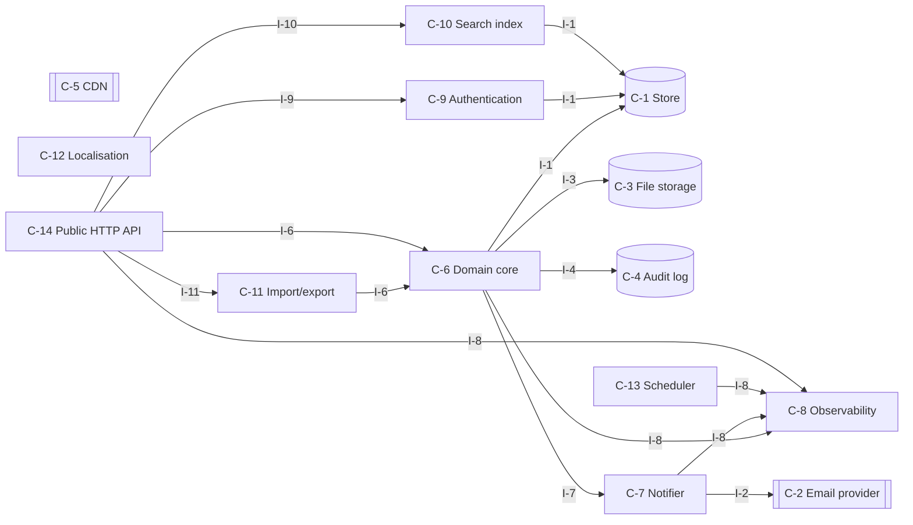
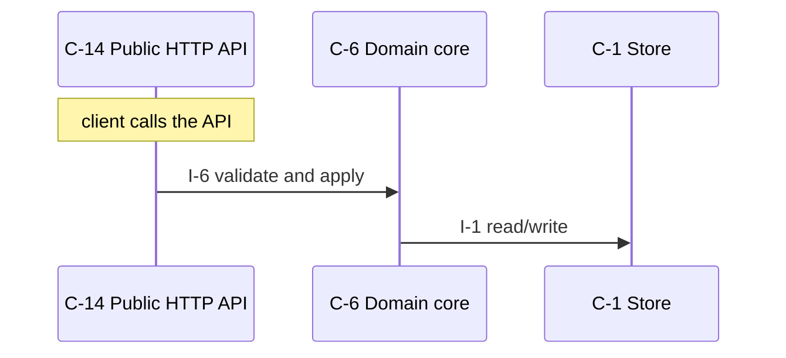
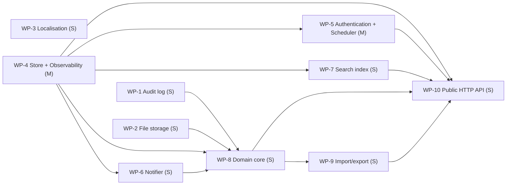

# internal-manage-system — design

Employees can take video courses.

_version 0.1.0 · schema sekkei/1_

## Goals

- Clients read and write domain resources over HTTP.
- The system notifies people through an external channel.
- Metrics, structured logs and health endpoints for operations.
- Callers are authenticated and authorized.
- Users search and filter records.
- Files are uploaded, stored and served.
- Work runs on a schedule.
- Changes are recorded append-only with the actor.
- Records move in and out as files.
- Large media files are stored once and played by many.
- Users work in several languages and locales.

**Non-goals**

- Videos transcoding (existing service delegated to).
- Outside learners (external).

## Requirements

| id | kind | priority | statement | metric |
|---|---|---|---|---|
| R-1 | functional | must | Admins can create, publish and unpublish courses (videos, files, tests). | — |
| R-2 | functional | must | Employees can search and take courses. Employees can save and resume playback position videos later. | — |
| R-3 | functional | must | Employees can take tests. Employees can view explanations grades immediately. | — |
| R-4 | functional | must | Managers can list and view grades their reports progress. Managers can export CSV. | — |
| R-5 | functional | must | The system must notify deadline 3 days before not yet taken employees email. | — |
| R-6 | functional | must | Courses completions grades audit for 5 years retention. | — |
| R-7 | functional | must | The system must view pages email employees locale (Japanese English). | — |
| R-8 | nonfunctional | must | Videos files up to 2 GB. The system must complete upload within 10 min. | latency at 2 GB <= 10 min |
| R-9 | nonfunctional | must | The system must view videos concurrently 2000 users playback must not stall. | number of users 2000 users |
| R-10 | nonfunctional | must | The system must respond courses list within 300 ms (p95). | p95 latency <= 300 ms |
| R-11 | nonfunctional | must | Grades must never be lost. Grades must not record double-applied. | lost or duplicate updates under concurrent writes to one record = 0 updates |
| R-12 | nonfunctional | must | Monthly availability at least 99.9 %. The system must export Prometheus for metrics. | ratio >= 99.9 % |
| R-13 | constraint | must | The system can use object storage TypeScript (Node 20) PostgreSQL S3. Team of 4. | — |
| R-14 | constraint | must | Employees authenticate internal SSO (OIDC). Containers existing ingress behind. | — |
| R-15 | functional | could | Every operation is scoped to the caller's own resources; an admin role may act on any resource (assumed by the engine). | — |
| R-16 | nonfunctional | must | The system sustains 100 requests/s with peaks of 1,000 requests/s (assumed by the engine; default, not derived from the text). | sustained rate at 1,000 100 requests /s |
| R-17 | nonfunctional | should | Backups run daily with a recovery point of 24 h and a recovery time of 4 h (assumed by the engine). | time at 4 h 24 h |
| R-18 | nonfunctional | should | External calls time out after 10 s; failures are retried 5 times with exponential backoff and work waits durably meanwhile (assumed by the engine). | time at 5 10 s |
| R-19 | nonfunctional | must | An alert is raised when the error rate exceeds 1 % for 5 minutes or the queue depth grows for 10 minutes (assumed by the engine). | ratio at 5 minutes, 10 minutes 1 % |
| R-20 | constraint | must | No existing data or system to migrate from (assumed by the engine). | — |
| R-21 | constraint | must | Use existing infrastructure only; no new managed services (assumed by the engine). | — |

## Components

### C-1 — Store

- **kind**: datastore · **path**: `src/store.ts`
- **responsibility**: Owns persistence of the domain entities: durable writes, reads, listing, and the schema/migrations.
- **provides**: I-1
- **requires**: —
- **satisfies**: R-9, R-11, R-13, R-18

### C-2 — Email provider

- **kind**: external
- **responsibility**: External email delivery service.
- **provides**: I-2
- **requires**: —
- **satisfies**: R-5, R-7

### C-3 — File storage

- **kind**: datastore · **path**: `src/files.ts`
- **responsibility**: Stores and serves uploaded files/blobs with content-type and size limits.
- **provides**: I-3
- **requires**: —
- **satisfies**: R-1, R-2, R-8, R-9

### C-4 — Audit log

- **kind**: datastore · **path**: `src/audit.ts`
- **responsibility**: Append-only record of who did what to which resource, queryable by resource and actor.
- **provides**: I-4
- **requires**: —
- **satisfies**: R-6

### C-5 — CDN

- **kind**: external
- **responsibility**: Edge cache in front of the object store; serves media by signed, expiring URLs.
- **provides**: I-5
- **requires**: —
- **satisfies**: R-1, R-2, R-8, R-9

### C-6 — Domain core

- **kind**: module · **path**: `src/core.ts`
- **responsibility**: Business rules and validation for the domain entities; the only module that changes state through the store.
- **provides**: I-6
- **requires**: I-1, I-8, I-3, I-4, I-7
- **satisfies**: R-3, R-4, R-9, R-11, R-13, R-20, R-21

### C-7 — Notifier

- **kind**: module · **path**: `src/notifier.ts`
- **responsibility**: Sends operator/customer notifications through the configured channel with templating and rate limiting.
- **provides**: I-7
- **requires**: I-2, I-8
- **satisfies**: R-5, R-7

### C-8 — Observability

- **kind**: module · **path**: `src/observability.ts`
- **responsibility**: Metrics registry and exposition, structured logging, health/readiness endpoints.
- **provides**: I-8
- **requires**: —
- **satisfies**: R-12, R-19

### C-9 — Authentication

- **kind**: module · **path**: `src/auth.ts`
- **responsibility**: Authenticates callers and resolves them to a principal and scope; enforces authorization for management operations.
- **provides**: I-9
- **requires**: I-1
- **satisfies**: R-14, R-15

### C-10 — Search index

- **kind**: module · **path**: `src/search.ts`
- **responsibility**: Full-text and filtered queries over the indexed entities.
- **provides**: I-10
- **requires**: I-1
- **satisfies**: R-2, R-8, R-10, R-16

### C-11 — Import/export

- **kind**: module · **path**: `src/exporter.ts`
- **responsibility**: Streams records to and from CSV/JSON with validation and partial-failure reporting.
- **provides**: I-11
- **requires**: I-6
- **satisfies**: R-4, R-12

### C-12 — Localisation

- **kind**: module · **path**: `src/i18n.ts`
- **responsibility**: Resolves locale, timezone and currency per request; formats messages, dates and amounts from message catalogues.
- **provides**: I-12
- **requires**: —
- **satisfies**: R-7

### C-13 — Scheduler

- **kind**: job · **path**: `src/scheduler.ts`
- **responsibility**: Computes when deferred work runs next (backoff schedules, periodic jobs) and promotes due work.
- **provides**: I-13
- **requires**: I-8
- **satisfies**: R-5

### C-14 — Public HTTP API

- **kind**: service · **path**: `src/surface_api.ts`
- **responsibility**: Translates HTTP requests into core calls: routing, request validation, error mapping, JSON.
- **provides**: I-14
- **requires**: I-6, I-8, I-9, I-10, I-11
- **satisfies**: R-3, R-8, R-9, R-10, R-14, R-16, R-17

**Layers** (each layer depends only on earlier ones):

0. C-1, C-12, C-2, C-3, C-4, C-5, C-8
1. C-10, C-13, C-7, C-9
2. C-6
3. C-11
4. C-14

## Interfaces

### I-1 — Store interface

- **kind**: class · **owner**: C-1 · **stability**: stable
- Provided by Store. 

| operation | inputs | output | errors | pre / post |
|---|---|---|---|---|
| `save` | `entity`: Entity, `record`: dict | id | ConflictError on duplicate key | record is durable before return |
| `get` | `entity`: Entity, `id`: str | record \| None | — | — |
| `list` | `entity`: Entity, `filter`: dict, `page`: Page | list[record], next page token | — | — |
| `delete` | `entity`: Entity, `id`: str | bool | — | — |

### I-2 — Email provider interface

- **kind**: http · **owner**: C-2 · **stability**: stable
- Provided by Email provider. External; contract is theirs.

| operation | inputs | output | errors | pre / post |
|---|---|---|---|---|
| `send` | `to`: str, `subject`: str, `body`: str | provider message id | — | — |

### I-3 — File storage interface

- **kind**: class · **owner**: C-3 · **stability**: stable
- Provided by File storage. 

| operation | inputs | output | errors | pre / post |
|---|---|---|---|---|
| `put` | `key`: str, `data`: bytes, `content_type`: str | FileRef | — | — |
| `get` | `key`: str | bytes \| None | — | — |

### I-4 — Audit log interface

- **kind**: class · **owner**: C-4 · **stability**: stable
- Provided by Audit log. 

| operation | inputs | output | errors | pre / post |
|---|---|---|---|---|
| `append` | `actor`: str, `action`: str, `resource`: str, `details`: dict | None | — | — |
| `query` | `resource`: str \| None, `actor`: str \| None, `page`: Page | entries | — | — |

### I-5 — CDN interface

- **kind**: http · **owner**: C-5 · **stability**: stable
- Provided by CDN. External; contract is theirs.

| operation | inputs | output | errors | pre / post |
|---|---|---|---|---|
| `GET <signed url>` | — | bytes with range support | — | — |

### I-6 — Domain core interface

- **kind**: module · **owner**: C-6 · **stability**: draft
- Provided by Domain core. 

| operation | inputs | output | errors | pre / post |
|---|---|---|---|---|
| `create_courses` | `courses`: Courses \| id | Courses \| None | ValidationError, NotFound | — |
| | from R-1: Admins can create, publish and unpublish courses (videos, files, tests). | | | |
| `publish_courses` | `courses`: Courses \| id | Courses \| None | ValidationError, NotFound | — |
| | from R-1: Admins can create, publish and unpublish courses (videos, files, tests). | | | |
| `search_courses` | `courses`: Courses \| id | Courses \| None | ValidationError, NotFound | — |
| | from R-2: Employees can search and take courses. Employees can save and resume playback position vid | | | |
| `save_playback` | `playback`: Playback \| id | Playback \| None | ValidationError, NotFound | — |
| | from R-2: Employees can search and take courses. Employees can save and resume playback position vid | | | |
| `get_grades` | `grades`: Grades \| id | Grades \| None | ValidationError, NotFound | — |
| | from R-3: Employees can take tests. Employees can view explanations grades immediately. | | | |
| `list_grades` | `grades`: Grades \| id | Grades \| None | ValidationError, NotFound | — |
| | from R-4: Managers can list and view grades their reports progress. Managers can export CSV. | | | |
| `export_progress` | `progress`: Progress \| id | Progress \| None | ValidationError, NotFound | — |
| | from R-4: Managers can list and view grades their reports progress. Managers can export CSV. | | | |
| `notify_deadline` | `deadline`: Deadline \| id | Deadline \| None | ValidationError, NotFound | stated values: 3 days (R-5) |
| | from R-5: The system must notify deadline 3 days before not yet taken employees email. | | | |
| `get_email` | `email`: Email \| id | Email \| None | ValidationError, NotFound | — |
| | from R-7: The system must view pages email employees locale (Japanese English). | | | |

### I-7 — Notifier interface

- **kind**: module · **owner**: C-7 · **stability**: draft
- Provided by Notifier. 

| operation | inputs | output | errors | pre / post |
|---|---|---|---|---|
| `notify` | `recipient`: str, `template`: str, `context`: dict | message id | NotifyError | — |

### I-8 — Observability interface

- **kind**: module · **owner**: C-8 · **stability**: draft
- Provided by Observability. 

| operation | inputs | output | errors | pre / post |
|---|---|---|---|---|
| `counter` | `name`: str, `labels`: dict | Counter | — | — |
| `histogram` | `name`: str, `labels`: dict | Histogram | — | — |
| `gauge` | `name`: str, `labels`: dict | Gauge | — | — |
| `GET /metrics` | — | Prometheus text exposition | — | — |
| `GET /healthz` | — | 200 when dependencies reachable | — | — |
| `log` | `event`: str, `fields`: dict | None | — | — |
| | one JSON line per event | | | |

### I-9 — Authentication interface

- **kind**: module · **owner**: C-9 · **stability**: draft
- Provided by Authentication. 

| operation | inputs | output | errors | pre / post |
|---|---|---|---|---|
| `authenticate` | `credentials`: str | Principal | AuthError | — |
| `authorize` | `principal`: Principal, `action`: str, `resource`: str | None | Forbidden | — |

### I-10 — Search index interface

- **kind**: module · **owner**: C-10 · **stability**: draft
- Provided by Search index. 

| operation | inputs | output | errors | pre / post |
|---|---|---|---|---|
| `index` | `entity`: Entity, `record`: dict | None | — | — |
| `query` | `text`: str, `filters`: dict, `page`: Page | hits | — | — |

### I-11 — Import/export interface

- **kind**: module · **owner**: C-11 · **stability**: draft
- Provided by Import/export. 

| operation | inputs | output | errors | pre / post |
|---|---|---|---|---|
| `export` | `entity`: Entity, `filter`: dict, `format`: csv\|json | byte stream | — | — |
| `import_` | `entity`: Entity, `stream`: bytes, `format`: csv\|json | ImportReport with per-row errors | — | — |

### I-12 — Localisation interface

- **kind**: module · **owner**: C-12 · **stability**: draft
- Provided by Localisation. 

| operation | inputs | output | errors | pre / post |
|---|---|---|---|---|
| `t` | `key`: str, `locale`: str, `args`: dict | str | — | — |
| | falls back to the default locale; missing keys are logged, never blank | | | |
| `format` | `value`: datetime \| Money, `locale`: str, `tz`: str | str | — | — |

### I-13 — Scheduler interface

- **kind**: module · **owner**: C-13 · **stability**: draft
- Provided by Scheduler. 

| operation | inputs | output | errors | pre / post |
|---|---|---|---|---|
| `next_attempt` | `attempt`: int, `retry_after`: timedelta \| None | datetime \| None | — | — |
| | None when attempts are exhausted | | | |
| `promote_due` | `now`: datetime | int moved | — | stated values: 3 days (R-5) |

### I-14 — Public HTTP API interface

- **kind**: http · **owner**: C-14 · **stability**: draft
- Provided by Public HTTP API. 

| operation | inputs | output | errors | pre / post |
|---|---|---|---|---|
| `POST /courses` | `body`: courses fields | 201 {courses id} | 400 invalid body, 401 unauthenticated, 409 conflict | — |
| | from R-1: Admins can create, publish and unpublish courses (videos, files, tests). | | | |
| `GET /courses` | `filter`: query, `page`: cursor | 200 [courses], next cursor | 401 unauthenticated | — |
| | from R-2: Employees can search and take courses. Employees can save and resume playback position vid | | | |
| `POST /playbacks/{id}/save` | `id`: str | 202 save accepted | 401 unauthenticated, 404 unknown id, 409 not applicable in current state | — |
| | from R-2: Employees can search and take courses. Employees can save and resume playback position vid | | | |
| `GET /grades` | `filter`: query, `page`: cursor | 200 [grades], next cursor | 401 unauthenticated | — |
| | from R-3: Employees can take tests. Employees can view explanations grades immediately. | | | |
| `GET /progress` | `filter`: query, `page`: cursor | 200 [progress], next cursor | 401 unauthenticated | — |
| | from R-4: Managers can list and view grades their reports progress. Managers can export CSV. | | | |

## Entities

### E-1 — Record (owner C-1)

Generic domain record; refine per entity found in the requirements.

| field | type | constraints |
|---|---|---|
| `id` | uuid | primary key |
| `created_at` | timestamp |  |
| `updated_at` | timestamp |  |

### E-2 — Principal (owner C-1)

| field | type | constraints |
|---|---|---|
| `id` | uuid | primary key |
| `kind` | enum(customer, operator, service) |  |
| `scopes` | list[str] |  |

### E-3 — File (owner C-3)

| field | type | constraints |
|---|---|---|
| `key` | str | primary key |
| `content_type` | str |  |
| `size` | int | <= configured limit |
| `owner_id` | uuid |  |

### E-4 — AuditEntry (owner C-4)

| field | type | constraints |
|---|---|---|
| `id` | uuid | primary key |
| `actor` | str |  |
| `action` | str |  |
| `resource` | str | indexed |
| `at` | timestamp |  |

### E-5 — Course (owner C-1)

Domain entity named in the requirements ('course'); confirm the fields.

| field | type | constraints |
|---|---|---|
| `id` | uuid | primary key |
| `videos` | … | from the text |
| `files` | … | from the text |
| `tests` | … | from the text |
| `created_at` | timestamp |  |

### E-6 — Grade (owner C-1)

Domain entity named in the requirements ('grade'); confirm the fields.

| field | type | constraints |
|---|---|---|
| `id` | uuid | primary key |
| `created_at` | timestamp |  |

### E-7 — Test (owner C-1)

Domain entity named in the requirements ('test'); confirm the fields.

| field | type | constraints |
|---|---|---|
| `id` | uuid | primary key |
| `created_at` | timestamp |  |

### E-8 — Video (owner C-1)

Domain entity named in the requirements ('video'); confirm the fields.

| field | type | constraints |
|---|---|---|
| `id` | uuid | primary key |
| `created_at` | timestamp |  |

## Flows

### F-1 — Serve a request

_Trigger:_ client calls the API

1. C-14 → C-6 via I-6: validate and apply
2. C-6 → C-1 via I-1: read/write

## Decisions

### D-1 — API style (accepted)

**Context.** Clients need a programmable surface.

- ✔ **REST/JSON over HTTP**
  - + universal tooling
  - + cacheable reads
  - − over-fetching on nested data
- ✘ **gRPC**
  - + typed contracts
  - + streaming
  - − browser and debugging friction
- ✘ **GraphQL**
  - + flexible queries
  - − complexity budget for a small team

**Rationale.** Scored against the active qualities; decided by durability (weight 1.0), operability (weight 1.0). REST/JSON over HTTP: 1.37; gRPC: 1.25; GraphQL: 1.13

**Consequences.** Not choosing 'gRPC' gives up: typed contracts, streaming. Not choosing 'GraphQL' gives up: flexible queries.

_Affects:_ C-14

### D-2 — Primary store (accepted)

**Context.** Domain records need durable, queryable storage.

- ✔ **PostgreSQL**
  - + transactions
  - + indexes and JSON
  - + widely available
  - − operational dependency
- ✘ **MySQL / MariaDB (the stated database)**
  - + transactions
  - + already operated by the team
  - − weaker JSON and DDL ergonomics than PostgreSQL
- ✘ **Managed document store (DynamoDB/MongoDB, as stated)**
  - + scales without operations
  - + flexible records
  - − no cross-record transactions by default
  - − query patterns must be designed up front
- ✘ **SQLite**
  - + zero operations
  - + single file
  - − one writer at a time
  - − no network access
- ✘ **Files (JSON/CSV on disk)**
  - + no dependencies
  - + human readable
  - − no transactions or concurrency
- ✘ **In-memory**
  - + fastest
  - + trivial
  - − lost on restart

**Rationale.** Scored against the active qualities; decided by durability (weight 1.0), operability (weight 1.0). PostgreSQL: 3.37; MySQL / MariaDB: unavailable (needs mysql, not in the constraints); Managed document store: unavailable (needs document_db, not in the constraints); SQLite: unavailable (ruled out by containers); Files: unavailable (ruled out by containers); In-memory: unavailable (ruled out by containers, postgres). stated in the constraints

_Affects:_ C-1

### D-3 — Caller authentication (accepted)

**Context.** Management operations must be attributable to a customer or operator.

- ✘ **API keys per customer, hashed at rest, sent as a bearer token**
  - + simple
  - + scriptable
  - − no delegation or expiry unless added
- ✔ **OAuth2 / OIDC with the platform's identity provider**
  - + single sign-on
  - + expiry and scopes
  - − integration effort
- ✘ **Mutual TLS**
  - + strong
  - + no secrets in headers
  - − certificate lifecycle for every customer
- ✘ **Email one-time code / magic link (no account needed)**
  - + no password, no sign-up
  - + works for occasional customers
  - − depends on email delivery
  - − weak against mailbox compromise

**Rationale.** Scored against the active qualities; decided by durability (weight 1.0), operability (weight 1.0). OAuth2 / OIDC with the platform's identity provi: 2.00; API keys per customer, hashed at rest, sent as a: 1.25; Mutual TLS: 0.88; Email one-time code / magic link: unavailable (needs email_auth, not in the constraints). stated in the constraints

**Consequences.** Not choosing 'API keys per customer, hashed at rest, sent as a' gives up: simple, scriptable. Not choosing 'Mutual TLS' gives up: strong, no secrets in headers.

_Affects:_ C-9

### D-4 — How media reaches viewers (accepted)

**Context.** Large files are watched by many people at once; the application must not proxy the bytes.

- ✔ **Object storage behind a CDN, signed expiring URLs, HTTP range requests; the application never streams bytes**
  - + scales with viewers, not with instances
  - + resumable playback for free
  - − CDN cost by egress
  - − URL signing and expiry to get right
- ✘ **Signed URLs straight from object storage (no CDN)**
  - + simplest
  - + cheap at low volume
  - − latency and egress from one region
  - − storage bandwidth caps
- ✘ **Application streams the file**
  - + one place for authorisation
  - − every viewer holds an application connection
  - − memory and bandwidth on the instances

**Rationale.** Scored against the active qualities; decided by durability (weight 1.0), operability (weight 1.0). Object storage behind a CDN, signed expiring URL: 1.81; Signed URLs straight from object storage: 1.46; Application streams the file: 0.91

**Consequences.** Not choosing 'Signed URLs straight from object storage' gives up: simplest, cheap at low volume. Not choosing 'Application streams the file' gives up: one place for authorisation.

_Affects:_ C-3, C-5

### D-5 — Localisation approach (accepted)

**Context.** Text, dates and amounts must appear in each user's language and locale.

- ✔ **Message catalogues in the code base (ICU message format), locale from the user's profile then the request**
  - + translations reviewed with code
  - + plural and gender rules handled
  - − a release per translation change
- ✘ **Translations stored in the database and editable at runtime**
  - + no release for wording
  - − missing keys at runtime
  - − caching

**Rationale.** Scored against the active qualities; decided by durability (weight 1.0), operability (weight 1.0). Message catalogues in the code base: 1.55; Translations stored in the database and editable: 1.28

**Consequences.** Not choosing 'Translations stored in the database and editable' gives up: no release for wording.

_Affects:_ C-12

### D-6 — Concurrency control for conflicting writes (accepted)

**Context.** Two callers may change the same record at the same time and the result must be consistent.

- ✔ **Optimistic concurrency: version column checked on every update; conflict returns 409 and the caller retries**
  - + no locks held across requests
  - + works with stateless instances
  - − callers must handle 409
- ✘ **Row locks inside a short transaction (SELECT ... FOR UPDATE)**
  - + simple mental model
  - + no client retry
  - − lock waits under contention
  - − needs a transactional store
- ✘ **Last write wins**
  - + nothing to implement
  - − lost updates

**Rationale.** Scored against the active qualities; decided by durability (weight 1.0), operability (weight 1.0). Optimistic concurrency: version column checked o: 1.81; Row locks inside a short transaction: 1.72; Last write wins: 1.55

**Consequences.** Not choosing 'Row locks inside a short transaction' gives up: simple mental model, no client retry. Not choosing 'Last write wins' gives up: nothing to implement.

_Affects:_ C-1, C-6

### D-7 — Redundancy for the availability target (accepted)

**Context.** The availability target must be met through instance failures and deploys.

- ✔ **Two or more interchangeable instances per role behind the ingress, health checks, rolling deploys**
  - + survives one instance failure
  - + zero-downtime deploys
  - − needs stateless instances and a shared store
- ✘ **Single instance with health-based restart**
  - + simplest
  - + cheapest
  - − restart time is downtime
  - − deploys are downtime
- ✘ **Active-active across two regions**
  - + survives a regional outage
  - − data replication and conflict handling
  - − cost

**Rationale.** Scored against the active qualities; decided by durability (weight 1.0), operability (weight 1.0). Two or more interchangeable instances per role b: 1.55; Active-active across two regions: 1.31; Single instance with health-based restart: 1.25

**Consequences.** Not choosing 'Active-active across two regions' gives up: survives a regional outage. Not choosing 'Single instance with health-based restart' gives up: simplest, cheapest.

_Affects:_ C-14

### D-8 — Process topology (accepted)

**Context.** The same code base serves requests and performs background work.

- ✔ **One image, role by flag: `api` and `worker` processes scale independently**
  - + stateless containers
  - + independent scaling of ingress and outbound work
  - + one build
  - − two deployables to operate
- ✘ **Single process with background threads**
  - + one deployable
  - − request latency competes with outbound work
  - − cannot scale roles separately
- ✘ **Separate services per concern (ingest, admin, delivery)**
  - + clear ownership
  - − three deployables for a team of three
  - − shared schema anyway

**Rationale.** Scored against the active qualities; decided by durability (weight 1.0), operability (weight 1.0). One image, role by flag: `api` and `worker` proc: 1.86; Separate services per concern: 1.43; Single process with background threads: 1.40

**Consequences.** Not choosing 'Separate services per concern' gives up: clear ownership. Not choosing 'Single process with background threads' gives up: one deployable.

_Affects:_ C-14, C-13

### D-9 — Assumed answer: load (Q-rate) (proposed)

**Context.** The requirements do not say. Question: Q-rate. No evidence in the text; engine default.

- ✔ **100 requests/s**
- ✘ **10 requests/s**
- ✘ **1,000 requests/s**

**Rationale.** No rate stated and none derivable (a count is a size, not a rate); 100 requests/s is a modest default for a first release — every capacity figure below inherits this assumption.

**Consequences.** If the real answer differs: State the measured or expected rate; capacity estimates and the queue decision change.

_Affects:_ C-14

### D-10 — Assumed answer: data (Q-backup) (proposed)

**Context.** The requirements do not say. Question: Q-backup. No evidence in the text; engine default.

- ✔ **daily / 24 h / 4 h**
- ✘ **hourly / 1 h / 1 h**
- ✘ **none**

**Rationale.** The store's own daily backup is the cheapest credible baseline.

**Consequences.** If the real answer differs: State RPO/RTO; the store decision and a restore drill change.

_Affects:_ C-1

### D-11 — Assumed answer: data (Q-migration) (proposed)

**Context.** The requirements do not say. Question: Q-migration. No evidence in the text; engine default.

- ✔ **greenfield**
- ✘ **one-shot import**
- ✘ **gradual cut-over**

**Rationale.** Nothing in the text names an existing system.

**Consequences.** If the real answer differs: Name the existing system; a migration package and risk are added.

### D-12 — Assumed answer: security (Q-authz) (proposed)

**Context.** The requirements do not say. Question: Q-authz. No evidence in the text; engine default.

- ✔ **owner-scoped + admin role**
- ✘ **flat (everyone sees everything)**
- ✘ **role matrix per resource**

**Rationale.** Ownership scoping is the minimum that prevents cross-tenant access.

**Consequences.** If the real answer differs: State the roles; core operations and acceptance checks change.

_Affects:_ C-6, C-9

### D-13 — Assumed answer: resilience (Q-external) (proposed)

**Context.** The requirements do not say. Question: Q-external. No evidence in the text; engine default.

- ✔ **10 s / 5 retries / queue**
- ✘ **fail fast, no retry**
- ✘ **30 s / unlimited retries**

**Rationale.** Bounded retries with a durable queue keep the system responsive during a one-hour outage.

**Consequences.** If the real answer differs: State the policy; the outbound client and scheduler contracts change.

_Affects:_ C-13

### D-14 — Assumed answer: operations (Q-alerting) (proposed)

**Context.** The requirements do not say. Question: Q-alerting. No evidence in the text; engine default.

- ✔ **error rate + queue growth**
- ✘ **none**
- ✘ **per-endpoint SLO alerts**

**Rationale.** Two alerts catch most incidents without paging on noise.

**Consequences.** If the real answer differs: State the rules and the on-call; observability conventions change.

_Affects:_ C-8

### D-15 — Assumed answer: cost (Q-budget) (proposed)

**Context.** The requirements do not say. Question: Q-budget. No evidence in the text; engine default.

- ✔ **existing only**
- ✘ **managed services allowed**
- ✘ **strict monthly cap**

**Rationale.** The cheapest assumption; every decision already prefers the option needing no new infrastructure.

**Consequences.** If the real answer differs: State the budget; options adding infrastructure become available.

## Risks

| id | risk | likelihood | impact | mitigation |
|---|---|---|---|---|
| K-1 | Payloads or uploads without size limits exhaust memory or disk. | medium | medium | Enforce size limits at the surface; reject early with a clear error. |
| K-2 | Entities evolve; migrations run against live data. | medium | medium | Versioned migrations applied before deploy; additive changes first, removals one release later. |
| K-3 | A widespread failure disables many targets and emails every owner at once. | low | medium | Rate-limit notifications per owner and batch them. |
| K-4 | Per-target labels on metrics explode cardinality. | medium | low | Label by outcome and partition class, not by target id; expose per-target detail through the API instead. |
| K-5 | A management operation reachable without authentication. | low | high | Authenticate in one middleware for every management route; test every route unauthenticated. |
| K-6 | Media egress cost and bandwidth grow with viewers, not with the team's plans. | medium | medium | Serve through the CDN with caching headers; monitor egress per day; cap bitrate variants. |
| K-7 | A missing message key ships as a blank or the key itself. | medium | low | Fallback to the default locale; a build check that every key exists in the default catalogue. |
| K-8 | Parts of the requirements were not recognised by the catalogue and received a generic decomposition. | medium | medium | Review the components marked generic; refine responsibilities and interfaces before briefing. |
| K-9 | [tampering] Store: Injection through query construction. | medium | medium | Parameterised queries only; no string-built SQL. Check: static check for string-formatted SQL finds nothing |
| K-10 | [information_disclosure] Store: Backups and dumps contain everything. | medium | high | Encrypt backups; restrict who can take them. Check: backup file is not readable without the key |
| K-11 | [tampering] File storage: Uploaded content is not what its type claims. | medium | medium | Sniff content type; reject executables; size limits. Check: renamed executable is rejected |
| K-12 | [elevation] File storage: Path traversal through user-supplied names. | medium | high | Generate storage keys; never use client names as paths. Check: name '../x' cannot escape the store |
| K-13 | [denial_of_service] Notifier: Notification storms and template injection. | medium | medium | Rate-limit per recipient; escape template context. Check: 1,000 failures produce one digest per owner |
| K-14 | [spoofing] Authentication: Credential stuffing or leaked keys. | medium | medium | Hash keys at rest; allow revocation; rate-limit failures. Check: revoked key is rejected within seconds; brute force is throttled |
| K-15 | [elevation] Authentication: A caller acts on another tenant's resources. | medium | high | Every core operation takes the principal and checks ownership. Check: cross-tenant request returns 404/403 for every operation |
| K-16 | [spoofing] Public HTTP API: Requests without a verified caller identity reach domain operations. | medium | medium | Authenticate every route in one middleware; deny by default. Check: every route returns 401 without credentials |
| K-17 | [tampering] Public HTTP API: Malformed or oversized bodies reach the core. | medium | medium | Schema-validate and size-limit at the surface; reject before parsing fully. Check: fuzz the body; oversize returns 413 |
| K-18 | [denial_of_service] Public HTTP API: A single caller saturates the service. | medium | medium | Per-caller rate limit and request timeouts. Check: burst from one key returns 429; others unaffected |
| K-19 | [information_disclosure] Public HTTP API: Stack traces or internal ids leak in error responses. | medium | high | Map exceptions to fixed error shapes; log details server-side only. Check: no traceback text in any 4xx/5xx body |

## Work packages

**Waves** (packages in one wave may run in parallel):

1. WP-1, WP-2, WP-3, WP-4
2. WP-5, WP-6, WP-7
3. WP-8
4. WP-9
5. WP-10

_Critical path (13 person-days):_ WP-4 → WP-6 → WP-8 → WP-9 → WP-10

### WP-1 — Audit log (S)

Implement Audit log: Append-only record of who did what to which resource, queryable by resource and actor.

- **components**: C-4 · **implements**: I-4
- **depends on**: — · **satisfies**: R-6
- **write scope**: `src/audit.ts`, `tests/audit.test.ts`
- **acceptance**:
  - A-1 (test) unit tests of Audit log pass — `npx vitest run tests/audit.test.ts`
- **notes**: family: audit_log

### WP-2 — File storage (S)

Implement File storage: Stores and serves uploaded files/blobs with content-type and size limits.

- **components**: C-3 · **implements**: I-3
- **depends on**: — · **satisfies**: R-1, R-2, R-8, R-9
- **write scope**: `src/files.ts`, `tests/files.test.ts`
- **acceptance**:
  - A-2 (test) unit tests of File storage pass — `npx vitest run tests/files.test.ts`
  - A-3 (metric) R-8: latency at 2 GB <= 10 min — load test at the stated rate; the stated percentile must meet the target — metric R-8
  - A-4 (metric) R-9: number of users 2000 users — metric R-9
- **notes**: family: file_storage

### WP-3 — Localisation (S)

Implement Localisation: Resolves locale, timezone and currency per request; formats messages, dates and amounts from message catalogues.

- **components**: C-12 · **implements**: I-12
- **depends on**: — · **satisfies**: R-7
- **write scope**: `src/i18n.ts`, `tests/i18n.test.ts`
- **acceptance**:
  - A-5 (test) unit tests of Localisation pass — `npx vitest run tests/i18n.test.ts`
- **notes**: family: i18n

### WP-4 — Store + Observability (M)

Implement Store: Owns persistence of the domain entities: durable writes, reads, listing, and the schema/migrations; Observability: Metrics registry and exposition, structured logging, health/readiness endpoints.

- **components**: C-1, C-8 · **implements**: I-1, I-8
- **depends on**: — · **satisfies**: R-9, R-11, R-12, R-13, R-18, R-19
- **write scope**: `src/store.ts`, `tests/store.test.ts`, `src/observability.ts`, `tests/observability.test.ts`
- **acceptance**:
  - A-6 (test) unit tests of Store, Observability pass — `npx vitest run tests/store.test.ts tests/observability.test.ts`
  - A-7 (metric) R-9: number of users 2000 users — metric R-9
  - A-8 (metric) R-11: lost or duplicate updates under concurrent writes to one record = 0 updates — concurrent-update test: N parallel writers to one record end in the consistent state with no lost update — metric R-11
  - A-9 (metric) R-12: ratio >= 99.9 % — kill one instance under load; error rate stays within the target — metric R-12
- **notes**: family: infra

### WP-5 — Authentication + Scheduler (M)

Implement Authentication: Authenticates callers and resolves them to a principal and scope; enforces authorization for management operations; Scheduler: Computes when deferred work runs next (backoff schedules, periodic jobs) and promotes due work.

- **components**: C-9, C-13 · **implements**: I-9, I-13
- **depends on**: WP-4 · **satisfies**: R-5, R-14, R-15
- **write scope**: `src/auth.ts`, `tests/auth.test.ts`, `src/scheduler.ts`, `tests/scheduler.test.ts`
- **acceptance**:
  - A-10 (test) unit tests of Authentication, Scheduler pass — `npx vitest run tests/auth.test.ts tests/scheduler.test.ts`
- **notes**: family: infra

### WP-6 — Notifier (S)

Implement Notifier: Sends operator/customer notifications through the configured channel with templating and rate limiting.

- **components**: C-7 · **implements**: I-7
- **depends on**: WP-4 · **satisfies**: R-5, R-7
- **write scope**: `src/notifier.ts`, `tests/notifier.test.ts`
- **acceptance**:
  - A-11 (test) unit tests of Notifier pass — `npx vitest run tests/notifier.test.ts`
- **notes**: family: notification

### WP-7 — Search index (S)

Implement Search index: Full-text and filtered queries over the indexed entities.

- **components**: C-10 · **implements**: I-10
- **depends on**: WP-4 · **satisfies**: R-2, R-8, R-10, R-16
- **write scope**: `src/search.ts`, `tests/search.test.ts`
- **acceptance**:
  - A-12 (test) unit tests of Search index pass — `npx vitest run tests/search.test.ts`
  - A-13 (metric) R-8: latency at 2 GB <= 10 min — load test at the stated rate; the stated percentile must meet the target — metric R-8
  - A-14 (metric) R-10: p95 latency <= 300 ms — load test at the stated rate; the stated percentile must meet the target — metric R-10
- **notes**: family: search

### WP-8 — Domain core (S)

Implement Domain core: Business rules and validation for the domain entities; the only module that changes state through the store.

- **components**: C-6 · **implements**: I-6
- **depends on**: WP-1, WP-2, WP-4, WP-6 · **satisfies**: R-3, R-4, R-9, R-11, R-13, R-20, R-21
- **write scope**: `src/core.ts`, `tests/core.test.ts`
- **acceptance**:
  - A-15 (test) unit tests of Domain core pass — `npx vitest run tests/core.test.ts`
  - A-16 (metric) R-9: number of users 2000 users — metric R-9
  - A-17 (metric) R-11: lost or duplicate updates under concurrent writes to one record = 0 updates — concurrent-update test: N parallel writers to one record end in the consistent state with no lost update — metric R-11
- **notes**: family: crud_api

### WP-9 — Import/export (S)

Implement Import/export: Streams records to and from CSV/JSON with validation and partial-failure reporting.

- **components**: C-11 · **implements**: I-11
- **depends on**: WP-8 · **satisfies**: R-4, R-12
- **write scope**: `src/exporter.ts`, `tests/exporter.test.ts`
- **acceptance**:
  - A-18 (test) unit tests of Import/export pass — `npx vitest run tests/exporter.test.ts`
  - A-19 (metric) R-12: ratio >= 99.9 % — kill one instance under load; error rate stays within the target — metric R-12
- **notes**: family: import_export

### WP-10 — Public HTTP API (S)

Implement Public HTTP API: Translates HTTP requests into core calls: routing, request validation, error mapping, JSON.

- **components**: C-14 · **implements**: I-14
- **depends on**: WP-4, WP-5, WP-7, WP-8, WP-9 · **satisfies**: R-3, R-8, R-9, R-10, R-14, R-16, R-17
- **write scope**: `src/surface_api.ts`, `tests/surface_api.test.ts`
- **acceptance**:
  - A-20 (test) unit tests of Public HTTP API pass — `npx vitest run tests/surface_api.test.ts`
  - A-21 (metric) R-8: latency at 2 GB <= 10 min — load test at the stated rate; the stated percentile must meet the target — metric R-8
  - A-22 (metric) R-9: number of users 2000 users — metric R-9
  - A-23 (metric) R-10: p95 latency <= 300 ms — load test at the stated rate; the stated percentile must meet the target — metric R-10
- **notes**: family: crud_api

## Traceability

| requirement | priority | components | work packages | acceptance |
|---|---|---|---|---|
| R-1 | must | C-3, C-5 | WP-2 | A-2, A-3, A-4 |
| R-2 | must | C-3, C-5, C-10 | WP-2, WP-7 | A-2, A-3, A-4, A-12, A-13, A-14 |
| R-3 | must | C-6, C-14 | WP-8, WP-10 | A-15, A-16, A-17, A-20, A-21, A-22, A-23 |
| R-4 | must | C-6, C-11 | WP-8, WP-9 | A-15, A-16, A-17, A-18, A-19 |
| R-5 | must | C-2, C-7, C-13 | WP-5, WP-6 | A-10, A-11 |
| R-6 | must | C-4 | WP-1 | A-1 |
| R-7 | must | C-2, C-7, C-12 | WP-3, WP-6 | A-5, A-11 |
| R-8 | must | C-3, C-5, C-10, C-14 | WP-2, WP-7, WP-10 | A-2, A-3, A-4, A-12, A-13, A-14, A-20, A-21, A-22, A-23 |
| R-9 | must | C-1, C-3, C-5, C-6, C-14 | WP-2, WP-4, WP-8, WP-10 | A-2, A-3, A-4, A-6, A-7, A-8, A-9, A-15, A-16, A-17, A-20, A-21, A-22, A-23 |
| R-10 | must | C-10, C-14 | WP-7, WP-10 | A-12, A-13, A-14, A-20, A-21, A-22, A-23 |
| R-11 | must | C-1, C-6 | WP-4, WP-8 | A-6, A-7, A-8, A-9, A-15, A-16, A-17 |
| R-12 | must | C-8, C-11 | WP-4, WP-9 | A-6, A-7, A-8, A-9, A-18, A-19 |
| R-13 | must | C-1, C-6 | WP-4, WP-8 | A-6, A-7, A-8, A-9, A-15, A-16, A-17 |
| R-14 | must | C-9, C-14 | WP-5, WP-10 | A-10, A-20, A-21, A-22, A-23 |
| R-15 | could | C-9 | WP-5 | A-10 |
| R-16 | must | C-10, C-14 | WP-7, WP-10 | A-12, A-13, A-14, A-20, A-21, A-22, A-23 |
| R-17 | should | C-14 | WP-10 | A-20, A-21, A-22, A-23 |
| R-18 | should | C-1 | WP-4 | A-6, A-7, A-8, A-9 |
| R-19 | must | C-8 | WP-4 | A-6, A-7, A-8, A-9 |
| R-20 | must | C-6 | WP-8 | A-15, A-16, A-17 |
| R-21 | must | C-6 | WP-8 | A-15, A-16, A-17 |

## Conventions

- **language**: typescript
- **test**: `npx vitest run`
- **lint**: `npx eslint .`
- strict TypeScript; no `any` in exported signatures.
- No business logic in route handlers.
- Every component logs one structured line per unit of work with the correlation id.
- No in-process state that a second instance would not see; instances are interchangeable.
- Prefer the boring option; a new piece of infrastructure needs a decision record.
- Node 20 as stated in the constraints.
- Stateless processes: configuration from the environment, no local files that a second instance would not see.

**Definition of done**

- Acceptance checks of the package pass.
- No file outside the write scope changed.
- Every public operation of the implemented interfaces exists with the declared inputs.
