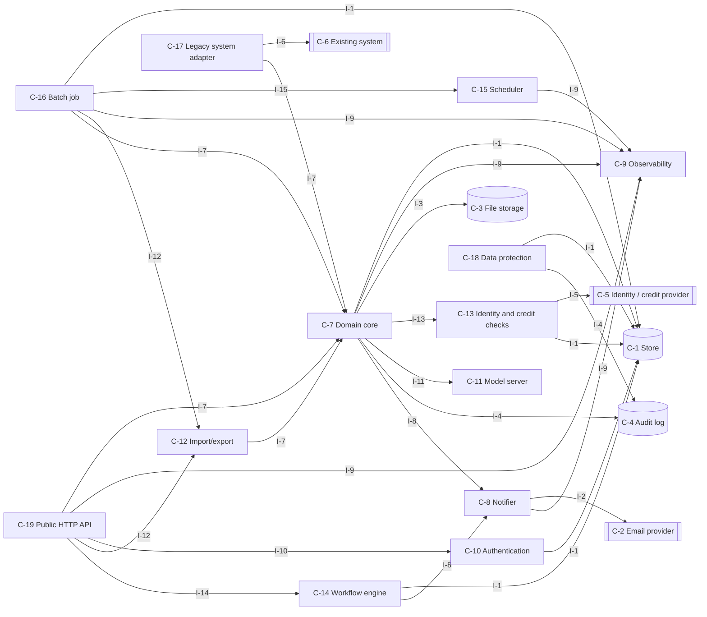
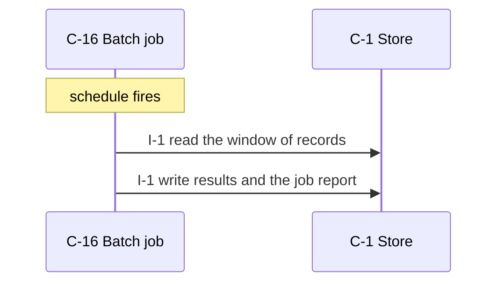
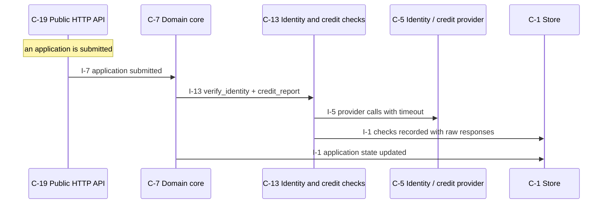
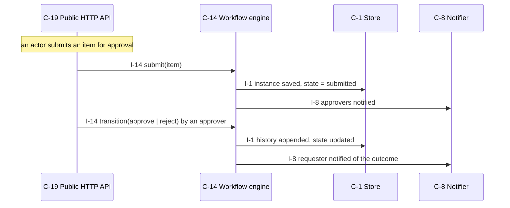
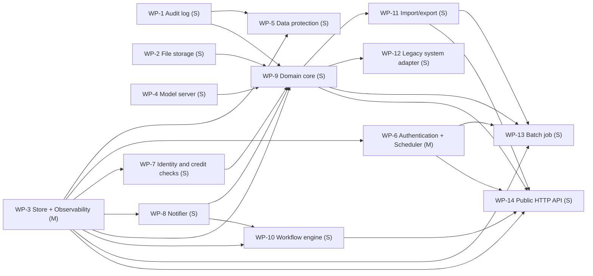

# loan-origination-service — design

A digital lender takes personal-loan applications online, checks identity and credit, and hands approved loans to the core banking system.

_version 0.1.0 · schema sekkei/1_

## Goals

- Metrics, structured logs and health endpoints for operations.
- Callers are authenticated and authorized.
- Files are uploaded, stored and served.
- Scheduled jobs process stored records in windows.
- Predictions are served from a versioned model.
- Changes are recorded append-only with the actor.
- Records move in and out as files.
- Applicants are checked against external identity and credit sources.
- Items move through states and approvals.
- Personal data is held and must be protected, exportable and deletable.
- Records flow to and from a system that already exists.

**Non-goals**

- Loan servicing and collections (core banking).
- Building the scoring model (a data-science team ships it as a versioned artifact).

## Requirements

| id | kind | priority | statement | metric |
|---|---|---|---|---|
| R-1 | functional | must | Applicants can create an application (amount, term, income, employment), upload identity documents and payslips, and see the status of their application. | — |
| R-2 | functional | must | The service verifies the applicant's identity through an external KYC provider and fetches a credit report from the bureau; both calls have a 10 s timeout. | — |
| R-3 | functional | must | A scoring model predicts default risk from the application and the credit report; applications above the threshold are approved automatically, borderline ones go to an underwriter. | — |
| R-4 | functional | must | Underwriters review borderline applications in a queue, request more documents, and approve or reject with a reason; an application waiting more than 2 business days escalates to a senior underwriter. | — |
| R-5 | functional | must | Approved loans are exported nightly to the existing core banking system (system of record for the loan account) as a fixed-format file. | — |
| R-6 | functional | must | Every decision is recorded with the model version, the inputs and who took it, for regulators. | — |
| R-7 | functional | must | Applicants can download a copy of their data and request deletion after the retention period. | — |
| R-8 | nonfunctional | must | 2,000 applications per day; 1,000 pending applications at any time; scoring returns within 2 s p95. | p95 latency at 2,000, 1,000 <= 2 s |
| R-9 | nonfunctional | must | No application or decision is lost on a crash; a decision is never recorded twice. | occurrences of the forbidden action (record) = 0 occurrences |
| R-10 | nonfunctional | should | Personal and financial data are encrypted; access to documents is logged; decisions are retained for 7 years. | time 7 years |
| R-11 | nonfunctional | must | 99.9 % monthly availability for the applicant surface; metrics for Prometheus; structured logs. | ratio 99.9 % |
| R-12 | constraint | must | Python 3.12, PostgreSQL and S3-compatible object storage available; containers behind an existing ingress; single region. Team of 5. | — |
| R-13 | constraint | must | Applicants authenticate with the bank's OIDC identity provider; underwriters with the corporate SSO. | — |
| R-14 | functional | could | Every operation is scoped to the caller's own resources; an admin role may act on any resource (assumed by the engine). | — |
| R-15 | nonfunctional | must | Records are 2 KB on average and at most 256 KB (assumed by the engine). | size at 2 KB <= 256 kb |
| R-16 | nonfunctional | should | Backups run daily with a recovery point of 24 h and a recovery time of 4 h (assumed by the engine). | time at 4 h 24 h |
| R-17 | nonfunctional | must | An alert is raised when the error rate exceeds 1 % for 5 minutes or the queue depth grows for 10 minutes (assumed by the engine). | ratio at 5 minutes, 10 minutes 1 % |
| R-18 | constraint | must | The existing system named in the requirements stays in place; integration, not migration (assumed by the engine). | — |
| R-19 | constraint | must | Use existing infrastructure only; no new managed services (assumed by the engine). | — |

## Components



### C-1 — Store

- **kind**: datastore · **path**: `app/store.py`
- **responsibility**: Owns persistence of the domain entities: durable writes, reads, listing, and the schema/migrations.
- **provides**: I-1
- **requires**: —
- **satisfies**: R-9, R-12

### C-2 — Email provider

- **kind**: external
- **responsibility**: External email delivery service.
- **provides**: I-2
- **requires**: —
- **satisfies**: —

### C-3 — File storage

- **kind**: datastore · **path**: `app/files.py`
- **responsibility**: Stores and serves uploaded files/blobs with content-type and size limits.
- **provides**: I-3
- **requires**: —
- **satisfies**: R-1

### C-4 — Audit log

- **kind**: datastore · **path**: `app/audit.py`
- **responsibility**: Append-only record of who did what to which resource, queryable by resource and actor.
- **provides**: I-4
- **requires**: —
- **satisfies**: R-6, R-7

### C-5 — Identity / credit provider

- **kind**: external
- **responsibility**: External KYC and credit bureau services; rate limited, billed per call.
- **provides**: I-5
- **requires**: —
- **satisfies**: R-2, R-3

### C-6 — Existing system

- **kind**: external
- **responsibility**: The system of record that already exists (ERP/CRM/database); outside our control.
- **provides**: I-6
- **requires**: —
- **satisfies**: R-5

### C-7 — Domain core

- **kind**: module · **path**: `app/core.py`
- **responsibility**: Business rules and validation for the domain entities; the only module that changes state through the store.
- **provides**: I-7
- **requires**: I-1, I-9, I-3, I-13, I-11, I-4, I-8
- **satisfies**: R-1, R-2, R-3, R-5, R-9, R-12, R-18, R-19

### C-8 — Notifier

- **kind**: module · **path**: `app/notifier.py`
- **responsibility**: Sends operator/customer notifications through the configured channel with templating and rate limiting.
- **provides**: I-8
- **requires**: I-2, I-9
- **satisfies**: R-3, R-4, R-5

### C-9 — Observability

- **kind**: module · **path**: `app/observability.py`
- **responsibility**: Metrics registry and exposition, structured logging, health/readiness endpoints.
- **provides**: I-9
- **requires**: —
- **satisfies**: R-11, R-17

### C-10 — Authentication

- **kind**: module · **path**: `app/auth.py`
- **responsibility**: Authenticates callers and resolves them to a principal and scope; enforces authorization for management operations.
- **provides**: I-10
- **requires**: I-1
- **satisfies**: R-10, R-13, R-14

### C-11 — Model server

- **kind**: service · **path**: `app/model.py`
- **responsibility**: Loads the model, serves predictions with batching and timeouts, versions the model.
- **provides**: I-11
- **requires**: —
- **satisfies**: R-3

### C-12 — Import/export

- **kind**: module · **path**: `app/exporter.py`
- **responsibility**: Streams records to and from CSV/JSON with validation and partial-failure reporting.
- **provides**: I-12
- **requires**: I-7
- **satisfies**: R-5

### C-13 — Identity and credit checks

- **kind**: module · **path**: `app/verifier.py`
- **responsibility**: Calls the external identity/credit providers with timeouts and retries, normalises their answers, records each check with its raw response and time.
- **provides**: I-13
- **requires**: I-5, I-1
- **satisfies**: R-2, R-3

### C-14 — Workflow engine

- **kind**: module · **path**: `app/workflow.py`
- **responsibility**: Runs the approval/state machine: allowed transitions, who may perform them, timeouts and escalation; every transition is recorded.
- **provides**: I-14
- **requires**: I-1, I-8
- **satisfies**: R-3, R-4, R-5

### C-15 — Scheduler

- **kind**: job · **path**: `app/scheduler.py`
- **responsibility**: Computes when deferred work runs next (backoff schedules, periodic jobs) and promotes due work.
- **provides**: I-15
- **requires**: I-9
- **satisfies**: R-5

### C-16 — Batch job

- **kind**: job · **path**: `app/batch.py`
- **responsibility**: Scheduled processing over stored records: extract, transform, aggregate, write results.
- **provides**: I-16
- **requires**: I-1, I-15, I-9, I-12, I-7
- **satisfies**: R-5

### C-17 — Legacy system adapter

- **kind**: module · **path**: `app/legacy_adapter.py`
- **responsibility**: Anti-corruption layer in front of the existing system: translates its records and calls into our model, isolates its quirks and outages.
- **provides**: I-17
- **requires**: I-6, I-7
- **satisfies**: R-5

### C-18 — Data protection

- **kind**: job · **path**: `app/data_protection.py`
- **responsibility**: Retention schedules, deletion and export requests for a person's data, consent records; runs the deletions and proves them.
- **provides**: I-18
- **requires**: I-1, I-4
- **satisfies**: R-7, R-10

### C-19 — Public HTTP API

- **kind**: service · **path**: `app/surface_api.py`
- **responsibility**: Translates HTTP requests into core calls: routing, request validation, error mapping, JSON.
- **provides**: I-19
- **requires**: I-7, I-9, I-10, I-12, I-14
- **satisfies**: R-8, R-12, R-15, R-16

**Layers** (each layer depends only on earlier ones):

0. C-1, C-11, C-2, C-3, C-4, C-5, C-6, C-9
1. C-10, C-13, C-15, C-18, C-8
2. C-14, C-7
3. C-12, C-17
4. C-16, C-19

## Interfaces

### I-1 — Store interface

- **kind**: class · **owner**: C-1 · **stability**: stable
- Provided by Store. 

| operation | inputs | output | errors | pre / post |
|---|---|---|---|---|
| `save` | `entity`: Entity, `record`: dict | id | ConflictError on duplicate key | record is durable before return |
| `get` | `entity`: Entity, `id`: str | record \| None | — | — |
| `list` | `entity`: Entity, `filter`: dict, `page`: Page | list[record], next page token | — | — |
| `delete` | `entity`: Entity, `id`: str | bool | — | — |

### I-2 — Email provider interface

- **kind**: http · **owner**: C-2 · **stability**: stable
- Provided by Email provider. External; contract is theirs.

| operation | inputs | output | errors | pre / post |
|---|---|---|---|---|
| `send` | `to`: str, `subject`: str, `body`: str | provider message id | — | — |

### I-3 — File storage interface

- **kind**: class · **owner**: C-3 · **stability**: stable
- Provided by File storage. 

| operation | inputs | output | errors | pre / post |
|---|---|---|---|---|
| `put` | `key`: str, `data`: bytes, `content_type`: str | FileRef | — | — |
| `get` | `key`: str | bytes \| None | — | — |

### I-4 — Audit log interface

- **kind**: class · **owner**: C-4 · **stability**: stable
- Provided by Audit log. 

| operation | inputs | output | errors | pre / post |
|---|---|---|---|---|
| `append` | `actor`: str, `action`: str, `resource`: str, `details`: dict | None | — | — |
| `query` | `resource`: str \| None, `actor`: str \| None, `page`: Page | entries | — | — |

### I-5 — Identity / credit provider interface

- **kind**: http · **owner**: C-5 · **stability**: stable
- Provided by Identity / credit provider. External; contract is theirs.

| operation | inputs | output | errors | pre / post |
|---|---|---|---|---|
| `POST /verify` | `document`: bytes, `person`: dict | match \| no match \| review | — | — |
| `GET /report` | `person`: dict | credit report | — | — |

### I-6 — Existing system interface

- **kind**: http · **owner**: C-6 · **stability**: stable
- Provided by Existing system. External; contract is theirs.

| operation | inputs | output | errors | pre / post |
|---|---|---|---|---|
| `read/write` | — | records | unavailable | — |

### I-7 — Domain core interface

- **kind**: module · **owner**: C-7 · **stability**: draft
- Provided by Domain core. 

| operation | inputs | output | errors | pre / post |
|---|---|---|---|---|
| `create_application` | `application`: Application \| id | Application \| None | ValidationError, NotFound | — |
| | from R-1: Applicants can create an application (amount, term, income, employment), upload identity d | | | |
| `upload_documents` | `documents`: Documents \| id | Documents \| None | ValidationError, NotFound | — |
| | from R-1: Applicants can create an application (amount, term, income, employment), upload identity d | | | |
| `get_status` | `status`: Status \| id | Status \| None | ValidationError, NotFound | — |
| | from R-1: Applicants can create an application (amount, term, income, employment), upload identity d | | | |
| `verify_applicant` | `applicant`: Applicant \| id | Applicant \| None | ValidationError, NotFound | stated values: 10 s (R-2) |
| | from R-2: The service verifies the applicant's identity through an external KYC provider and fetches | | | |
| `fetch_report` | `report`: Report \| id | Report \| None | ValidationError, NotFound | stated values: 10 s (R-2) |
| | from R-2: The service verifies the applicant's identity through an external KYC provider and fetches | | | |
| `approve_reason` | `reason`: Reason \| id | Reason \| None | ValidationError, NotFound | stated values: 2 business days (R-4) |
| | from R-4: Underwriters review borderline applications in a queue, request more documents, and approv | | | |
| `reject_reason` | `reason`: Reason \| id | Reason \| None | ValidationError, NotFound | stated values: 2 business days (R-4) |
| | from R-4: Underwriters review borderline applications in a queue, request more documents, and approv | | | |
| `download_copy` | `copy`: Copy \| id | Copy \| None | ValidationError, NotFound | — |
| | from R-7: Applicants can download a copy of their data and request deletion after the retention peri | | | |
| `request_deletion` | `deletion`: Deletion \| id | Deletion \| None | ValidationError, NotFound | — |
| | from R-7: Applicants can download a copy of their data and request deletion after the retention peri | | | |

### I-8 — Notifier interface

- **kind**: module · **owner**: C-8 · **stability**: draft
- Provided by Notifier. 

| operation | inputs | output | errors | pre / post |
|---|---|---|---|---|
| `notify` | `recipient`: str, `template`: str, `context`: dict | message id | NotifyError | — |

### I-9 — Observability interface

- **kind**: module · **owner**: C-9 · **stability**: draft
- Provided by Observability. 

| operation | inputs | output | errors | pre / post |
|---|---|---|---|---|
| `counter` | `name`: str, `labels`: dict | Counter | — | — |
| `histogram` | `name`: str, `labels`: dict | Histogram | — | — |
| `gauge` | `name`: str, `labels`: dict | Gauge | — | — |
| `GET /metrics` | — | Prometheus text exposition | — | — |
| `GET /healthz` | — | 200 when dependencies reachable | — | — |
| `log` | `event`: str, `fields`: dict | None | — | — |
| | one JSON line per event | | | |

### I-10 — Authentication interface

- **kind**: module · **owner**: C-10 · **stability**: draft
- Provided by Authentication. 

| operation | inputs | output | errors | pre / post |
|---|---|---|---|---|
| `authenticate` | `credentials`: str | Principal | AuthError | — |
| `authorize` | `principal`: Principal, `action`: str, `resource`: str | None | Forbidden | — |

### I-11 — Model server interface

- **kind**: module · **owner**: C-11 · **stability**: draft
- Provided by Model server. 

| operation | inputs | output | errors | pre / post |
|---|---|---|---|---|
| `predict` | `inputs`: list, `model_version`: str | predictions | ModelError | — |

### I-12 — Import/export interface

- **kind**: module · **owner**: C-12 · **stability**: draft
- Provided by Import/export. 

| operation | inputs | output | errors | pre / post |
|---|---|---|---|---|
| `export` | `entity`: Entity, `filter`: dict, `format`: csv\|json | byte stream | — | — |
| `import_` | `entity`: Entity, `stream`: bytes, `format`: csv\|json | ImportReport with per-row errors | — | — |

### I-13 — Identity and credit checks interface

- **kind**: module · **owner**: C-13 · **stability**: draft
- Provided by Identity and credit checks. 

| operation | inputs | output | errors | pre / post |
|---|---|---|---|---|
| `verify_identity` | `applicant_id`: str, `documents`: list[File] | IdentityCheck | ProviderUnavailableError, IdentityMismatchError | check persisted with the provider's reference before return |
| `credit_report` | `applicant_id`: str | CreditReport | ProviderUnavailableError | — |
| | cached for the application's lifetime | | | |

### I-14 — Workflow engine interface

- **kind**: module · **owner**: C-14 · **stability**: draft
- Provided by Workflow engine. 

| operation | inputs | output | errors | pre / post |
|---|---|---|---|---|
| `submit` | `item_id`: str, `actor`: Principal | WorkflowInstance | InvalidTransitionError | state = submitted; approvers notified |
| `transition` | `instance_id`: str, `action`: str, `actor`: Principal, `comment`: str | WorkflowInstance | InvalidTransitionError, NotPermittedError | action is allowed from the current state for this actor's role / transition appended to history before return |
| `escalate_due` | `now`: datetime | int escalated | — | — |
| | instances past their step deadline go to the next approver | | | |

### I-15 — Scheduler interface

- **kind**: module · **owner**: C-15 · **stability**: draft
- Provided by Scheduler. 

| operation | inputs | output | errors | pre / post |
|---|---|---|---|---|
| `next_attempt` | `attempt`: int, `retry_after`: timedelta \| None | datetime \| None | — | — |
| | None when attempts are exhausted | | | |
| `promote_due` | `now`: datetime | int moved | — | — |

### I-16 — Batch job interface

- **kind**: module · **owner**: C-16 · **stability**: draft
- Provided by Batch job. 

| operation | inputs | output | errors | pre / post |
|---|---|---|---|---|
| `run` | `window`: DateRange | JobReport | JobError | — |

### I-17 — Legacy system adapter interface

- **kind**: module · **owner**: C-17 · **stability**: draft
- Provided by Legacy system adapter. 

| operation | inputs | output | errors | pre / post |
|---|---|---|---|---|
| `pull` | `since`: datetime | list[record] | LegacyUnavailableError | — |
| | incremental read; idempotent on re-run | | | |
| `push` | `record`: record | legacy id | LegacyRejectedError | mapping stored so the record is not pushed twice |

### I-18 — Data protection interface

- **kind**: module · **owner**: C-18 · **stability**: draft
- Provided by Data protection. 

| operation | inputs | output | errors | pre / post |
|---|---|---|---|---|
| `request_deletion` | `subject_id`: str, `requested_by`: Principal | DeletionRequest | — | request recorded with a deadline |
| `run_due` | `now`: datetime | int completed | — | — |
| | deletes or anonymises the subject's personal data in every store except append-only audit/chain-of-custody records, which are pseudonymised; audit entry per subject | | | |
| `export` | `subject_id`: str | archive | — | — |
| | everything held about the subject, machine readable | | | |

### I-19 — Public HTTP API interface

- **kind**: http · **owner**: C-19 · **stability**: draft
- Provided by Public HTTP API. 

| operation | inputs | output | errors | pre / post |
|---|---|---|---|---|
| `POST /applications` | `body`: application fields | 201 {application id} | 400 invalid body, 401 unauthenticated, 409 conflict | — |
| | from R-1: Applicants can create an application (amount, term, income, employment), upload identity d | | | |
| `POST /documents` | `body`: documents fields | 201 {documents id} | 400 invalid body, 401 unauthenticated, 409 conflict | — |
| | from R-1: Applicants can create an application (amount, term, income, employment), upload identity d | | | |
| `GET /status/{id}` | `id`: str | 200 status | 401 unauthenticated, 404 unknown id | — |
| | from R-1: Applicants can create an application (amount, term, income, employment), upload identity d | | | |
| `POST /reasons/{id}/approve` | `id`: str | 202 approve accepted | 401 unauthenticated, 404 unknown id, 409 not applicable in current state | stated values: 2 business days (R-4) |
| | from R-4: Underwriters review borderline applications in a queue, request more documents, and approv | | | |
| `POST /reasons/{id}/reject` | `id`: str | 202 reject accepted | 401 unauthenticated, 404 unknown id, 409 not applicable in current state | stated values: 2 business days (R-4) |
| | from R-4: Underwriters review borderline applications in a queue, request more documents, and approv | | | |
| `GET /copies/{id}` | `id`: str | 200 copy | 401 unauthenticated, 404 unknown id | — |
| | from R-7: Applicants can download a copy of their data and request deletion after the retention peri | | | |
| `POST /deletions` | `body`: deletion fields | 201 {deletion id} | 400 invalid body, 401 unauthenticated, 409 conflict | — |
| | from R-7: Applicants can download a copy of their data and request deletion after the retention peri | | | |

## Entities

### E-1 — Principal (owner C-1)

| field | type | constraints |
|---|---|---|
| `id` | uuid | primary key |
| `kind` | enum(customer, operator, service) |  |
| `scopes` | list[str] |  |

### E-2 — File (owner C-3)

| field | type | constraints |
|---|---|---|
| `key` | str | primary key |
| `content_type` | str |  |
| `size` | int | <= configured limit |
| `owner_id` | uuid |  |

### E-3 — JobRun (owner C-1)

| field | type | constraints |
|---|---|---|
| `id` | uuid | primary key |
| `job` | str |  |
| `window_start` | timestamp |  |
| `window_end` | timestamp |  |
| `status` | enum |  |
| `report` | json |  |

### E-4 — AuditEntry (owner C-4)

| field | type | constraints |
|---|---|---|
| `id` | uuid | primary key |
| `actor` | str |  |
| `action` | str |  |
| `resource` | str | indexed |
| `at` | timestamp |  |

### E-5 — WorkflowInstance (owner C-1)

| field | type | constraints |
|---|---|---|
| `id` | uuid | primary key |
| `item_id` | uuid | indexed |
| `state` | str | from the state machine |
| `step_deadline` | timestamp |  |
| `history` | list[Transition] | append-only |

### E-6 — DeletionRequest (owner C-1)

| field | type | constraints |
|---|---|---|
| `id` | uuid | primary key |
| `subject_id` | uuid | indexed |
| `requested_at` | timestamp |  |
| `deadline` | timestamp | statutory window |
| `completed_at` | timestamp |  |
| `proof` | json | what was deleted where |

### E-7 — Document (owner C-1)

Domain entity named in the requirements ('document'); confirm the fields.

| field | type | constraints |
|---|---|---|
| `id` | uuid | primary key |
| `created_at` | timestamp |  |

### E-8 — Loan (owner C-1)

Domain entity named in the requirements ('loan'); confirm the fields.

| field | type | constraints |
|---|---|---|
| `id` | uuid | primary key |
| `created_at` | timestamp |  |

### E-9 — Status (owner C-1)

Domain entity named in the requirements ('status'); confirm the fields.

| field | type | constraints |
|---|---|---|
| `id` | uuid | primary key |
| `created_at` | timestamp |  |

## Flows

### F-1 — Run the batch job

_Trigger:_ schedule fires

1. C-16 → C-1 via I-1: read the window of records
2. C-16 → C-1 via I-1: write results and the job report



### F-2 — Verify an applicant

_Trigger:_ an application is submitted

1. C-19 → C-7 via I-7: application submitted
2. C-7 → C-13 via I-13: verify_identity + credit_report
3. C-13 → C-5 via I-5: provider calls with timeout
4. C-13 → C-1 via I-1: checks recorded with raw responses
5. C-7 → C-1 via I-1: application state updated



### F-3 — Approve an item

_Trigger:_ an actor submits an item for approval

1. C-19 → C-14 via I-14: submit(item)
2. C-14 → C-1 via I-1: instance saved, state = submitted
3. C-14 → C-8 via I-8: approvers notified
4. C-19 → C-14 via I-14: transition(approve | reject) by an approver
5. C-14 → C-1 via I-1: history appended, state updated
6. C-14 → C-8 via I-8: requester notified of the outcome



### F-4 — Exchange records with the existing system

_Trigger:_ schedule fires

1. C-17 → C-6 via I-6: pull(since)
2. C-17 → C-7 via I-7: translated records applied
3. C-17 → C-7 via I-7: records changed since the last run are read
4. C-17 → C-6 via I-6: push; mapping stored

```mermaid
sequenceDiagram
  participant C_17 as C-17 Legacy system adapter
  participant C_6 as C-6 Existing system
  participant C_7 as C-7 Domain core
  Note over C_17: schedule fires
  C_17->>C_6: I-6 pull(since)
  C_17->>C_7: I-7 translated records applied
  C_17->>C_7: I-7 records changed since the last run are read
  C_17->>C_6: I-6 push; mapping stored
```

## Decisions

### D-1 — Caller authentication (accepted)

**Context.** Management operations must be attributable to a customer or operator.

- ✘ **API keys per customer, hashed at rest, sent as a bearer token**
  - + simple
  - + scriptable
  - − no delegation or expiry unless added
- ✔ **OAuth2 / OIDC with the platform's identity provider**
  - + single sign-on
  - + expiry and scopes
  - − integration effort
- ✘ **Mutual TLS**
  - + strong
  - + no secrets in headers
  - − certificate lifecycle for every customer
- ✘ **Session tokens issued by the platform's own account service to game/mobile clients (device-bound, short-lived, refreshable)**
  - + fits clients without a browser
  - + revocable per device
  - − a token service to run
- ✘ **Email one-time code / magic link (no account needed)**
  - + no password, no sign-up
  - + works for occasional customers
  - − depends on email delivery
  - − weak against mailbox compromise

**Rationale.** Scored against the active qualities; decided by operability (weight 1.0), availability (weight 0.78). OAuth2 / OIDC with the platform's identity provi: 2.23; API keys per customer, hashed at rest, sent as a: 1.38; Mutual TLS: 1.10; Session tokens issued by the platform's own acco: unavailable (needs game_client, not in the constraints); Email one-time code / magic link: unavailable (needs email_auth, not in the constraints). stated in the constraints

**Consequences.** Not choosing 'API keys per customer, hashed at rest, sent as a' gives up: simple, scriptable. Not choosing 'Mutual TLS' gives up: strong, no secrets in headers.

_Affects:_ C-10

### D-2 — Primary store (accepted)

**Context.** Domain records need durable, queryable storage.

- ✔ **PostgreSQL**
  - + transactions
  - + indexes and JSON
  - + widely available
  - − operational dependency
- ✘ **MySQL / MariaDB (the stated database)**
  - + transactions
  - + already operated by the team
  - − weaker JSON and DDL ergonomics than PostgreSQL
- ✘ **Redis for the hot state (as stated) with a relational store for durable records**
  - + the stated home of the hot data
  - + sub-millisecond reads
  - − two stores to keep consistent
  - − Redis durability depends on AOF/fsync
- ✘ **Managed document store (DynamoDB/MongoDB, as stated)**
  - + scales without operations
  - + flexible records
  - − no cross-record transactions by default
  - − query patterns must be designed up front
- ✘ **SQLite**
  - + zero operations
  - + single file
  - − one writer at a time
  - − no network access
- ✘ **Files (JSON/CSV on disk)**
  - + no dependencies
  - + human readable
  - − no transactions or concurrency
- ✘ **In-memory**
  - + fastest
  - + trivial
  - − lost on restart

**Rationale.** Scored against the active qualities; decided by operability (weight 1.0), availability (weight 0.78). PostgreSQL: 3.14; MySQL / MariaDB: unavailable (needs mysql, not in the constraints); Redis for the hot state: unavailable (needs redis_primary, not in the constraints); Managed document store: unavailable (needs document_db, not in the constraints); SQLite: unavailable (ruled out by containers); Files: unavailable (ruled out by containers); In-memory: unavailable (ruled out by containers, postgres, durable_required). stated in the constraints

_Affects:_ C-1

### D-3 — Process topology (accepted)

**Context.** The same code base serves requests and performs background work.

- ✔ **One image, role by flag: `api` and `worker` processes scale independently**
  - + stateless containers
  - + independent scaling of ingress and outbound work
  - + one build
  - − two deployables to operate
- ✘ **Single process with background threads**
  - + one deployable
  - − request latency competes with outbound work
  - − cannot scale roles separately
- ✘ **Separate services per concern (ingest, admin, delivery)**
  - + clear ownership
  - − three deployables for a team of three
  - − shared schema anyway

**Rationale.** Scored against the active qualities; decided by operability (weight 1.0), availability (weight 0.78). One image, role by flag: `api` and `worker` proc: 1.79; Single process with background threads: 1.45; Separate services per concern: 1.29

**Consequences.** Not choosing 'Single process with background threads' gives up: one deployable. Not choosing 'Separate services per concern' gives up: clear ownership.

_Affects:_ C-19, C-15

### D-4 — How the approval workflow is implemented (accepted)

**Context.** Items move through states with rules about who may move them and when.

- ✔ **Explicit state machine in code: a transitions table (state, action, role) -> state, history rows in the store**
  - + readable and testable
  - + no new infrastructure
  - − custom UI for the workflow definition if it must change at runtime
- ✘ **Embedded workflow library (state-machine package)**
  - + declarative definitions
  - + guards and callbacks built in
  - − another dependency
  - − persistence adapter to maintain
- ✘ **External BPM engine**
  - + business users edit the process
  - + rich tooling
  - − a large system to operate
  - − a team of two cannot own it

**Rationale.** Scored against the active qualities; decided by operability (weight 1.0), availability (weight 0.78). Explicit state machine in code: a transitions ta: 1.84; Embedded workflow library: 1.42; External BPM engine: 1.07

**Consequences.** Not choosing 'Embedded workflow library' gives up: declarative definitions, guards and callbacks built in. Not choosing 'External BPM engine' gives up: business users edit the process, rich tooling.

_Affects:_ C-14

### D-5 — Protection of personal data (accepted)

**Context.** Personal data is stored and must be protected and deletable.

- ✘ **Field-level encryption for identifiers and sensitive fields with a key outside the database; pseudonymous ids elsewhere**
  - + a dump does not expose people
  - + deletion = key destruction where fields are only encrypted
  - − cannot index encrypted fields
  - − key management
- ✔ **Encryption at rest by the platform plus strict access control and audit**
  - + no application changes
  - + indexes work
  - − anyone with database access sees everything
- ✘ **Separate personal-data store with tokenised references**
  - + blast radius contained
  - + deletion in one place
  - − joins across two stores
  - − a second store

**Rationale.** Scored against the active qualities; decided by operability (weight 1.0), availability (weight 0.78). Encryption at rest by the platform plus strict a: 1.71; Field-level encryption for identifiers and sensi: 1.55; Separate personal-data store with tokenised refe: 1.44

**Consequences.** Not choosing 'Field-level encryption for identifiers and sensi' gives up: a dump does not expose people, deletion = key destruction where fields are only encrypted. Not choosing 'Separate personal-data store with tokenised refe' gives up: blast radius contained, deletion in one place.

_Affects:_ C-18, C-1

### D-6 — Integration with the existing system (accepted)

**Context.** Records must flow between the new system and the one that already exists.

- ✘ **API façade (anti-corruption layer) calling the legacy system's interfaces, with a translation layer and retries**
  - + legacy schema never leaks in
  - + quirks isolated in one module
  - − depends on the legacy system's uptime
- ✔ **Scheduled batch file exchange (CSV/fixed format) through a shared drop**
  - + works with any system
  - + no live coupling
  - − latency of the schedule
  - − reconciliation of partial files
- ✘ **Change data capture from the legacy database**
  - + near real time
  - + no legacy code changes
  - − coupled to the legacy schema
  - − capture tooling to operate
- ✘ **Events over the existing message topics (the stated integration points); no new synchronous calls**
  - + decoupled
  - + already operated
  - − at-least-once: consumers must be idempotent
  - − schema of the topics to govern

**Rationale.** Scored against the active qualities; decided by operability (weight 1.0), availability (weight 0.78). Scheduled batch file exchange: 2.65; API façade: 1.71; Change data capture from the legacy database: 1.41; Events over the existing message topics: unavailable (needs broker, not in the constraints). stated in the constraints

**Consequences.** Not choosing 'API façade' gives up: legacy schema never leaks in, quirks isolated in one module. Not choosing 'Change data capture from the legacy database' gives up: near real time, no legacy code changes.

_Affects:_ C-17

### D-7 — Concurrency control for conflicting writes (accepted)

**Context.** Two callers may change the same record at the same time and the result must be consistent.

- ✘ **Optimistic concurrency: version column checked on every update; conflict returns 409 and the caller retries**
  - + no locks held across requests
  - + works with stateless instances
  - − callers must handle 409
- ✔ **Row locks inside a short transaction (SELECT ... FOR UPDATE)**
  - + simple mental model
  - + no client retry
  - − lock waits under contention
  - − needs a transactional store
- ✘ **Last write wins**
  - + nothing to implement
  - − lost updates

**Rationale.** Scored against the active qualities; decided by operability (weight 1.0), availability (weight 0.78). Row locks inside a short transaction: 1.58; Optimistic concurrency: version column checked o: 1.57; Last write wins: 1.39

**Consequences.** Not choosing 'Optimistic concurrency: version column checked o' gives up: no locks held across requests, works with stateless instances. Not choosing 'Last write wins' gives up: nothing to implement.

_Affects:_ C-1, C-7

### D-8 — Redundancy for the availability target (accepted)

**Context.** The availability target must be met through instance failures and deploys.

- ✔ **Two or more interchangeable instances per role behind the ingress, health checks, rolling deploys**
  - + survives one instance failure
  - + zero-downtime deploys
  - − needs stateless instances and a shared store
- ✘ **Single instance with health-based restart**
  - + simplest
  - + cheapest
  - − restart time is downtime
  - − deploys are downtime
- ✘ **Active-active across two regions**
  - + survives a regional outage
  - − data replication and conflict handling
  - − cost

**Rationale.** Scored against the active qualities; decided by operability (weight 1.0), availability (weight 0.78). Two or more interchangeable instances per role b: 1.42; Single instance with health-based restart: 1.26; Active-active across two regions: unavailable (ruled out by single_region)

**Consequences.** Not choosing 'Single instance with health-based restart' gives up: simplest, cheapest.

_Affects:_ C-19

### D-9 — Assumed answer: load (Q-payload) (proposed)

**Context.** The requirements do not say. Question: Q-payload. No evidence in the text; engine default.

- ✔ **2 KB / 256 KB**
- ✘ **16 KB / 1 MB**
- ✘ **256 bytes / 4 KB**

**Rationale.** Typical JSON record sizes; the maximum bounds request bodies.

**Consequences.** If the real answer differs: State the sizes; storage growth and body limits change.

_Affects:_ C-19

### D-10 — Assumed answer: data (Q-backup) (proposed)

**Context.** The requirements do not say. Question: Q-backup. No evidence in the text; engine default.

- ✔ **daily / 24 h / 4 h**
- ✘ **hourly / 1 h / 1 h**
- ✘ **none**

**Rationale.** The store's own daily backup is the cheapest credible baseline.

**Consequences.** If the real answer differs: State RPO/RTO; the store decision and a restore drill change.

_Affects:_ C-1

### D-11 — Assumed answer: data (Q-migration) (proposed)

**Context.** The requirements do not say. Question: Q-migration. Evidence: legacy_integration pattern.

- ✔ **integrate, no migration**
- ✘ **one-shot import**
- ✘ **gradual cut-over**

**Rationale.** The text names an existing system and describes an exchange with it.

**Consequences.** If the real answer differs: State whether data moves; a migration package and risk are added.

_Affects:_ C-17

### D-12 — Assumed answer: security (Q-authz) (proposed)

**Context.** The requirements do not say. Question: Q-authz. No evidence in the text; engine default.

- ✔ **owner-scoped + admin role**
- ✘ **flat (everyone sees everything)**
- ✘ **role matrix per resource**

**Rationale.** Ownership scoping is the minimum that prevents cross-tenant access.

**Consequences.** If the real answer differs: State the roles; core operations and acceptance checks change.

_Affects:_ C-7, C-10

### D-13 — Assumed answer: operations (Q-alerting) (proposed)

**Context.** The requirements do not say. Question: Q-alerting. No evidence in the text; engine default.

- ✔ **error rate + queue growth**
- ✘ **none**
- ✘ **per-endpoint SLO alerts**

**Rationale.** Two alerts catch most incidents without paging on noise.

**Consequences.** If the real answer differs: State the rules and the on-call; observability conventions change.

_Affects:_ C-9

### D-14 — Assumed answer: cost (Q-budget) (proposed)

**Context.** The requirements do not say. Question: Q-budget. No evidence in the text; engine default.

- ✔ **existing only**
- ✘ **managed services allowed**
- ✘ **strict monthly cap**

**Rationale.** The cheapest assumption; every decision already prefers the option needing no new infrastructure.

**Consequences.** If the real answer differs: State the budget; options adding infrastructure become available.

## Risks

| id | risk | likelihood | impact | mitigation |
|---|---|---|---|---|
| K-1 | Per-target labels on metrics explode cardinality. | medium | low | Label by outcome and partition class, not by target id; expose per-target detail through the API instead. |
| K-2 | A management operation reachable without authentication. | low | high | Authenticate in one middleware for every management route; test every route unauthenticated. |
| K-3 | Payloads or uploads without size limits exhaust memory or disk. | medium | medium | Enforce size limits at the surface; reject early with a clear error. |
| K-4 | Entities evolve; migrations run against live data. | medium | medium | Versioned migrations applied before deploy; additive changes first, removals one release later. |
| K-5 | The identity/credit provider is down or slow and applications pile up or time out. | medium | medium | Timeouts and retries with backoff; queue the check and let the application wait in a 'pending verification' state; alert on provider error rate. |
| K-6 | An instance waits forever on an approver who left. | medium | medium | Step deadlines with escalation to the next role; a report of instances past their deadline. |
| K-7 | A requester approves their own item. | medium | high | Transition rules forbid the requester's principal for approve/reject; tested per transition. |
| K-8 | Personal data is copied into logs, reports and backups where deletion cannot reach it. | high | high | Log only pseudonymous ids; reports carry aggregates or pseudonyms; deletion covers backups by expiry. |
| K-9 | The legacy system's schema or outages leak into the new domain. | medium | medium | All translation in the adapter; the core never sees legacy types; the adapter degrades to read-only when the legacy system is down. |
| K-10 | [tampering] Store: Injection through query construction. | medium | medium | Parameterised queries only; no string-built SQL. Check: static check for string-formatted SQL finds nothing |
| K-11 | [information_disclosure] Store: Backups and dumps contain everything. | medium | high | Encrypt backups; restrict who can take them. Check: backup file is not readable without the key |
| K-12 | [tampering] File storage: Uploaded content is not what its type claims. | medium | medium | Sniff content type; reject executables; size limits. Check: renamed executable is rejected |
| K-13 | [elevation] File storage: Path traversal through user-supplied names. | medium | high | Generate storage keys; never use client names as paths. Check: name '../x' cannot escape the store |
| K-14 | [denial_of_service] Notifier: Notification storms and template injection. | medium | medium | Rate-limit per recipient; escape template context. Check: 1,000 failures produce one digest per owner |
| K-15 | [spoofing] Authentication: Credential stuffing or leaked keys. | medium | medium | Hash keys at rest; allow revocation; rate-limit failures. Check: revoked key is rejected within seconds; brute force is throttled |
| K-16 | [elevation] Authentication: A caller acts on another tenant's resources. | medium | high | Every core operation takes the principal and checks ownership. Check: cross-tenant request returns 404/403 for every operation |
| K-17 | [denial_of_service] Model server: Adversarial or oversized inputs exhaust inference capacity. | medium | medium | Input size limits; batching with timeouts. Check: oversize input rejected before inference |
| K-18 | [elevation] Workflow engine: A requester approves their own item or skips a step. | medium | high | Transition rules name the roles allowed per action and exclude the requester; no direct state writes. Check: self-approval and out-of-order transitions return NotPermitted/InvalidTransition |
| K-19 | [repudiation] Workflow engine: Approvals cannot be attributed later. | medium | medium | Every transition records the principal, time and comment in an append-only history. Check: history has one row per transition with the actor |
| K-20 | [spoofing] Legacy system adapter: The adapter trusts anything that looks like the legacy system. | medium | medium | Authenticate the legacy endpoint (mTLS or credentials); pin its address. Check: connection to an impostor host fails |
| K-21 | [tampering] Legacy system adapter: Malformed legacy records corrupt the domain. | medium | medium | Validate and translate every record; quarantine rejects with a report. Check: a malformed record is quarantined, not applied |
| K-22 | [repudiation] Data protection: A deletion cannot be proven later. | medium | medium | Record what was deleted where, with timestamps, in the audit log. Check: each completed request has a proof entry |
| K-23 | [information_disclosure] Data protection: An export goes to the wrong person. | medium | high | Exports are delivered only to the verified subject or an authorised operator; time-limited links. Check: export link expires and is bound to the requester |
| K-24 | [spoofing] Public HTTP API: Requests without a verified caller identity reach domain operations. | medium | medium | Authenticate every route in one middleware; deny by default. Check: every route returns 401 without credentials |
| K-25 | [tampering] Public HTTP API: Malformed or oversized bodies reach the core. | medium | medium | Schema-validate and size-limit at the surface; reject before parsing fully. Check: fuzz the body; oversize returns 413 |
| K-26 | [denial_of_service] Public HTTP API: A single caller saturates the service. | medium | medium | Per-caller rate limit and request timeouts. Check: burst from one key returns 429; others unaffected |
| K-27 | [information_disclosure] Public HTTP API: Stack traces or internal ids leak in error responses. | medium | high | Map exceptions to fixed error shapes; log details server-side only. Check: no traceback text in any 4xx/5xx body |

## Work packages



**Waves** (packages in one wave may run in parallel):

1. WP-1, WP-2, WP-3, WP-4
2. WP-5, WP-6, WP-7, WP-8
3. WP-10, WP-9
4. WP-11, WP-12
5. WP-13, WP-14

_Critical path (13 person-days):_ WP-3 → WP-8 → WP-9 → WP-11 → WP-14

### WP-1 — Audit log (S)

Implement Audit log: Append-only record of who did what to which resource, queryable by resource and actor.

- **components**: C-4 · **implements**: I-4
- **depends on**: — · **satisfies**: R-6, R-7
- **write scope**: `app/audit.py`, `tests/test_audit.py`
- **acceptance**:
  - A-1 (test) unit tests of Audit log pass — `python -m pytest -q tests/test_audit.py`
- **notes**: family: audit_log

### WP-2 — File storage (S)

Implement File storage: Stores and serves uploaded files/blobs with content-type and size limits.

- **components**: C-3 · **implements**: I-3
- **depends on**: — · **satisfies**: R-1
- **write scope**: `app/files.py`, `tests/test_files.py`
- **acceptance**:
  - A-2 (test) unit tests of File storage pass — `python -m pytest -q tests/test_files.py`
- **notes**: family: file_storage

### WP-3 — Store + Observability (M)

Implement Store: Owns persistence of the domain entities: durable writes, reads, listing, and the schema/migrations; Observability: Metrics registry and exposition, structured logging, health/readiness endpoints.

- **components**: C-1, C-9 · **implements**: I-1, I-9
- **depends on**: — · **satisfies**: R-9, R-11, R-12, R-17
- **write scope**: `app/store.py`, `tests/test_store.py`, `app/observability.py`, `tests/test_observability.py`
- **acceptance**:
  - A-3 (test) unit tests of Store, Observability pass — `python -m pytest -q tests/test_store.py tests/test_observability.py`
  - A-4 (metric) R-9: occurrences of the forbidden action (record) = 0 occurrences — metric R-9
  - A-5 (metric) R-11: ratio 99.9 % — kill one instance under load; error rate stays within the target — metric R-11
- **notes**: family: infra

### WP-4 — Model server (S)

Implement Model server: Loads the model, serves predictions with batching and timeouts, versions the model.

- **components**: C-11 · **implements**: I-11
- **depends on**: — · **satisfies**: R-3
- **write scope**: `app/model.py`, `tests/test_model.py`
- **acceptance**:
  - A-6 (test) unit tests of Model server pass — `python -m pytest -q tests/test_model.py`
- **notes**: family: ml_inference

### WP-5 — Data protection (S)

Implement Data protection: Retention schedules, deletion and export requests for a person's data, consent records; runs the deletions and proves them.

- **components**: C-18 · **implements**: I-18
- **depends on**: WP-1, WP-3 · **satisfies**: R-7, R-10
- **write scope**: `app/data_protection.py`, `tests/test_data_protection.py`
- **acceptance**:
  - A-7 (test) unit tests of Data protection pass — `python -m pytest -q tests/test_data_protection.py`
- **notes**: family: compliance_data

### WP-6 — Authentication + Scheduler (M)

Implement Authentication: Authenticates callers and resolves them to a principal and scope; enforces authorization for management operations; Scheduler: Computes when deferred work runs next (backoff schedules, periodic jobs) and promotes due work.

- **components**: C-10, C-15 · **implements**: I-10, I-15
- **depends on**: WP-3 · **satisfies**: R-5, R-10, R-13, R-14
- **write scope**: `app/auth.py`, `tests/test_auth.py`, `app/scheduler.py`, `tests/test_scheduler.py`
- **acceptance**:
  - A-8 (test) unit tests of Authentication, Scheduler pass — `python -m pytest -q tests/test_auth.py tests/test_scheduler.py`
- **notes**: family: infra

### WP-7 — Identity and credit checks (S)

Implement Identity and credit checks: Calls the external identity/credit providers with timeouts and retries, normalises their answers, records each check with its raw response and time.

- **components**: C-13 · **implements**: I-13
- **depends on**: WP-3 · **satisfies**: R-2, R-3
- **write scope**: `app/verifier.py`, `tests/test_verifier.py`
- **acceptance**:
  - A-9 (test) unit tests of Identity and credit checks pass — `python -m pytest -q tests/test_verifier.py`
- **notes**: family: kyc

### WP-8 — Notifier (S)

Implement Notifier: Sends operator/customer notifications through the configured channel with templating and rate limiting.

- **components**: C-8 · **implements**: I-8
- **depends on**: WP-3 · **satisfies**: R-3, R-4, R-5
- **write scope**: `app/notifier.py`, `tests/test_notifier.py`
- **acceptance**:
  - A-10 (test) unit tests of Notifier pass — `python -m pytest -q tests/test_notifier.py`
- **notes**: family: workflow

### WP-9 — Domain core (S)

Implement Domain core: Business rules and validation for the domain entities; the only module that changes state through the store.

- **components**: C-7 · **implements**: I-7
- **depends on**: WP-1, WP-2, WP-3, WP-4, WP-7, WP-8 · **satisfies**: R-1, R-2, R-3, R-5, R-9, R-12, R-18, R-19
- **write scope**: `app/core.py`, `tests/test_core.py`
- **acceptance**:
  - A-11 (test) unit tests of Domain core pass — `python -m pytest -q tests/test_core.py`
  - A-12 (metric) R-9: occurrences of the forbidden action (record) = 0 occurrences — metric R-9
- **notes**: family: file_storage

### WP-10 — Workflow engine (S)

Implement Workflow engine: Runs the approval/state machine: allowed transitions, who may perform them, timeouts and escalation; every transition is recorded.

- **components**: C-14 · **implements**: I-14
- **depends on**: WP-3, WP-8 · **satisfies**: R-3, R-4, R-5
- **write scope**: `app/workflow.py`, `tests/test_workflow.py`
- **acceptance**:
  - A-13 (test) unit tests of Workflow engine pass — `python -m pytest -q tests/test_workflow.py`
- **notes**: family: workflow

### WP-11 — Import/export (S)

Implement Import/export: Streams records to and from CSV/JSON with validation and partial-failure reporting.

- **components**: C-12 · **implements**: I-12
- **depends on**: WP-9 · **satisfies**: R-5
- **write scope**: `app/exporter.py`, `tests/test_exporter.py`
- **acceptance**:
  - A-14 (test) unit tests of Import/export pass — `python -m pytest -q tests/test_exporter.py`
- **notes**: family: import_export

### WP-12 — Legacy system adapter (S)

Implement Legacy system adapter: Anti-corruption layer in front of the existing system: translates its records and calls into our model, isolates its quirks and outages.

- **components**: C-17 · **implements**: I-17
- **depends on**: WP-9 · **satisfies**: R-5
- **write scope**: `app/legacy_adapter.py`, `tests/test_legacy_adapter.py`
- **acceptance**:
  - A-15 (test) unit tests of Legacy system adapter pass — `python -m pytest -q tests/test_legacy_adapter.py`
- **notes**: family: legacy_integration

### WP-13 — Batch job (S)

Implement Batch job: Scheduled processing over stored records: extract, transform, aggregate, write results.

- **components**: C-16 · **implements**: I-16
- **depends on**: WP-3, WP-6, WP-9, WP-11 · **satisfies**: R-5
- **write scope**: `app/batch.py`, `tests/test_batch.py`
- **acceptance**:
  - A-16 (test) unit tests of Batch job pass — `python -m pytest -q tests/test_batch.py`
- **notes**: family: batch_pipeline

### WP-14 — Public HTTP API (S)

Implement Public HTTP API: Translates HTTP requests into core calls: routing, request validation, error mapping, JSON.

- **components**: C-19 · **implements**: I-19
- **depends on**: WP-3, WP-6, WP-9, WP-10, WP-11 · **satisfies**: R-8, R-12, R-15, R-16
- **write scope**: `app/surface_api.py`, `tests/test_surface_api.py`
- **acceptance**:
  - A-17 (test) unit tests of Public HTTP API pass — `python -m pytest -q tests/test_surface_api.py`
  - A-18 (metric) R-8: p95 latency at 2,000, 1,000 <= 2 s — load test at the stated rate; the stated percentile must meet the target — metric R-8
- **notes**: family: infra

## Traceability

| requirement | priority | components | work packages | acceptance |
|---|---|---|---|---|
| R-1 | must | C-3, C-7 | WP-2, WP-9 | A-2, A-11, A-12 |
| R-2 | must | C-5, C-7, C-13 | WP-7, WP-9 | A-9, A-11, A-12 |
| R-3 | must | C-5, C-7, C-8, C-11, C-13, C-14 | WP-4, WP-7, WP-8, WP-9, WP-10 | A-6, A-9, A-10, A-11, A-12, A-13 |
| R-4 | must | C-8, C-14 | WP-8, WP-10 | A-10, A-13 |
| R-5 | must | C-6, C-7, C-8, C-12, C-14, C-15, C-16, C-17 | WP-6, WP-8, WP-9, WP-10, WP-11, WP-12, WP-13 | A-8, A-10, A-11, A-12, A-13, A-14, A-15, A-16 |
| R-6 | must | C-4 | WP-1 | A-1 |
| R-7 | must | C-4, C-18 | WP-1, WP-5 | A-1, A-7 |
| R-8 | must | C-19 | WP-14 | A-17, A-18 |
| R-9 | must | C-1, C-7 | WP-3, WP-9 | A-3, A-4, A-5, A-11, A-12 |
| R-10 | should | C-10, C-18 | WP-5, WP-6 | A-7, A-8 |
| R-11 | must | C-9 | WP-3 | A-3, A-4, A-5 |
| R-12 | must | C-1, C-7, C-19 | WP-3, WP-9, WP-14 | A-3, A-4, A-5, A-11, A-12, A-17, A-18 |
| R-13 | must | C-10 | WP-6 | A-8 |
| R-14 | could | C-10 | WP-6 | A-8 |
| R-15 | must | C-19 | WP-14 | A-17, A-18 |
| R-16 | should | C-19 | WP-14 | A-17, A-18 |
| R-17 | must | C-9 | WP-3 | A-3, A-4, A-5 |
| R-18 | must | C-7 | WP-9 | A-11, A-12 |
| R-19 | must | C-7 | WP-9 | A-11, A-12 |

## Conventions

- **language**: python
- **test**: `python -m pytest -q`
- **lint**: `ruff check .`
- Type hints on every public function; dataclasses or pydantic for records.
- No business logic in the HTTP layer.
- Every management route goes through the authentication middleware; no route is exempt without a decision.
- Every component logs one structured line per unit of work with the correlation id.
- Prefer the boring option; a new piece of infrastructure needs a decision record.
- Python 3.12 as stated in the constraints.
- Stateless processes: configuration from the environment, no local files that a second instance would not see.

**Definition of done**

- Acceptance checks of the package pass.
- No file outside the write scope changed.
- Every public operation of the implemented interfaces exists with the declared inputs.
