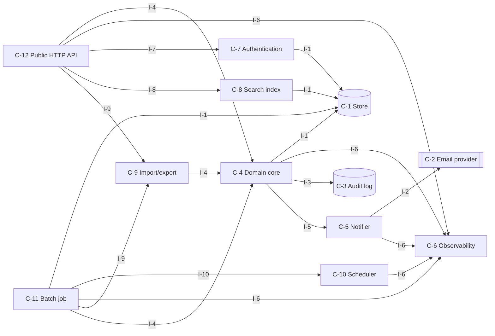
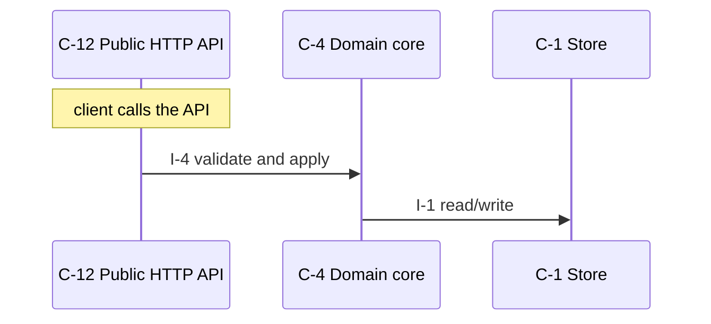
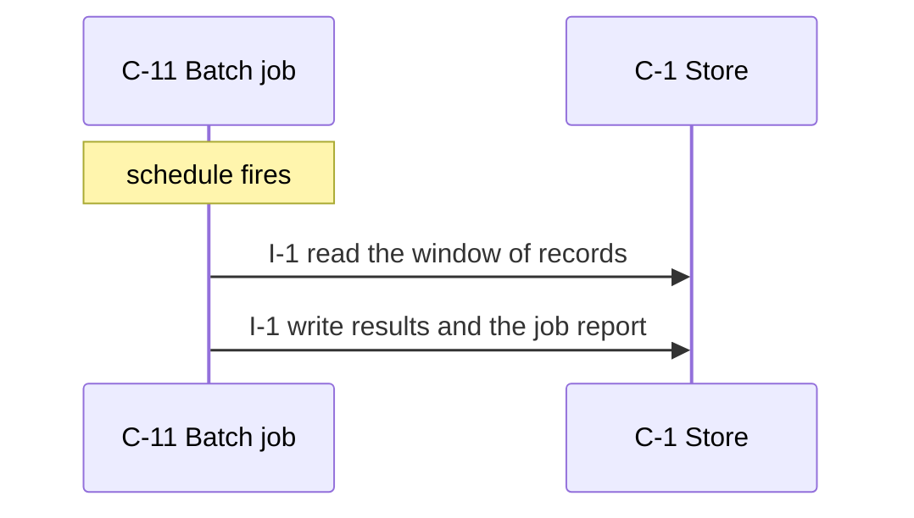
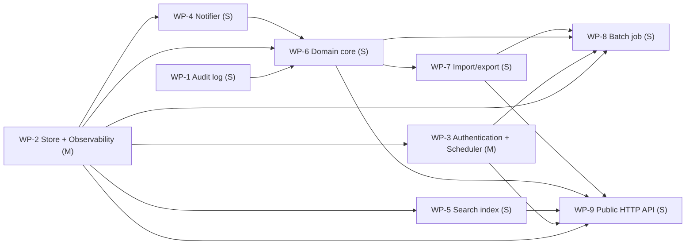

# warehouses-stock-management-service — design

Staff can record stock movements warehouses stock.

_version 0.1.0 · schema sekkei/1_

## Goals

- Clients read and write domain resources over HTTP.
- The system notifies people through an external channel.
- Metrics, structured logs and health endpoints for operations.
- Callers are authenticated and authorized.
- Users search and filter records.
- Scheduled jobs process stored records in windows.
- Changes are recorded append-only with the actor.
- Records move in and out as files.

**Non-goals**

- Purchasing suppliers manage.

## Requirements

| id | kind | priority | statement | metric |
|---|---|---|---|---|
| R-1 | functional | must | Staff can add, move and delete stock items (SKU, quantity, warehouses, bins) REST API. | — |
| R-2 | functional | must | Managers are notified reorder level stock falls below email. | — |
| R-3 | functional | must | Managers can export stock list CSV. | — |
| R-4 | functional | must | Users can search stock SKU warehouses. | — |
| R-5 | nonfunctional | must | The system must respond search 200000 items for within 300 ms (p95). | p95 latency at 200000 <= 300 ms |
| R-6 | nonfunctional | must | The system must update stock counts concurrent not lost. The system must not apply double-applied. | lost or duplicate updates under concurrent writes to one record = 0 updates |
| R-7 | nonfunctional | must | Monthly availability at least 99.9 %. | ratio >= 99.9 % |
| R-8 | nonfunctional | must | The system must export structured logs Prometheus for metrics. | required metrics exposed = all listed |
| R-9 | constraint | must | TypeScript(Node 20). The system can use PostgreSQL. Team of 2. | — |
| R-10 | constraint | must | Containers existing ingress behind run. | — |
| R-11 | functional | must | Domain records are kept indefinitely; logs and audit history are retained for 1 year, after which a nightly job deletes them (assumed by the engine). | — |
| R-12 | functional | must | Personal data is deleted on request within 30 days and access to it is logged (assumed by the engine). | — |
| R-13 | functional | could | Every operation is scoped to the caller's own resources; an admin role may act on any resource (assumed by the engine). | — |
| R-14 | nonfunctional | must | The system sustains 100 requests/s with peaks of 1,000 requests/s (assumed by the engine; default, not derived from the text). | sustained rate at 1,000 100 requests /s |
| R-15 | nonfunctional | must | Records are 2 KB on average and at most 256 KB (assumed by the engine). | size at 2 KB <= 256 kb |
| R-16 | nonfunctional | should | Backups run daily with a recovery point of 24 h and a recovery time of 4 h (assumed by the engine). | time at 4 h 24 h |
| R-17 | nonfunctional | must | An alert is raised when the error rate exceeds 1 % for 5 minutes or the queue depth grows for 10 minutes (assumed by the engine). | ratio at 5 minutes, 10 minutes 1 % |
| R-18 | nonfunctional | should | External calls time out after 10 s; failures are retried 5 times with exponential backoff and work waits durably meanwhile (assumed by the engine). | time at 5 10 s |
| R-19 | constraint | must | No existing data or system to migrate from (assumed by the engine). | — |
| R-20 | constraint | must | Authentication via an OIDC identity provider (assumed by the engine: internal users). | — |
| R-21 | constraint | must | Use existing infrastructure only; no new managed services (assumed by the engine). | — |

## Components

### C-1 — Store

- **kind**: datastore · **path**: `src/store.ts`
- **responsibility**: Owns persistence of the domain entities: durable writes, reads, listing, and the schema/migrations.
- **provides**: I-1
- **requires**: —
- **satisfies**: R-6, R-9, R-18

### C-2 — Email provider

- **kind**: external
- **responsibility**: External email delivery service.
- **provides**: I-2
- **requires**: —
- **satisfies**: R-2

### C-3 — Audit log

- **kind**: datastore · **path**: `src/audit.ts`
- **responsibility**: Append-only record of who did what to which resource, queryable by resource and actor.
- **provides**: I-3
- **requires**: —
- **satisfies**: R-12

### C-4 — Domain core

- **kind**: module · **path**: `src/core.ts`
- **responsibility**: Business rules and validation for the domain entities; the only module that changes state through the store.
- **provides**: I-4
- **requires**: I-1, I-6, I-3, I-5
- **satisfies**: R-1, R-3, R-6, R-9, R-19, R-21

### C-5 — Notifier

- **kind**: module · **path**: `src/notifier.ts`
- **responsibility**: Sends operator/customer notifications through the configured channel with templating and rate limiting.
- **provides**: I-5
- **requires**: I-2, I-6
- **satisfies**: R-2

### C-6 — Observability

- **kind**: module · **path**: `src/observability.ts`
- **responsibility**: Metrics registry and exposition, structured logging, health/readiness endpoints.
- **provides**: I-6
- **requires**: —
- **satisfies**: R-7, R-8, R-17

### C-7 — Authentication

- **kind**: module · **path**: `src/auth.ts`
- **responsibility**: Authenticates callers and resolves them to a principal and scope; enforces authorization for management operations.
- **provides**: I-7
- **requires**: I-1
- **satisfies**: R-13, R-20

### C-8 — Search index

- **kind**: module · **path**: `src/search.ts`
- **responsibility**: Full-text and filtered queries over the indexed entities.
- **provides**: I-8
- **requires**: I-1
- **satisfies**: R-4, R-5, R-14

### C-9 — Import/export

- **kind**: module · **path**: `src/exporter.ts`
- **responsibility**: Streams records to and from CSV/JSON with validation and partial-failure reporting.
- **provides**: I-9
- **requires**: I-4
- **satisfies**: R-3, R-8

### C-10 — Scheduler

- **kind**: job · **path**: `src/scheduler.ts`
- **responsibility**: Computes when deferred work runs next (backoff schedules, periodic jobs) and promotes due work.
- **provides**: I-10
- **requires**: I-6
- **satisfies**: R-11

### C-11 — Batch job

- **kind**: job · **path**: `src/batch.ts`
- **responsibility**: Scheduled processing over stored records: extract, transform, aggregate, write results.
- **provides**: I-11
- **requires**: I-1, I-10, I-6, I-9, I-4
- **satisfies**: R-11

### C-12 — Public HTTP API

- **kind**: service · **path**: `src/surface_api.ts`
- **responsibility**: Translates HTTP requests into core calls: routing, request validation, error mapping, JSON.
- **provides**: I-12
- **requires**: I-4, I-6, I-7, I-8, I-9
- **satisfies**: R-1, R-5, R-10, R-14, R-15, R-16

**Layers** (each layer depends only on earlier ones):

0. C-1, C-2, C-3, C-6
1. C-10, C-5, C-7, C-8
2. C-4
3. C-9
4. C-11, C-12

## Interfaces

### I-1 — Store interface

- **kind**: class · **owner**: C-1 · **stability**: stable
- Provided by Store. 

| operation | inputs | output | errors | pre / post |
|---|---|---|---|---|
| `save` | `entity`: Entity, `record`: dict | id | ConflictError on duplicate key | record is durable before return |
| `get` | `entity`: Entity, `id`: str | record \| None | — | — |
| `list` | `entity`: Entity, `filter`: dict, `page`: Page | list[record], next page token | — | — |
| `delete` | `entity`: Entity, `id`: str | bool | — | — |

### I-2 — Email provider interface

- **kind**: http · **owner**: C-2 · **stability**: stable
- Provided by Email provider. External; contract is theirs.

| operation | inputs | output | errors | pre / post |
|---|---|---|---|---|
| `send` | `to`: str, `subject`: str, `body`: str | provider message id | — | — |

### I-3 — Audit log interface

- **kind**: class · **owner**: C-3 · **stability**: stable
- Provided by Audit log. 

| operation | inputs | output | errors | pre / post |
|---|---|---|---|---|
| `append` | `actor`: str, `action`: str, `resource`: str, `details`: dict | None | — | — |
| `query` | `resource`: str \| None, `actor`: str \| None, `page`: Page | entries | — | — |

### I-4 — Domain core interface

- **kind**: module · **owner**: C-4 · **stability**: draft
- Provided by Domain core. 

| operation | inputs | output | errors | pre / post |
|---|---|---|---|---|
| `add_items` | `items`: Items \| id | Items \| None | ValidationError, NotFound | — |
| | from R-1: Staff can add, move and delete stock items (SKU, quantity, warehouses, bins) REST API. | | | |
| `move_items` | `items`: Items \| id | Items \| None | ValidationError, NotFound | — |
| | from R-1: Staff can add, move and delete stock items (SKU, quantity, warehouses, bins) REST API. | | | |
| `delete_items` | `items`: Items \| id | Items \| None | ValidationError, NotFound | — |
| | from R-1: Staff can add, move and delete stock items (SKU, quantity, warehouses, bins) REST API. | | | |
| `notify_level` | `level`: Level \| id | Level \| None | ValidationError, NotFound | — |
| | from R-2: Managers are notified reorder level stock falls below email. | | | |
| `export_stock` | `stock`: Stock \| id | Stock \| None | ValidationError, NotFound | — |
| | from R-3: Managers can export stock list CSV. | | | |
| `list_stock` | `stock`: Stock \| id | Stock \| None | ValidationError, NotFound | — |
| | from R-3: Managers can export stock list CSV. | | | |
| `search_sku` | `sku`: Sku \| id | Sku \| None | ValidationError, NotFound | — |
| | from R-4: Users can search stock SKU warehouses. | | | |

### I-5 — Notifier interface

- **kind**: module · **owner**: C-5 · **stability**: draft
- Provided by Notifier. 

| operation | inputs | output | errors | pre / post |
|---|---|---|---|---|
| `notify` | `recipient`: str, `template`: str, `context`: dict | message id | NotifyError | — |

### I-6 — Observability interface

- **kind**: module · **owner**: C-6 · **stability**: draft
- Provided by Observability. 

| operation | inputs | output | errors | pre / post |
|---|---|---|---|---|
| `counter` | `name`: str, `labels`: dict | Counter | — | — |
| `histogram` | `name`: str, `labels`: dict | Histogram | — | — |
| `gauge` | `name`: str, `labels`: dict | Gauge | — | — |
| `GET /metrics` | — | Prometheus text exposition | — | — |
| `GET /healthz` | — | 200 when dependencies reachable | — | — |
| `log` | `event`: str, `fields`: dict | None | — | — |
| | one JSON line per event | | | |

### I-7 — Authentication interface

- **kind**: module · **owner**: C-7 · **stability**: draft
- Provided by Authentication. 

| operation | inputs | output | errors | pre / post |
|---|---|---|---|---|
| `authenticate` | `credentials`: str | Principal | AuthError | — |
| `authorize` | `principal`: Principal, `action`: str, `resource`: str | None | Forbidden | — |

### I-8 — Search index interface

- **kind**: module · **owner**: C-8 · **stability**: draft
- Provided by Search index. 

| operation | inputs | output | errors | pre / post |
|---|---|---|---|---|
| `index` | `entity`: Entity, `record`: dict | None | — | — |
| `query` | `text`: str, `filters`: dict, `page`: Page | hits | — | — |

### I-9 — Import/export interface

- **kind**: module · **owner**: C-9 · **stability**: draft
- Provided by Import/export. 

| operation | inputs | output | errors | pre / post |
|---|---|---|---|---|
| `export` | `entity`: Entity, `filter`: dict, `format`: csv\|json | byte stream | — | — |
| `import_` | `entity`: Entity, `stream`: bytes, `format`: csv\|json | ImportReport with per-row errors | — | — |

### I-10 — Scheduler interface

- **kind**: module · **owner**: C-10 · **stability**: draft
- Provided by Scheduler. 

| operation | inputs | output | errors | pre / post |
|---|---|---|---|---|
| `next_attempt` | `attempt`: int, `retry_after`: timedelta \| None | datetime \| None | — | — |
| | None when attempts are exhausted | | | |
| `promote_due` | `now`: datetime | int moved | — | — |

### I-11 — Batch job interface

- **kind**: module · **owner**: C-11 · **stability**: draft
- Provided by Batch job. 

| operation | inputs | output | errors | pre / post |
|---|---|---|---|---|
| `run` | `window`: DateRange | JobReport | JobError | stated values: 1 year (R-11) |

### I-12 — Public HTTP API interface

- **kind**: http · **owner**: C-12 · **stability**: draft
- Provided by Public HTTP API. 

| operation | inputs | output | errors | pre / post |
|---|---|---|---|---|
| `POST /items` | `body`: items fields | 201 {items id} | 400 invalid body, 401 unauthenticated, 409 conflict | — |
| | from R-1: Staff can add, move and delete stock items (SKU, quantity, warehouses, bins) REST API. | | | |
| `POST /items/{id}/move` | `id`: str | 202 move accepted | 401 unauthenticated, 404 unknown id, 409 not applicable in current state | — |
| | from R-1: Staff can add, move and delete stock items (SKU, quantity, warehouses, bins) REST API. | | | |
| `DELETE /items/{id}` | `id`: str | 204 | 401 unauthenticated, 404 unknown id | — |
| | from R-1: Staff can add, move and delete stock items (SKU, quantity, warehouses, bins) REST API. | | | |
| `GET /stocks` | `filter`: query, `page`: cursor | 200 [stock], next cursor | 401 unauthenticated | — |
| | from R-3: Managers can export stock list CSV. | | | |
| `GET /skus` | `filter`: query, `page`: cursor | 200 [sku], next cursor | 401 unauthenticated | — |
| | from R-4: Users can search stock SKU warehouses. | | | |

## Entities

### E-1 — Record (owner C-1)

Generic domain record; refine per entity found in the requirements.

| field | type | constraints |
|---|---|---|
| `id` | uuid | primary key |
| `created_at` | timestamp |  |
| `updated_at` | timestamp |  |

### E-2 — Principal (owner C-1)

| field | type | constraints |
|---|---|---|
| `id` | uuid | primary key |
| `kind` | enum(customer, operator, service) |  |
| `scopes` | list[str] |  |

### E-3 — JobRun (owner C-1)

| field | type | constraints |
|---|---|---|
| `id` | uuid | primary key |
| `job` | str |  |
| `window_start` | timestamp |  |
| `window_end` | timestamp |  |
| `status` | enum |  |
| `report` | json |  |

### E-4 — AuditEntry (owner C-3)

| field | type | constraints |
|---|---|---|
| `id` | uuid | primary key |
| `actor` | str |  |
| `action` | str |  |
| `resource` | str | indexed |
| `at` | timestamp |  |

### E-5 — Item (owner C-1)

Domain entity named in the requirements ('item'); confirm the fields.

| field | type | constraints |
|---|---|---|
| `id` | uuid | primary key |
| `sku` | … | from the text |
| `quantity` | … | from the text |
| `warehouses` | … | from the text |
| `bins` | … | from the text |
| `created_at` | timestamp |  |

### E-6 — Warehouse (owner C-1)

Domain entity named in the requirements ('warehouse'); confirm the fields.

| field | type | constraints |
|---|---|---|
| `id` | uuid | primary key |
| `created_at` | timestamp |  |

## Flows

### F-1 — Serve a request

_Trigger:_ client calls the API

1. C-12 → C-4 via I-4: validate and apply
2. C-4 → C-1 via I-1: read/write

### F-2 — Run the batch job

_Trigger:_ schedule fires

1. C-11 → C-1 via I-1: read the window of records
2. C-11 → C-1 via I-1: write results and the job report

## Decisions

### D-1 — API style (accepted)

**Context.** Clients need a programmable surface.

- ✔ **REST/JSON over HTTP**
  - + universal tooling
  - + cacheable reads
  - − over-fetching on nested data
- ✘ **gRPC**
  - + typed contracts
  - + streaming
  - − browser and debugging friction
- ✘ **GraphQL**
  - + flexible queries
  - − complexity budget for a small team

**Rationale.** Scored against the active qualities; decided by operability (weight 1.0), simplicity (weight 0.8). REST/JSON over HTTP: 1.43; gRPC: 1.28; GraphQL: 1.14

**Consequences.** Not choosing 'gRPC' gives up: typed contracts, streaming. Not choosing 'GraphQL' gives up: flexible queries.

_Affects:_ C-12

### D-2 — Primary store (accepted)

**Context.** Domain records need durable, queryable storage.

- ✔ **PostgreSQL**
  - + transactions
  - + indexes and JSON
  - + widely available
  - − operational dependency
- ✘ **MySQL / MariaDB (the stated database)**
  - + transactions
  - + already operated by the team
  - − weaker JSON and DDL ergonomics than PostgreSQL
- ✘ **Managed document store (DynamoDB/MongoDB, as stated)**
  - + scales without operations
  - + flexible records
  - − no cross-record transactions by default
  - − query patterns must be designed up front
- ✘ **SQLite**
  - + zero operations
  - + single file
  - − one writer at a time
  - − no network access
- ✘ **Files (JSON/CSV on disk)**
  - + no dependencies
  - + human readable
  - − no transactions or concurrency
- ✘ **In-memory**
  - + fastest
  - + trivial
  - − lost on restart

**Rationale.** Scored against the active qualities; decided by operability (weight 1.0), simplicity (weight 0.8). PostgreSQL: 3.29; MySQL / MariaDB: unavailable (needs mysql, not in the constraints); Managed document store: unavailable (needs document_db, not in the constraints); SQLite: unavailable (ruled out by containers); Files: unavailable (ruled out by containers); In-memory: unavailable (ruled out by containers, postgres). stated in the constraints

_Affects:_ C-1

### D-3 — Caller authentication (accepted)

**Context.** Management operations must be attributable to a customer or operator.

- ✘ **API keys per customer, hashed at rest, sent as a bearer token**
  - + simple
  - + scriptable
  - − no delegation or expiry unless added
- ✔ **OAuth2 / OIDC with the platform's identity provider**
  - + single sign-on
  - + expiry and scopes
  - − integration effort
- ✘ **Mutual TLS**
  - + strong
  - + no secrets in headers
  - − certificate lifecycle for every customer
- ✘ **Email one-time code / magic link (no account needed)**
  - + no password, no sign-up
  - + works for occasional customers
  - − depends on email delivery
  - − weak against mailbox compromise

**Rationale.** Scored against the active qualities; decided by operability (weight 1.0), simplicity (weight 0.8). OAuth2 / OIDC with the platform's identity provi: 2.00; API keys per customer, hashed at rest, sent as a: 1.29; Mutual TLS: 0.86; Email one-time code / magic link: unavailable (needs email_auth, not in the constraints). stated in the constraints

**Consequences.** Not choosing 'API keys per customer, hashed at rest, sent as a' gives up: simple, scriptable. Not choosing 'Mutual TLS' gives up: strong, no secrets in headers.

_Affects:_ C-7

### D-4 — Process topology (accepted)

**Context.** The same code base serves requests and performs background work.

- ✔ **One image, role by flag: `api` and `worker` processes scale independently**
  - + stateless containers
  - + independent scaling of ingress and outbound work
  - + one build
  - − two deployables to operate
- ✘ **Single process with background threads**
  - + one deployable
  - − request latency competes with outbound work
  - − cannot scale roles separately
- ✘ **Separate services per concern (ingest, admin, delivery)**
  - + clear ownership
  - − three deployables for a team of three
  - − shared schema anyway

**Rationale.** Scored against the active qualities; decided by operability (weight 1.0), simplicity (weight 0.8). One image, role by flag: `api` and `worker` proc: 1.79; Single process with background threads: 1.47; Separate services per concern: 1.28

**Consequences.** Not choosing 'Single process with background threads' gives up: one deployable. Not choosing 'Separate services per concern' gives up: clear ownership.

_Affects:_ C-12, C-10

### D-5 — Concurrency control for conflicting writes (accepted)

**Context.** Two callers may change the same record at the same time and the result must be consistent.

- ✘ **Optimistic concurrency: version column checked on every update; conflict returns 409 and the caller retries**
  - + no locks held across requests
  - + works with stateless instances
  - − callers must handle 409
- ✔ **Row locks inside a short transaction (SELECT ... FOR UPDATE)**
  - + simple mental model
  - + no client retry
  - − lock waits under contention
  - − needs a transactional store
- ✘ **Last write wins**
  - + nothing to implement
  - − lost updates

**Rationale.** Scored against the active qualities; decided by operability (weight 1.0), simplicity (weight 0.8). Row locks inside a short transaction: 1.71; Optimistic concurrency: version column checked o: 1.71; Last write wins: 1.43

**Consequences.** Not choosing 'Optimistic concurrency: version column checked o' gives up: no locks held across requests, works with stateless instances. Not choosing 'Last write wins' gives up: nothing to implement.

_Affects:_ C-1, C-4

### D-6 — Redundancy for the availability target (accepted)

**Context.** The availability target must be met through instance failures and deploys.

- ✔ **Two or more interchangeable instances per role behind the ingress, health checks, rolling deploys**
  - + survives one instance failure
  - + zero-downtime deploys
  - − needs stateless instances and a shared store
- ✘ **Single instance with health-based restart**
  - + simplest
  - + cheapest
  - − restart time is downtime
  - − deploys are downtime
- ✘ **Active-active across two regions**
  - + survives a regional outage
  - − data replication and conflict handling
  - − cost

**Rationale.** Scored against the active qualities; decided by operability (weight 1.0), simplicity (weight 0.8). Two or more interchangeable instances per role b: 1.43; Single instance with health-based restart: 1.29; Active-active across two regions: 1.14

**Consequences.** Not choosing 'Single instance with health-based restart' gives up: simplest, cheapest. Not choosing 'Active-active across two regions' gives up: survives a regional outage.

_Affects:_ C-12

### D-7 — Assumed answer: load (Q-rate) (proposed)

**Context.** The requirements do not say. Question: Q-rate. No evidence in the text; engine default.

- ✔ **100 requests/s**
- ✘ **10 requests/s**
- ✘ **1,000 requests/s**

**Rationale.** No rate stated and none derivable (a count is a size, not a rate); 100 requests/s is a modest default for a first release — every capacity figure below inherits this assumption.

**Consequences.** If the real answer differs: State the measured or expected rate; capacity estimates and the queue decision change.

_Affects:_ C-12

### D-8 — Assumed answer: load (Q-payload) (proposed)

**Context.** The requirements do not say. Question: Q-payload. No evidence in the text; engine default.

- ✔ **2 KB / 256 KB**
- ✘ **16 KB / 1 MB**
- ✘ **256 bytes / 4 KB**

**Rationale.** Typical JSON record sizes; the maximum bounds request bodies.

**Consequences.** If the real answer differs: State the sizes; storage growth and body limits change.

_Affects:_ C-12

### D-9 — Assumed answer: data (Q-retention) (proposed)

**Context.** The requirements do not say. Question: Q-retention. No evidence in the text; engine default.

- ✔ **indefinite / 1 year**
- ✘ **90 days / 1 year**
- ✘ **30 days / 90 days**

**Rationale.** Deleting domain data is never a safe default; bounded retention for logs and history limits growth and satisfies most data-minimisation rules.

**Consequences.** If the real answer differs: State the retention per record class; the deletion job and capacity change.

_Affects:_ C-11, C-1

### D-10 — Assumed answer: data (Q-backup) (proposed)

**Context.** The requirements do not say. Question: Q-backup. No evidence in the text; engine default.

- ✔ **daily / 24 h / 4 h**
- ✘ **hourly / 1 h / 1 h**
- ✘ **none**

**Rationale.** The store's own daily backup is the cheapest credible baseline.

**Consequences.** If the real answer differs: State RPO/RTO; the store decision and a restore drill change.

_Affects:_ C-1

### D-11 — Assumed answer: data (Q-migration) (proposed)

**Context.** The requirements do not say. Question: Q-migration. No evidence in the text; engine default.

- ✔ **greenfield**
- ✘ **one-shot import**
- ✘ **gradual cut-over**

**Rationale.** Nothing in the text names an existing system.

**Consequences.** If the real answer differs: Name the existing system; a migration package and risk are added.

### D-12 — Assumed answer: security (Q-auth) (proposed)

**Context.** The requirements do not say. Question: Q-auth. Evidence: staff/employees mentioned.

- ✔ **OIDC**
- ✘ **API keys**
- ✘ **mTLS**

**Rationale.** Internal staff systems normally sit behind the company's SSO.

**Consequences.** If the real answer differs: State the scheme; the authentication decision is rescored.

_Affects:_ C-7

### D-13 — Assumed answer: compliance (Q-compliance) (proposed)

**Context.** The requirements do not say. Question: Q-compliance. Evidence: personal data mentioned.

- ✔ **GDPR-style deletion + audit**
- ✘ **no regime**
- ✘ **HIPAA/PCI controls**

**Rationale.** Email addresses or names are personal data almost everywhere; deletion on request is the common denominator.

**Consequences.** If the real answer differs: State the regime; audit and deletion paths change.

_Affects:_ C-3, C-1

### D-14 — Assumed answer: operations (Q-alerting) (proposed)

**Context.** The requirements do not say. Question: Q-alerting. No evidence in the text; engine default.

- ✔ **error rate + queue growth**
- ✘ **none**
- ✘ **per-endpoint SLO alerts**

**Rationale.** Two alerts catch most incidents without paging on noise.

**Consequences.** If the real answer differs: State the rules and the on-call; observability conventions change.

_Affects:_ C-6

### D-15 — Assumed answer: cost (Q-budget) (proposed)

**Context.** The requirements do not say. Question: Q-budget. No evidence in the text; engine default.

- ✔ **existing only**
- ✘ **managed services allowed**
- ✘ **strict monthly cap**

**Rationale.** The cheapest assumption; every decision already prefers the option needing no new infrastructure.

**Consequences.** If the real answer differs: State the budget; options adding infrastructure become available.

### D-16 — Assumed answer: security (Q-authz) (proposed)

**Context.** The requirements do not say. Question: Q-authz. No evidence in the text; engine default.

- ✔ **owner-scoped + admin role**
- ✘ **flat (everyone sees everything)**
- ✘ **role matrix per resource**

**Rationale.** Ownership scoping is the minimum that prevents cross-tenant access.

**Consequences.** If the real answer differs: State the roles; core operations and acceptance checks change.

_Affects:_ C-4, C-7

### D-17 — Assumed answer: resilience (Q-external) (proposed)

**Context.** The requirements do not say. Question: Q-external. No evidence in the text; engine default.

- ✔ **10 s / 5 retries / queue**
- ✘ **fail fast, no retry**
- ✘ **30 s / unlimited retries**

**Rationale.** Bounded retries with a durable queue keep the system responsive during a one-hour outage.

**Consequences.** If the real answer differs: State the policy; the outbound client and scheduler contracts change.

_Affects:_ C-10

## Risks

| id | risk | likelihood | impact | mitigation |
|---|---|---|---|---|
| K-1 | Payloads or uploads without size limits exhaust memory or disk. | medium | medium | Enforce size limits at the surface; reject early with a clear error. |
| K-2 | Entities evolve; migrations run against live data. | medium | medium | Versioned migrations applied before deploy; additive changes first, removals one release later. |
| K-3 | A widespread failure disables many targets and emails every owner at once. | low | medium | Rate-limit notifications per owner and batch them. |
| K-4 | Per-target labels on metrics explode cardinality. | medium | low | Label by outcome and partition class, not by target id; expose per-target detail through the API instead. |
| K-5 | A management operation reachable without authentication. | low | high | Authenticate in one middleware for every management route; test every route unauthenticated. |
| K-6 | [tampering] Store: Injection through query construction. | medium | medium | Parameterised queries only; no string-built SQL. Check: static check for string-formatted SQL finds nothing |
| K-7 | [information_disclosure] Store: Backups and dumps contain everything. | medium | high | Encrypt backups; restrict who can take them. Check: backup file is not readable without the key |
| K-8 | [denial_of_service] Notifier: Notification storms and template injection. | medium | medium | Rate-limit per recipient; escape template context. Check: 1,000 failures produce one digest per owner |
| K-9 | [spoofing] Authentication: Credential stuffing or leaked keys. | medium | medium | Hash keys at rest; allow revocation; rate-limit failures. Check: revoked key is rejected within seconds; brute force is throttled |
| K-10 | [elevation] Authentication: A caller acts on another tenant's resources. | medium | high | Every core operation takes the principal and checks ownership. Check: cross-tenant request returns 404/403 for every operation |
| K-11 | [spoofing] Public HTTP API: Requests without a verified caller identity reach domain operations. | medium | medium | Authenticate every route in one middleware; deny by default. Check: every route returns 401 without credentials |
| K-12 | [tampering] Public HTTP API: Malformed or oversized bodies reach the core. | medium | medium | Schema-validate and size-limit at the surface; reject before parsing fully. Check: fuzz the body; oversize returns 413 |
| K-13 | [denial_of_service] Public HTTP API: A single caller saturates the service. | medium | medium | Per-caller rate limit and request timeouts. Check: burst from one key returns 429; others unaffected |
| K-14 | [information_disclosure] Public HTTP API: Stack traces or internal ids leak in error responses. | medium | high | Map exceptions to fixed error shapes; log details server-side only. Check: no traceback text in any 4xx/5xx body |

## Work packages

**Waves** (packages in one wave may run in parallel):

1. WP-1, WP-2
2. WP-3, WP-4, WP-5
3. WP-6
4. WP-7
5. WP-8, WP-9

_Critical path (13 person-days):_ WP-2 → WP-4 → WP-6 → WP-7 → WP-9

### WP-1 — Audit log (S)

Implement Audit log: Append-only record of who did what to which resource, queryable by resource and actor.

- **components**: C-3 · **implements**: I-3
- **depends on**: — · **satisfies**: R-12
- **write scope**: `src/audit.ts`, `tests/audit.test.ts`
- **acceptance**:
  - A-1 (test) unit tests of Audit log pass — `npx vitest run tests/audit.test.ts`
- **notes**: family: audit_log

### WP-2 — Store + Observability (M)

Implement Store: Owns persistence of the domain entities: durable writes, reads, listing, and the schema/migrations; Observability: Metrics registry and exposition, structured logging, health/readiness endpoints.

- **components**: C-1, C-6 · **implements**: I-1, I-6
- **depends on**: — · **satisfies**: R-6, R-7, R-8, R-9, R-17, R-18
- **write scope**: `src/store.ts`, `tests/store.test.ts`, `src/observability.ts`, `tests/observability.test.ts`
- **acceptance**:
  - A-2 (test) unit tests of Store, Observability pass — `npx vitest run tests/store.test.ts tests/observability.test.ts`
  - A-3 (metric) R-6: lost or duplicate updates under concurrent writes to one record = 0 updates — concurrent-update test: N parallel writers to one record end in the consistent state with no lost update — metric R-6
  - A-4 (metric) R-7: ratio >= 99.9 % — kill one instance under load; error rate stays within the target — metric R-7
  - A-5 (metric) R-8: required metrics exposed = all listed — the listed metrics are exposed and change under a smoke workload — metric R-8
- **notes**: family: infra

### WP-3 — Authentication + Scheduler (M)

Implement Authentication: Authenticates callers and resolves them to a principal and scope; enforces authorization for management operations; Scheduler: Computes when deferred work runs next (backoff schedules, periodic jobs) and promotes due work.

- **components**: C-7, C-10 · **implements**: I-7, I-10
- **depends on**: WP-2 · **satisfies**: R-11, R-13, R-20
- **write scope**: `src/auth.ts`, `tests/auth.test.ts`, `src/scheduler.ts`, `tests/scheduler.test.ts`
- **acceptance**:
  - A-6 (test) unit tests of Authentication, Scheduler pass — `npx vitest run tests/auth.test.ts tests/scheduler.test.ts`
- **notes**: family: infra

### WP-4 — Notifier (S)

Implement Notifier: Sends operator/customer notifications through the configured channel with templating and rate limiting.

- **components**: C-5 · **implements**: I-5
- **depends on**: WP-2 · **satisfies**: R-2
- **write scope**: `src/notifier.ts`, `tests/notifier.test.ts`
- **acceptance**:
  - A-7 (test) unit tests of Notifier pass — `npx vitest run tests/notifier.test.ts`
- **notes**: family: notification

### WP-5 — Search index (S)

Implement Search index: Full-text and filtered queries over the indexed entities.

- **components**: C-8 · **implements**: I-8
- **depends on**: WP-2 · **satisfies**: R-4, R-5, R-14
- **write scope**: `src/search.ts`, `tests/search.test.ts`
- **acceptance**:
  - A-8 (test) unit tests of Search index pass — `npx vitest run tests/search.test.ts`
  - A-9 (metric) R-5: p95 latency at 200000 <= 300 ms — load test at the stated rate; the stated percentile must meet the target — metric R-5
- **notes**: family: search

### WP-6 — Domain core (S)

Implement Domain core: Business rules and validation for the domain entities; the only module that changes state through the store.

- **components**: C-4 · **implements**: I-4
- **depends on**: WP-1, WP-2, WP-4 · **satisfies**: R-1, R-3, R-6, R-9, R-19, R-21
- **write scope**: `src/core.ts`, `tests/core.test.ts`
- **acceptance**:
  - A-10 (test) unit tests of Domain core pass — `npx vitest run tests/core.test.ts`
  - A-11 (metric) R-6: lost or duplicate updates under concurrent writes to one record = 0 updates — concurrent-update test: N parallel writers to one record end in the consistent state with no lost update — metric R-6
- **notes**: family: crud_api

### WP-7 — Import/export (S)

Implement Import/export: Streams records to and from CSV/JSON with validation and partial-failure reporting.

- **components**: C-9 · **implements**: I-9
- **depends on**: WP-6 · **satisfies**: R-3, R-8
- **write scope**: `src/exporter.ts`, `tests/exporter.test.ts`
- **acceptance**:
  - A-12 (test) unit tests of Import/export pass — `npx vitest run tests/exporter.test.ts`
  - A-13 (metric) R-8: required metrics exposed = all listed — the listed metrics are exposed and change under a smoke workload — metric R-8
- **notes**: family: import_export

### WP-8 — Batch job (S)

Implement Batch job: Scheduled processing over stored records: extract, transform, aggregate, write results.

- **components**: C-11 · **implements**: I-11
- **depends on**: WP-2, WP-3, WP-6, WP-7 · **satisfies**: R-11
- **write scope**: `src/batch.ts`, `tests/batch.test.ts`
- **acceptance**:
  - A-14 (test) unit tests of Batch job pass — `npx vitest run tests/batch.test.ts`
- **notes**: family: batch_pipeline

### WP-9 — Public HTTP API (S)

Implement Public HTTP API: Translates HTTP requests into core calls: routing, request validation, error mapping, JSON.

- **components**: C-12 · **implements**: I-12
- **depends on**: WP-2, WP-3, WP-5, WP-6, WP-7 · **satisfies**: R-1, R-5, R-10, R-14, R-15, R-16
- **write scope**: `src/surface_api.ts`, `tests/surface_api.test.ts`
- **acceptance**:
  - A-15 (test) unit tests of Public HTTP API pass — `npx vitest run tests/surface_api.test.ts`
  - A-16 (metric) R-5: p95 latency at 200000 <= 300 ms — load test at the stated rate; the stated percentile must meet the target — metric R-5
- **notes**: family: crud_api

## Traceability

| requirement | priority | components | work packages | acceptance |
|---|---|---|---|---|
| R-1 | must | C-4, C-12 | WP-6, WP-9 | A-10, A-11, A-15, A-16 |
| R-2 | must | C-2, C-5 | WP-4 | A-7 |
| R-3 | must | C-4, C-9 | WP-6, WP-7 | A-10, A-11, A-12, A-13 |
| R-4 | must | C-8 | WP-5 | A-8, A-9 |
| R-5 | must | C-8, C-12 | WP-5, WP-9 | A-8, A-9, A-15, A-16 |
| R-6 | must | C-1, C-4 | WP-2, WP-6 | A-2, A-3, A-4, A-5, A-10, A-11 |
| R-7 | must | C-6 | WP-2 | A-2, A-3, A-4, A-5 |
| R-8 | must | C-6, C-9 | WP-2, WP-7 | A-2, A-3, A-4, A-5, A-12, A-13 |
| R-9 | must | C-1, C-4 | WP-2, WP-6 | A-2, A-3, A-4, A-5, A-10, A-11 |
| R-10 | must | C-12 | WP-9 | A-15, A-16 |
| R-11 | must | C-10, C-11 | WP-3, WP-8 | A-6, A-14 |
| R-12 | must | C-3 | WP-1 | A-1 |
| R-13 | could | C-7 | WP-3 | A-6 |
| R-14 | must | C-8, C-12 | WP-5, WP-9 | A-8, A-9, A-15, A-16 |
| R-15 | must | C-12 | WP-9 | A-15, A-16 |
| R-16 | should | C-12 | WP-9 | A-15, A-16 |
| R-17 | must | C-6 | WP-2 | A-2, A-3, A-4, A-5 |
| R-18 | should | C-1 | WP-2 | A-2, A-3, A-4, A-5 |
| R-19 | must | C-4 | WP-6 | A-10, A-11 |
| R-20 | must | C-7 | WP-3 | A-6 |
| R-21 | must | C-4 | WP-6 | A-10, A-11 |

## Conventions

- **language**: typescript
- **test**: `npx vitest run`
- **lint**: `npx eslint .`
- strict TypeScript; no `any` in exported signatures.
- No business logic in route handlers.
- Every component logs one structured line per unit of work with the correlation id.
- Prefer the boring option; a new piece of infrastructure needs a decision record.
- Node 20 as stated in the constraints.
- Stateless processes: configuration from the environment, no local files that a second instance would not see.

**Definition of done**

- Acceptance checks of the package pass.
- No file outside the write scope changed.
- Every public operation of the implemented interfaces exists with the declared inputs.
