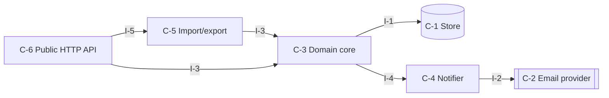
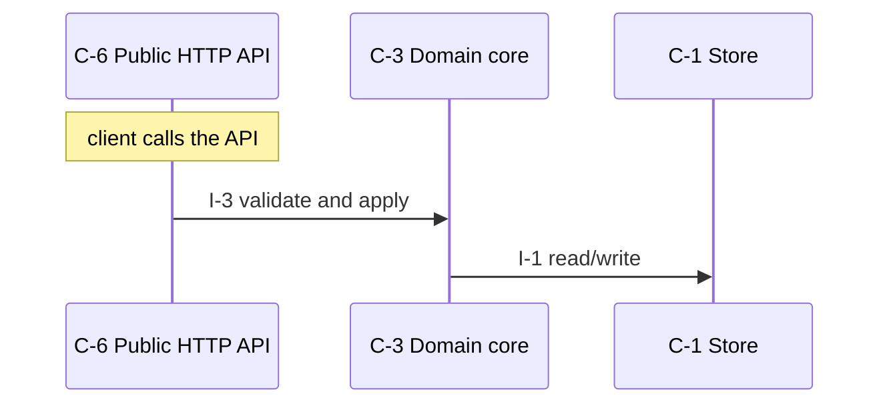
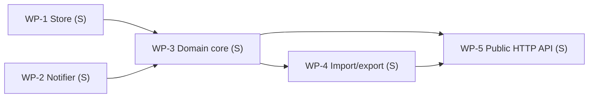

# newsletter-signup — design

Visitors can subscribe with an email address and confirm through a link sent by email.

_version 0.1.0 · schema sekkei/1_

## Goals

- The system notifies people through an external channel.
- Records move in and out as files.

## Requirements

| id | kind | priority | statement | metric |
|---|---|---|---|---|
| R-1 | functional | must | Visitors can subscribe with an email address and confirm through a link sent by email. | — |
| R-2 | functional | must | Admins can export the subscriber list as CSV. | — |

## Components

### C-1 — Store

- **kind**: datastore · **path**: `app/store.py`
- **responsibility**: Owns persistence of the domain entities: durable writes, reads, listing, and the schema/migrations.
- **provides**: I-1
- **requires**: —
- **satisfies**: R-1

### C-2 — Email provider

- **kind**: external
- **responsibility**: External email delivery service.
- **provides**: I-2
- **requires**: —
- **satisfies**: R-1

### C-3 — Domain core

- **kind**: module · **path**: `app/core.py`
- **responsibility**: Business rules and validation for the domain entities; the only module that changes state through the store.
- **provides**: I-3
- **requires**: I-1, I-4
- **satisfies**: R-2

### C-4 — Notifier

- **kind**: module · **path**: `app/notifier.py`
- **responsibility**: Sends operator/customer notifications through the configured channel with templating and rate limiting.
- **provides**: I-4
- **requires**: I-2
- **satisfies**: R-1

### C-5 — Import/export

- **kind**: module · **path**: `app/exporter.py`
- **responsibility**: Streams records to and from CSV/JSON with validation and partial-failure reporting.
- **provides**: I-5
- **requires**: I-3
- **satisfies**: R-2

### C-6 — Public HTTP API

- **kind**: service · **path**: `app/surface_api.py`
- **responsibility**: Translates HTTP requests into core calls: routing, request validation, error mapping, JSON.
- **provides**: I-6
- **requires**: I-3, I-5
- **satisfies**: R-1

**Layers** (each layer depends only on earlier ones):

0. C-1, C-2
1. C-4
2. C-3
3. C-5
4. C-6

## Interfaces

### I-1 — Store interface

- **kind**: class · **owner**: C-1 · **stability**: stable
- Provided by Store. 

| operation | inputs | output | errors | pre / post |
|---|---|---|---|---|
| `save` | `entity`: Entity, `record`: dict | id | ConflictError on duplicate key | record is durable before return |
| `get` | `entity`: Entity, `id`: str | record \| None | — | — |
| `list` | `entity`: Entity, `filter`: dict, `page`: Page | list[record], next page token | — | — |
| `delete` | `entity`: Entity, `id`: str | bool | — | — |

### I-2 — Email provider interface

- **kind**: http · **owner**: C-2 · **stability**: stable
- Provided by Email provider. External; contract is theirs.

| operation | inputs | output | errors | pre / post |
|---|---|---|---|---|
| `send` | `to`: str, `subject`: str, `body`: str | provider message id | — | — |

### I-3 — Domain core interface

- **kind**: module · **owner**: C-3 · **stability**: draft
- Provided by Domain core. 

| operation | inputs | output | errors | pre / post |
|---|---|---|---|---|
| `export_subscriber` | `subscriber`: Subscriber \| id | Subscriber \| None | ValidationError, NotFound | — |
| | from R-2: Admins can export the subscriber list as CSV. | | | |
| `list_subscriber` | `subscriber`: Subscriber \| id | Subscriber \| None | ValidationError, NotFound | — |
| | from R-2: Admins can export the subscriber list as CSV. | | | |

### I-4 — Notifier interface

- **kind**: module · **owner**: C-4 · **stability**: draft
- Provided by Notifier. 

| operation | inputs | output | errors | pre / post |
|---|---|---|---|---|
| `notify` | `recipient`: str, `template`: str, `context`: dict | message id | NotifyError | — |

### I-5 — Import/export interface

- **kind**: module · **owner**: C-5 · **stability**: draft
- Provided by Import/export. 

| operation | inputs | output | errors | pre / post |
|---|---|---|---|---|
| `export` | `entity`: Entity, `filter`: dict, `format`: csv\|json | byte stream | — | — |
| `import_` | `entity`: Entity, `stream`: bytes, `format`: csv\|json | ImportReport with per-row errors | — | — |

### I-6 — Public HTTP API interface

- **kind**: http · **owner**: C-6 · **stability**: draft
- Provided by Public HTTP API. 

_(no operations declared)_

## Entities

### E-1 — Email (owner C-1)

Generic record named after the most frequent noun ('email'); refine the fields.

| field | type | constraints |
|---|---|---|
| `id` | uuid | primary key |
| `created_at` | timestamp |  |
| `updated_at` | timestamp |  |

## Flows

### F-1 — Serve a request

_Trigger:_ client calls the API

1. C-6 → C-3 via I-3: validate and apply
2. C-3 → C-1 via I-1: read/write

## Decisions

### D-1 — Primary store (accepted)

**Context.** Domain records need durable, queryable storage.

- ✘ **PostgreSQL**
  - + transactions
  - + indexes and JSON
  - + already available
  - − operational dependency
- ✔ **SQLite**
  - + zero operations
  - + single file
  - − one writer at a time
  - − no network access
- ✘ **Files (JSON/CSV on disk)**
  - + no dependencies
  - + human readable
  - − no transactions or concurrency
- ✘ **In-memory**
  - + fastest
  - + trivial
  - − lost on restart

**Rationale.** Scored against the active qualities; decided by simplicity (no qualities stated). SQLite: 3.00; Files: 3.00; In-memory: 3.00; PostgreSQL: unavailable (needs postgres, not in the constraints)

**Consequences.** Not choosing 'Files' gives up: no dependencies, human readable. Not choosing 'In-memory' gives up: fastest, trivial.

_Affects:_ C-1

## Risks

| id | risk | likelihood | impact | mitigation |
|---|---|---|---|---|
| K-1 | A widespread failure disables many targets and emails every owner at once. | low | medium | Rate-limit notifications per owner and batch them. |
| K-2 | Payloads or uploads without size limits exhaust memory or disk. | medium | medium | Enforce size limits at the surface; reject early with a clear error. |
| K-3 | A single-writer store becomes the ceiling under concurrent load. | medium | medium | Keep write transactions short; measure before sharding. |
| K-4 | [tampering] Store: Injection through query construction. | medium | medium | Parameterised queries only; no string-built SQL. Check: static check for string-formatted SQL finds nothing |
| K-5 | [information_disclosure] Store: Backups and dumps contain everything. | medium | high | Encrypt backups; restrict who can take them. Check: backup file is not readable without the key |
| K-6 | [denial_of_service] Notifier: Notification storms and template injection. | medium | medium | Rate-limit per recipient; escape template context. Check: 1,000 failures produce one digest per owner |
| K-7 | [spoofing] Public HTTP API: Requests without a verified caller identity reach domain operations. | medium | medium | Authenticate every route in one middleware; deny by default. Check: every route returns 401 without credentials |
| K-8 | [tampering] Public HTTP API: Malformed or oversized bodies reach the core. | medium | medium | Schema-validate and size-limit at the surface; reject before parsing fully. Check: fuzz the body; oversize returns 413 |
| K-9 | [denial_of_service] Public HTTP API: A single caller saturates the service. | medium | medium | Per-caller rate limit and request timeouts. Check: burst from one key returns 429; others unaffected |
| K-10 | [information_disclosure] Public HTTP API: Stack traces or internal ids leak in error responses. | medium | high | Map exceptions to fixed error shapes; log details server-side only. Check: no traceback text in any 4xx/5xx body |

## Work packages

**Waves** (packages in one wave may run in parallel):

1. WP-1, WP-2
2. WP-3
3. WP-4
4. WP-5

_Critical path (weight 4):_ WP-2 → WP-3 → WP-4 → WP-5

### WP-1 — Store (S)

Implement Store: Owns persistence of the domain entities: durable writes, reads, listing, and the schema/migrations.

- **components**: C-1 · **implements**: I-1
- **depends on**: — · **satisfies**: —
- **write scope**: `app/store.py`, `tests/test_store.py`
- **acceptance**:
  - A-1 (test) unit tests of Store pass — `python -m pytest -q tests/test_store.py`
- **notes**: family: infra

### WP-2 — Notifier (S)

Implement Notifier: Sends operator/customer notifications through the configured channel with templating and rate limiting.

- **components**: C-4 · **implements**: I-4
- **depends on**: — · **satisfies**: R-1
- **write scope**: `app/notifier.py`, `tests/test_notifier.py`
- **acceptance**:
  - A-2 (test) unit tests of Notifier pass — `python -m pytest -q tests/test_notifier.py`
- **notes**: family: notification

### WP-3 — Domain core (S)

Implement Domain core: Business rules and validation for the domain entities; the only module that changes state through the store.

- **components**: C-3 · **implements**: I-3
- **depends on**: WP-1, WP-2 · **satisfies**: R-2
- **write scope**: `app/core.py`, `tests/test_core.py`
- **acceptance**:
  - A-3 (test) unit tests of Domain core pass — `python -m pytest -q tests/test_core.py`
- **notes**: family: import_export

### WP-4 — Import/export (S)

Implement Import/export: Streams records to and from CSV/JSON with validation and partial-failure reporting.

- **components**: C-5 · **implements**: I-5
- **depends on**: WP-3 · **satisfies**: R-2
- **write scope**: `app/exporter.py`, `tests/test_exporter.py`
- **acceptance**:
  - A-4 (test) unit tests of Import/export pass — `python -m pytest -q tests/test_exporter.py`
- **notes**: family: import_export

### WP-5 — Public HTTP API (S)

Implement Public HTTP API: Translates HTTP requests into core calls: routing, request validation, error mapping, JSON.

- **components**: C-6 · **implements**: I-6
- **depends on**: WP-3, WP-4 · **satisfies**: —
- **write scope**: `app/surface_api.py`, `tests/test_surface_api.py`
- **acceptance**:
  - A-5 (test) unit tests of Public HTTP API pass — `python -m pytest -q tests/test_surface_api.py`
- **notes**: family: infra

## Traceability

| requirement | priority | components | work packages | acceptance |
|---|---|---|---|---|
| R-1 | must | C-1, C-2, C-4, C-6 | WP-2 | A-2 |
| R-2 | must | C-3, C-5 | WP-3, WP-4 | A-3, A-4 |

## Conventions

- **language**: python
- **test**: `python -m pytest -q`
- **lint**: `ruff check .`
- Type hints on every public function; dataclasses or pydantic for records.
- No business logic in the HTTP layer.

**Definition of done**

- Acceptance checks of the package pass.
- No file outside the write scope changed.
- Every public operation of the implemented interfaces exists with the declared inputs.
