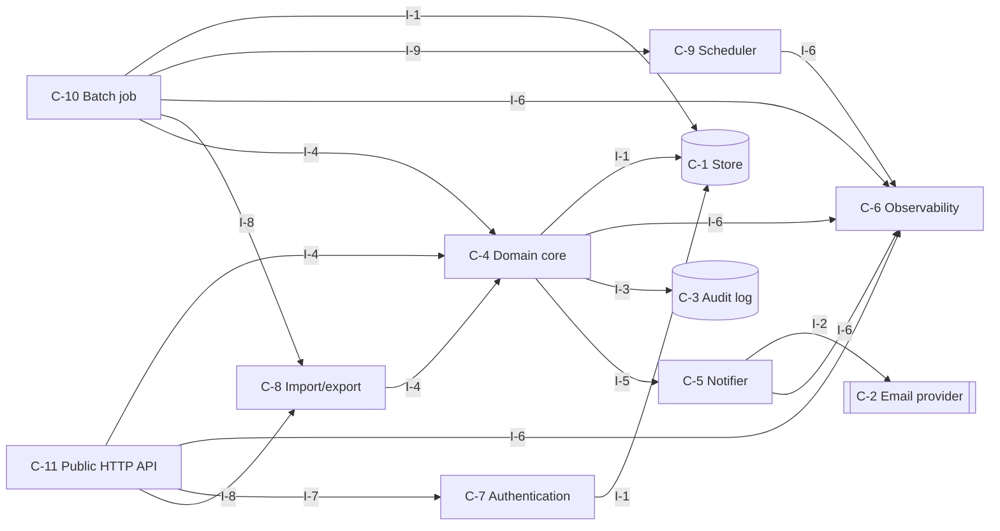
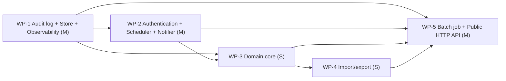

# newsletter-signup — design

Visitors can subscribe with an email address and confirm through a link sent by email.

_version 0.1.0 · schema sekkei/1_

## Goals

- The system notifies people through an external channel.
- Callers are authenticated and authorized.
- Scheduled jobs process stored records in windows.
- Changes are recorded append-only with the actor.
- Records move in and out as files.

## Requirements

| id | kind | priority | statement | metric |
|---|---|---|---|---|
| R-1 | functional | must | Visitors can subscribe with an email address and confirm through a link sent by email. | — |
| R-2 | functional | must | Admins can export the subscriber list as CSV. | — |
| R-3 | functional | must | Personal data is deleted on request within 30 days and access to it is logged (assumed by the engine). | — |
| R-4 | functional | must | Records are retained for 90 days and audit history for 1 year, after which a nightly job deletes them (assumed by the engine). | — |
| R-5 | nonfunctional | should | The system sustains 100 requests/s with peaks of 1,000 requests/s (assumed by the engine). | sustained rate at 1,000 100 requests /s requests /s |
| R-6 | nonfunctional | should | The system holds 10,000 records and serves 1,000 users in the first year (assumed by the engine). | number of records at 1,000 10000 records records |
| R-7 | nonfunctional | should | Records are 2 KB on average and at most 256 KB (assumed by the engine). | size at 2 KB <= 256 kb kb |
| R-8 | nonfunctional | should | Read operations complete within 300 ms p95 and writes within 1 s p95 (assumed by the engine). | p95 latency at 1 s <= 300 ms ms |
| R-9 | nonfunctional | must | Availability of 99.9 % monthly; accepted work is delayed but never lost during an outage (assumed by the engine). | ratio 99.9 % % |
| R-10 | nonfunctional | should | Backups run daily with a recovery point of 24 h and a recovery time of 4 h (assumed by the engine). | time at 4 h 24 h h |
| R-11 | nonfunctional | should | External calls time out after 10 s; failures are retried 5 times with exponential backoff and work waits durably meanwhile (assumed by the engine). | time at 5 10 s s |
| R-12 | constraint | must | Python 3.12 (assumed by the engine). | — |
| R-13 | constraint | must | PostgreSQL available (assumed by the engine). | — |
| R-14 | constraint | must | Deployed as stateless containers behind an ingress (assumed by the engine). | — |
| R-15 | constraint | must | Team of 2 (assumed by the engine). | — |
| R-16 | constraint | must | Authentication by API keys per customer (assumed by the engine). | — |
| R-17 | constraint | must | Use existing infrastructure only; no new managed services (assumed by the engine). | — |
| R-18 | constraint | must | No existing data or system to migrate from (assumed by the engine). | — |

## Components

### C-1 — Store

- **kind**: datastore · **path**: `app/store.py`
- **responsibility**: Owns persistence of the domain entities: durable writes, reads, listing, and the schema/migrations.
- **provides**: I-1
- **requires**: —
- **satisfies**: R-9, R-11, R-13

### C-2 — Email provider

- **kind**: external
- **responsibility**: External email delivery service.
- **provides**: I-2
- **requires**: —
- **satisfies**: R-1

### C-3 — Audit log

- **kind**: datastore · **path**: `app/audit.py`
- **responsibility**: Append-only record of who did what to which resource, queryable by resource and actor.
- **provides**: I-3
- **requires**: —
- **satisfies**: R-3

### C-4 — Domain core

- **kind**: module · **path**: `app/core.py`
- **responsibility**: Business rules and validation for the domain entities; the only module that changes state through the store.
- **provides**: I-4
- **requires**: I-1, I-6, I-3, I-5
- **satisfies**: R-2, R-12, R-15, R-17, R-18

### C-5 — Notifier

- **kind**: module · **path**: `app/notifier.py`
- **responsibility**: Sends operator/customer notifications through the configured channel with templating and rate limiting.
- **provides**: I-5
- **requires**: I-2, I-6
- **satisfies**: R-1

### C-6 — Observability

- **kind**: module · **path**: `app/observability.py`
- **responsibility**: Metrics registry and exposition, structured logging, health/readiness endpoints.
- **provides**: I-6
- **requires**: —
- **satisfies**: R-8, R-9

### C-7 — Authentication

- **kind**: module · **path**: `app/auth.py`
- **responsibility**: Authenticates callers and resolves them to a principal and scope; enforces authorization for management operations.
- **provides**: I-7
- **requires**: I-1
- **satisfies**: R-16

### C-8 — Import/export

- **kind**: module · **path**: `app/exporter.py`
- **responsibility**: Streams records to and from CSV/JSON with validation and partial-failure reporting.
- **provides**: I-8
- **requires**: I-4
- **satisfies**: R-2

### C-9 — Scheduler

- **kind**: job · **path**: `app/scheduler.py`
- **responsibility**: Computes when deferred work runs next (backoff schedules, periodic jobs) and promotes due work.
- **provides**: I-9
- **requires**: I-6
- **satisfies**: R-4

### C-10 — Batch job

- **kind**: job · **path**: `app/batch.py`
- **responsibility**: Scheduled processing over stored records: extract, transform, aggregate, write results.
- **provides**: I-10
- **requires**: I-1, I-9, I-6, I-8, I-4
- **satisfies**: R-4

### C-11 — Public HTTP API

- **kind**: service · **path**: `app/surface_api.py`
- **responsibility**: Translates HTTP requests into core calls: routing, request validation, error mapping, JSON.
- **provides**: I-11
- **requires**: I-4, I-6, I-7, I-8
- **satisfies**: R-5, R-6, R-7, R-8, R-10, R-14

**Layers** (each layer depends only on earlier ones):

0. C-1, C-2, C-3, C-6
1. C-5, C-7, C-9
2. C-4
3. C-8
4. C-10, C-11

## Interfaces

### I-1 — Store interface

- **kind**: class · **owner**: C-1 · **stability**: stable
- Provided by Store. 

| operation | inputs | output | errors | pre / post |
|---|---|---|---|---|
| `save` | `entity`: Entity, `record`: dict | id | ConflictError on duplicate key | record is durable before return |
| `get` | `entity`: Entity, `id`: str | record \| None | — | — |
| `list` | `entity`: Entity, `filter`: dict, `page`: Page | list[record], next page token | — | — |
| `delete` | `entity`: Entity, `id`: str | bool | — | — |

### I-2 — Email provider interface

- **kind**: http · **owner**: C-2 · **stability**: stable
- Provided by Email provider. External; contract is theirs.

| operation | inputs | output | errors | pre / post |
|---|---|---|---|---|
| `send` | `to`: str, `subject`: str, `body`: str | provider message id | — | — |

### I-3 — Audit log interface

- **kind**: class · **owner**: C-3 · **stability**: stable
- Provided by Audit log. 

| operation | inputs | output | errors | pre / post |
|---|---|---|---|---|
| `append` | `actor`: str, `action`: str, `resource`: str, `details`: dict | None | — | — |
| `query` | `resource`: str \| None, `actor`: str \| None, `page`: Page | entries | — | — |

### I-4 — Domain core interface

- **kind**: module · **owner**: C-4 · **stability**: draft
- Provided by Domain core. 

| operation | inputs | output | errors | pre / post |
|---|---|---|---|---|
| `export_subscriber` | `subscriber`: Subscriber \| id | Subscriber \| None | ValidationError, NotFound | — |
| | from R-2: Admins can export the subscriber list as CSV. | | | |
| `list_subscriber` | `subscriber`: Subscriber \| id | Subscriber \| None | ValidationError, NotFound | — |
| | from R-2: Admins can export the subscriber list as CSV. | | | |
| `record_audit` | `audit`: Audit \| id | Audit \| None | ValidationError, NotFound | — |
| | from R-4: Records are retained for 90 days and audit history for 1 year, after which a nightly job d | | | |
| `delete_engine` | `engine`: Engine \| id | Engine \| None | ValidationError, NotFound | — |
| | from R-4: Records are retained for 90 days and audit history for 1 year, after which a nightly job d | | | |

### I-5 — Notifier interface

- **kind**: module · **owner**: C-5 · **stability**: draft
- Provided by Notifier. 

| operation | inputs | output | errors | pre / post |
|---|---|---|---|---|
| `notify` | `recipient`: str, `template`: str, `context`: dict | message id | NotifyError | — |

### I-6 — Observability interface

- **kind**: module · **owner**: C-6 · **stability**: draft
- Provided by Observability. 

| operation | inputs | output | errors | pre / post |
|---|---|---|---|---|
| `counter` | `name`: str, `labels`: dict | Counter | — | — |
| `histogram` | `name`: str, `labels`: dict | Histogram | — | — |
| `gauge` | `name`: str, `labels`: dict | Gauge | — | — |
| `GET /metrics` | — | Prometheus text exposition | — | — |
| `GET /healthz` | — | 200 when dependencies reachable | — | — |
| `log` | `event`: str, `fields`: dict | None | — | — |
| | one JSON line per event | | | |

### I-7 — Authentication interface

- **kind**: module · **owner**: C-7 · **stability**: draft
- Provided by Authentication. 

| operation | inputs | output | errors | pre / post |
|---|---|---|---|---|
| `authenticate` | `credentials`: str | Principal | AuthError | — |
| `authorize` | `principal`: Principal, `action`: str, `resource`: str | None | Forbidden | — |

### I-8 — Import/export interface

- **kind**: module · **owner**: C-8 · **stability**: draft
- Provided by Import/export. 

| operation | inputs | output | errors | pre / post |
|---|---|---|---|---|
| `export` | `entity`: Entity, `filter`: dict, `format`: csv\|json | byte stream | — | — |
| `import_` | `entity`: Entity, `stream`: bytes, `format`: csv\|json | ImportReport with per-row errors | — | — |

### I-9 — Scheduler interface

- **kind**: module · **owner**: C-9 · **stability**: draft
- Provided by Scheduler. 

| operation | inputs | output | errors | pre / post |
|---|---|---|---|---|
| `next_attempt` | `attempt`: int, `retry_after`: timedelta \| None | datetime \| None | — | — |
| | None when attempts are exhausted | | | |
| `promote_due` | `now`: datetime | int moved | — | — |

### I-10 — Batch job interface

- **kind**: module · **owner**: C-10 · **stability**: draft
- Provided by Batch job. 

| operation | inputs | output | errors | pre / post |
|---|---|---|---|---|
| `run` | `window`: DateRange | JobReport | JobError | stated values: 90 days (R-4); 1 year (R-4) |

### I-11 — Public HTTP API interface

- **kind**: http · **owner**: C-11 · **stability**: draft
- Provided by Public HTTP API. 

| operation | inputs | output | errors | pre / post |
|---|---|---|---|---|
| `GET /subscribers` | `filter`: query, `page`: cursor | 200 [subscriber], next cursor | 401 unauthenticated | — |
| | from R-2: Admins can export the subscriber list as CSV. | | | |

## Entities

### E-1 — Principal (owner C-1)

| field | type | constraints |
|---|---|---|
| `id` | uuid | primary key |
| `kind` | enum(customer, operator, service) |  |
| `scopes` | list[str] |  |

### E-2 — JobRun (owner C-1)

| field | type | constraints |
|---|---|---|
| `id` | uuid | primary key |
| `job` | str |  |
| `window_start` | timestamp |  |
| `window_end` | timestamp |  |
| `status` | enum |  |
| `report` | json |  |

### E-3 — AuditEntry (owner C-3)

| field | type | constraints |
|---|---|---|
| `id` | uuid | primary key |
| `actor` | str |  |
| `action` | str |  |
| `resource` | str | indexed |
| `at` | timestamp |  |

## Flows

### F-1 — Run the batch job

_Trigger:_ schedule fires

1. C-10 → C-1 via I-1: read the window of records
2. C-10 → C-1 via I-1: write results and the job report

## Decisions

### D-1 — Caller authentication (accepted)

**Context.** Management operations must be attributable to a customer or operator.

- ✔ **API keys per customer, hashed at rest, sent as a bearer token**
  - + simple
  - + scriptable
  - − no delegation or expiry unless added
- ✘ **OAuth2 / OIDC with the platform's identity provider**
  - + single sign-on
  - + expiry and scopes
  - − integration effort
- ✘ **Mutual TLS**
  - + strong
  - + no secrets in headers
  - − certificate lifecycle for every customer

**Rationale.** Scored against the active qualities; decided by durability (weight 1.0), performance (weight 1.0). API keys per customer, hashed at rest, sent as a: 1.29; Mutual TLS: 0.85; OAuth2 / OIDC with the platform's identity provi: unavailable (needs idp, not in the constraints)

**Consequences.** Not choosing 'Mutual TLS' gives up: strong, no secrets in headers.

_Affects:_ C-7

### D-2 — Primary store (accepted)

**Context.** Domain records need durable, queryable storage.

- ✔ **PostgreSQL**
  - + transactions
  - + indexes and JSON
  - + already available
  - − operational dependency
- ✘ **SQLite**
  - + zero operations
  - + single file
  - − one writer at a time
  - − no network access
- ✘ **Files (JSON/CSV on disk)**
  - + no dependencies
  - + human readable
  - − no transactions or concurrency
- ✘ **In-memory**
  - + fastest
  - + trivial
  - − lost on restart

**Rationale.** Scored against the active qualities; decided by durability (weight 1.0), performance (weight 1.0). PostgreSQL: 3.48; In-memory: 1.18; SQLite: unavailable (ruled out by containers, multi_instance); Files: unavailable (ruled out by containers, multi_instance). stated in the constraints

**Consequences.** Not choosing 'In-memory' gives up: fastest, trivial.

_Affects:_ C-1

### D-3 — Process topology (accepted)

**Context.** The same code base serves requests and performs background work.

- ✔ **One image, role by flag: `api` and `worker` processes scale independently**
  - + stateless containers
  - + independent scaling of ingress and outbound work
  - + one build
  - − two deployables to operate
- ✘ **Single process with background threads**
  - + one deployable
  - − request latency competes with outbound work
  - − cannot scale roles separately
- ✘ **Separate services per concern (ingest, admin, delivery)**
  - + clear ownership
  - − three deployables for a team of three
  - − shared schema anyway

**Rationale.** Scored against the active qualities; decided by durability (weight 1.0), performance (weight 1.0). One image, role by flag: `api` and `worker` proc: 1.84; Separate services per concern: 1.69; Single process with background threads: 1.29

**Consequences.** Not choosing 'Separate services per concern' gives up: clear ownership. Not choosing 'Single process with background threads' gives up: one deployable.

_Affects:_ C-11, C-9

### D-4 — Redundancy for the availability target (accepted)

**Context.** The availability target must be met through instance failures and deploys.

- ✔ **Two or more interchangeable instances per role behind the ingress, health checks, rolling deploys**
  - + survives one instance failure
  - + zero-downtime deploys
  - − needs stateless instances and a shared store
- ✘ **Single instance with health-based restart**
  - + simplest
  - + cheapest
  - − restart time is downtime
  - − deploys are downtime
- ✘ **Active-active across two regions**
  - + survives a regional outage
  - − data replication and conflict handling
  - − cost

**Rationale.** Scored against the active qualities; decided by durability (weight 1.0), performance (weight 1.0). Two or more interchangeable instances per role b: 1.84; Active-active across two regions: 1.54; Single instance with health-based restart: 1.29

**Consequences.** Not choosing 'Active-active across two regions' gives up: survives a regional outage. Not choosing 'Single instance with health-based restart' gives up: simplest, cheapest.

_Affects:_ C-11

### D-5 — Assumed answer: stack (Q-lang) (proposed)

**Context.** The requirements do not say. Question: Q-lang. No evidence in the text; engine default.

- ✔ **Python 3.12**
- ✘ **TypeScript on Node 20**
- ✘ **Go 1.22**

**Rationale.** No language stated; Python has the shortest path for a small team and the engine's richest layout.

**Consequences.** If the real answer differs: Change the language line; every work package's files and test commands follow.

### D-6 — Assumed answer: stack (Q-store) (proposed)

**Context.** The requirements do not say. Question: Q-store. No evidence in the text; engine default.

- ✔ **PostgreSQL**
- ✘ **SQLite**
- ✘ **MySQL**

**Rationale.** A networked service with several actors favour a transactional server database; PostgreSQL is the engine's default when none is stated.

**Consequences.** If the real answer differs: State the available database; the Primary store and Work queue decisions are rescored.

_Affects:_ C-1

### D-7 — Assumed answer: stack (Q-deploy) (proposed)

**Context.** The requirements do not say. Question: Q-deploy. No evidence in the text; engine default.

- ✔ **containers behind an ingress**
- ✘ **single VM**
- ✘ **serverless functions**

**Rationale.** The default for a networked service; keeps instances interchangeable.

**Consequences.** If the real answer differs: State the deployment; topology, statelessness conventions and store options change.

_Affects:_ C-11

### D-8 — Assumed answer: people (Q-team) (proposed)

**Context.** The requirements do not say. Question: Q-team. No evidence in the text; engine default.

- ✔ **team of 2**
- ✘ **team of 1**
- ✘ **team of 5**

**Rationale.** No team stated; two people is the smallest team that can review each other's work. Simplicity is weighted accordingly.

**Consequences.** If the real answer differs: State the team size; decision weights and the schedule change.

### D-9 — Assumed answer: load (Q-rate) (proposed)

**Context.** The requirements do not say. Question: Q-rate. No evidence in the text; engine default.

- ✔ **100 requests/s**
- ✘ **10 requests/s**
- ✘ **1,000 requests/s**

**Rationale.** No rate or count stated; 100 requests/s is a modest default for a first release.

**Consequences.** If the real answer differs: State the measured or expected rate; capacity estimates and the queue decision change.

_Affects:_ C-11

### D-10 — Assumed answer: load (Q-volume) (proposed)

**Context.** The requirements do not say. Question: Q-volume. No evidence in the text; engine default.

- ✔ **10,000 records / 1,000 users**
- ✘ **100,000 / 10,000**
- ✘ **1,000 / 100**

**Rationale.** No counts stated; the default keeps single-instance options viable and is easy to revise.

**Consequences.** If the real answer differs: State the counts; isolation and capacity estimates change.

_Affects:_ C-1

### D-11 — Assumed answer: load (Q-payload) (proposed)

**Context.** The requirements do not say. Question: Q-payload. No evidence in the text; engine default.

- ✔ **2 KB / 256 KB**
- ✘ **16 KB / 1 MB**
- ✘ **256 bytes / 4 KB**

**Rationale.** Typical JSON record sizes; the maximum bounds request bodies.

**Consequences.** If the real answer differs: State the sizes; storage growth and body limits change.

_Affects:_ C-11

### D-12 — Assumed answer: quality (Q-latency) (proposed)

**Context.** The requirements do not say. Question: Q-latency. No evidence in the text; engine default.

- ✔ **300 ms / 1 s**
- ✘ **100 ms / 500 ms**
- ✘ **1 s / 5 s**

**Rationale.** Common interactive-API targets; measurable from day one.

**Consequences.** If the real answer differs: State the target; the metric acceptance checks change.

_Affects:_ C-11

### D-13 — Assumed answer: quality (Q-availability) (proposed)

**Context.** The requirements do not say. Question: Q-availability. No evidence in the text; engine default.

- ✔ **99.9 %**
- ✘ **99.5 %**
- ✘ **99.99 %**

**Rationale.** Three nines is achievable with two instances and health-based restarts; anything higher needs multi-region.

**Consequences.** If the real answer differs: State the target and what may be lost; topology and queue durability change.

_Affects:_ C-6

### D-14 — Assumed answer: data (Q-backup) (proposed)

**Context.** The requirements do not say. Question: Q-backup. No evidence in the text; engine default.

- ✔ **daily / 24 h / 4 h**
- ✘ **hourly / 1 h / 1 h**
- ✘ **none**

**Rationale.** The store's own daily backup is the cheapest credible baseline.

**Consequences.** If the real answer differs: State RPO/RTO; the store decision and a restore drill change.

_Affects:_ C-1

### D-15 — Assumed answer: security (Q-auth) (proposed)

**Context.** The requirements do not say. Question: Q-auth. Evidence: customers/visitors mentioned.

- ✔ **API keys**
- ✘ **OIDC**
- ✘ **mTLS**

**Rationale.** External callers without a stated identity provider are simplest to serve with per-customer keys.

**Consequences.** If the real answer differs: State the scheme; the authentication decision is rescored.

_Affects:_ C-7

### D-16 — Assumed answer: resilience (Q-external) (proposed)

**Context.** The requirements do not say. Question: Q-external. No evidence in the text; engine default.

- ✔ **10 s / 5 retries / queue**
- ✘ **fail fast, no retry**
- ✘ **30 s / unlimited retries**

**Rationale.** Bounded retries with a durable queue keep the system responsive during a one-hour outage.

**Consequences.** If the real answer differs: State the policy; the outbound client and scheduler contracts change.

_Affects:_ C-9

### D-17 — Assumed answer: compliance (Q-compliance) (proposed)

**Context.** The requirements do not say. Question: Q-compliance. Evidence: personal data mentioned.

- ✔ **GDPR-style deletion + audit**
- ✘ **no regime**
- ✘ **HIPAA/PCI controls**

**Rationale.** Email addresses or names are personal data almost everywhere; deletion on request is the common denominator.

**Consequences.** If the real answer differs: State the regime; audit and deletion paths change.

_Affects:_ C-3, C-1

### D-18 — Assumed answer: cost (Q-budget) (proposed)

**Context.** The requirements do not say. Question: Q-budget. No evidence in the text; engine default.

- ✔ **existing only**
- ✘ **managed services allowed**
- ✘ **strict monthly cap**

**Rationale.** The cheapest assumption; every decision already prefers the option needing no new infrastructure.

**Consequences.** If the real answer differs: State the budget; options adding infrastructure become available.

### D-19 — Assumed answer: data (Q-retention) (proposed)

**Context.** The requirements do not say. Question: Q-retention. No evidence in the text; engine default.

- ✔ **90 days / 1 year**
- ✘ **30 days / 90 days**
- ✘ **indefinite**

**Rationale.** Bounded retention limits storage growth and satisfies most data-minimisation rules.

**Consequences.** If the real answer differs: State the retention; the deletion job and capacity change.

_Affects:_ C-10, C-1

### D-20 — Assumed answer: data (Q-migration) (proposed)

**Context.** The requirements do not say. Question: Q-migration. No evidence in the text; engine default.

- ✔ **greenfield**
- ✘ **one-shot import**
- ✘ **gradual cut-over**

**Rationale.** Nothing in the text names an existing system.

**Consequences.** If the real answer differs: Name the existing system; a migration package and risk are added.

## Risks

| id | risk | likelihood | impact | mitigation |
|---|---|---|---|---|
| K-1 | A widespread failure disables many targets and emails every owner at once. | low | medium | Rate-limit notifications per owner and batch them. |
| K-2 | A management operation reachable without authentication. | low | high | Authenticate in one middleware for every management route; test every route unauthenticated. |
| K-3 | Entities evolve; migrations run against live data. | medium | medium | Versioned migrations applied before deploy; additive changes first, removals one release later. |
| K-4 | Payloads or uploads without size limits exhaust memory or disk. | medium | medium | Enforce size limits at the surface; reject early with a clear error. |
| K-5 | [tampering] Store: Injection through query construction. | medium | medium | Parameterised queries only; no string-built SQL. Check: static check for string-formatted SQL finds nothing |
| K-6 | [information_disclosure] Store: Backups and dumps contain everything. | medium | high | Encrypt backups; restrict who can take them. Check: backup file is not readable without the key |
| K-7 | [denial_of_service] Notifier: Notification storms and template injection. | medium | medium | Rate-limit per recipient; escape template context. Check: 1,000 failures produce one digest per owner |
| K-8 | [spoofing] Authentication: Credential stuffing or leaked keys. | medium | medium | Hash keys at rest; allow revocation; rate-limit failures. Check: revoked key is rejected within seconds; brute force is throttled |
| K-9 | [elevation] Authentication: A caller acts on another tenant's resources. | medium | high | Every core operation takes the principal and checks ownership. Check: cross-tenant request returns 404/403 for every operation |
| K-10 | [spoofing] Public HTTP API: Requests without a verified caller identity reach domain operations. | medium | medium | Authenticate every route in one middleware; deny by default. Check: every route returns 401 without credentials |
| K-11 | [tampering] Public HTTP API: Malformed or oversized bodies reach the core. | medium | medium | Schema-validate and size-limit at the surface; reject before parsing fully. Check: fuzz the body; oversize returns 413 |
| K-12 | [denial_of_service] Public HTTP API: A single caller saturates the service. | medium | medium | Per-caller rate limit and request timeouts. Check: burst from one key returns 429; others unaffected |
| K-13 | [information_disclosure] Public HTTP API: Stack traces or internal ids leak in error responses. | medium | high | Map exceptions to fixed error shapes; log details server-side only. Check: no traceback text in any 4xx/5xx body |

## Work packages

**Waves** (packages in one wave may run in parallel):

1. WP-1
2. WP-2
3. WP-3
4. WP-4
5. WP-5

_Critical path (weight 8):_ WP-1 → WP-2 → WP-3 → WP-4 → WP-5

### WP-1 — Audit log + Store + Observability (M)

Implement Audit log: Append-only record of who did what to which resource, queryable by resource and actor; Store: Owns persistence of the domain entities: durable writes, reads, listing, and the schema/migrations; Observability: Metrics registry and exposition, structured logging, health/readiness endpoints.

- **components**: C-3, C-1, C-6 · **implements**: I-3, I-1, I-6
- **depends on**: — · **satisfies**: R-3, R-8, R-9, R-11, R-13
- **write scope**: `app/audit.py`, `tests/test_audit.py`, `app/store.py`, `tests/test_store.py`, `app/observability.py`, `tests/test_observability.py`
- **acceptance**:
  - A-1 (test) unit tests of Audit log, Store, Observability pass — `python -m pytest -q tests/test_audit.py tests/test_store.py tests/test_observability.py`
  - A-2 (metric) R-8: p95 latency at 1 s <= 300 ms ms — load test at the stated rate; the stated percentile must meet the target — metric R-8
  - A-3 (metric) R-9: ratio 99.9 % % — crash/kill test: no accepted item is lost and none is delivered without a durable record — metric R-9
  - A-4 (metric) R-11: time at 5 10 s s — crash/kill test: no accepted item is lost and none is delivered without a durable record — metric R-11
- **notes**: family: audit_log

### WP-2 — Authentication + Scheduler + Notifier (M)

Implement Authentication: Authenticates callers and resolves them to a principal and scope; enforces authorization for management operations; Scheduler: Computes when deferred work runs next (backoff schedules, periodic jobs) and promotes due work; Notifier: Sends operator/customer notifications through the configured channel with templating and rate limiting.

- **components**: C-7, C-9, C-5 · **implements**: I-7, I-9, I-5
- **depends on**: WP-1 · **satisfies**: R-1, R-4, R-16
- **write scope**: `app/auth.py`, `tests/test_auth.py`, `app/scheduler.py`, `tests/test_scheduler.py`, `app/notifier.py`, `tests/test_notifier.py`
- **acceptance**:
  - A-5 (test) unit tests of Authentication, Scheduler, Notifier pass — `python -m pytest -q tests/test_auth.py tests/test_scheduler.py tests/test_notifier.py`
- **notes**: family: auth

### WP-3 — Domain core (S)

Implement Domain core: Business rules and validation for the domain entities; the only module that changes state through the store.

- **components**: C-4 · **implements**: I-4
- **depends on**: WP-1, WP-2 · **satisfies**: R-2, R-12, R-15, R-17, R-18
- **write scope**: `app/core.py`, `tests/test_core.py`
- **acceptance**:
  - A-6 (test) unit tests of Domain core pass — `python -m pytest -q tests/test_core.py`
- **notes**: family: import_export

### WP-4 — Import/export (S)

Implement Import/export: Streams records to and from CSV/JSON with validation and partial-failure reporting.

- **components**: C-8 · **implements**: I-8
- **depends on**: WP-3 · **satisfies**: R-2
- **write scope**: `app/exporter.py`, `tests/test_exporter.py`
- **acceptance**:
  - A-7 (test) unit tests of Import/export pass — `python -m pytest -q tests/test_exporter.py`
- **notes**: family: import_export

### WP-5 — Batch job + Public HTTP API (M)

Implement Batch job: Scheduled processing over stored records: extract, transform, aggregate, write results; Public HTTP API: Translates HTTP requests into core calls: routing, request validation, error mapping, JSON.

- **components**: C-10, C-11 · **implements**: I-10, I-11
- **depends on**: WP-1, WP-2, WP-3, WP-4 · **satisfies**: R-4, R-5, R-6, R-7, R-8, R-10, R-14
- **write scope**: `app/batch.py`, `tests/test_batch.py`, `app/surface_api.py`, `tests/test_surface_api.py`
- **acceptance**:
  - A-8 (test) unit tests of Batch job, Public HTTP API pass — `python -m pytest -q tests/test_batch.py tests/test_surface_api.py`
  - A-9 (metric) R-5: sustained rate at 1,000 100 requests /s requests /s — load test at the stated rate; the stated percentile must meet the target — metric R-5
  - A-10 (metric) R-6: number of records at 1,000 10000 records records — metric R-6
  - A-11 (metric) R-7: size at 2 KB <= 256 kb kb — metric R-7
  - A-12 (metric) R-8: p95 latency at 1 s <= 300 ms ms — load test at the stated rate; the stated percentile must meet the target — metric R-8
  - A-13 (metric) R-10: time at 4 h 24 h h — metric R-10
- **notes**: family: batch_pipeline

## Traceability

| requirement | priority | components | work packages | acceptance |
|---|---|---|---|---|
| R-1 | must | C-2, C-5 | WP-2 | A-5 |
| R-2 | must | C-4, C-8 | WP-3, WP-4 | A-6, A-7 |
| R-3 | must | C-3 | WP-1 | A-1, A-2, A-3, A-4 |
| R-4 | must | C-9, C-10 | WP-2, WP-5 | A-5, A-8, A-9, A-10, A-11, A-12, A-13 |
| R-5 | should | C-11 | WP-5 | A-8, A-9, A-10, A-11, A-12, A-13 |
| R-6 | should | C-11 | WP-5 | A-8, A-9, A-10, A-11, A-12, A-13 |
| R-7 | should | C-11 | WP-5 | A-8, A-9, A-10, A-11, A-12, A-13 |
| R-8 | should | C-6, C-11 | WP-1, WP-5 | A-1, A-2, A-3, A-4, A-8, A-9, A-10, A-11, A-12, A-13 |
| R-9 | must | C-1, C-6 | WP-1 | A-1, A-2, A-3, A-4 |
| R-10 | should | C-11 | WP-5 | A-8, A-9, A-10, A-11, A-12, A-13 |
| R-11 | should | C-1 | WP-1 | A-1, A-2, A-3, A-4 |
| R-12 | must | C-4 | WP-3 | A-6 |
| R-13 | must | C-1 | WP-1 | A-1, A-2, A-3, A-4 |
| R-14 | must | C-11 | WP-5 | A-8, A-9, A-10, A-11, A-12, A-13 |
| R-15 | must | C-4 | WP-3 | A-6 |
| R-16 | must | C-7 | WP-2 | A-5 |
| R-17 | must | C-4 | WP-3 | A-6 |
| R-18 | must | C-4 | WP-3 | A-6 |

## Conventions

- **language**: python
- **test**: `python -m pytest -q`
- **lint**: `ruff check .`
- Type hints on every public function; dataclasses or pydantic for records.
- No business logic in the HTTP layer.
- No in-process state that a second instance would not see; instances are interchangeable.
- Prefer the boring option; a new piece of infrastructure needs a decision record.
- Python 3.12 as stated in the constraints.
- Stateless processes: configuration from the environment, no local files that a second instance would not see.

**Definition of done**

- Acceptance checks of the package pass.
- No file outside the write scope changed.
- Every public operation of the implemented interfaces exists with the declared inputs.
