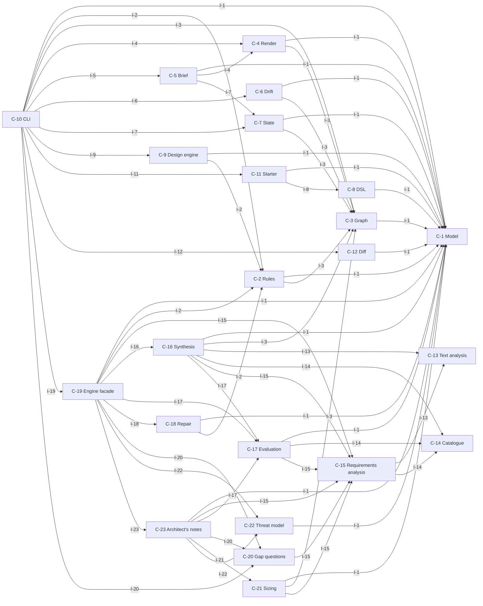
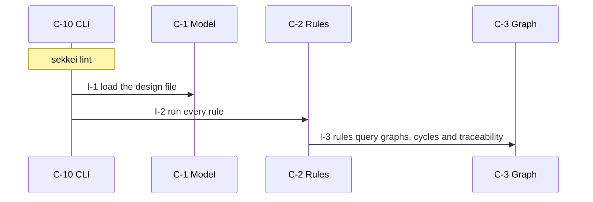
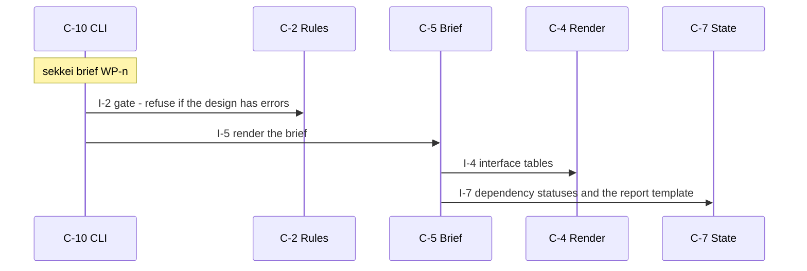
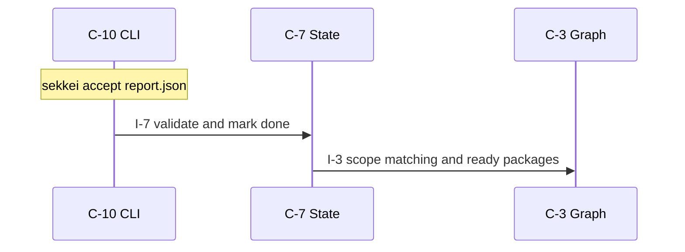
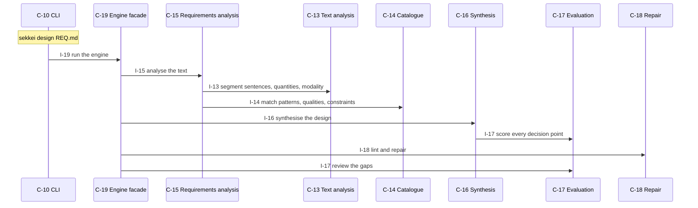
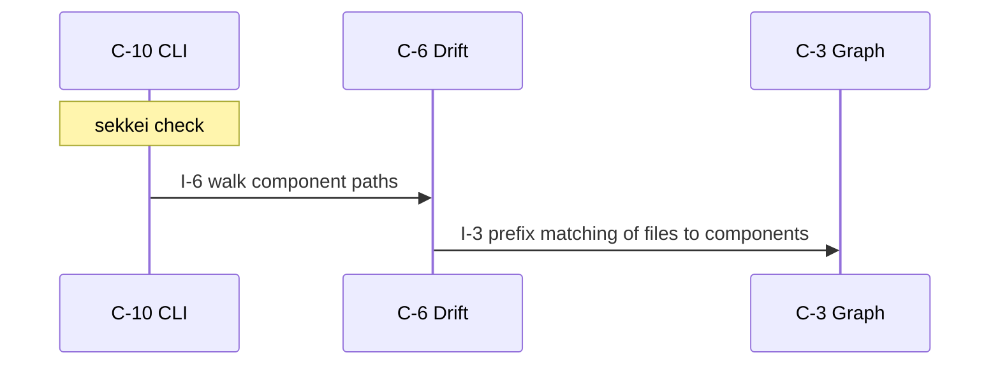
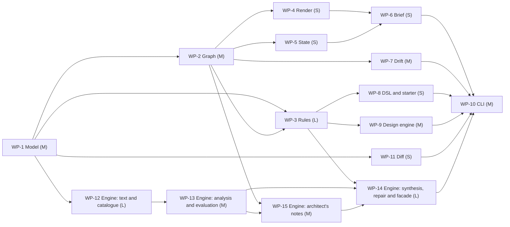

# sekkei — design

A design-first harness for LLM coding agents: a checkable architecture graph, a deterministic linter, self-contained work-package briefs, a plan, and drift checks against the code.

_version 0.1.0 · schema sekkei/1_

## Goals

- A design schema rich enough for real systems and small enough for an LLM to emit correctly.
- Every lint rule deterministic, identified, and covered by a planted-defect test.
- Briefs that let one agent implement one package without reading the rest of the design.
- A closed loop: brief, implementation, completion report, acceptance, next packages.

**Non-goals**

- Generating application code.
- Orchestrating agents.
- Conversational requirements elicitation.

## Requirements

| id | kind | priority | statement | metric |
|---|---|---|---|---|
| R-1 | functional | must | The design file describes requirements, components, interfaces with operations, entities, flows, decisions, risks, work packages and acceptance checks, and round-trips through JSON without loss. | — |
| R-2 | functional | must | Every lint rule is deterministic, has a stable id, a fixed severity and a fix hint, and is covered by a planted-defect test that the meta-test enforces. | — |
| R-3 | functional | must | A brief for a work package contains its goal, the requirements it satisfies verbatim, the contracts it implements, the contracts it consumes, its write scope, the conventions, its acceptance checks and the completion-report template, and nothing about other packages. | — |
| R-4 | functional | must | The plan orders work packages into waves such that every package's dependencies lie in earlier waves, and reports the size-weighted critical path. | — |
| R-5 | functional | must | For Python code the drift check reports missing component paths, missing operations, parameter mismatches and undeclared imports between components. | — |
| R-6 | functional | must | A completion report is accepted only if every acceptance check of the package passed and every touched file is inside the package's write scope; acceptance unlocks dependents. | — |
| R-7 | constraint | must | No runtime dependency outside the Python standard library; Python 3.11 or newer. | — |
| R-8 | nonfunctional | should | Linting and drift-checking this repository's own design finishes fast enough to run on every commit. | wall time of `sekkei lint` plus `sekkei check` on examples/self on a laptop <= 1 s |
| R-9 | functional | should | A human can author a design in a small Python DSL that yields the same model as the JSON. | — |
| R-10 | functional | should | sekkei designs from a requirements text: it drafts a design with a model, feeds lint diagnostics back until clean, has the model review the design against a senior-architect checklist, revises, and lints again; the model runs through the local Claude Code CLI (no API key) or the anthropic SDK. | — |
| R-11 | functional | must | A command line exposes every operation with a default design file, JSON output where an orchestrator would consume it, and exit code 1 on errors. | — |
| R-12 | functional | must | Two versions of a design can be compared, listing added, removed and changed elements and the work packages whose briefs became stale; a completion report against a stale brief is rejected unless forced. | — |
| R-13 | functional | must | sekkei designs a system from a requirements text without any model: it segments the text into requirement units with their numbers, recognises capability patterns and quality attributes from a catalogue, synthesises components, interfaces with operations, entities, flows, decisions, risks and work packages, scores every decision against the active qualities and constraints, repairs and lints the result, and reviews its own gaps. | — |
| R-14 | nonfunctional | must | The design engine is deterministic: the same requirements text yields byte-identical output. | designs from two runs on the same text that differ = 0 designs |
| R-15 | functional | must | Every element of a generated design traces to the input sentences and the catalogue rules that produced it, and the engine states which requirements it did not recognise instead of hiding them. | — |
| R-16 | functional | must | Besides the design, the engine hands over an architect's notes: the questions the text leaves open with the assumption taken meanwhile, capacity estimates with formulas and inputs, an effort and schedule estimate, a STRIDE-lite threat model whose threats become risks in the design, and a requirements template. | — |

## Components



### C-1 — Model

- **kind**: module · **path**: `sekkei/model.py`
- **responsibility**: Dataclasses for the design, tolerant JSON loading, serialisation and the JSON Schema.
- **provides**: I-1
- **requires**: —
- **satisfies**: R-1, R-7

### C-2 — Rules

- **kind**: module · **path**: `sekkei/rules.py`
- **responsibility**: The deterministic lint rules and the diagnostic type.
- **provides**: I-2
- **requires**: I-1, I-3
- **satisfies**: R-2

### C-3 — Graph

- **kind**: module · **path**: `sekkei/graph.py`
- **responsibility**: Dependency graphs, cycle detection, waves, critical path, traceability, scope matching.
- **provides**: I-3
- **requires**: I-1
- **satisfies**: R-4

### C-4 — Render

- **kind**: module · **path**: `sekkei/render.py`
- **responsibility**: DESIGN.md, Mermaid/DOT graphs and the traceability matrix.
- **provides**: I-4
- **requires**: I-1, I-3
- **satisfies**: R-1

### C-5 — Brief

- **kind**: module · **path**: `sekkei/brief.py`
- **responsibility**: Self-contained work-package briefs, their fingerprint, and the report template.
- **provides**: I-5
- **requires**: I-1, I-4, I-7
- **satisfies**: R-3, R-12

### C-6 — Drift

- **kind**: module · **path**: `sekkei/drift.py`
- **responsibility**: Design-versus-code checks over Python sources using ast.
- **provides**: I-6
- **requires**: I-1, I-3
- **satisfies**: R-5

### C-7 — State

- **kind**: module · **path**: `sekkei/state.py`
- **responsibility**: Progress state in .sekkei/state.json, brief fingerprints, and completion-report acceptance.
- **provides**: I-7
- **requires**: I-1, I-3
- **satisfies**: R-6, R-12

### C-8 — DSL

- **kind**: module · **path**: `sekkei/dsl.py`
- **responsibility**: Python builder for authoring designs by hand.
- **provides**: I-8
- **requires**: I-1
- **satisfies**: R-9

### C-9 — Design engine

- **kind**: module · **path**: `sekkei/llm.py`
- **responsibility**: Model backends (Claude Code CLI, anthropic SDK, fake), the architect and review prompts, and the draft/review/revise pipeline.
- **provides**: I-9
- **requires**: I-1, I-2
- **satisfies**: R-10

### C-10 — CLI

- **kind**: cli · **path**: `sekkei/cli.py`
- **responsibility**: argparse front end over every module.
- **provides**: I-10
- **requires**: I-1, I-2, I-3, I-4, I-5, I-6, I-7, I-9, I-11, I-12, I-19, I-20
- **satisfies**: R-11, R-8

### C-11 — Starter

- **kind**: module · **path**: `sekkei/examples.py`
- **responsibility**: The example design written by `sekkei init`.
- **provides**: I-11
- **requires**: I-1, I-8
- **satisfies**: R-11

### C-12 — Diff

- **kind**: module · **path**: `sekkei/diff.py`
- **responsibility**: Element-level comparison of two design versions and the packages they affect.
- **provides**: I-12
- **requires**: I-1
- **satisfies**: R-12

### C-13 — Text analysis

- **kind**: module · **path**: `sekkei/engine/text.py`
- **responsibility**: Sentence segmentation, sections, modality, the quantity grammar, actors, verbs and nouns.
- **provides**: I-13
- **requires**: —
- **satisfies**: R-13

### C-14 — Catalogue

- **kind**: module · **path**: `sekkei/engine/catalog.py`
- **responsibility**: The knowledge base: archetypes, entity and flow templates, decision points with scored options, risks, capability patterns with signals, quality tactics, constraint tokens and language layouts.
- **provides**: I-14
- **requires**: —
- **satisfies**: R-13

### C-15 — Requirements analysis

- **kind**: module · **path**: `sekkei/engine/analysis.py`
- **responsibility**: Turns sentences into requirement units (kind, priority, metric), matches patterns and qualities, extracts constraints, and lists what was not recognised.
- **provides**: I-15
- **requires**: I-13, I-14
- **satisfies**: R-13, R-15

### C-16 — Synthesis

- **kind**: module · **path**: `sekkei/engine/synthesis.py`
- **responsibility**: Instantiates and merges archetypes into components and interfaces, derives operations from verbs and objects, maps requirements to components, builds entities, flows, decisions, risks, conventions and work packages; records the trace.
- **provides**: I-16
- **requires**: I-1, I-3, I-13, I-14, I-15, I-17
- **satisfies**: R-13, R-15

### C-17 — Evaluation

- **kind**: module · **path**: `sekkei/engine/evaluate.py`
- **responsibility**: Scores decision options against the active qualities and constraints (utility with availability rules and stated-technology bonus) and writes the engine's review of its own gaps.
- **provides**: I-17
- **requires**: I-1, I-14, I-15
- **satisfies**: R-13, R-15

### C-18 — Repair

- **kind**: module · **path**: `sekkei/engine/repair.py`
- **responsibility**: Runs the linter over the synthesised design and applies the few repairs synthesis may make.
- **provides**: I-18
- **requires**: I-1, I-2
- **satisfies**: R-13

### C-19 — Engine facade

- **kind**: module · **path**: `sekkei/engine/__init__.py`
- **responsibility**: design(text): analyse, synthesise, inject threats, repair, review, notes; ask(text): questions only.
- **provides**: I-19
- **requires**: I-1, I-2, I-15, I-16, I-17, I-18, I-20, I-22, I-23
- **satisfies**: R-13, R-14, R-15, R-16

### C-20 — Gap questions

- **kind**: module · **path**: `sekkei/engine/gaps.py`
- **responsibility**: The questions an architect asks before committing, derived from what the text does not say, each with the assumption used meanwhile.
- **provides**: I-20
- **requires**: I-15
- **satisfies**: R-16

### C-21 — Sizing

- **kind**: module · **path**: `sekkei/engine/sizing.py`
- **responsibility**: Capacity estimates (Little's law, storage, backlog) and effort/schedule from package sizes and team size, with every assumption stated.
- **provides**: I-21
- **requires**: I-1, I-3, I-15
- **satisfies**: R-16

### C-22 — Threat model

- **kind**: module · **path**: `sekkei/engine/threats.py`
- **responsibility**: STRIDE-lite threats per archetype, injected into the design as risks with mitigations and proofs.
- **provides**: I-22
- **requires**: I-1
- **satisfies**: R-16

### C-23 — Architect's notes

- **kind**: module · **path**: `sekkei/engine/report.py`
- **responsibility**: Assembles questions, capacity, effort, threats, the self-review and the reading of the text into one Markdown report; holds the requirements template.
- **provides**: I-23
- **requires**: I-1, I-15, I-17, I-20, I-21, I-22
- **satisfies**: R-16

**Layers** (each layer depends only on earlier ones):

0. C-1, C-13, C-14
1. C-12, C-15, C-22, C-3, C-8
2. C-11, C-17, C-2, C-20, C-21, C-4, C-6, C-7
3. C-16, C-18, C-23, C-5, C-9
4. C-19
5. C-10

## Interfaces

### I-1 — Model API

- **kind**: module · **owner**: C-1 · **stability**: stable

| operation | inputs | output | errors | pre / post |
|---|---|---|---|---|
| `from_dict` | `data`: dict | Design | DesignError on type mismatch | unknown keys are recorded in Design.unknown_keys |
| `to_dict` | `obj`: Any | JSON-compatible data | — | — |
| `loads` | `text`: str | Design | DesignError on invalid JSON | — |
| `load` | `path`: str \| Path | Design | DesignError, FileNotFoundError | — |
| `dumps` | `design`: Design | str | — | — |
| `dump` | `design`: Design, `path`: str \| Path | None | — | — |
| `json_schema` | — | dict (JSON Schema draft 2020-12) | — | — |

### I-2 — Rules API

- **kind**: module · **owner**: C-2 · **stability**: stable

| operation | inputs | output | errors | pre / post |
|---|---|---|---|---|
| `lint` | `design`: Design, `disable`: Iterable[str], `strict`: bool | list[Diagnostic] sorted by severity, rule, where | — | — |
| `has_errors` | `diags`: Iterable[Diagnostic] | bool | — | — |
| `summary` | `diags`: Iterable[Diagnostic] | dict severity -> count | — | — |
| `format_text` | `diags`: list[Diagnostic], `hints`: bool | str | — | — |
| `rule_table` | — | Markdown table of all rules | — | — |

### I-3 — Graph API

- **kind**: module · **owner**: C-3 · **stability**: stable

| operation | inputs | output | errors | pre / post |
|---|---|---|---|---|
| `component_graph` | `design`: Design | dict[str, set[str]] | — | — |
| `package_graph` | `design`: Design | dict[str, set[str]] | — | — |
| `implied_package_edges` | `design`: Design | list[(from, to, interface)] | — | — |
| `find_cycle` | `g`: Graph | list[str] \| None | — | — |
| `waves` | `g`: Graph | list[list[str]] | ValueError on a cycle | — |
| `critical_path` | `design`: Design | (weight, [package ids]) | — | — |
| `ready_packages` | `design`: Design, `done`: Iterable[str] | list[str] | — | — |
| `traceability` | `design`: Design | dict requirement -> {components, packages, acceptance} | — | — |
| `in_scope` | `path`: str, `scope_entry`: str | bool | — | — |
| `transitive` | `g`: Graph, `start`: str | set[str] | — | — |
| `layers` | `design`: Design | list[list[str]] | — | — |

### I-4 — Render API

- **kind**: module · **owner**: C-4 · **stability**: draft

| operation | inputs | output | errors | pre / post |
|---|---|---|---|---|
| `render_markdown` | `design`: Design | str | — | — |
| `mermaid` | `design`: Design, `which`: 'components' \| 'packages' | str | — | — |
| `dot` | `design`: Design, `which`: 'components' \| 'packages' | str | — | — |
| `traceability_markdown` | `design`: Design | str | — | — |
| `interface_table` | `iface`: Interface | Markdown table | — | — |
| `sequence` | `design`: Design, `flow_id`: str | Mermaid sequenceDiagram of one flow | KeyError for an unknown flow | — |

### I-5 — Brief API

- **kind**: module · **owner**: C-5 · **stability**: draft

| operation | inputs | output | errors | pre / post |
|---|---|---|---|---|
| `render_brief` | `design`: Design, `wp_id`: str, `state`: State \| None | str | KeyError for an unknown package | — |
| `brief_fingerprint` | `design`: Design, `wp_id`: str | 16-hex-digit hash of the design-derived brief content | — | — |

### I-6 — Drift API

- **kind**: module · **owner**: C-6 · **stability**: draft

| operation | inputs | output | errors | pre / post |
|---|---|---|---|---|
| `check` | `design`: Design, `root`: str \| Path | list[Finding] | — | — |
| `scope_violations` | `design`: Design, `wp_id`: str, `files`: Iterable[str] | list[str] | — | — |
| `format_findings` | `findings`: list[Finding] | str | — | — |
| `has_errors` | `findings`: Iterable[Finding] | bool | — | — |

### I-7 — State API

- **kind**: module · **owner**: C-7 · **stability**: draft

| operation | inputs | output | errors | pre / post |
|---|---|---|---|---|
| `State` | — | class: load(root), save(), status(wp), done(), set_status(wp, status, report), record_brief(wp, fp), is_stale(wp, fp) | — | — |
| `report_template` | `design`: Design, `wp_id`: str | dict | — | — |
| `validate_report` | `design`: Design, `report`: dict | list[str] problems (empty = acceptable) | — | — |
| `accept` | `design`: Design, `state`: State, `report`: dict, `fingerprint`: str \| None, `force`: bool | list[str] problems; rejects a stale brief unless force; on success marks done and saves | — | — |
| `next_packages` | `design`: Design, `state`: State | list[str] | — | — |
| `status_table` | `design`: Design, `state`: State | Markdown table | — | — |

### I-8 — DSL

- **kind**: module · **owner**: C-8 · **stability**: draft

| operation | inputs | output | errors | pre / post |
|---|---|---|---|---|
| `DesignBuilder` | — | class with requirement/component/interface/.../work_package/build/save | — | — |
| `op` | `name`: str, `inputs`: Sequence, `output`: str, `errors`: Sequence[str] | Operation | — | — |
| `check` | `id_`: str, `description`: str, `kind`: str, `command`: str, `metric`: str | Acceptance | — | — |
| `option` | `name`: str, `pros`: Sequence[str], `cons`: Sequence[str] | Option | — | — |
| `load_python` | `path`: str \| Path | Design | ValueError if the file defines neither `design` nor `build()` | — |

### I-9 — Model drafting API

- **kind**: module · **owner**: C-9 · **stability**: draft

| operation | inputs | output | errors | pre / post |
|---|---|---|---|---|
| `get_backend` | `name`: str \| None, `model`: str \| None | Backend (claude-code \| anthropic) | RuntimeError if none is available | — |
| `architect_prompt` | `include_schema`: bool, `include_rules`: bool | str | — | — |
| `draft` | `requirements_text`: str, `backend`: Backend, `rounds`: int | DraftResult | RuntimeError from the backend | — |
| `review` | `design`: Design, `requirements_text`: str, `backend`: Backend | list[ReviewFinding] | — | — |
| `revise` | `design`: Design, `findings`: list[ReviewFinding], `requirements_text`: str, `backend`: Backend, `rounds`: int | DraftResult | — | — |
| `design` | `requirements_text`: str, `backend`: Backend, `rounds`: int, `review_rounds`: int | DesignResult | — | — |
| `extract_json` | `text`: str | dict | DesignError if no JSON object | — |

### I-13 — Text analysis API

- **kind**: module · **owner**: C-13 · **stability**: stable

| operation | inputs | output | errors | pre / post |
|---|---|---|---|---|
| `segment` | `text`: str | list[Sentence] with section, modality, quantities, actors, verbs, nouns | — | — |
| `quantities` | `text`: str | list[Quantity] (rate \| latency \| duration \| count \| size \| percent \| factor \| code \| number) | — | — |
| `modality` | `text`: str | 'must' \| 'should' \| 'could' \| '' | — | — |
| `tokens` | `text`: str | list[str] | — | — |
| `verb_of` | `word`: str | lexicon verb or '' | — | — |
| `title_of` | `text`: str | str | — | — |
| `slug` | `text`: str | str | — | — |

### I-14 — Catalogue

- **kind**: module · **owner**: C-14 · **stability**: stable

| operation | inputs | output | errors | pre / post |
|---|---|---|---|---|
| `Archetype` | — | class: key, name, responsibility, kind, layer, needs, ops, iface_kind | — | — |
| `Pattern` | — | class: id, signals, archetypes, entities, flows, decisions, risks | — | — |
| `DecisionPoint` | — | class: options with fit per quality, needs/excludes/bonus_when constraint tokens | — | — |
| `Tactic` | — | class: quality signals, archetypes, decisions, acceptance template, convention | — | — |
| `Layout` | — | class: module/test path templates and commands per language | — | — |

### I-15 — Analysis API

- **kind**: module · **owner**: C-15 · **stability**: draft

| operation | inputs | output | errors | pre / post |
|---|---|---|---|---|
| `analyse` | `text`: str | Analysis: requirements (ReqUnit), patterns, qualities, constraints, languages, team size, unrecognised, assumptions | — | — |

### I-16 — Synthesis API

- **kind**: module · **owner**: C-16 · **stability**: draft

| operation | inputs | output | errors | pre / post |
|---|---|---|---|---|
| `synthesise` | `an`: Analysis | Synthesis: design, trace, generic component ids, log | — | — |

### I-17 — Evaluation API

- **kind**: module · **owner**: C-17 · **stability**: draft

| operation | inputs | output | errors | pre / post |
|---|---|---|---|---|
| `score_option` | `opt`: Option, `qualities`: dict, `constraints`: set | Scored(score, available, reason) | — | — |
| `decide` | `dp`: DecisionPoint, `qualities`: dict, `constraints`: set | (best, ranked, rationale, consequences) | — | — |
| `review` | `design`: Design, `an`: Analysis, `generic_components`: list[str] | Review (unrecognised, unaddressed, generic, assumptions, notes) | — | — |

### I-18 — Repair API

- **kind**: module · **owner**: C-18 · **stability**: draft

| operation | inputs | output | errors | pre / post |
|---|---|---|---|---|
| `repair` | `design`: Design, `max_passes`: int | (design, remaining diagnostics, repairs applied) | — | — |

### I-19 — Engine API

- **kind**: module · **owner**: C-19 · **stability**: stable

| operation | inputs | output | errors | pre / post |
|---|---|---|---|---|
| `design` | `text`: str | EngineResult: design, analysis, review, notes, diagnostics, trace; ok when no lint error | — | — |
| `ask` | `text`: str | list[Question] | — | — |

### I-20 — Gap questions API

- **kind**: module · **owner**: C-20 · **stability**: draft

| operation | inputs | output | errors | pre / post |
|---|---|---|---|---|
| `questions` | `an`: Analysis | list[Question] (id, topic, question, why, assumption, affects) | — | — |
| `questions_markdown` | `qs`: list[Question] | Markdown table | — | — |

### I-21 — Sizing API

- **kind**: module · **owner**: C-21 · **stability**: draft

| operation | inputs | output | errors | pre / post |
|---|---|---|---|---|
| `capacity` | `an`: Analysis | Capacity: estimates with formula and inputs, assumptions, missing inputs | — | — |
| `effort` | `design`: Design, `an`: Analysis | Effort: person-days, critical path, calendar, waves | — | — |
| `capacity_markdown` | `cap`: Capacity | str | — | — |
| `effort_markdown` | `e`: Effort | str | — | — |

### I-22 — Threat model API

- **kind**: module · **owner**: C-22 · **stability**: draft

| operation | inputs | output | errors | pre / post |
|---|---|---|---|---|
| `threat_table` | `design`: Design | list[(component id, name, Threat)] | — | — |
| `inject_risks` | `design`: Design | int risks added (idempotent) | — | — |
| `threats_markdown` | `design`: Design | str | — | — |

### I-23 — Notes API

- **kind**: module · **owner**: C-23 · **stability**: draft

| operation | inputs | output | errors | pre / post |
|---|---|---|---|---|
| `notes` | `design`: Design, `an`: Analysis, `review`: Review | Notes with to_markdown() | — | — |
| `analysis_markdown` | `an`: Analysis | str | — | — |
| | the module also exports the constant REQUIREMENTS_TEMPLATE | | | |

### I-10 — Command line

- **kind**: cli · **owner**: C-10 · **stability**: draft

| operation | inputs | output | errors | pre / post |
|---|---|---|---|---|
| `sekkei init [dir]` | — | starter design.json | — | — |
| `sekkei lint [-d FILE] [--json] [--strict] [--disable RULE\|GROUP]` | — | diagnostics; exit 1 on errors | — | — |
| `sekkei render / graph / matrix` | — | DESIGN.md, Mermaid/DOT, traceability | — | — |
| `sekkei brief WP / plan [--json]` | — | brief; waves, critical path, ready packages | — | — |
| `sekkei check [--root DIR] / scope WP FILES` | — | drift findings; out-of-scope files | — | — |
| `sekkei accept REPORT [--force] / status / next / start WP` | — | state transitions; stale briefs are refused | — | — |
| `sekkei diff OLD [-d NEW]` | — | element changes and the affected packages; exit 1 if any | — | — |
| `sekkei schema / rules / prompt` | — | JSON Schema; rule table; architect prompt | — | — |
| `sekkei design REQ.md [-o design.json] [--render DESIGN.md] [--review NOTES.md] [--trace TRACE.json]` | — | a complete, lint-clean design without any model, plus the architect's notes | — | — |
| `sekkei ask REQ.md [--json] / sekkei template [-o requirements.md]` | — | the open questions; the requirements template | — | — |
| `sekkei draft REQ.md [--review] [--backend claude-code\|anthropic]` | — | optional model-based draft | — | — |

### I-11 — Starter

- **kind**: module · **owner**: C-11 · **stability**: draft

| operation | inputs | output | errors | pre / post |
|---|---|---|---|---|
| `starter_design` | `name`: str | Design that lints clean | — | — |

### I-12 — Diff API

- **kind**: module · **owner**: C-12 · **stability**: draft

| operation | inputs | output | errors | pre / post |
|---|---|---|---|---|
| `diff` | `old`: Design, `new`: Design | list[Change] (collection, id, added\|removed\|changed, fields) | — | — |
| `affected_packages` | `new`: Design, `changes`: list[Change] | dict package id -> reasons | — | — |
| `format_diff` | `changes`: list[Change], `affected`: dict | str | — | — |

## Entities

### E-1 — Design (owner C-1)

The root object; serialised with the top-level key `sekkei`.

| field | type | constraints |
|---|---|---|
| `requirements` | list[Requirement] |  |
| `components` | list[Component] | ids unique across the document |
| `interfaces` | list[Interface] | owner is a component id |
| `work_packages` | list[WorkPackage] | depends_on forms a DAG |

### E-2 — Diagnostic (owner C-2)

| field | type | constraints |
|---|---|---|
| `rule` | str | e.g. V001 |
| `severity` | str | error \| warning \| info |
| `message` | str |  |
| `where` | str | id or JSON path |
| `hint` | str |  |

### E-3 — Completion report (owner C-7)

What an agent returns; validated by accept.

| field | type | constraints |
|---|---|---|
| `work_package` | str |  |
| `files_touched` | list[str] | each inside the package's files |
| `checks` | list[{id, passed, output}] | one per acceptance check, all passed |
| `deviations` | list[str] |  |
| `proposed_decisions` | list[str] |  |
| `notes` | str |  |

## Flows

### F-1 — Lint from the command line

_Trigger:_ sekkei lint

1. C-10 → C-1 via I-1: load the design file
2. C-10 → C-2 via I-2: run every rule
3. C-2 → C-3 via I-3: rules query graphs, cycles and traceability



### F-2 — Brief a work package

_Trigger:_ sekkei brief WP-n

1. C-10 → C-2 via I-2: gate: refuse if the design has errors
2. C-10 → C-5 via I-5: render the brief
3. C-5 → C-4 via I-4: interface tables
4. C-5 → C-7 via I-7: dependency statuses and the report template



### F-3 — Accept a completion report

_Trigger:_ sekkei accept report.json

1. C-10 → C-7 via I-7: validate and mark done
2. C-7 → C-3 via I-3: scope matching and ready packages



### F-5 — Design changed after a brief was issued

_Trigger:_ sekkei diff old.json; sekkei accept report.json

1. C-10 → C-12 via I-12: list the changes and the packages they touch
2. C-10 → C-5 via I-5: recompute the brief fingerprint
3. C-10 → C-7 via I-7: accept compares it with the recorded one and refuses a stale brief

```mermaid
sequenceDiagram
  participant C_10 as C-10 CLI
  participant C_12 as C-12 Diff
  participant C_5 as C-5 Brief
  participant C_7 as C-7 State
  Note over C_10: sekkei diff old.json; sekkei accept report.json
  C_10->>C_12: I-12 list the changes and the packages they touch
  C_10->>C_5: I-5 recompute the brief fingerprint
  C_10->>C_7: I-7 accept compares it with the recorded one and refuses a stale brief
```

### F-6 — Design from a requirements text

_Trigger:_ sekkei design REQ.md

1. C-10 → C-19 via I-19: run the engine
2. C-19 → C-15 via I-15: analyse the text
3. C-15 → C-13 via I-13: segment sentences, quantities, modality
4. C-15 → C-14 via I-14: match patterns, qualities, constraints
5. C-19 → C-16 via I-16: synthesise the design
6. C-16 → C-17 via I-17: score every decision point
7. C-19 → C-18 via I-18: lint and repair
8. C-19 → C-17 via I-17: review the gaps



### F-4 — Drift check

_Trigger:_ sekkei check

1. C-10 → C-6 via I-6: walk component paths
2. C-6 → C-3 via I-3: prefix matching of files to components



## Decisions

### D-1 — Single source of truth for interface ownership (accepted)

**Context.** A component could list what it provides, or an interface could name its owner.

- ✔ **interface.owner only**
  - + cannot disagree with itself
  - − provides list must be derived
- ✘ **component.provides and interface.owner**
  - + explicit both ways
  - − two lists that must agree will not

**Rationale.** Redundant bookkeeping is where LLM-written designs go wrong first.

_Affects:_ C-1, C-2

### D-2 — JSON as the design format (accepted)

**Context.** The file is written mostly by models and read mostly by tools.

- ✔ **JSON**
  - + emitted reliably by LLMs
  - + stdlib parser
  - + exact round-trip
  - − hard for humans to read
- ✘ **YAML**
  - + readable
  - − dependency
  - − indentation errors from models
- ✘ **Markdown with conventions**
  - + readable
  - − needs a parser that guesses

**Rationale.** Render exists for humans; the DSL exists for hand-authoring.

_Affects:_ C-1, C-8

### D-3 — Work packages carry a write scope (accepted)

**Context.** Parallel agents must not edit the same files.

- ✔ **files per package**
  - + conflict check A002
  - + scope check after the fact
  - − author must list files
- ✘ **no scope**
  - + less to write
  - − conflicts found at merge time

**Rationale.** It is the only way to make parallel waves safe.

_Affects:_ C-2, C-6, C-7

### D-4 — Python-only symbol and import checks (accepted)

**Context.** Drift checking needs a parser per language.

- ✔ **stdlib ast, Python only**
  - + zero dependencies
  - + exact
  - − other languages get presence checks only
- ✘ **tree-sitter**
  - + many languages
  - − native dependency
  - − grammar drift

**Rationale.** Honest partial coverage beats a dependency the user cannot install.

_Affects:_ C-6

### D-6 — A deterministic engine rather than a model as the design engine (accepted)

**Context.** The engine must produce complete designs; a model would be more fluent but not reproducible or explainable.

- ✔ **rule-based engine over a catalogue**
  - + deterministic
  - + every element traced to sentences and rules
  - + offline, no cost
  - + says what it did not recognise
  - − no understanding of prose
  - − finite catalogue; novel domains get a generic decomposition
- ✘ **model-based drafting only**
  - + fluent on any domain
  - − not reproducible
  - − invents requirements
  - − needs credentials
- ✘ **model drafting checked by the linter**
  - + fluent and structurally checked
  - − semantic errors pass the linter

**Rationale.** The harness exists to hold a line a model cannot hold for itself; the engine keeps that property. Model drafting stays as an optional extra.

**Consequences.** Domains outside the catalogue are handled by the layered fallback and flagged in the review; growing the catalogue is the improvement path.

_Affects:_ C-14, C-16, C-19

### D-5 — No orchestration (accepted)

**Context.** Agent runtimes change monthly.

- ✔ **export a JSON plan**
  - + stable contract
  - + works with any runner
  - − user wires the loop
- ✘ **built-in runner**
  - + one command
  - − ties sekkei to one agent API

**Rationale.** The plan and the state file are the contract.

_Affects:_ C-10, C-7

## Risks

| id | risk | likelihood | impact | mitigation |
|---|---|---|---|---|
| K-1 | Wording rules (group Q) produce false positives on legitimate text. | medium | low | They are warnings with a fixed vocabulary and can be disabled with --disable Q. |
| K-2 | Dynamic or aliased imports escape the drift check, hiding an undeclared dependency. | medium | medium | Documented limitation; the check is ast-based and reports only what it can prove. |
| K-3 | A model emits keys or values outside the schema. | high | low | Tolerant loader records unknown keys (S006) and invalid values (S005) instead of failing to load. |
| K-4 | The catalogue does not cover a domain, so the engine produces a generic decomposition that looks complete. | high | medium | Unrecognised requirements and generic components are listed in the review and as a risk in the design; the fixtures include a novel domain to keep this honest. |
| K-5 | The verb/object heuristics derive a wrong operation name from an unusual sentence. | medium | low | Operations carry the sentence they came from in their description; the fixtures assert the expected operations. |

## Work packages



**Waves** (packages in one wave may run in parallel):

1. WP-1
2. WP-11, WP-12, WP-2
3. WP-13, WP-3, WP-4, WP-5, WP-7
4. WP-15, WP-6, WP-8, WP-9
5. WP-14
6. WP-10

_Critical path (weight 16):_ WP-1 → WP-12 → WP-13 → WP-15 → WP-14 → WP-10

### WP-1 — Model (M)

Implement the dataclasses, tolerant loader, serialiser and JSON Schema generator with round-trip tests.

- **components**: C-1 · **implements**: I-1
- **depends on**: — · **satisfies**: R-1, R-7
- **write scope**: `sekkei/model.py`, `tests/test_model.py`
- **acceptance**:
  - A-1 (test) model tests pass — `python -m pytest -q tests/test_model.py`

### WP-2 — Graph (M)

Implement dependency graphs, cycle detection, waves, critical path, traceability and scope matching.

- **components**: C-3 · **implements**: I-3
- **depends on**: WP-1 · **satisfies**: R-4
- **write scope**: `sekkei/graph.py`, `tests/test_graph.py`
- **acceptance**:
  - A-2 (test) graph tests pass — `python -m pytest -q tests/test_graph.py`

### WP-3 — Rules (L)

Implement every lint rule with a stable id, severity and hint, plus the planted-defect battery and its meta-test.

- **components**: C-2 · **implements**: I-2
- **depends on**: WP-1, WP-2 · **satisfies**: R-2
- **write scope**: `sekkei/rules.py`, `tests/test_rules.py`
- **acceptance**:
  - A-3 (test) rule tests pass, including the meta-test that every rule has a planted defect — `python -m pytest -q tests/test_rules.py`

### WP-4 — Render (S)

Render DESIGN.md with Mermaid graphs, layers, waves and the traceability matrix.

- **components**: C-4 · **implements**: I-4
- **depends on**: WP-2 · **satisfies**: R-1
- **write scope**: `sekkei/render.py`, `tests/test_render.py`
- **acceptance**:
  - A-4 (test) render tests pass — `python -m pytest -q tests/test_render.py`

### WP-5 — State (S)

Implement the state file, report validation and acceptance, and the ready-package query.

- **components**: C-7 · **implements**: I-7
- **depends on**: WP-2 · **satisfies**: R-6
- **write scope**: `sekkei/state.py`, `tests/test_state.py`
- **acceptance**:
  - A-5 (test) state tests pass — `python -m pytest -q tests/test_state.py`

### WP-6 — Brief (S)

Generate self-contained briefs containing only what one package needs, with the report template.

- **components**: C-5 · **implements**: I-5
- **depends on**: WP-4, WP-5 · **satisfies**: R-3
- **write scope**: `sekkei/brief.py`, `tests/test_brief.py`
- **acceptance**:
  - A-6 (test) brief tests pass, including that a brief never names another package's components — `python -m pytest -q tests/test_brief.py`

### WP-7 — Drift (M)

Implement presence, symbol, parameter and import checks over Python sources, and the scope check.

- **components**: C-6 · **implements**: I-6
- **depends on**: WP-2 · **satisfies**: R-5
- **write scope**: `sekkei/drift.py`, `tests/test_drift.py`
- **acceptance**:
  - A-7 (test) drift tests pass on a synthetic repository — `python -m pytest -q tests/test_drift.py`

### WP-8 — DSL and starter (S)

Provide the Python builder and the starter design that `sekkei init` writes; both must produce designs that lint clean.

- **components**: C-8, C-11 · **implements**: I-8, I-11
- **depends on**: WP-3 · **satisfies**: R-9, R-11
- **write scope**: `sekkei/dsl.py`, `sekkei/examples.py`, `tests/test_dsl.py`
- **acceptance**:
  - A-8 (test) DSL tests pass and the starter design has zero diagnostics — `python -m pytest -q tests/test_dsl.py`

### WP-9 — Design engine (M)

Implement the model backends, the architect and review prompts, and the draft/review/revise pipeline with lint feedback, testable offline through a fake backend.

- **components**: C-9 · **implements**: I-9
- **depends on**: WP-3 · **satisfies**: R-10
- **write scope**: `sekkei/llm.py`, `tests/test_llm.py`
- **acceptance**:
  - A-9 (test) design-engine tests pass with the fake backend, including the full draft/review/revise pipeline — `python -m pytest -q tests/test_llm.py`

### WP-12 — Engine: text and catalogue (L)

Implement the requirements-text analysis (segmentation, quantity grammar, modality, verbs) and the knowledge base of patterns, archetypes, decisions, tactics and layouts.

- **components**: C-13, C-14 · **implements**: I-13, I-14
- **depends on**: WP-1 · **satisfies**: R-13
- **write scope**: `sekkei/engine/text.py`, `sekkei/engine/catalog.py`, `tests/test_engine.py`, `tests/fixtures`
- **acceptance**:
  - A-14 (test) text tests pass: quantities, sections, modality, verb inflection — `python -m pytest -q tests/test_engine.py -k 'quantities or segmentation'`

### WP-13 — Engine: analysis and evaluation (M)

Implement requirement-unit analysis with pattern/quality/constraint matching, decision scoring and the self-review.

- **components**: C-15, C-17 · **implements**: I-15, I-17
- **depends on**: WP-12 · **satisfies**: R-13, R-15
- **write scope**: `sekkei/engine/analysis.py`, `sekkei/engine/evaluate.py`
- **acceptance**:
  - A-15 (test) analysis tests pass on the fixtures — `python -m pytest -q tests/test_engine.py -k analysis`

### WP-15 — Engine: architect's notes (M)

Implement the gap questions, capacity and effort estimates, the STRIDE-lite threat model and the notes report with the requirements template.

- **components**: C-20, C-21, C-22, C-23 · **implements**: I-20, I-21, I-22, I-23
- **depends on**: WP-2, WP-13 · **satisfies**: R-16
- **write scope**: `sekkei/engine/gaps.py`, `sekkei/engine/sizing.py`, `sekkei/engine/threats.py`, `sekkei/engine/report.py`, `tests/test_notes.py`
- **acceptance**:
  - A-18 (test) notes tests pass: a minimal input yields the architect's questions, a complete spec leaves few, answering a question changes only its target, threats become risks — `python -m pytest -q tests/test_notes.py`

### WP-14 — Engine: synthesis, repair and facade (L)

Implement the synthesis of a full design from an analysis, the lint-driven repair loop and the engine facade; prove determinism, fidelity and lint-cleanliness on every fixture.

- **components**: C-16, C-18, C-19 · **implements**: I-16, I-18, I-19
- **depends on**: WP-3, WP-13, WP-15 · **satisfies**: R-13, R-14, R-15, R-16
- **write scope**: `sekkei/engine/synthesis.py`, `sekkei/engine/repair.py`, `sekkei/engine/__init__.py`
- **acceptance**:
  - A-16 (test) engine tests pass: every fixture lint-clean, deterministic, faithful; the webhook design has the expected architecture — `python -m pytest -q tests/test_engine.py`
  - A-17 (metric) R-14: two runs on the same text produce identical JSON — metric R-14

### WP-11 — Diff (S)

Compare two design versions element by element and map the changes to the work packages whose briefs are stale.

- **components**: C-12 · **implements**: I-12
- **depends on**: WP-1 · **satisfies**: R-12
- **write scope**: `sekkei/diff.py`, `tests/test_diff.py`
- **acceptance**:
  - A-13 (test) diff tests pass, including that a stale brief blocks acceptance — `python -m pytest -q tests/test_diff.py`

### WP-10 — CLI (M)

Expose every operation on the command line with exit codes and JSON output, and prove the whole loop end to end.

- **components**: C-10 · **implements**: I-10
- **depends on**: WP-6, WP-7, WP-8, WP-9, WP-11, WP-14 · **satisfies**: R-11, R-8, R-12
- **write scope**: `sekkei/cli.py`, `sekkei/__main__.py`, `tests/test_cli.py`, `tests/test_self.py`
- **acceptance**:
  - A-10 (test) CLI round-trip test passes: init, lint, render, plan, brief, accept, next — `python -m pytest -q tests/test_cli.py`
  - A-11 (test) self design lints clean and drift check on the repository reports no error — `python -m pytest -q tests/test_self.py`
  - A-12 (metric) lint + check on examples/self run within the target — metric R-8

## Traceability

| requirement | priority | components | work packages | acceptance |
|---|---|---|---|---|
| R-1 | must | C-1, C-4 | WP-1, WP-4 | A-1, A-4 |
| R-2 | must | C-2 | WP-3 | A-3 |
| R-3 | must | C-5 | WP-6 | A-6 |
| R-4 | must | C-3 | WP-2 | A-2 |
| R-5 | must | C-6 | WP-7 | A-7 |
| R-6 | must | C-7 | WP-5 | A-5 |
| R-7 | must | C-1 | WP-1 | A-1 |
| R-8 | should | C-10 | WP-10 | A-10, A-11, A-12 |
| R-9 | should | C-8 | WP-8 | A-8 |
| R-10 | should | C-9 | WP-9 | A-9 |
| R-11 | must | C-10, C-11 | WP-8, WP-10 | A-8, A-10, A-11, A-12 |
| R-12 | must | C-5, C-7, C-12 | WP-11, WP-10 | A-13, A-10, A-11, A-12 |
| R-13 | must | C-13, C-14, C-15, C-16, C-17, C-18, C-19 | WP-12, WP-13, WP-14 | A-14, A-15, A-16, A-17 |
| R-14 | must | C-19 | WP-14 | A-16, A-17 |
| R-15 | must | C-15, C-16, C-17, C-19 | WP-13, WP-14 | A-15, A-16, A-17 |
| R-16 | must | C-19, C-20, C-21, C-22, C-23 | WP-15, WP-14 | A-18, A-16, A-17 |

## Conventions

- **language**: python
- **test**: `python -m pytest -q`
- Standard library only at runtime (the anthropic package is an optional extra used by sekkei/llm.py only).
- Python 3.11+; type hints everywhere; dataclasses for the model.
- No fuzzy matching: every diagnostic must be reproducible from the design alone.
- Import direction: cli -> {brief, drift, state, render, llm, rules, graph} -> model; never upward.

**Definition of done**

- The package's acceptance commands exit 0.
- `sekkei check -d examples/self/design.json --root .` reports no error.
- No file outside the package's write scope was changed.
