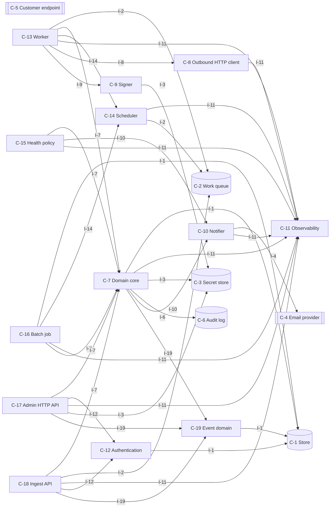
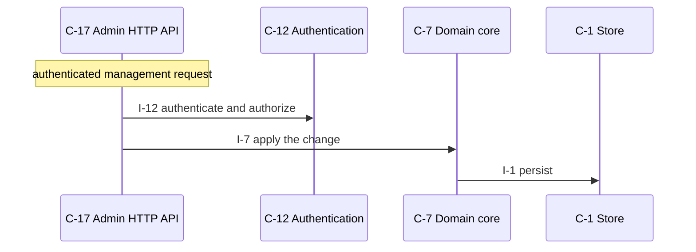
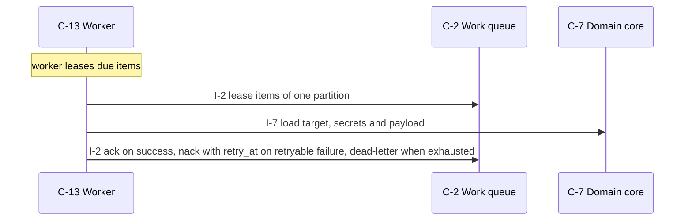
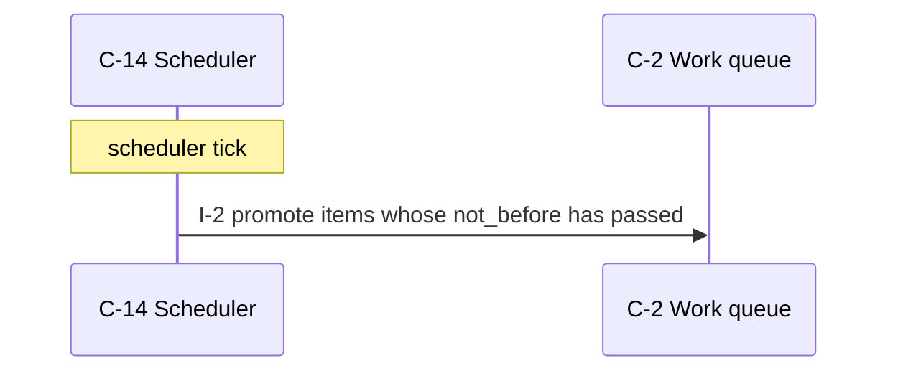
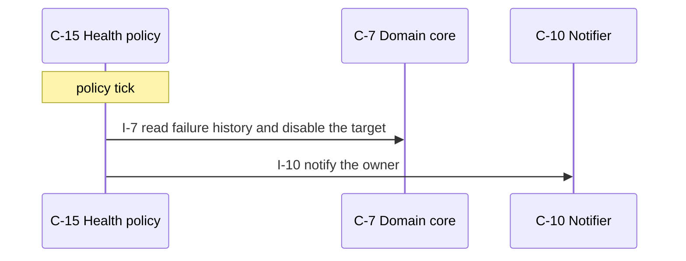
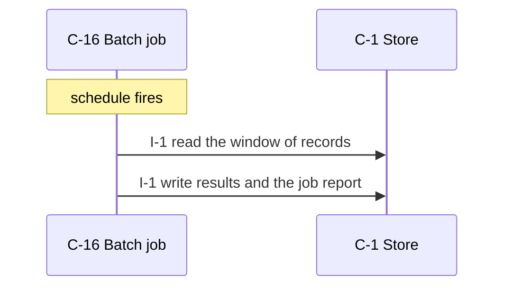
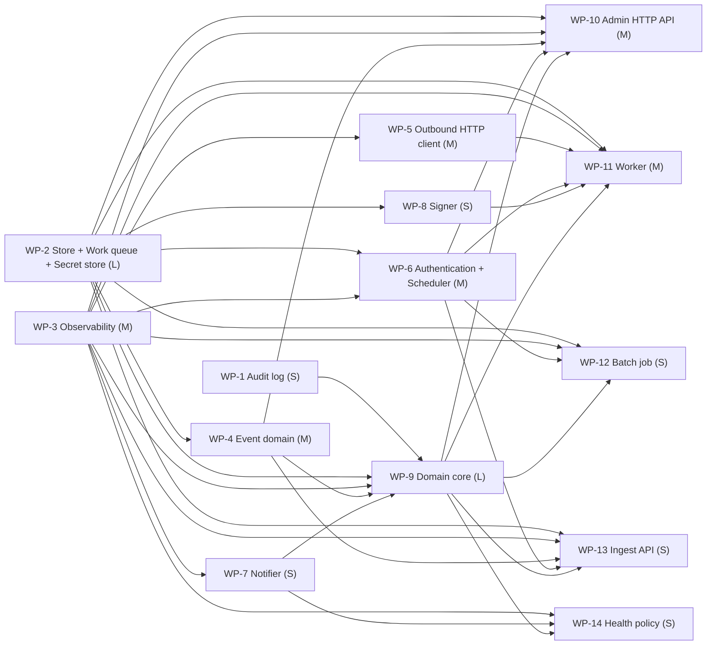

# webhook-delivery-service — design

We run a SaaS.

_version 0.1.0 · schema sekkei/1_

## Goals

- Clients read and write domain resources over HTTP.
- Customers or operators manage resources through an authenticated API.
- Producers hand events to the system, which persists them before acknowledging.
- Work is queued durably and performed by workers with a retry schedule.
- Events are delivered to endpoints customers registered.
- Outbound requests carry an HMAC signature; secrets rotate with a grace window.
- The system notifies people through an external channel.
- Targets that keep failing are disabled by policy and the owner is told.
- Metrics, structured logs and health endpoints for operations.
- Callers are authenticated and authorized.
- Scheduled jobs process stored records in windows.
- Changes are recorded append-only with the actor.

## Requirements

| id | kind | priority | statement | metric |
|---|---|---|---|---|
| R-1 | functional | must | Customers register webhook endpoints; when things happen in our platform (order.created, order.paid, refund.issued, ...) we must deliver a signed JSON event to every endpoint subscribed to that event type. | — |
| R-2 | functional | must | Customers manage endpoints via an admin HTTP API: create/list/delete endpoints, choose event types, rotate the signing secret. | — |
| R-3 | functional | must | Internal services publish events through an internal API (HTTP or in-process call). | — |
| R-4 | functional | must | Each event is delivered at least once to every matching endpoint. Deliveries are retried with exponential backoff (1 min, 5 min, 30 min, 2 h, 12 h; 5 attempts) on 5xx/timeout. 4xx (except 429) is final failure. 429 honours Retry-After. | — |
| R-5 | functional | must | Every delivery carries an HMAC-SHA256 signature over the body with the endpoint's current secret, plus a timestamp header; after rotation, both old and new secrets are valid for 24 h. | — |
| R-6 | functional | must | Customers can see delivery attempts per event (status, response code, timestamps) and manually redeliver. | — |
| R-7 | functional | must | Endpoints that fail continuously for 3 days are disabled automatically and the customer is notified by email. | — |
| R-8 | nonfunctional | must | 1,000 events/s sustained publish rate, 5,000 endpoints; delivery latency p95 under 5 s for a healthy endpoint. | p95 latency at 1,000, 5,000 < 5 s |
| R-9 | nonfunctional | should | No event lost on process crash (persist before ack). | records lost across a process crash = 0 records |
| R-10 | nonfunctional | must | Per-endpoint isolation: one slow endpoint must not delay others. | p95 latency of healthy targets while one target stalls within the stated latency target |
| R-11 | nonfunctional | should | metrics (queue depth, delivery success rate, attempt latency) exposed for Prometheus; structured logs. | required metrics exposed = all listed |
| R-12 | constraint | must | Python 3.12, PostgreSQL available, Redis available. Single region. Team of 3. | — |
| R-13 | constraint | must | Must run as a set of stateless containers behind our existing ingress. | — |
| R-14 | functional | must | Domain records are kept indefinitely; logs and audit history are retained for 1 year, after which a nightly job deletes them (assumed by the engine). | — |
| R-15 | functional | must | Personal data is deleted on request within 30 days and access to it is logged (assumed by the engine). | — |
| R-16 | nonfunctional | must | Records are 2 KB on average and at most 256 KB (assumed by the engine). | size at 2 KB <= 256 kb |
| R-17 | nonfunctional | must | Availability of 99.9 % monthly; accepted work is delayed but never lost during an outage (assumed by the engine). | ratio 99.9 % |
| R-18 | nonfunctional | should | Backups run daily with a recovery point of 24 h and a recovery time of 4 h (assumed by the engine). | time at 4 h 24 h |
| R-19 | nonfunctional | must | An alert is raised when the error rate exceeds 1 % for 5 minutes or the queue depth grows for 10 minutes (assumed by the engine). | ratio at 5 minutes, 10 minutes 1 % |
| R-20 | constraint | must | No existing data or system to migrate from (assumed by the engine). | — |
| R-21 | constraint | must | Authentication by API keys per customer (assumed by the engine). | — |
| R-22 | constraint | must | Use existing infrastructure only; no new managed services (assumed by the engine). | — |

## Components



### C-1 — Store

- **kind**: datastore · **path**: `app/store.py`
- **responsibility**: Owns persistence of the domain entities: durable writes, reads, listing, and the schema/migrations.
- **provides**: I-1
- **requires**: —
- **satisfies**: R-9, R-12

### C-2 — Work queue

- **kind**: datastore · **path**: `app/queue.py`
- **responsibility**: Durable, ordered hand-off of work items between the ingest path and the workers, with visibility timeout and dead-letter.
- **provides**: I-2
- **requires**: —
- **satisfies**: R-1, R-3, R-4, R-5, R-6, R-8, R-9, R-11, R-17, R-19

### C-3 — Secret store

- **kind**: datastore · **path**: `app/secrets.py`
- **responsibility**: Holds per-endpoint signing secrets and their rotation history; encrypts at rest.
- **provides**: I-3
- **requires**: —
- **satisfies**: R-1, R-2, R-5

### C-4 — Email provider

- **kind**: external
- **responsibility**: External email delivery service.
- **provides**: I-4
- **requires**: —
- **satisfies**: R-7

### C-5 — Customer endpoint

- **kind**: external
- **responsibility**: The customer's HTTPS receiver; outside our control.
- **provides**: I-5
- **requires**: —
- **satisfies**: R-1, R-4

### C-6 — Audit log

- **kind**: datastore · **path**: `app/audit.py`
- **responsibility**: Append-only record of who did what to which resource, queryable by resource and actor.
- **provides**: I-6
- **requires**: —
- **satisfies**: R-15

### C-7 — Domain core

- **kind**: module · **path**: `app/core.py`
- **responsibility**: Business rules and validation for the domain entities; the only module that changes state through the store.
- **provides**: I-7
- **requires**: I-1, I-11, I-3, I-6, I-10, I-19
- **satisfies**: R-1, R-2, R-3, R-4, R-5, R-6, R-7, R-12, R-20, R-22

### C-8 — Outbound HTTP client

- **kind**: module · **path**: `app/dispatcher.py`
- **responsibility**: Performs the outbound HTTP call with timeouts, size limits, redirect and private-address protection, and returns a classified outcome.
- **provides**: I-8
- **requires**: I-11
- **satisfies**: R-1, R-4, R-5, R-6, R-8, R-11

### C-9 — Signer

- **kind**: module · **path**: `app/signer.py`
- **responsibility**: Produces and verifies HMAC signatures over request bodies with the current and previous secrets.
- **provides**: I-9
- **requires**: I-3
- **satisfies**: R-1, R-2, R-5

### C-10 — Notifier

- **kind**: module · **path**: `app/notifier.py`
- **responsibility**: Sends operator/customer notifications through the configured channel with templating and rate limiting.
- **provides**: I-10
- **requires**: I-4, I-11
- **satisfies**: R-7

### C-11 — Observability

- **kind**: module · **path**: `app/observability.py`
- **responsibility**: Metrics registry and exposition, structured logging, health/readiness endpoints.
- **provides**: I-11
- **requires**: —
- **satisfies**: R-11, R-17, R-19

### C-12 — Authentication

- **kind**: module · **path**: `app/auth.py`
- **responsibility**: Authenticates callers and resolves them to a principal and scope; enforces authorization for management operations.
- **provides**: I-12
- **requires**: I-1
- **satisfies**: R-1, R-2, R-6, R-21

### C-13 — Worker

- **kind**: job · **path**: `app/worker.py`
- **responsibility**: Leases work items, performs the outbound action, records the outcome, and decides retry vs. final failure.
- **provides**: I-13
- **requires**: I-2, I-7, I-14, I-11, I-8, I-9
- **satisfies**: R-1, R-4, R-5, R-6, R-8, R-10, R-11, R-13

### C-14 — Scheduler

- **kind**: job · **path**: `app/scheduler.py`
- **responsibility**: Computes when deferred work runs next (backoff schedules, periodic jobs) and promotes due work.
- **provides**: I-14
- **requires**: I-11, I-2
- **satisfies**: R-1, R-4, R-5, R-6, R-8, R-11, R-14

### C-15 — Health policy

- **kind**: job · **path**: `app/policy.py`
- **responsibility**: Evaluates per-target failure history against the disable policy and applies the consequence.
- **provides**: I-15
- **requires**: I-7, I-10, I-11
- **satisfies**: R-7

### C-16 — Batch job

- **kind**: job · **path**: `app/batch.py`
- **responsibility**: Scheduled processing over stored records: extract, transform, aggregate, write results.
- **provides**: I-16
- **requires**: I-1, I-14, I-11, I-7
- **satisfies**: R-14

### C-17 — Admin HTTP API

- **kind**: service · **path**: `app/admin_api.py`
- **responsibility**: Management surface for operators/customers: resource lifecycle and configuration; authenticated.
- **provides**: I-17
- **requires**: I-7, I-12, I-11, I-3, I-19
- **satisfies**: R-1, R-2, R-6, R-8, R-10, R-13, R-16, R-18

### C-18 — Ingest API

- **kind**: service · **path**: `app/ingest_api.py`
- **responsibility**: Accepts events/records from producers, validates them, persists them, and enqueues work; acknowledges only after persistence.
- **provides**: I-18
- **requires**: I-7, I-2, I-11, I-12, I-19
- **satisfies**: R-3, R-8, R-9, R-10, R-13

### C-19 — Event domain

- **kind**: module · **path**: `app/domain_event.py`
- **responsibility**: Owns the Event aggregate: creation, changes and state transitions of these records, and the rules that hold across them. Event states: delivered, published; transitions not stated. Read from R-1, R-3, R-4, R-6.
- **provides**: I-19
- **requires**: I-1
- **satisfies**: R-1, R-3, R-4, R-6

**Layers** (each layer depends only on earlier ones):

0. C-1, C-11, C-2, C-3, C-4, C-5, C-6
1. C-10, C-12, C-14, C-19, C-8, C-9
2. C-7
3. C-13, C-15, C-16, C-17, C-18

## Interfaces

### I-1 — Store interface

- **kind**: class · **owner**: C-1 · **stability**: stable
- Provided by Store. 

| operation | inputs | output | errors | pre / post |
|---|---|---|---|---|
| `save` | `entity`: Entity, `record`: dict | id | ConflictError on duplicate key | record is durable before return |
| `get` | `entity`: Entity, `id`: str | record \| None | — | — |
| `list` | `entity`: Entity, `filter`: dict, `page`: Page | list[record], next page token | — | — |
| `delete` | `entity`: Entity, `id`: str | bool | — | — |

### I-2 — Work queue interface

- **kind**: class · **owner**: C-2 · **stability**: stable
- Provided by Work queue. 

| operation | inputs | output | errors | pre / post |
|---|---|---|---|---|
| `enqueue` | `item`: WorkItem, `not_before`: datetime \| None | None | — | item is durable before return |
| `lease` | `partition`: str, `limit`: int, `visibility`: timedelta | list[WorkItem] | — | items whose not_before has passed |
| `ack` | `item_id`: str | None | — | — |
| `nack` | `item_id`: str, `retry_at`: datetime \| None | None | — | — |
| | re-queue with a delay, or dead-letter when retries are exhausted | | | |
| `depth` | `partition`: str \| None | int | — | — |

### I-3 — Secret store interface

- **kind**: class · **owner**: C-3 · **stability**: stable
- Provided by Secret store. 

| operation | inputs | output | errors | pre / post |
|---|---|---|---|---|
| `current` | `endpoint_id`: str | list[Secret] valid now | — | — |
| `rotate` | `endpoint_id`: str, `grace`: timedelta | Secret new | — | stated values: 24 h (R-5) / old secret stays valid until now + grace |

### I-4 — Email provider interface

- **kind**: http · **owner**: C-4 · **stability**: stable
- Provided by Email provider. External; contract is theirs.

| operation | inputs | output | errors | pre / post |
|---|---|---|---|---|
| `send` | `to`: str, `subject`: str, `body`: str | provider message id | — | — |

### I-5 — Customer endpoint interface

- **kind**: http · **owner**: C-5 · **stability**: stable
- Provided by Customer endpoint. External; contract is theirs.

| operation | inputs | output | errors | pre / post |
|---|---|---|---|---|
| `POST <url>` | `body`: json, `signature headers`: str | 2xx on acceptance | 4xx final, 5xx retry, 429 with Retry-After | — |

### I-6 — Audit log interface

- **kind**: class · **owner**: C-6 · **stability**: stable
- Provided by Audit log. 

| operation | inputs | output | errors | pre / post |
|---|---|---|---|---|
| `append` | `actor`: str, `action`: str, `resource`: str, `details`: dict | None | — | — |
| `query` | `resource`: str \| None, `actor`: str \| None, `page`: Page | entries | — | — |

### I-7 — Domain core interface

- **kind**: module · **owner**: C-7 · **stability**: draft
- Provided by Domain core. 

| operation | inputs | output | errors | pre / post |
|---|---|---|---|---|
| `register_endpoints` | `endpoints`: Endpoints \| id | Endpoints \| None | ValidationError, NotFound | — |
| | from R-1: Customers register webhook endpoints; when things happen in our platform (order.created, o | | | |
| `deliver_event` | `event`: Event \| id | Event \| None | ValidationError, NotFound | — |
| | from R-1: Customers register webhook endpoints; when things happen in our platform (order.created, o | | | |
| `manage_endpoints` | `endpoints`: Endpoints \| id | Endpoints \| None | ValidationError, NotFound | — |
| | from R-2: Customers manage endpoints via an admin HTTP API: create/list/delete endpoints, choose eve | | | |
| `create_endpoints` | `endpoints`: Endpoints \| id | Endpoints \| None | ValidationError, NotFound | — |
| | from R-2: Customers manage endpoints via an admin HTTP API: create/list/delete endpoints, choose eve | | | |
| `list_endpoints` | `endpoints`: Endpoints \| id | Endpoints \| None | ValidationError, NotFound | — |
| | from R-2: Customers manage endpoints via an admin HTTP API: create/list/delete endpoints, choose eve | | | |
| `delete_endpoints` | `endpoints`: Endpoints \| id | Endpoints \| None | ValidationError, NotFound | — |
| | from R-2: Customers manage endpoints via an admin HTTP API: create/list/delete endpoints, choose eve | | | |
| `set_types` | `types`: Types \| id | Types \| None | ValidationError, NotFound | — |
| | from R-2: Customers manage endpoints via an admin HTTP API: create/list/delete endpoints, choose eve | | | |
| `rotate_secret` | `secret`: Secret \| id | Secret \| None | ValidationError, NotFound | — |
| | from R-2: Customers manage endpoints via an admin HTTP API: create/list/delete endpoints, choose eve | | | |
| `publish_events` | `events`: Events \| id | Events \| None | ValidationError, NotFound | — |
| | from R-3: Internal services publish events through an internal API (HTTP or in-process call). | | | |
| `get_attempts` | `attempts`: Attempts \| id | Attempts \| None | ValidationError, NotFound | — |
| | from R-6: Customers can see delivery attempts per event (status, response code, timestamps) and manu | | | |
| `redeliver_timestamps` | `timestamps`: Timestamps \| id | Timestamps \| None | ValidationError, NotFound | — |
| | from R-6: Customers can see delivery attempts per event (status, response code, timestamps) and manu | | | |

### I-8 — Outbound HTTP client interface

- **kind**: module · **owner**: C-8 · **stability**: draft
- Provided by Outbound HTTP client. 

| operation | inputs | output | errors | pre / post |
|---|---|---|---|---|
| `post` | `url`: str, `body`: bytes, `headers`: dict, `timeout`: float | Outcome(status, latency, retry_after) | TimeoutError, ConnectionError, BlockedAddressError | url resolves to a public address |

### I-9 — Signer interface

- **kind**: module · **owner**: C-9 · **stability**: draft
- Provided by Signer. 

| operation | inputs | output | errors | pre / post |
|---|---|---|---|---|
| `sign` | `body`: bytes, `timestamp`: int, `secret`: bytes | signature hex | — | HMAC-SHA256(timestamp + '.' + body) |
| `headers` | `body`: bytes, `secrets`: list[bytes] | dict of signature headers | — | — |
| | one header per valid secret during a rotation window | | | |

### I-10 — Notifier interface

- **kind**: module · **owner**: C-10 · **stability**: draft
- Provided by Notifier. 

| operation | inputs | output | errors | pre / post |
|---|---|---|---|---|
| `notify` | `recipient`: str, `template`: str, `context`: dict | message id | NotifyError | — |

### I-11 — Observability interface

- **kind**: module · **owner**: C-11 · **stability**: draft
- Provided by Observability. 

| operation | inputs | output | errors | pre / post |
|---|---|---|---|---|
| `counter` | `name`: str, `labels`: dict | Counter | — | — |
| `histogram` | `name`: str, `labels`: dict | Histogram | — | — |
| `gauge` | `name`: str, `labels`: dict | Gauge | — | — |
| `GET /metrics` | — | Prometheus text exposition | — | — |
| `GET /healthz` | — | 200 when dependencies reachable | — | — |
| `log` | `event`: str, `fields`: dict | None | — | — |
| | one JSON line per event | | | |

### I-12 — Authentication interface

- **kind**: module · **owner**: C-12 · **stability**: draft
- Provided by Authentication. 

| operation | inputs | output | errors | pre / post |
|---|---|---|---|---|
| `authenticate` | `credentials`: str | Principal | AuthError | — |
| `authorize` | `principal`: Principal, `action`: str, `resource`: str | None | Forbidden | — |

### I-13 — Worker interface

- **kind**: module · **owner**: C-13 · **stability**: draft
- Provided by Worker. 

| operation | inputs | output | errors | pre / post |
|---|---|---|---|---|
| `run_once` | `partition`: str | int processed | — | — |
| | one lease/process/ack cycle; the loop and concurrency live in the process entry point | | | |
| `process` | `item`: WorkItem | Outcome | DeliveryError | outcome recorded through core before ack |

### I-14 — Scheduler interface

- **kind**: module · **owner**: C-14 · **stability**: draft
- Provided by Scheduler. 

| operation | inputs | output | errors | pre / post |
|---|---|---|---|---|
| `next_attempt` | `attempt`: int, `retry_after`: timedelta \| None | datetime \| None | — | stated values: 1 min (R-4); 5 min (R-4); 30 min (R-4); 2 h (R-4); 12 h (R-4); 5 attempts (R-4); 24 h (R-5) |
| | None when attempts are exhausted | | | |
| `promote_due` | `now`: datetime | int moved | — | — |

### I-15 — Health policy interface

- **kind**: module · **owner**: C-15 · **stability**: draft
- Provided by Health policy. 

| operation | inputs | output | errors | pre / post |
|---|---|---|---|---|
| `evaluate` | `now`: datetime | list[action taken] | — | stated values: 3 days (R-7) |
| | disables targets failing continuously beyond the window and notifies | | | |

### I-16 — Batch job interface

- **kind**: module · **owner**: C-16 · **stability**: draft
- Provided by Batch job. 

| operation | inputs | output | errors | pre / post |
|---|---|---|---|---|
| `run` | `window`: DateRange | JobReport | JobError | stated values: 1 year (R-14) |

### I-17 — Admin HTTP API interface

- **kind**: http · **owner**: C-17 · **stability**: draft
- Provided by Admin HTTP API. 

| operation | inputs | output | errors | pre / post |
|---|---|---|---|---|
| `POST /endpoints` | `body`: endpoints fields | 201 {endpoints id} | 400 invalid body, 401 unauthenticated, 409 conflict | — |
| | from R-1: Customers register webhook endpoints; when things happen in our platform (order.created, o | | | |
| `GET /endpoints` | `filter`: query, `page`: cursor | 200 [endpoints], next cursor | 401 unauthenticated | — |
| | from R-2: Customers manage endpoints via an admin HTTP API: create/list/delete endpoints, choose eve | | | |
| `DELETE /endpoints/{id}` | `id`: str | 204 | 401 unauthenticated, 404 unknown id | — |
| | from R-2: Customers manage endpoints via an admin HTTP API: create/list/delete endpoints, choose eve | | | |
| `POST /secrets/{id}/rotate` | `id`: str | 202 rotate accepted | 401 unauthenticated, 404 unknown id, 409 not applicable in current state | — |
| | from R-2: Customers manage endpoints via an admin HTTP API: create/list/delete endpoints, choose eve | | | |
| `POST /events` | `body`: events fields | 201 {events id} | 400 invalid body, 401 unauthenticated, 409 conflict | — |
| | from R-3: Internal services publish events through an internal API (HTTP or in-process call). | | | |

### I-18 — Ingest API interface

- **kind**: http · **owner**: C-18 · **stability**: draft
- Provided by Ingest API. 

| operation | inputs | output | errors | pre / post |
|---|---|---|---|---|
| `POST /events` | `type`: str, `payload`: json, `idempotency_key`: str | 202 {event_id} | 400 invalid payload, 409 duplicate idempotency key | event persisted and enqueued before 202 |

### I-19 — Event domain interface

- **kind**: module · **owner**: C-19 · **stability**: draft
- Provided by Event domain. Operations are the state transitions and creations the requirements name; add queries as the surfaces need them.

| operation | inputs | output | errors | pre / post |
|---|---|---|---|---|
| `deliver_event` | `event_id`: ref | Event (status = delivered) | NotFound, InvalidTransition (source status not allowed) | allowed source states not read by the engine (it reads 'then/until/otherwise' prose and a → b lists; state the transition or set it here) / status = delivered |
| | from R-1 | | | |
| `publish_event` | `event_id`: ref | Event (status = published) | NotFound, InvalidTransition (source status not allowed) | allowed source states not read by the engine (it reads 'then/until/otherwise' prose and a → b lists; state the transition or set it here) / status = published |
| | from R-3 | | | |
| `create_event` | `event`: Event | Event (id assigned) | ValidationError listing every invalid field | record is durable before return |
| | creation of the aggregate root | | | |
| `get_event` | `event_id`: ref | Event \| None | — | — |

## Entities

### E-1 — Principal (owner C-1)

| field | type | constraints |
|---|---|---|
| `id` | uuid | primary key |
| `kind` | enum(customer, operator, service) |  |
| `scopes` | list[str] |  |

### E-2 — Event (owner C-1)

| field | type | constraints |
|---|---|---|
| `id` | uuid | primary key |
| `type` | str | indexed |
| `payload` | json |  |
| `created_at` | timestamp |  |
| `idempotency_key` | str | unique per producer |
| `status` | enum | from R-6 |
| `response_code` | ref | from R-6 |
| `timestamps` | str | from R-6 |
| `status` | enum(delivered, published) | states read from R-1, R-3, R-4 |

### E-3 — WorkItem (owner C-2)

| field | type | constraints |
|---|---|---|
| `id` | uuid | primary key |
| `partition` | str | indexed; the isolation key |
| `payload_ref` | uuid | references the event |
| `attempt` | int | >= 0 |
| `not_before` | timestamp | indexed |
| `leased_until` | timestamp \| null |  |

### E-4 — DeliveryAttempt (owner C-1)

| field | type | constraints |
|---|---|---|
| `id` | uuid | primary key |
| `work_item_id` | uuid | indexed |
| `attempt` | int |  |
| `status` | enum(success, retry, failed) |  |
| `response_code` | int \| null |  |
| `started_at` | timestamp |  |
| `finished_at` | timestamp |  |
| `error` | str \| null |  |

### E-5 — Endpoint (owner C-1)

| field | type | constraints |
|---|---|---|
| `id` | uuid | primary key |
| `owner_id` | uuid | indexed |
| `url` | https url | validated; no private addresses |
| `event_types` | list[str] |  |
| `enabled` | bool |  |
| `disabled_reason` | str \| null |  |
| `failing_since` | timestamp \| null |  |

### E-6 — Secret (owner C-3)

| field | type | constraints |
|---|---|---|
| `id` | uuid | primary key |
| `endpoint_id` | uuid | indexed |
| `value` | bytes | encrypted at rest |
| `created_at` | timestamp |  |
| `valid_until` | timestamp \| null | set on rotation |

### E-7 — JobRun (owner C-1)

| field | type | constraints |
|---|---|---|
| `id` | uuid | primary key |
| `job` | str |  |
| `window_start` | timestamp |  |
| `window_end` | timestamp |  |
| `status` | enum |  |
| `report` | json |  |

### E-8 — AuditEntry (owner C-6)

| field | type | constraints |
|---|---|---|
| `id` | uuid | primary key |
| `actor` | str |  |
| `action` | str |  |
| `resource` | str | indexed |
| `at` | timestamp |  |

## Flows

### F-1 — Manage a resource

_Trigger:_ authenticated management request

1. C-17 → C-12 via I-12: authenticate and authorize
2. C-17 → C-7 via I-7: apply the change
3. C-7 → C-1 via I-1: persist



### F-2 — Publish an event

_Trigger:_ producer calls the ingest API

1. C-18 → C-7 via I-7: validate the event against known types
2. C-7 → C-1 via I-1: persist the event
3. C-18 → C-2 via I-2: enqueue one work item per matching target; ack only after both are durable

```mermaid
sequenceDiagram
  participant C_18 as C-18 Ingest API
  participant C_7 as C-7 Domain core
  participant C_1 as C-1 Store
  participant C_2 as C-2 Work queue
  Note over C_18: producer calls the ingest API
  C_18->>C_7: I-7 validate the event against known types
  C_7->>C_1: I-1 persist the event
  C_18->>C_2: I-2 enqueue one work item per matching target; ack only after both are durable
```

### F-3 — Deliver a work item

_Trigger:_ worker leases due items

1. C-13 → C-2 via I-2: lease items of one partition
2. C-13 → C-7 via I-7: load target, secrets and payload
3. C-13 → C-2 via I-2: ack on success, nack with retry_at on retryable failure, dead-letter when exhausted



### F-4 — Retry after failure

_Trigger:_ scheduler tick

1. C-14 → C-2 via I-2: promote items whose not_before has passed



### F-5 — Disable a continuously failing target

_Trigger:_ policy tick

1. C-15 → C-7 via I-7: read failure history and disable the target
2. C-15 → C-10 via I-10: notify the owner



### F-6 — Run the batch job

_Trigger:_ schedule fires

1. C-16 → C-1 via I-1: read the window of records
2. C-16 → C-1 via I-1: write results and the job report



## Decisions

### D-1 — API style (accepted)

**Context.** Clients need a programmable surface.

- ✔ **REST/JSON over HTTP**
  - + universal tooling
  - + cacheable reads
  - − over-fetching on nested data
- ✘ **gRPC**
  - + typed contracts
  - + streaming
  - − browser and debugging friction
- ✘ **GraphQL**
  - + flexible queries
  - − complexity budget for a small team

**Rationale.** Scored against the active qualities; decided by durability (weight 1.0), performance (weight 0.82). REST/JSON over HTTP: 2.37; gRPC: 1.25; GraphQL: 1.12. stated in the constraints

**Consequences.** Not choosing 'gRPC' gives up: typed contracts, streaming. Not choosing 'GraphQL' gives up: flexible queries.

_Affects:_ C-17

### D-2 — Primary store (accepted)

**Context.** Domain records need durable, queryable storage.

- ✔ **PostgreSQL**
  - + transactions
  - + indexes and JSON
  - + widely available
  - − operational dependency
- ✘ **MySQL / MariaDB (the stated database)**
  - + transactions
  - + already operated by the team
  - − weaker JSON and DDL ergonomics than PostgreSQL
- ✘ **Redis for the hot state (as stated) with a relational store for durable records**
  - + the stated home of the hot data
  - + sub-millisecond reads
  - − two stores to keep consistent
  - − Redis durability depends on AOF/fsync
- ✘ **Managed document store (DynamoDB/MongoDB, as stated)**
  - + scales without operations
  - + flexible records
  - − no cross-record transactions by default
  - − query patterns must be designed up front
- ✘ **SQLite**
  - + zero operations
  - + single file
  - − one writer at a time
  - − no network access
- ✘ **Files (JSON/CSV on disk)**
  - + no dependencies
  - + human readable
  - − no transactions or concurrency
- ✘ **In-memory**
  - + fastest
  - + trivial
  - − lost on restart

**Rationale.** Scored against the active qualities; decided by durability (weight 1.0), performance (weight 0.82). PostgreSQL: 3.27; MySQL / MariaDB: unavailable (needs mysql, not in the constraints); Redis for the hot state: unavailable (needs redis_primary, not in the constraints); Managed document store: unavailable (needs document_db, not in the constraints); SQLite: unavailable (ruled out by containers, multi_instance); Files: unavailable (ruled out by containers, multi_instance); In-memory: unavailable (ruled out by containers, multi_instance, postgres, durable_required). stated in the constraints

_Affects:_ C-1

### D-3 — Caller authentication (accepted)

**Context.** Management operations must be attributable to a customer or operator.

- ✔ **API keys per customer, hashed at rest, sent as a bearer token**
  - + simple
  - + scriptable
  - − no delegation or expiry unless added
- ✘ **OAuth2 / OIDC with the platform's identity provider**
  - + single sign-on
  - + expiry and scopes
  - − integration effort
- ✘ **Mutual TLS**
  - + strong
  - + no secrets in headers
  - − certificate lifecycle for every customer
- ✘ **Session tokens issued by the platform's own account service to game/mobile clients (device-bound, short-lived, refreshable)**
  - + fits clients without a browser
  - + revocable per device
  - − a token service to run
- ✘ **No account: a reference number plus a knowledge factor (date of birth) resumes a saved application; every attempt rate-limited and logged**
  - + no credentials to manage for occasional users
  - + meets 'no account or email required'
  - − a reference number can be shared; scope what it unlocks
- ✘ **Email one-time code / magic link (no account needed)**
  - + no password, no sign-up
  - + works for occasional customers
  - − depends on email delivery
  - − weak against mailbox compromise

**Rationale.** Scored against the active qualities; decided by durability (weight 1.0), performance (weight 0.82). API keys per customer, hashed at rest, sent as a: 1.33; Mutual TLS: 1.04; OAuth2 / OIDC with the platform's identity provi: unavailable (needs idp, not in the constraints); Session tokens issued by the platform's own acco: unavailable (needs game_client, not in the constraints); No account: a reference number plus a knowledge : unavailable (needs no_account_auth, not in the constraints); Email one-time code / magic link: unavailable (needs email_auth, not in the constraints)

**Consequences.** Not choosing 'Mutual TLS' gives up: strong, no secrets in headers.

_Affects:_ C-12, C-17

### D-4 — How producers publish (accepted)

**Context.** Internal services must hand events to the system.

- ✔ **HTTP publish endpoint with idempotency keys**
  - + language-agnostic
  - + one contract
  - − one network hop
  - − callers need retries
- ✘ **In-process client library that writes the outbox in the caller's transaction**
  - + no lost events at the source
  - − couples callers to our schema and language
- ✘ **Message bus topic**
  - + decoupled
  - − new infrastructure

**Rationale.** Scored against the active qualities; decided by durability (weight 1.0), performance (weight 0.82). HTTP publish endpoint with idempotency keys: 1.79; In-process client library that writes the outbox: 1.56; Message bus topic: unavailable (needs broker, not in the constraints)

**Consequences.** Not choosing 'In-process client library that writes the outbox' gives up: no lost events at the source.

_Affects:_ C-18

### D-5 — Work queue technology (accepted)

**Context.** Work items must survive a crash and be leased by several workers.

- ✔ **PostgreSQL table with SELECT ... FOR UPDATE SKIP LOCKED**
  - + transactional with the domain data (persist + enqueue atomically)
  - + no new infrastructure
  - + easy to inspect
  - − throughput bounded by the database (fine to ~10k items/s)
  - − needs a vacuum-friendly schema
- ✘ **Redis Streams with consumer groups**
  - + high throughput
  - + built-in consumer groups and pending lists
  - − durability depends on AOF/fsync configuration
  - − separate from the transactional store: needs an outbox
- ✘ **Managed broker (SQS/RabbitMQ/Kafka)**
  - + scales independently
  - + delayed delivery built in (SQS)
  - − new infrastructure and cost
  - − at-least-once semantics still need an outbox
- ✘ **In-memory queue**
  - + simplest possible
  - − work is lost on crash
  - − single process only

**Rationale.** Scored against the active qualities; decided by durability (weight 1.0), performance (weight 0.82). PostgreSQL table with SELECT ... FOR UPDATE SKIP: 3.13; Redis Streams with consumer groups: 1.81; Managed broker: unavailable (needs broker, not in the constraints); In-memory queue: unavailable (ruled out by durable_required, containers, multi_instance). stated in the constraints

**Consequences.** Not choosing 'Redis Streams with consumer groups' gives up: high throughput, built-in consumer groups and pending lists.

_Affects:_ C-2, C-18, C-13

### D-6 — Where delayed retries wait (accepted)

**Context.** Failed deliveries must run again at a computed future time.

- ✔ **not_before column on the work item; the scheduler promotes due rows**
  - + one durable store for queued and delayed items
  - + trivial to inspect and to redeliver manually
  - − a periodic scan (index on not_before)
- ✘ **Redis sorted set keyed by due time**
  - + cheap due-time queries
  - − a second store to keep consistent
- ✘ **In-process timers**
  - + no store
  - − lost on restart

**Rationale.** Scored against the active qualities; decided by durability (weight 1.0), performance (weight 0.82). not_before column on the work item: 1.91; Redis sorted set keyed by due time: 1.49; In-process timers: unavailable (ruled out by durable_required, containers, multi_instance)

**Consequences.** Not choosing 'Redis sorted set keyed by due time' gives up: cheap due-time queries.

_Affects:_ C-14, C-2

### D-7 — Process topology (accepted)

**Context.** The same code base serves requests and performs background work.

- ✔ **One image, role by flag: `api` and `worker` processes scale independently**
  - + stateless containers
  - + independent scaling of ingress and outbound work
  - + one build
  - − two deployables to operate
- ✘ **Single process with background threads**
  - + one deployable
  - − request latency competes with outbound work
  - − cannot scale roles separately
- ✘ **Separate services per concern (ingest, admin, delivery)**
  - + clear ownership
  - − three deployables for a team of three
  - − shared schema anyway

**Rationale.** Scored against the active qualities; decided by durability (weight 1.0), performance (weight 0.82). One image, role by flag: `api` and `worker` proc: 1.87; Separate services per concern: 1.64; Single process with background threads: 1.36

**Consequences.** Not choosing 'Separate services per concern' gives up: clear ownership. Not choosing 'Single process with background threads' gives up: one deployable.

_Affects:_ C-17, C-18, C-13, C-14, C-15

### D-8 — Outbound request safety (accepted)

**Context.** The system makes HTTP requests to customer-supplied URLs.

- ✔ **Resolve and block private/link-local ranges; pin the resolved IP; cap body size and redirects; per-request timeout**
  - + closes SSRF and slow-loris classes
  - − a resolver step per request
- ✘ **Plain HTTP client with a timeout**
  - + simplest
  - − SSRF into internal networks
  - − unbounded response bodies

**Rationale.** Scored against the active qualities; decided by durability (weight 1.0), performance (weight 0.82). Resolve and block private/link-local ranges: 1.41; Plain HTTP client with a timeout: 1.16

**Consequences.** Not choosing 'Plain HTTP client with a timeout' gives up: simplest.

_Affects:_ C-8

### D-9 — Storage of signing secrets (accepted)

**Context.** Per-endpoint secrets are sensitive and must be readable by workers.

- ✔ **Encrypted column (AES-GCM) with a key from the environment/KMS**
  - + one store
  - + workers read directly
  - − key rotation procedure needed
- ✘ **External secrets manager (Vault/KMS-backed)**
  - + audited access
  - + rotation built in
  - − latency and a new dependency on the hot path
- ✘ **Plaintext column**
  - + simplest
  - − database dump exposes every customer secret

**Rationale.** Scored against the active qualities; decided by durability (weight 1.0), performance (weight 0.82). Encrypted column: 1.53; Plaintext column: 1.31; External secrets manager: unavailable (needs vault, not in the constraints)

**Consequences.** Not choosing 'Plaintext column' gives up: simplest.

_Affects:_ C-3, C-9

### D-10 — Per-target isolation of outbound work (accepted)

**Context.** One slow or failing target must not delay work for the others.

- ✔ **Partition the queue by target; each lease takes one partition with a per-partition concurrency cap**
  - + a slow target only occupies its own slot
  - + fair scheduling across targets
  - − more bookkeeping in the queue
  - − partition count = target count
- ✘ **Single FIFO queue with a global worker pool**
  - + simplest
  - − one slow target blocks pool slots for everyone (head-of-line blocking)
- ✘ **Hash targets to N shards, one worker pool per shard**
  - + bounded blast radius without per-target state
  - − a slow target still delays its shard

**Rationale.** Scored against the active qualities; decided by durability (weight 1.0), performance (weight 0.82). Partition the queue by target: 1.76; Hash targets to N shards, one worker pool per sh: 1.56; Single FIFO queue with a global worker pool: 1.34

**Consequences.** Not choosing 'Hash targets to N shards, one worker pool per sh' gives up: bounded blast radius without per-target state. Not choosing 'Single FIFO queue with a global worker pool' gives up: simplest.

_Affects:_ C-2, C-13

### D-11 — Redundancy for the availability target (accepted)

**Context.** The availability target must be met through instance failures and deploys.

- ✔ **Two or more interchangeable instances per role behind the ingress, health checks, rolling deploys**
  - + survives one instance failure
  - + zero-downtime deploys
  - − needs stateless instances and a shared store
- ✘ **Single instance with health-based restart**
  - + simplest
  - + cheapest
  - − restart time is downtime
  - − deploys are downtime
- ✘ **Active-active across two regions**
  - + survives a regional outage
  - − data replication and conflict handling
  - − cost

**Rationale.** Scored against the active qualities; decided by durability (weight 1.0), performance (weight 0.82). Two or more interchangeable instances per role b: 1.51; Single instance with health-based restart: 1.24; Active-active across two regions: unavailable (ruled out by single_region)

**Consequences.** Not choosing 'Single instance with health-based restart' gives up: simplest, cheapest.

_Affects:_ C-17, C-18, C-13

### D-12 — Assumed answer: load (Q-payload) (proposed)

**Context.** The requirements do not say. Question: Q-payload. No evidence in the text; engine default.

- ✔ **2 KB / 256 KB**
- ✘ **16 KB / 1 MB**
- ✘ **256 bytes / 4 KB**

**Rationale.** Typical JSON record sizes; the maximum bounds request bodies.

**Consequences.** If the real answer differs: State the sizes; storage growth and body limits change.

_Affects:_ C-18

### D-13 — Assumed answer: quality (Q-availability) (proposed)

**Context.** The requirements do not say. Question: Q-availability. No evidence in the text; engine default.

- ✔ **99.9 %**
- ✘ **99.5 %**
- ✘ **99.99 %**

**Rationale.** Three nines is achievable with two instances and health-based restarts; anything higher needs multi-region.

**Consequences.** If the real answer differs: State the target and what may be lost; topology and queue durability change.

_Affects:_ C-2, C-11

### D-14 — Assumed answer: data (Q-retention) (proposed)

**Context.** The requirements do not say. Question: Q-retention. No evidence in the text; engine default.

- ✔ **indefinite / 1 year**
- ✘ **90 days / 1 year**
- ✘ **30 days / 90 days**

**Rationale.** Deleting domain data is never a safe default; bounded retention for logs and history limits growth and satisfies most data-minimisation rules.

**Consequences.** If the real answer differs: State the retention per record class; the deletion job and capacity change.

_Affects:_ C-16, C-1

### D-15 — Assumed answer: data (Q-backup) (proposed)

**Context.** The requirements do not say. Question: Q-backup. No evidence in the text; engine default.

- ✔ **daily / 24 h / 4 h**
- ✘ **hourly / 1 h / 1 h**
- ✘ **none**

**Rationale.** The store's own daily backup is the cheapest credible baseline.

**Consequences.** If the real answer differs: State RPO/RTO; the store decision and a restore drill change.

_Affects:_ C-1

### D-16 — Assumed answer: data (Q-migration) (proposed)

**Context.** The requirements do not say. Question: Q-migration. No evidence in the text; engine default.

- ✔ **greenfield**
- ✘ **one-shot import**
- ✘ **gradual cut-over**

**Rationale.** Nothing in the text names an existing system.

**Consequences.** If the real answer differs: Name the existing system; a migration package and risk are added.

### D-17 — Assumed answer: security (Q-auth) (proposed)

**Context.** The requirements do not say. Question: Q-auth. Evidence: customers/visitors mentioned.

- ✔ **API keys**
- ✘ **OIDC**
- ✘ **mTLS**

**Rationale.** External callers without a stated identity provider are simplest to serve with per-customer keys.

**Consequences.** If the real answer differs: State the scheme; the authentication decision is rescored.

_Affects:_ C-12

### D-18 — Assumed answer: compliance (Q-compliance) (proposed)

**Context.** The requirements do not say. Question: Q-compliance. No evidence in the text; engine default.

- ✔ **GDPR-style deletion + audit**
- ✘ **no regime**
- ✘ **HIPAA/PCI controls**

**Rationale.** Email addresses or names are personal data almost everywhere; deletion on request is the common denominator.

**Consequences.** If the real answer differs: State the regime; audit and deletion paths change.

_Affects:_ C-6, C-1

### D-19 — Assumed answer: operations (Q-alerting) (proposed)

**Context.** The requirements do not say. Question: Q-alerting. No evidence in the text; engine default.

- ✔ **error rate + queue growth**
- ✘ **none**
- ✘ **per-endpoint SLO alerts**

**Rationale.** Two alerts catch most incidents without paging on noise.

**Consequences.** If the real answer differs: State the rules and the on-call; observability conventions change.

_Affects:_ C-11

### D-20 — Assumed answer: cost (Q-budget) (proposed)

**Context.** The requirements do not say. Question: Q-budget. No evidence in the text; engine default.

- ✔ **existing only**
- ✘ **managed services allowed**
- ✘ **strict monthly cap**

**Rationale.** The cheapest assumption; every decision already prefers the option needing no new infrastructure.

**Consequences.** If the real answer differs: State the budget; options adding infrastructure become available.

## Risks

| id | risk | likelihood | impact | mitigation |
|---|---|---|---|---|
| K-1 | Payloads or uploads without size limits exhaust memory or disk. | medium | medium | Enforce size limits at the surface; reject early with a clear error. |
| K-2 | Entities evolve; migrations run against live data. | medium | medium | Versioned migrations applied before deploy; additive changes first, removals one release later. |
| K-3 | A management operation reachable without authentication. | low | high | Authenticate in one middleware for every management route; test every route unauthenticated. |
| K-4 | At-least-once delivery means a target can receive the same event twice (crash between call and ack). | high | medium | Send a stable event id and attempt number in headers; document idempotent consumption; never retry on 2xx. |
| K-5 | Many targets fail at once (regional outage) and their retries align, creating a burst. | medium | medium | Add jitter to the backoff schedule and cap concurrent deliveries per partition and globally. |
| K-6 | Customer-supplied URLs can point at internal addresses or metadata services. | high | high | Resolve before connecting, block private ranges, pin the IP, forbid redirects to non-public hosts. |
| K-7 | Retried and dead-lettered items accumulate and slow the lease query. | medium | medium | Partial index on (partition, not_before) for live items; archive terminal items on a schedule. |
| K-8 | Timestamp-based signatures and not_before scheduling depend on wall clocks. | low | medium | Use the database clock for scheduling; tolerate a bounded skew window when verifying timestamps. |
| K-9 | Signing secrets in the database are exposed by a dump or a read-only breach. | medium | high | Encrypt at rest with a key outside the database; log secret reads; rotate on suspicion. |
| K-10 | A widespread failure disables many targets and emails every owner at once. | low | medium | Rate-limit notifications per owner and batch them. |
| K-11 | Per-target labels on metrics explode cardinality. | medium | low | Label by outcome and partition class, not by target id; expose per-target detail through the API instead. |
| K-12 | [tampering] Store: Injection through query construction. | medium | medium | Parameterised queries only; no string-built SQL. Check: static check for string-formatted SQL finds nothing |
| K-13 | [information_disclosure] Store: Backups and dumps contain everything. | medium | high | Encrypt backups; restrict who can take them. Check: backup file is not readable without the key |
| K-14 | [denial_of_service] Work queue: A poison item is retried forever and blocks its partition. | medium | medium | Attempt cap and dead-letter; per-partition concurrency cap. Check: an always-failing item ends in the dead-letter after the cap |
| K-15 | [tampering] Work queue: Items are processed twice after a crash between call and ack. | medium | medium | Idempotent processing with the item id; ack only after the outcome is recorded. Check: kill the worker mid-call; the item is redelivered exactly once more |
| K-16 | [information_disclosure] Secret store: Secrets readable from a database dump or a read-only breach. | medium | high | Encrypt at rest with a key held outside the database; never log values. Check: database dump contains no plaintext secret; grep logs for secret prefixes finds nothing |
| K-17 | [elevation] Secret store: A rotated secret stays valid forever. | medium | high | Bound the grace window; expire old secrets by time. Check: old secret rejected after the window |
| K-18 | [ssrf] Outbound HTTP client: A customer-supplied URL points at internal or metadata addresses. | medium | high | Resolve and block private/link-local ranges; pin the resolved IP; forbid redirects to non-public hosts. Check: URL to 169.254.169.254 / 10.0.0.1 / localhost is refused before connecting |
| K-19 | [denial_of_service] Outbound HTTP client: A slow or infinite response body ties up a worker. | medium | medium | Per-request timeout; cap response size; stream and discard bodies. Check: target that stalls is cut at the timeout; 100 MB body is cut at the cap |
| K-20 | [information_disclosure] Outbound HTTP client: Secrets or internal headers leak to targets. | medium | high | Send only the documented headers; never forward inbound headers. Check: captured request has exactly the documented headers |
| K-21 | [tampering] Signer: Signatures without a timestamp can be replayed. | medium | medium | Sign timestamp + body; document a tolerance window for verifiers. Check: replay outside the window fails verification |
| K-22 | [denial_of_service] Notifier: Notification storms and template injection. | medium | medium | Rate-limit per recipient; escape template context. Check: 1,000 failures produce one digest per owner |
| K-23 | [spoofing] Authentication: Credential stuffing or leaked keys. | medium | medium | Hash keys at rest; allow revocation; rate-limit failures. Check: revoked key is rejected within seconds; brute force is throttled |
| K-24 | [elevation] Authentication: A caller acts on another tenant's resources. | medium | high | Every core operation takes the principal and checks ownership. Check: cross-tenant request returns 404/403 for every operation |
| K-25 | [spoofing] Admin HTTP API: Management operations reachable without authentication. | medium | medium | Authenticate in one middleware for every management route; deny by default. Check: every management route returns 401 unauthenticated |
| K-26 | [repudiation] Admin HTTP API: No record of who changed what. | medium | medium | Audit log entries for every management write with the principal. Check: each write produces an audit entry |
| K-27 | [elevation] Admin HTTP API: A customer manages another customer's resources. | medium | high | Ownership check on every resource operation. Check: cross-customer access returns 404 |
| K-28 | [spoofing] Ingest API: Any network peer can publish events. | medium | medium | Authenticate producers (service credentials); allowlist event types. Check: unauthenticated publish returns 401 |
| K-29 | [tampering] Ingest API: Duplicate or replayed publishes create duplicate work. | medium | medium | Idempotency key per event; reject or de-duplicate replays. Check: replaying the same key does not enqueue twice |
| K-30 | [denial_of_service] Ingest API: A producer floods the ingest path. | medium | medium | Per-producer rate limit; back-pressure with 429 and Retry-After. Check: flood from one producer is throttled |

## Work packages



**Waves** (packages in one wave may run in parallel):

1. WP-1, WP-2, WP-3
2. WP-4, WP-5, WP-6, WP-7, WP-8
3. WP-9
4. WP-10, WP-11, WP-12, WP-13, WP-14

_Critical path (30 person-days):_ WP-2 → WP-4 → WP-9 → WP-11

### WP-1 — Audit log (S)

Implement Audit log: Append-only record of who did what to which resource, queryable by resource and actor.

- **components**: C-6 · **implements**: I-6
- **depends on**: — · **satisfies**: R-15
- **write scope**: `app/audit.py`, `tests/test_audit.py`
- **acceptance**:
  - A-1 (test) unit tests of Audit log pass — `python -m pytest -q tests/test_audit.py`
- **notes**: family: audit_log

### WP-2 — Store + Work queue + Secret store (L)

Implement Store: Owns persistence of the domain entities: durable writes, reads, listing, and the schema/migrations; Work queue: Durable, ordered hand-off of work items between the ingest path and the workers, with visibility timeout and dead-letter; Secret store: Holds per-endpoint signing secrets and their rotation history; encrypts at rest.

- **components**: C-1, C-2, C-3 · **implements**: I-1, I-2, I-3
- **depends on**: — · **satisfies**: R-1, R-2, R-3, R-4, R-5, R-6, R-8, R-9, R-11, R-12, R-17, R-19
- **write scope**: `app/store.py`, `tests/test_store.py`, `app/queue.py`, `tests/test_queue.py`, `app/secrets.py`, `tests/test_secrets.py`
- **acceptance**:
  - A-2 (test) unit tests of Store, Work queue, Secret store pass — `python -m pytest -q tests/test_store.py tests/test_queue.py tests/test_secrets.py`
  - A-3 (metric) R-8: p95 latency at 1,000, 5,000 < 5 s — load test at the stated rate; the stated percentile must meet the target — metric R-8
  - A-4 (metric) R-9: records lost across a process crash = 0 records — crash/kill test: no accepted item is lost and none is delivered without a durable record — metric R-9
  - A-5 (metric) R-11: required metrics exposed = all listed — the listed metrics are exposed and change under a smoke workload — metric R-11
  - A-6 (metric) R-17: ratio 99.9 % — kill one instance under load; error rate stays within the target — metric R-17
- **notes**: family: infra

### WP-3 — Observability (M)

Implement Observability: Metrics registry and exposition, structured logging, health/readiness endpoints.

- **components**: C-11 · **implements**: I-11
- **depends on**: — · **satisfies**: R-11, R-17, R-19
- **write scope**: `app/observability.py`, `tests/test_observability.py`
- **acceptance**:
  - A-7 (test) unit tests of Observability pass — `python -m pytest -q tests/test_observability.py`
  - A-8 (metric) R-11: required metrics exposed = all listed — the listed metrics are exposed and change under a smoke workload — metric R-11
  - A-9 (metric) R-17: ratio 99.9 % — kill one instance under load; error rate stays within the target — metric R-17
- **notes**: family: infra

### WP-4 — Event domain (M)

Implement Event domain: Owns the Event aggregate: creation, changes and state transitions of these records, and the rules that hold across them. Event states: delivered, published; transitions not stated. Read from R-1, R-3, R-4, R-6.

- **components**: C-19 · **implements**: I-19
- **depends on**: WP-2 · **satisfies**: R-1, R-3, R-4, R-6
- **write scope**: `app/domain_event.py`, `tests/test_domain_event.py`
- **acceptance**:
  - A-10 (test) unit tests of Event domain pass — `python -m pytest -q tests/test_domain_event.py`
- **notes**: family: aggregate:domain_event

### WP-5 — Outbound HTTP client (M)

Implement Outbound HTTP client: Performs the outbound HTTP call with timeouts, size limits, redirect and private-address protection, and returns a classified outcome.

- **components**: C-8 · **implements**: I-8
- **depends on**: WP-3 · **satisfies**: R-1, R-4, R-5, R-6, R-8, R-11
- **write scope**: `app/dispatcher.py`, `tests/test_dispatcher.py`
- **acceptance**:
  - A-11 (test) unit tests of Outbound HTTP client pass — `python -m pytest -q tests/test_dispatcher.py`
  - A-12 (metric) R-8: p95 latency at 1,000, 5,000 < 5 s — load test at the stated rate; the stated percentile must meet the target — metric R-8
  - A-13 (metric) R-11: required metrics exposed = all listed — the listed metrics are exposed and change under a smoke workload — metric R-11
- **notes**: family: async_delivery

### WP-6 — Authentication + Scheduler (M)

Implement Authentication: Authenticates callers and resolves them to a principal and scope; enforces authorization for management operations; Scheduler: Computes when deferred work runs next (backoff schedules, periodic jobs) and promotes due work.

- **components**: C-12, C-14 · **implements**: I-12, I-14
- **depends on**: WP-2, WP-3 · **satisfies**: R-1, R-2, R-4, R-5, R-6, R-8, R-11, R-14, R-21
- **write scope**: `app/auth.py`, `tests/test_auth.py`, `app/scheduler.py`, `tests/test_scheduler.py`
- **acceptance**:
  - A-14 (test) unit tests of Authentication, Scheduler pass — `python -m pytest -q tests/test_auth.py tests/test_scheduler.py`
  - A-15 (metric) R-8: p95 latency at 1,000, 5,000 < 5 s — load test at the stated rate; the stated percentile must meet the target — metric R-8
  - A-16 (metric) R-11: required metrics exposed = all listed — the listed metrics are exposed and change under a smoke workload — metric R-11
- **notes**: family: infra

### WP-7 — Notifier (S)

Implement Notifier: Sends operator/customer notifications through the configured channel with templating and rate limiting.

- **components**: C-10 · **implements**: I-10
- **depends on**: WP-3 · **satisfies**: R-7
- **write scope**: `app/notifier.py`, `tests/test_notifier.py`
- **acceptance**:
  - A-17 (test) unit tests of Notifier pass — `python -m pytest -q tests/test_notifier.py`
- **notes**: family: notification

### WP-8 — Signer (S)

Implement Signer: Produces and verifies HMAC signatures over request bodies with the current and previous secrets.

- **components**: C-9 · **implements**: I-9
- **depends on**: WP-2 · **satisfies**: R-1, R-2, R-5
- **write scope**: `app/signer.py`, `tests/test_signer.py`
- **acceptance**:
  - A-18 (test) unit tests of Signer pass — `python -m pytest -q tests/test_signer.py`
- **notes**: family: signing

### WP-9 — Domain core (L)

Implement Domain core: Business rules and validation for the domain entities; the only module that changes state through the store.

- **components**: C-7 · **implements**: I-7
- **depends on**: WP-1, WP-2, WP-3, WP-4, WP-7 · **satisfies**: R-1, R-2, R-3, R-4, R-5, R-6, R-7, R-12, R-20, R-22
- **write scope**: `app/core.py`, `tests/test_core.py`
- **acceptance**:
  - A-19 (test) unit tests of Domain core pass — `python -m pytest -q tests/test_core.py`
- **notes**: family: crud_api

### WP-10 — Admin HTTP API (M)

Implement Admin HTTP API: Management surface for operators/customers: resource lifecycle and configuration; authenticated.

- **components**: C-17 · **implements**: I-17
- **depends on**: WP-2, WP-3, WP-4, WP-6, WP-9 · **satisfies**: R-1, R-2, R-6, R-8, R-10, R-13, R-16, R-18
- **write scope**: `app/admin_api.py`, `tests/test_admin_api.py`
- **acceptance**:
  - A-20 (test) unit tests of Admin HTTP API pass — `python -m pytest -q tests/test_admin_api.py`
  - A-21 (metric) R-8: p95 latency at 1,000, 5,000 < 5 s — load test at the stated rate; the stated percentile must meet the target — metric R-8
  - A-22 (metric) R-10: p95 latency of healthy targets while one target stalls within the stated latency target — load test at the stated rate; the stated percentile must meet the target — metric R-10
- **notes**: family: admin_api

### WP-11 — Worker (M)

Implement Worker: Leases work items, performs the outbound action, records the outcome, and decides retry vs. final failure.

- **components**: C-13 · **implements**: I-13
- **depends on**: WP-2, WP-3, WP-5, WP-6, WP-8, WP-9 · **satisfies**: R-1, R-4, R-5, R-6, R-8, R-10, R-11, R-13
- **write scope**: `app/worker.py`, `tests/test_worker.py`
- **acceptance**:
  - A-23 (test) unit tests of Worker pass — `python -m pytest -q tests/test_worker.py`
  - A-24 (metric) R-8: p95 latency at 1,000, 5,000 < 5 s — load test at the stated rate; the stated percentile must meet the target — metric R-8
  - A-25 (metric) R-10: p95 latency of healthy targets while one target stalls within the stated latency target — load test at the stated rate; the stated percentile must meet the target — metric R-10
  - A-26 (metric) R-11: required metrics exposed = all listed — the listed metrics are exposed and change under a smoke workload — metric R-11
- **notes**: family: async_delivery

### WP-12 — Batch job (S)

Implement Batch job: Scheduled processing over stored records: extract, transform, aggregate, write results.

- **components**: C-16 · **implements**: I-16
- **depends on**: WP-2, WP-3, WP-6, WP-9 · **satisfies**: R-14
- **write scope**: `app/batch.py`, `tests/test_batch.py`
- **acceptance**:
  - A-27 (test) unit tests of Batch job pass — `python -m pytest -q tests/test_batch.py`
- **notes**: family: batch_pipeline

### WP-13 — Ingest API (S)

Implement Ingest API: Accepts events/records from producers, validates them, persists them, and enqueues work; acknowledges only after persistence.

- **components**: C-18 · **implements**: I-18
- **depends on**: WP-2, WP-3, WP-4, WP-6, WP-9 · **satisfies**: R-3, R-8, R-9, R-10, R-13
- **write scope**: `app/ingest_api.py`, `tests/test_ingest_api.py`
- **acceptance**:
  - A-28 (test) unit tests of Ingest API pass — `python -m pytest -q tests/test_ingest_api.py`
  - A-29 (metric) R-8: p95 latency at 1,000, 5,000 < 5 s — load test at the stated rate; the stated percentile must meet the target — metric R-8
  - A-30 (metric) R-9: records lost across a process crash = 0 records — crash/kill test: no accepted item is lost and none is delivered without a durable record — metric R-9
  - A-31 (metric) R-10: p95 latency of healthy targets while one target stalls within the stated latency target — load test at the stated rate; the stated percentile must meet the target — metric R-10
- **notes**: family: event_ingest

### WP-14 — Health policy (S)

Implement Health policy: Evaluates per-target failure history against the disable policy and applies the consequence.

- **components**: C-15 · **implements**: I-15
- **depends on**: WP-3, WP-7, WP-9 · **satisfies**: R-7
- **write scope**: `app/policy.py`, `tests/test_policy.py`
- **acceptance**:
  - A-32 (test) unit tests of Health policy pass — `python -m pytest -q tests/test_policy.py`
- **notes**: family: health_policy

## Traceability

| requirement | priority | components | work packages | acceptance |
|---|---|---|---|---|
| R-1 | must | C-2, C-3, C-5, C-7, C-8, C-9, C-12, C-13, C-14, C-17, C-19 | WP-2, WP-4, WP-5, WP-6, WP-8, WP-9, WP-10, WP-11 | A-2, A-3, A-4, A-5, A-6, A-10, A-11, A-12, A-13, A-14, A-15, A-16, A-18, A-19, A-20, A-21, A-22, A-23, A-24, A-25, A-26 |
| R-2 | must | C-3, C-7, C-9, C-12, C-17 | WP-2, WP-6, WP-8, WP-9, WP-10 | A-2, A-3, A-4, A-5, A-6, A-14, A-15, A-16, A-18, A-19, A-20, A-21, A-22 |
| R-3 | must | C-2, C-7, C-18, C-19 | WP-2, WP-4, WP-9, WP-13 | A-2, A-3, A-4, A-5, A-6, A-10, A-19, A-28, A-29, A-30, A-31 |
| R-4 | must | C-2, C-5, C-7, C-8, C-13, C-14, C-19 | WP-2, WP-4, WP-5, WP-6, WP-9, WP-11 | A-2, A-3, A-4, A-5, A-6, A-10, A-11, A-12, A-13, A-14, A-15, A-16, A-19, A-23, A-24, A-25, A-26 |
| R-5 | must | C-2, C-3, C-7, C-8, C-9, C-13, C-14 | WP-2, WP-5, WP-6, WP-8, WP-9, WP-11 | A-2, A-3, A-4, A-5, A-6, A-11, A-12, A-13, A-14, A-15, A-16, A-18, A-19, A-23, A-24, A-25, A-26 |
| R-6 | must | C-2, C-7, C-8, C-12, C-13, C-14, C-17, C-19 | WP-2, WP-4, WP-5, WP-6, WP-9, WP-10, WP-11 | A-2, A-3, A-4, A-5, A-6, A-10, A-11, A-12, A-13, A-14, A-15, A-16, A-19, A-20, A-21, A-22, A-23, A-24, A-25, A-26 |
| R-7 | must | C-4, C-7, C-10, C-15 | WP-7, WP-9, WP-14 | A-17, A-19, A-32 |
| R-8 | must | C-2, C-8, C-13, C-14, C-17, C-18 | WP-2, WP-5, WP-6, WP-10, WP-11, WP-13 | A-2, A-3, A-4, A-5, A-6, A-11, A-12, A-13, A-14, A-15, A-16, A-20, A-21, A-22, A-23, A-24, A-25, A-26, A-28, A-29, A-30, A-31 |
| R-9 | should | C-1, C-2, C-18 | WP-2, WP-13 | A-2, A-3, A-4, A-5, A-6, A-28, A-29, A-30, A-31 |
| R-10 | must | C-13, C-17, C-18 | WP-10, WP-11, WP-13 | A-20, A-21, A-22, A-23, A-24, A-25, A-26, A-28, A-29, A-30, A-31 |
| R-11 | should | C-2, C-8, C-11, C-13, C-14 | WP-2, WP-3, WP-5, WP-6, WP-11 | A-2, A-3, A-4, A-5, A-6, A-7, A-8, A-9, A-11, A-12, A-13, A-14, A-15, A-16, A-23, A-24, A-25, A-26 |
| R-12 | must | C-1, C-7 | WP-2, WP-9 | A-2, A-3, A-4, A-5, A-6, A-19 |
| R-13 | must | C-13, C-17, C-18 | WP-10, WP-11, WP-13 | A-20, A-21, A-22, A-23, A-24, A-25, A-26, A-28, A-29, A-30, A-31 |
| R-14 | must | C-14, C-16 | WP-6, WP-12 | A-14, A-15, A-16, A-27 |
| R-15 | must | C-6 | WP-1 | A-1 |
| R-16 | must | C-17 | WP-10 | A-20, A-21, A-22 |
| R-17 | must | C-2, C-11 | WP-2, WP-3 | A-2, A-3, A-4, A-5, A-6, A-7, A-8, A-9 |
| R-18 | should | C-17 | WP-10 | A-20, A-21, A-22 |
| R-19 | must | C-2, C-11 | WP-2, WP-3 | A-2, A-3, A-4, A-5, A-6, A-7, A-8, A-9 |
| R-20 | must | C-7 | WP-9 | A-19 |
| R-21 | must | C-12 | WP-6 | A-14, A-15, A-16 |
| R-22 | must | C-7 | WP-9 | A-19 |

## Conventions

- **language**: python
- **test**: `python -m pytest -q`
- **lint**: `ruff check .`
- Type hints on every public function; dataclasses or pydantic for records.
- No business logic in the HTTP layer.
- Every management route goes through the authentication middleware; no route is exempt without a decision.
- Every component logs one structured line per unit of work with the correlation id.
- No in-process state that a second instance would not see; instances are interchangeable.
- Prefer the boring option; a new piece of infrastructure needs a decision record.
- Python 3.12 as stated in the constraints.
- Stateless processes: configuration from the environment, no local files that a second instance would not see.

**Definition of done**

- Acceptance checks of the package pass.
- No file outside the write scope changed.
- Every public operation of the implemented interfaces exists with the declared inputs.
